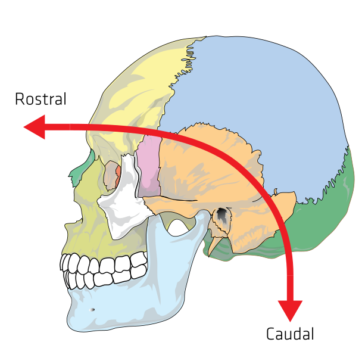

# (APPENDIX) Appendix {-}

# Anatomical Terms Of Location

All vertebrates (including humans) have the same basic body plan – they are strictly bilaterally symmetrical in early embryonic stages and largely bilaterally symmetrical in adulthood. That is, they have mirror-image left and right halves if divided down the middle. For these reasons, the basic directional terms can be considered to be those used in vertebrates. By extension, the same terms are used for many other (invertebrate) organisms as well.

Standardized anatomical and zoological terms of location have been developed, usually based on Latin and Greek words, to enable all biological and medical scientists to precisely delineate and communicate information about animal bodies and their component organs, even though the meaning of some of the terms often is context-sensitive.

The vertebrates and Craniata share a substantial heritage and common structure, so many of the same terms are used for location. To avoid ambiguities this terminology is based on the anatomy of each animal in a standard way.

While these terms are standardized within specific fields of biology, there are unavoidable, sometimes dramatic differences between some disciplines. For example, differences in terminology remain a problem that, to some extent, still separates the terminology of human anatomy from that used in the study of various other zoological categories.

For humans, one type of vertebrate, anatomical terms may differ from other forms of vertebrates. For one reason, this is because humans have a different neuraxis and, unlike animals that rest on four limbs, humans are considered when describing anatomy as being in the standard anatomical position. Thus what is on "top" of a human is the head, whereas the "top" of a dog may be its back, and the "top" of a flounder could refer to either its left or its right side.

## Anatomical Planes

Anatomical planes

* A transverse plane, also known as a cross-section, divides the body into cranial and caudal (head and tail) portions.
* A longitudinal plane is any plane that is perpendicular to the transverse plane. The main longitudinal planes are:
    * The frontal plane or coronal plane divides the body into dorsal and ventral (back and front, or posterior and anterior) portions. For post-embryonic humans a coronal plane is vertical and a transverse plane is horizontal, but for embryos and quadrupeds a coronal plane is horizontal and a transverse plane is vertical.
    * The sagittal plane is a plane parallel to the sagittal suture. All other sagittal planes (referred to as parasagittal planes) are parallel to it. The plane is a Y-Z plane, perpendicular to the ground. A special sagittal plane is the median plane or midsagittal plane in the midline of the body, and divides the body into left and right (sinister and dexter) portions. This passes through the head, spinal cord, navel, and, in many animals, the tail. The term "median plane" can also refer to the midsagittal plane of other structures, such as a digit.

## Anatomical Axes

To begin with, distinct, polar-opposite ends of the organism are chosen. By definition, each pair of opposite points defines an axis. In a bilaterally symmetrical organism, there are 6 polar opposite points, giving three axes that intersect at right angles – the x, y, and z axes familiar from three-dimensional geometry.


```{r axes, out.width='75%', echo=FALSE, message=FALSE, warning=FALSE}
library(tidyverse)
library(printr)        
library(kableExtra)

setwd("~/Dropbox/R/neuroanatomy-text-master")

comparison <-  as_tibble(read.csv("data/axes.csv"))

knitr::kable(comparison, col.names = c("Axis","Directional term","Directed towards"), digits = 2, align = 'lll', longtable = TRUE, booktabs = TRUE, caption = "The main anatomical axes.") %>% kable_styling(latex_options = c("striped", "scale_down", "hold_position")) %>% column_spec(1, width = "15em") %>% column_spec(2, width = "10em") %>% column_spec(3, width = "10em") %>% collapse_rows(columns = 1:2, latex_hline = "major", valign = "middle") 
```

The terms "intermediate", "ipsilateral", "contralateral", "superficial", and "deep", while indicating directions, are relative terms and thus do not properly define fixed anatomical axes. Also, while the "rostrocaudal" and anteroposterior directionality are equivalent in a significant portion of the human body, they are different directions in other parts of the body.

## Main Anatomical Terms

### Superior And Inferior

In anatomical terminology superior (from Latin, meaning 'above') is used to refer to what is above something, and inferior (from Latin, meaning 'below') to what is below it. For example, in the anatomical position the most superior part of the human body is the head, and the most inferior is the feet. As a second example, in humans the neck is superior to the chest but inferior to the head.

### Anterior And Posterior

Anterior refers to what is in front (from Latin ante, meaning "before") and posterior, what is to the back of the subject (from Latin post, meaning "after"). For example, in a dog the nose is anterior to the eyes and the tail is considered the most posterior part; in many fish the gill openings are posterior to the eyes, but anterior to the tail. In projectional radiography terminology, an anteroposterior (AP) projection is taken with the X-ray generator anteriorly (such as in the front of a human), and the X-ray detector posteriorly. In contrast, a posteroanterior (PA) projection is taken with the X-ray generator posteriorly.

### Medial And Lateral

Lateral (from Latin lateralis, meaning 'to the side') refers to the sides of an animal, as in "left lateral" and "right lateral". The term medial (from Latin medius, meaning 'middle') is used to refer to structures close to the centre of an organism, called the "median plane". For example, in a human, imagine a line down the center of the body from the head though the navel and going between the legs— the medial side of the foot would be the big toe side; the medial side of the knee would be the side adjacent to the other knee. To describe the sides of the knees touching each other would be "right medial" and "left medial".

The terms "left" and "right" are sometimes used, or their Latin alternatives (Latin: dexter; "right", Latin: sinister; "left"). However, as left and right sides are mirror images, using these words is somewhat confusing, as structures are duplicated on both sides. For example, it is very confusing to say the dorsal fin of a dolphin is "right of" the left pectoral fin, but is "left of" the right eye, but much easier and clearer to say "the dorsal fin is medial to the pectoral fins".

Terms derived from lateral include:

* Contralateral (from Latin contra, meaning 'against'): on the side opposite to another structure. For example, the right arm and leg are represented by the left, i.e., contralateral side of the forebrain.
* Ipsilateral (from Latin ipse, meaning 'same'): on the same side as another structure. For example, the left arm is ipsilateral to the left leg.
* Bilateral (from Latin bis, meaning 'twice'): on both sides of the body. For example, bilateral orchiectomy (removal of testes on both sides of the body's axis) is surgical castration.
* Unilateral (from Latin unus, meaning 'one'): on one side of the body. For example, unilateral paresis is hemiparesis.

Terms derived from medial include:

* Inferomedial (from Latin inferus, meaning 'lower'): lower and in or near the midline. For example, the human nose is inferomedial to the eyes.
*       Superomedial (from Latin superus, meaning 'above'): above and toward the midline. For example, the human nose is superomedial to the mouth.

### Central And Peripheral

Central and peripheral are terms that are closely related to concepts such as proximal and distal, but they are so widely applicable that in many respects their flexibility makes them hard to define. Loosely speaking, they distinguish near and far, inside and out, or even organs of vital importance such as heart and lungs, from peripheral organs such as fingers, that undoubtedly may be important, but which it may not be life-threatening to dispense with. Examples of the application of the terms are the distinction between central- and peripheral nervous systems, and between peripheral blood vessels and the central circulatory organs, such as the heart and major vessels. The terms also can apply to large and complex molecules such as proteins, where central amino acid residues are protected from antibodies or the like, but peripheral residues are important in docking and other interactions. Other examples include Central and peripheral circadian clocks, and central versus peripheral vision.

### Superficial And Deep

These two terms relate to the distance of a structure from the surface of an animal.

Deep (from Old English) refers to something further away from the surface of the organism. For example, the external oblique muscle of the abdomen is deep to the skin. "Deep" is one of the few anatomical terms of location derived from Old English rather than Latin – the anglicised Latin term would have been "profound" (from Latin profundus, meaning 'due to depth').

Superficial (from Latin superficies, meaning 'surface') refers to something near the outer surface of the organism. For example, in skin the epidermis is superficial to the subcutis.

### Dorsal And Ventral

These two terms, used in anatomy and embryology, refer to back (dorsal) and front or belly (ventral) of an organism.

The dorsal (from Latin dorsum, meaning 'back') surface of an organism refers to the back, or upper side, of an organism. If talking about the skull, the dorsal side is the top.

The ventral (from Latin venter, meaning 'belly') surface refers to the front, or lower side, of an organism.

For example, in a fish the pectoral fins are dorsal to the anal fin, but ventral to the dorsal fin.

#### Cranial And Caudal
 
(ref:roscau) [In the human skull the terms rostral and caudal are adapted to the curved neuraxis of Hominidae](https://commons.wikimedia.org/wiki/File:Rostralcaudal.svg)

```{r rostralcaudal, fig.cap='(ref:roscau)', echo=FALSE, message=FALSE, warning=FALSE}

```

Specific terms exist to describe how close or far something is to the head or tail of an animal. To describe how close to the head of an animal something is, three distinct terms are used:

* Rostral (from Latin rostrum, meaning 'beak, nose'), meaning situated toward the oral or nasal region, or in the case of the brain, toward the tip of the frontal lobe.
* Cranial (from Greek κρανίον, meaning 'skull') or cephalic (from Greek κεφαλή, meaning 'head').
* Caudal (from Latin cauda, meaning 'tail') is used to describe how close something is to the trailing end of an organism,
For example, in the horse, the eyes are caudal to the nose and rostral to the back of the head.

These terms are generally preferred in veterinary medicine and not used as often in human medicine. In humans, "cranial" and "cephalic" are used to refer to the skull, with "cranial" being used more commonly. The term "rostral" is rarely used in human anatomy, apart from embryology, and refers more to the front of the face than the superior aspect of the organism. Similarly, the term "caudal" is only occasionally used in human anatomy. This is because the brain is situated at the superior part of the head whereas the nose is situated in the anterior part. Thus the "rostrocaudal axis" refers to a C shape (see image).

The location of anatomical structures can also be described with relation to different anatomical landmarks.

Structures may be described as being at the level of a specific spinal vertebra, depending on the section of the vertebral column the structure is at. The position is often abbreviated. For example, structures at the level of the fourth cervical vertebra may be abbreviated as "C4", at the level of the fourth thoracic vertebra "T4", and at the level of the third lumbar vertebra "L3". Because the sacrum and coccyx are fused, they are not often used to provide location.

Directional and locational prefixes can modify many anatomical and morphological terms, sometimes in formally standard usage, but often attached arbitrarily according to need or convenience.

Several other terms are also used to describe location. These terms are not used to form the fixed axes. Terms include:

* Axial (from Latin axis, meaning 'axle'): around the central axis of the organism or the extremity. Two related terms, "abaxial" and "adaxial", refer to locations away from and toward the central axis of an organism, respectively
* Parietal (from Latin paries, meaning 'wall'): pertaining to the wall of a body cavity. For example, the parietal peritoneum is the lining on the inside of the abdominal cavity. Parietal can also refer specifically to the parietal bone of the skull or associated structures.
* Posteromedial (from Latin posterus, meaning 'coming after', and medius, meaning 'middle'): situated towards the middle of the posterior surface.
* Posterosuperior (from Latin posterus, meaning 'coming after' and superior): situated towards the upper part of the posterior surface.
* Terminal (from Latin terminus, meaning 'boundary or end') at the extremity of a (usually projecting) structure, as in "...an antenna with a terminal sensory hair".
* Visceral and viscus (from Latin viscera, meaning 'internal organs'): associated with organs within the body's cavities. For example, the stomach is covered with a lining called the visceral peritoneum as opposed to the parietal peritoneum. Viscus can also be used to mean "organ". For example, the stomach is a viscus within the abdominal cavity.

## Prefixes

* Sub- (from Latin sub, meaning 'preposition beneath, close to, nearly etc') appended as a prefix, with or without the hyphen, qualifies terms in various senses. Consider subcutaneous as meaning beneath the skin, subterminal meaning near to the end of a structure. Sub- also may mean "nearly" or "more-or-less"; for instance subglobular means almost globular. In many usages sub- is similar in application to "hypo-"
* Hypo- (from Ancient Greek ὑπό, meaning 'under') Like "sub" in various senses as in hypolingual nerve beneath the tongue, or hypodermal fat beneath the skin
* Infra- (from Latin infra, meaning 'preposition beneath, below etc') Similar to "sub"; a direct opposite to super- and supra-, as in Infratemporal space or infraorbital.
* Inter- (from Latin inter, meaning 'between'): between two other structures. For example, the navel is intermediate to the left arm and the contralateral (right) leg. The intercostal muscles run between the ribs.
* Super- or Supra- (from Latin super, supra, meaning 'above, on top of, beyond etc') appended as a prefix, with or without the hyphen, as in superciliary arches or supraorbital

# Neuroanatomical Terms

## Nucleus

In neuroanatomy, a nucleus (plural form: nuclei) is a cluster of neurons in the central nervous system, located deep within the cerebral hemispheres and brainstem. The neurons in one nucleus usually have roughly similar connections and functions. Nuclei are connected to other nuclei by tracts, the bundles (fascicles) of axons (nerve fibers) extending from the cell bodies. A nucleus is one of the two most common forms of nerve cell organization, the other being layered structures such as the cerebral cortex or cerebellar cortex. In anatomical sections, a nucleus shows up as a region of gray matter, often bordered by white matter. The vertebrate brain contains hundreds of distinguishable nuclei, varying widely in shape and size. A nucleus may itself have a complex internal structure, with multiple types of neurons arranged in clumps (subnuclei) or layers.

The term "nucleus" is in some cases used rather loosely, to mean simply an identifiably distinct group of neurons, even if they are spread over an extended area. The reticular nucleus of the thalamus, for example, is a thin layer of inhibitory neurons that surrounds the thalamus.

Some of the major anatomical components of the brain are organized as clusters of interconnected nuclei. Notable among these are the thalamus and hypothalamus, each of which contains several dozen distinguishable substructures. The medulla and pons also contain numerous small nuclei with a wide variety of sensory, motor, and regulatory functions.

In the peripheral nervous system (PNS), a cluster of cell bodies of neurons (homologous to a CNS nucleus) is called a ganglion. The fascicles of nerve fibers in the PNS (homologous to CNS tracts) are called nerves.

## Ganglion

A ganglion is a group of neuron cell bodies in the peripheral nervous system. In the somatic nervous system this includes dorsal root ganglia and trigeminal ganglia among a few others. In the autonomic nervous system there are both sympathetic and parasympathetic ganglia which contain the cell bodies of postganglionic sympathetic and parasympathetic neurons respectively.

Ganglia are primarily made up of somata and dendritic structures which are bundled or connected. Ganglia often interconnect with other ganglia to form a complex system of ganglia known as a plexus. Ganglia provide relay points and intermediary connections between different neurological structures in the body, such as the peripheral and central nervous systems.

Among vertebrates there are three major groups of ganglia:

* Dorsal root ganglia (also known as the spinal ganglia) contain the cell bodies of sensory (afferent) neurons.
* Cranial nerve ganglia contain the cell bodies of cranial nerve neurons.
* Autonomic ganglia contain the cell bodies of autonomic nerves.

In the autonomic nervous system, fibers from the central nervous system to the ganglia are known as preganglionic fibers, while those from the ganglia to the effector organ are called postganglionic fibers.

Basal ganglia
The term "ganglion" refers to the peripheral nervous system.

However, in the brain (part of the central nervous system), the "basal ganglia" is a group of nuclei interconnected with the cerebral cortex, thalamus, and brainstem, associated with a variety of functions: motor control, cognition, emotions, and learning.

Partly due to this ambiguity, the Terminologia Anatomica recommends using the term basal nuclei instead of basal ganglia; however, this usage has not been generally adopted.

## Tract

A nerve tract is a bundle of nerve fibers (axons) connecting nuclei of the central nervous system. In the peripheral nervous system this is known as a nerve, and has associated connective tissue. The main nerve tracts in the central nervous system are of three types: association fibers, commissural fibers, and projection fibers. A tract may also be referred to as a commissure, fasciculus or decussation. A commissure connects the two cerebral hemispheres at the same levels. Examples are the posterior commissure and the corpus callosum. A decussation is a connection made by fibres that cross at different levels (obliquely), such as the sensory decussation. Examples of a fascicle are the subthalamic fasciculus and the lenticular fasciculus.

In the brain, bundles of axons are also categorized by their function into association fibers, projection fibers, and commissural fibers.

## Lemniscus

A lemniscus (Greek for ribbon or band) is a bundle of secondary sensory fibres in the brainstem. The medial lemniscus and lateral lemniscus terminate in specific relay nuclei of the diencephalon. The trigeminal lemniscus is sometimes considered as the cephalic part of the medial lemniscus.

# List Of Regions In The Human Brain

## Hindbrain (rhombencephalon)


Myelencephalon

* Medulla oblongata
* Medullary pyramids
* Olivary body
* Inferior olivary nucleus
* Rostral ventrolateral medulla
* Caudal ventrolateral medulla
* Solitary nucleus (Nucleus of the solitary tract)
* Respiratory center-Respiratory groups
* Dorsal respiratory group
* Ventral respiratory group or Apneustic centre
* Pre-Bötzinger complex
* Botzinger complex
* Retrotrapezoid nucleus
* Nucleus retrofacialis
* Nucleus retroambiguus
* Nucleus para-ambiguus
* Paramedian reticular nucleus
* Gigantocellular reticular nucleus
* Parafacial zone
* Cuneate nucleus
* Gracile nucleus
* Perihypoglossal nuclei
* Intercalated nucleus
* Prepositus nucleus
* Sublingual nucleus
* Area postrema
* Medullary cranial nerve nuclei
* Inferior salivatory nucleus
* Nucleus ambiguus
* Dorsal nucleus of vagus nerve
* Hypoglossal nucleus
* Chemoreceptor trigger zone

Metencephalon

* Pons
* Pontine nuclei
* Pontine cranial nerve nuclei
* chief or pontine nucleus of the trigeminal nerve sensory nucleus (V)
* Motor nucleus for the trigeminal nerve (V)
* Abducens nucleus (VI)
* Facial nerve nucleus (VII)
* vestibulocochlear nuclei (vestibular nuclei and cochlear nuclei) (VIII)
* Superior salivatory nucleus
* Pontine tegmentum
* Pontine micturition center (Barrington's nucleus)
* Locus coeruleus
* Pedunculopontine nucleus
* Laterodorsal tegmental nucleus
* Tegmental pontine reticular nucleus
* Nucleus incertus
* Parabrachial area
* Medial parabrachial nucleus
* Lateral parabrachial nucleus
* Subparabrachial nucleus (Kölliker-Fuse nucleus)
* Pontine respiratory group
* Superior olivary complex
* Medial superior olive
* Lateral superior olive
* Medial nucleus of the trapezoid body
* Paramedian pontine reticular formation
* Parvocellular reticular nucleus
* Caudal pontine reticular nucleus
* Cerebellar peduncles
* Superior cerebellar peduncle
* Middle cerebellar peduncle
* Inferior cerebellar peduncle
* Fourth ventricle
* Cerebellum
* Cerebellar vermis
* Cerebellar hemispheres
* Anterior lobe
* Posterior lobe
* Flocculonodular lobe
* Cerebellar nuclei
* Fastigial nucleus
* Interposed nucleus
* Globose nucleus
* Emboliform nucleus
* Dentate nucleus

## Midbrain (mesencephalon)

* Tectum
* Corpora quadrigemina
* inferior colliculi
* superior colliculi
* Pretectum
* Tegmentum
* Periaqueductal gray
* Rostral interstitial nucleus of medial longitudinal fasciculus
* Midbrain reticular formation
* Dorsal raphe nucleus
* Red nucleus
* Ventral tegmental area
* Parabrachial pigmented nucleus
* Paranigral nucleus
* Rostromedial tegmental nucleus
* Caudal linear nucleus
* Rostral linear nucleus of the raphe
* Interfascicular nucleus
* Substantia nigra
* Pars compacta
* Pars reticulata
* Interpeduncular nucleus
* Cerebral peduncle
* Crus cerebri
* Mesencephalic cranial nerve nuclei
* Oculomotor nucleus (III)
* Edinger-Westphal nucleus
* Trochlear nucleus (IV)
* Mesencephalic duct (cerebral aqueduct, aqueduct of Sylvius)

## Forebrain (prosencephalon)

Diencephalon

Epithalamus

* Pineal body (pineal gland)
* Habenular nuclei
* Stria medullaris
* Taenia thalami

Third ventricle

* Subcommissural organ

Thalamus

* Anterior nuclear group
  * Anteroventral nucleus (a.k.a. ventral anterior nucleus)
  * Anterodorsal nucleus
  * Anteromedial nucleus
* Medial nuclear group
  * Medial dorsal nucleus
  * Midline nuclear group
  * Paratenial nucleus
  * Reuniens nucleus
  * Rhomboidal nucleus
  * Intralaminar nuclear group
  * Centromedian nucleus
  * Parafascicular nucleus
  * Paracentral nucleus
  * Central lateral nucleus
* Lateral nuclear group
  * Lateral dorsal nucleus
  * Lateral posterior nucleus
  * Pulvinar
* Ventral nuclear group
  * Ventral anterior nucleus
  * Ventral lateral nucleus
  * Ventral posterior nucleus
    * Ventral posterior lateral nucleus
    * Ventral posterior medial nucleus
* Metathalamus
  * Medial geniculate body
  * Lateral geniculate body
* Thalamic reticular nucleus

Hypothalamus (limbic system) (HPA axis)

* Anterior
  * Medial area
    * Parts of preoptic area
      * Medial preoptic nucleus
        * INAH 1
        * INAH 2
        * INAH 3
        * INAH 4
* Suprachiasmatic nucleus
* Paraventricular nucleus
* Supraoptic nucleus (mainly)
* Anterior hypothalamic nucleus
* Lateral area
   * Parts of preoptic area
    * Lateral preoptic nucleus
  * Anterior part of Lateral nucleus
  * Part of supraoptic nucleus
* Other nuclei of preoptic area
    * median preoptic nucleus
    * periventricular preoptic nucleus
* Tuberal
  * Medial area
    * Dorsomedial hypothalamic nucleus
    * Ventromedial nucleus
    * Arcuate nucleus
  * Lateral area
    * Tuberal part of Lateral nucleus
    * Lateral tuberal nuclei
* Posterior
  * Medial area
    * Mammillary nuclei (part of mammillary bodies)
    * Posterior nucleus
  * Lateral area
    * Posterior part of Lateral nucleus
* Surface
  * Median eminence
  * Mammillary bodies
  * Pituitary stalk (infundibulum)
* Optic chiasm
* Subfornical organ
* Periventricular nucleus
* Tuber cinereum
    * Tuberal nucleus
    * Tuberomammillary nucleus
* Tuberal region
* Mammillary nucleus

Subthalamus(HPA axis)

* Subthalamic nucleus
* Zona incerta

Pituitary gland (HPA axis)

* neurohypophysis
* Pars intermedia (Intermediate Lobe)
* adenohypophysis

Telencephalon (cerebrum) Cerebral hemispheres

White matter

* Centrum semiovale
* Corona radiata
* Internal capsule
* External capsule
* Extreme capsule
  
Subcortical

* Hippocampus (Medial Temporal Lobe)
  * Dentate gyrus
  * Cornu ammonis (CA fields)
    * Cornu ammonis area 1 (CA1)
    * Cornu ammonis area 2 (CA2)
    * Cornu ammonis area 3 (CA3)
    * Cornu ammonis area 4 (CA4)
* Amygdala (limbic system) (limbic lobe)
  * Central nucleus (autonomic nervous system)
  * Medial nucleus (accessory olfactory system)
  * Cortical and basomedial nuclei (main olfactory system)
  * Lateral and basolateral nuclei (frontotemporal cortical system)
* Extended amygdala
  * Stria terminalis
    * Bed nucleus of the stria terminalis
* Claustrum
* Basal ganglia
  * Striatum
    * Dorsal striatum (a.k.a. neostriatum)
      * Putamen
      * Caudate nucleus
    * Ventral striatum
      * Nucleus accumbens
      * Olfactory tubercle
    * Globus pallidus (forms nucleus lentiformis with putamen)
      * Ventral pallidum
    * Subthalamic nucleus
* Basal forebrain
  * Anterior perforated substance
  * Substantia innominata
  * Nucleus basalis
  * Diagonal band of Broca
  * Septal nuclei
    * Medial septal nuclei
  * Lamina terminalis
    * Vascular organ of lamina terminalis

Rhinencephalon (paleocortex)

* Olfactory bulb
* Olfactory tract
* Anterior olfactory nucleus
* Piriform cortex
* Anterior commissure
* Uncus
* Periamygdaloid cortex

Cerebral cortex (neocortex)

* Frontal lobe
  * Cortex
    * Primary motor cortex (Precentral gyrus, M1)
    * Supplementary motor cortex
    * Premotor cortex
    * Prefrontal cortex
      * Orbitofrontal cortex
      * Dorsolateral prefrontal cortex
* Gyri
  * Superior frontal gyrus
  * Middle frontal gyrus
  * Inferior frontal gyrus
* Brodmann areas: 4, 6, 8, 9, 10, 11, 12, 24, 25, 32, 33, 44, 45, 46, 47
* Parietal lobe
  * Cortex
   * Primary somatosensory cortex (S1)
   * Secondary somatosensory cortex (S2)
   * Posterior parietal cortex
  * Gyri
    * Postcentral gyrus (Primary somesthetic area)
* Other
  * Precuneus
* Brodmann areas 1, 2, 3 (Primary somesthetic area); 5, 7, 23, 26, 29, 31, 39, 40
* Occipital lobe
  * Cortex
    * Primary visual cortex (V1)
    * V2
    * V3
    * V4
    * V5/MT
* Gyri
  * Lateral occipital gyrus
* Other
  * Cuneus
* Brodmann areas 17 (V1, primary visual cortex); 18, 19
* Temporal lobe
  * Cortex
    * Primary auditory cortex (A1)
    * secondary auditory cortex (A2)
    * Inferior temporal cortex
    * Posterior inferior temporal cortex
* Gyri
    * Superior temporal gyrus
    * Middle temporal gyrus
    * Inferior temporal gyrus
    * Entorhinal cortex
    * Perirhinal cortex
    * Parahippocampal gyrus
    * Fusiform gyrus
* Brodmann areas: 20, 21, 22, 27, 34, 35, 36, 37, 38, 41, 42
* Other
  * Medial superior temporal area (MST)
* Insular cortex
* Cingulate cortex
  * Anterior cingulate
  * Posterior cingulate
  * Retrosplenial cortex
  * Indusium griseum
  * Subgenual area 25
  * Brodmann areas 23, 24; 26, 29, 30 (retrosplenial areas); 31, 32

# Neural pathways

* Superior longitudinal fasciculus
  * Arcuate fasciculus
* Uncinate fasciculus
* Perforant pathway
* Thalamocortical radiations
* Corpus callosum
* Anterior commissure
* Amygdalofugal pathway
* Interthalamic adhesion
* Posterior commissure
* Habenular commissure
* Fornix
* Mammillotegmental fasciculus
* Incertohypothalamic pathway
* Cerebral peduncle
* Medial forebrain bundle
* Medial longitudinal fasciculus
* Myoclonic triangle
* Solitary tract
* Major dopaminergic pathways from dopaminergic cell groups
  * Mesocortical pathway
  * Mesolimbic pathway
  * Nigrostriatal pathway
  * Tuberoinfundibular pathway
* Serotonergic pathways
  * Raphe Nuclei
* Norepinephrine Pathways
  * Locus coeruleus and other noradrenergic cell groups
* Epinephrine pathways from adrenergic cell groups
* Glutamate and acetylcholine pathways from mesopontine nuclei

## Motor systems / Descending fibers

* Extrapyramidal system
* Pyramidal tract
  * Corticospinal tract or Cerebrospinal fibers
    * Lateral corticospinal tract
    * Anterior corticospinal tract
  * Corticopontine fibers
    * Frontopontine fibers
    * Temporopontine fibers
  * Corticobulbar tract
* Corticomesencephalic tract
* Tectospinal tract
* Interstitiospinal tract
* Rubrospinal tract
* Rubro-olivary tract
* Olivocerebellar tract
* Olivospinal tract
* Vestibulospinal tract
    * Lateral vestibulospinal tract
    * Medial vestibulospinal tract
* Reticulospinal tract
* Lateral raphespinal tract
* Alpha system
* Gamma system

## Somatosensory system

* Dorsal column–medial lemniscus pathway
  * Gracile fasciculus
  * Cuneate fasciculus
  * Medial lemniscus
* Spinothalamic tract
  * Lateral spinothalamic tract
  * Anterior spinothalamic tract
  * Spinomesencephalic tract
* Spinocerebellar tract
* Spino-olivary tract
* Spinoreticular tract

## Visual system

* Optic tract
* Optic radiation
* Retinohypothalamic tract

## Auditory system

* Medullary striae of fourth ventricle
* Trapezoid body
* Lateral lemniscus
 
# Brodmann Areas

A [Brodmann area](https://en.wikipedia.org/wiki/Brodmann_area) is a region of the cerebral cortex, in the human or other primate brain, defined by its cytoarchitecture, or histological structure and organization of cells.

Brodmann areas were originally defined and numbered by the German anatomist [Korbinian Brodmann](https://en.wikipedia.org/wiki/Korbinian_Brodmann) based on the cytoarchitectural organization of neurons he observed in the cerebral cortex using the Nissl method of cell staining. Brodmann published his maps of cortical areas in humans, monkeys, and other species in 1909, along with many other findings and observations regarding the general cell types and laminar organization of the mammalian cortex.

Brodmann areas have been discussed, debated, refined, and renamed exhaustively for nearly a century and remain the most widely known and frequently cited cytoarchitectural organization of the human cortex.

Many of the areas Brodmann defined based solely on their neuronal organization have since been correlated closely to diverse cortical functions. For example, Brodmann areas 3, 1 and 2 are the primary somatosensory cortex; area 4 is the primary motor cortex; area 17 is the primary visual cortex; and areas 41 and 42 correspond closely to primary auditory cortex. Higher order functions of the association cortical areas are also consistently localized to the same Brodmann areas by neurophysiological, functional imaging, and other methods (e.g., the consistent localization of Broca's speech and language area to the left Brodmann areas 44 and 45). However, functional imaging can only identify the approximate localization of brain activations in terms of Brodmann areas since their actual boundaries in any individual brain requires its histological examination.

* Areas 1, 2 and 3 – Primary somatosensory cortex in the postcentral gyrus (frequently referred to as Areas 3, 1, 2 by convention)
* Area 4– Primary motor cortex
* Area 5 – Superior parietal lobule
* Area 6 – Premotor cortex and Supplementary Motor Cortex (Secondary Motor Cortex) (Supplementary motor area)
* Area 7 – Visuo-Motor Coordination
* Area 8 – Includes Frontal eye fields
* Area 9 – Dorsolateral prefrontal cortex
* Area 10 – Anterior prefrontal cortex (most rostral part of superior and middle frontal gyri)
* Area 11 – Orbitofrontal area (orbital and rectus gyri, plus part of the rostral part of the superior frontal gyrus)
* Area 12 – Orbitofrontal area (used to be part of BA11, refers to the area between the superior frontal gyrus and the inferior rostral sulcus)
* Area 13 and Area 14 – Insular cortex
* Area 15 – Anterior Temporal lobe
* Area 16 – Insular cortex
* Area 17 – Primary visual cortex (V1)
* Area 18 – Secondary visual cortex (V2)
* Area 19 – Associative visual cortex (V3, V4, V5)
* Area 20 – Inferior temporal gyrus
* Area 21 – Middle temporal gyrus
* Area 22 – Part of the superior temporal gyrus, included in Wernicke's area
* Area 23 – Ventral posterior cingulate cortex
* Area 24 – Ventral anterior cingulate cortex.
* Area 25 – Subgenual area (part of the Ventromedial prefrontal cortex)
* Area 26 – Ectosplenial portion of the retrosplenial region of the cerebral cortex
* Area 27 – Piriform cortex
* Area 28 – Ventral entorhinal cortex
* Area 29 – Retrosplenial cortex
* Area 30 – Subdivision of retrosplenial cortex
* Area 31 – Dorsal Posterior cingulate cortex
* Area 32 – Dorsal anterior cingulate cortex
* Area 33 – Part of anterior cingulate cortex
* Area 34 – Dorsal entorhinal cortex (on the Parahippocampal gyrus)
* Area 35 – Part of the perirhinal cortex (in the rhinal sulcus)
* Area 36 – Part of the perirhinal cortex (in the rhinal sulcus)
* Area 37 – Fusiform gyrus
* Area 38 – Temporopolar area (most rostral part of the superior and middle temporal gyri)
* Area 39 – Angular gyrus, considered by some to be part of Wernicke's area
* Area 40 – Supramarginal gyrus considered by some to be part of Wernicke's area
* Areas 41 and 42 – Auditory cortex
* Area 43 – Primary gustatory cortex
* Areas 44 and 45 – Broca's area, includes the opercular part and triangular part of the inferior frontal gyrus
* Area 46 – Dorsolateral prefrontal cortex
* Area 47 – Orbital part of inferior frontal gyrus
* Area 48 – Retrosubicular area (a small part of the medial surface of the temporal lobe)
* Area 49 – Parasubicular area in a rodent
* Area 52 – Parainsular area (at the junction of the temporal lobe and the insula)
