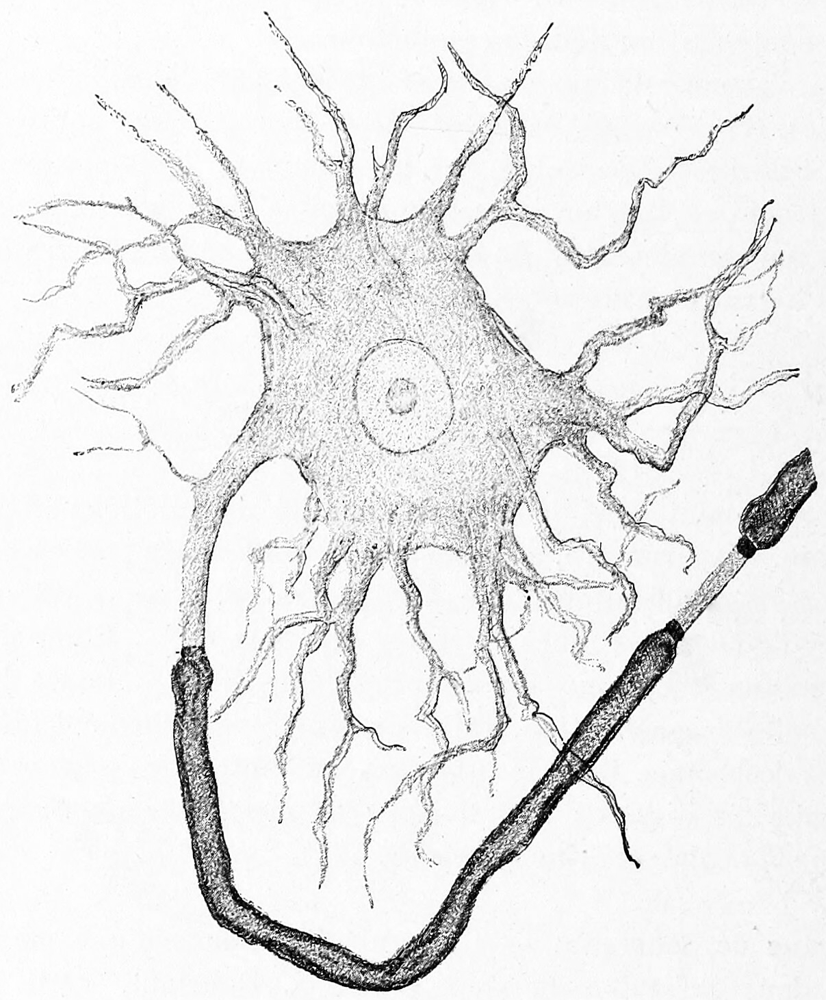

# Neurons And Glial Cells

## Neurons

The neuron doctrine is the now fundamental idea that neurons are the basic structural and functional units of the nervous system. The theory was put forward by Santiago Ramón y Cajal in the late 19th century. It held that neurons are discrete cells (not connected in a meshwork), acting as metabolically distinct units.

Later discoveries yielded refinements to the doctrine. For example, glial cells, which are not considered neurons, play an essential role in information processing. Also, electrical synapses are more common than previously thought, comprising direct, cytoplasmic connections between neurons. In fact, neurons can form even tighter couplings: the squid giant axon arises from the fusion of multiple axons.

Ramón y Cajal also postulated the Law of Dynamic Polarization, which states that a neuron receives signals at its dendrites and cell body and transmits them, as action potentials, along the axon in one direction: away from the cell body. The Law of Dynamic Polarization has important exceptions; dendrites can serve as synaptic output sites of neurons and axons can receive synaptic inputs.

The number of neurons in the brain varies dramatically from species to species. In a human, there are an estimated 10–20 billion neurons in the cerebral cortex and 55–70 billion neurons in the cerebellum. By contrast, the nematode worm *Caenorhabditis elegans* has just 302 neurons, making it an ideal model organism as scientists have been able to map all of its neurons. The fruit fly *Drosophila melanogaster*, a common subject in biological experiments, has around 100,000 neurons and exhibits many complex behaviors. Many properties of neurons, from the type of neurotransmitters used to ion channel composition, are maintained across species, allowing scientists to study processes occurring in more complex organisms in much simpler experimental systems.

A neuron, neurone (old British spelling) or nerve cell, is an electrically excitable cell that communicates with other cells via specialized connections called synapses. It is the main component of nervous tissue. All animals except sponges and placozoans have neurons, but other multicellular organisms such as plants do not.

Neurons are typically classified into three types based on their function. Sensory neurons respond to stimuli such as touch, sound, or light that affect the cells of the sensory organs, and they send signals to the spinal cord or brain. Motor neurons receive signals from the brain and spinal cord to control everything from muscle contractions to glandular output. Interneurons connect neurons to other neurons within the same region of the brain or spinal cord. A group of connected neurons is called a neural circuit.

A typical neuron consists of a cell body (soma), dendrites, and a single axon. The soma is usually compact. The axon and dendrites are filaments that extrude from it. Dendrites typically branch profusely and extend a few hundred micrometers from the soma. The axon leaves the soma at a swelling called the axon hillock, and travels for as far as 1 meter in humans or more in other species. It branches but usually maintains a constant diameter. At the farthest tip of the axon's branches are axon terminals, where the neuron can transmit a signal across the synapse to another cell. Neurons may lack dendrites or have no axon. The term neurite is used to describe either a dendrite or an axon, particularly when the cell is undifferentiated.

Most neurons receive signals via the dendrites and soma and send out signals down the axon. At the majority of synapses, signals cross from the axon of one neuron to a dendrite of another. However, synapses can connect an axon to another axon or a dendrite to another dendrite.

The signaling process is partly electrical and partly chemical. Neurons are electrically excitable, due to maintenance of voltage gradients across their membranes. If the voltage changes by a large enough amount over a short interval, the neuron generates an all-or-nothing electrochemical pulse called an action potential. This potential travels rapidly along the axon, and activates synaptic connections as it reaches them. Synaptic signals may be excitatory or inhibitory, increasing or reducing the net voltage that reaches the soma.

In most cases, neurons are generated by neural stem cells during brain development and childhood. Neurogenesis largely ceases during adulthood in most areas of the brain. However, strong evidence supports generation of substantial numbers of new neurons in the hippocampus and olfactory bulb.

Neurons are highly specialized for the processing and transmission of cellular signals. Given their diversity of functions performed in different parts of the nervous system, there is a wide variety in their shape, size, and electrochemical properties. For instance, the soma of a neuron can vary from 4 to 100 micrometers in diameter.

The soma is the body of the neuron. As it contains the nucleus, most protein synthesis occurs here. The nucleus can range from 3 to 18 micrometers in diameter.
The dendrites of a neuron are cellular extensions with many branches. This overall shape and structure is referred to metaphorically as a dendritic tree. This is where the majority of input to the neuron occurs via the dendritic spine.

The axon is a finer, cable-like projection that can extend tens, hundreds, or even tens of thousands of times the diameter of the soma in length. The axon primarily carries nerve signals away from the soma, and carries some types of information back to it. Many neurons have only one axon, but this axon may—and usually will—undergo extensive branching, enabling communication with many target cells. The part of the axon where it emerges from the soma is called the axon hillock. Besides being an anatomical structure, the axon hillock also has the greatest density of voltage-dependent sodium channels. This makes it the most easily excited part of the neuron and the spike initiation zone for the axon. In electrophysiological terms, it has the most negative threshold potential. While the axon and axon hillock are generally involved in information outflow, this region can also receive input from other neurons.

The axon terminal is found at the end of the axon farthest from the soma and contains synapses. Synaptic boutons are specialized structures where neurotransmitter chemicals are released to communicate with target neurons. In addition to synaptic boutons at the axon terminal, a neuron may have en passant boutons, which are located along the length of the axon.

The accepted view of the neuron attributes dedicated functions to its various anatomical components; however, dendrites and axons often act in ways contrary to their so-called main function.

Axons and dendrites in the central nervous system are typically only about one micrometer thick, while some in the peripheral nervous system are much thicker. The soma is usually about 10–25 micrometers in diameter and often is not much larger than the cell nucleus it contains. The longest axon of a human motor neuron can be over a meter long, reaching from the base of the spine to the toes.

Sensory neurons can have axons that run from the toes to the posterior column of the spinal cord, over 1.5 meters in adults. Giraffes have single axons several meters in length running along the entire length of their necks. Much of what is known about axonal function comes from studying the squid giant axon, an ideal experimental preparation because of its relatively immense size (0.5–1 millimeters thick, several centimeters long).

Fully differentiated neurons are permanently postmitotic however, stem cells present in the adult brain may regenerate functional neurons throughout the life of an organism. Astrocytes are star-shaped glial cells. They have been observed to turn into neurons by virtue of their stem cell-like characteristic of pluripotency.

Like all animal cells, the cell body of every neuron is enclosed by a plasma membrane, a bilayer of lipid molecules with many types of protein structures embedded in it. A lipid bilayer is a powerful electrical insulator, but in neurons, many of the protein structures embedded in the membrane are electrically active. These include ion channels that permit electrically charged ions to flow across the membrane and ion pumps that transport ions from one side of the membrane to the other. Most ion channels are permeable only to specific types of ions. Some ion channels are voltage gated, meaning that they can be switched between open and closed states by altering the voltage difference across the membrane. Others are chemically gated, meaning that they can be switched between open and closed states by interactions with chemicals that diffuse through the extracellular fluid. The ions include sodium, potassium, chloride, and calcium. The interactions between ion channels and ion pumps produce a voltage difference across the membrane, typically a bit less than 1/10 of a volt at baseline. This voltage has two functions: first, it provides a power source for an assortment of voltage-dependent protein machinery that is embedded in the membrane; second, it provides a basis for electrical signal transmission between different parts of the membrane.

Numerous microscopic clumps called Nissl bodies (or Nissl substance) are seen when nerve cell bodies are stained with a basophilic ("base-loving") dye. These structures consist of rough endoplasmic reticulum and associated ribosomal RNA. Named after German psychiatrist and neuropathologist [Franz Nissl](https://en.wikipedia.org/wiki/Franz_Nissl) (1860–1919), they are involved in protein synthesis and their prominence can be explained by the fact that nerve cells are very metabolically active. Basophilic dyes such as aniline or (weakly) haematoxylin  highlight negatively charged components, and so bind to the phosphate backbone of the ribosomal RNA.

The cell body of a neuron is supported by a complex mesh of structural proteins called neurofilaments, which together with neurotubules (neuronal microtubules) are assembled into larger neurofibrils. Some neurons also contain pigment granules, such as neuromelanin (a brownish-black pigment that is byproduct of synthesis of catecholamines), and lipofuscin (a yellowish-brown pigment), both of which accumulate with age. Other structural proteins that are important for neuronal function are actin and the tubulin of microtubules. Class III β-tubulin is found almost exclusively in neurons. Actin is predominately found at the tips of axons and dendrites during neuronal development. There the actin dynamics can be modulated via an interplay with microtubule.

(ref:neuron) [Diagram of a myelinated vertebrate motor neuron.](https://commons.wikimedia.org/wiki/File:Complete_neuron_cell_diagram_en.svg)

```{r motorneuron, fig.cap='(ref:neuron)', echo=FALSE, message=FALSE, warning=FALSE}
knitr::include_graphics("./figures/cells/Complete_neuron_cell_diagram_en.svg")
```

There are different internal structural characteristics between axons and dendrites. Typical axons almost never contain ribosomes, except some in the initial segment. Dendrites contain granular endoplasmic reticulum or ribosomes, in diminishing amounts as the distance from the cell body increases.

Neurons vary in shape and size and can be classified by their morphology and function. The anatomist [Camillo Golgi](https://en.wikipedia.org/wiki/Camillo_Golgi) grouped neurons into two types; type I with long axons used to move signals over long distances and type II with short axons, which can often be confused with dendrites. Type I cells can be further classified by the location of the soma. The basic morphology of type I neurons, represented by spinal motor neurons, consists of a cell body called the soma and a long thin axon covered by a myelin sheath.

(ref:myelin) A Golgi type I neuron from the electric lobe in the brain of the electric ray (*Torpedo*). A single, thick axon emerges from the cell body unmyelinated (middle, left) but becomes surrounded by a think layer of myelin (dark grey).  Multiple, thin dendrites emerge from the remainder of the cell body. [Histologie du système nerveux de l'homme & des vertébrés, Tome Premier](https://wellcomelibrary.org/item/b2129592x#?c=0&m=0&s=0&cv=14&z=0%2C-3.48%2C1%2C8.6591) (1909) by Santiago Ramón y Cajal translated from Spanish by Dr. L. Azoulay.

```{r axonmyelinated, fig.cap='(ref:myelin)', echo=FALSE, message=FALSE, warning=FALSE}

```

The dendritic tree wraps around the cell body and receives signals from other neurons. The end of the axon has branching terminals (axon terminal) that release neurotransmitters into a gap called the synaptic cleft between the terminals and the dendrites of the next neuron.

Most neurons can be anatomically characterized as:

* Unipolar: single process
* Bipolar: 1 axon and 1 dendrite
* Multipolar: 1 axon and 2 or more dendrites
* Golgi I: neurons with projecting axonal processes; examples are pyramidal cells, Purkinje cells, and anterior horn cells
* Golgi II: neurons whose axonal process projects locally; the best example is the granule cell
* Anaxonic: where the axon cannot be distinguished from the dendrite(s)
* Pseudounipolar: 1 process which then serves as both an axon and a dendrite
* Other

(ref:neurons) Morpholoigcally distinct types of neurons after Cajal. A) Unipolar neurons; B) bipolar neurons; Golgi I neurons: C) a Purkinje cell; D) spinal motor neuron E) a pyramidal cell; F) Golgi II neuron. [Histologie du système nerveux de l'homme & des vertébrés, Tome Premier](https://wellcomelibrary.org/item/b2129592x#?c=0&m=0&s=0&cv=14&z=0%2C-3.48%2C1%2C8.6591) (1909) by Santiago Ramón y Cajal translated from Spanish by Dr. L. Azoulay.


```{r neurontypes, fig.cap='(ref:neurons)', echo=FALSE, message=FALSE, warning=FALSE}
knitr::include_graphics("./figures/cells/Cajal_neurons.jpg")
```

Some unique neuronal types can be identified according to their location in the nervous system and distinct shape. Some examples are:

* Basket cells, interneurons that form a dense plexus of terminals around the soma of target cells, found in the cortex and cerebellum
* Betz cells, large motor neurons
* Lugaro cells, interneurons of the cerebellum
* Medium spiny neurons, most neurons in the corpus striatum
* Purkinje cells, huge neurons in the cerebellum, a type of Golgi I multipolar neuron
* Pyramidal cells, neurons with triangular soma, a type of Golgi I
* Renshaw cells, neurons with both ends linked to alpha motor neurons
* Unipolar brush cells, interneurons with unique dendrite ending in a brush-like tuft
* Granule cells, a type of Golgi II neuron
* Anterior horn cells, motoneurons located in the spinal cord
* Spindle cells, interneurons that connect widely separated areas of the brain

Neurons can also be characterized based on various aspects of their function:

* Afferent neurons convey information from tissues and organs into the central nervous system and are also called sensory neurons.
* Efferent neurons (motor neurons) transmit signals from the central nervous system to the effector cells.
* Interneurons connect neurons within specific regions of the central nervous system.
Afferent and efferent also refer generally to neurons that, respectively, bring information to or send information from the brain.

The axons of neurons in the human peripheral nervous system can be classified based on their physical features and signal conduction properties. Axons were known to have different thicknesses (from 0.1 to 20 µm) and these differences were thought to relate to the speed at which an action potential could travel along the axon – its conductance velocity. Erlanger and Gasser proved this hypothesis, and identified several types of nerve fiber, establishing a relationship between the diameter of an axon and its nerve conduction velocity. They published their findings in 1941 giving the first classification of axons.

Axons are classified in two systems. The first one introduced by Erlanger and Gasser, grouped the fibers into three main groups using the letters A, B, and C. These groups, group A, group B, and group C include both the sensory fibers (afferents) and the motor fibres (efferents). The first group A, was subdivided into alpha, beta, gamma, and delta fibers — Aα, Aβ, Aγ, and Aδ. The motor neurons of the different motor fibers, were the lower motor neurons – alpha motor neuron, beta motor neuron, and gamma motor neuron having the Aα, Aβ, and Aγ nerve fibers respectively.

```{r erlanger, out.width='75%', echo=FALSE, message=FALSE, warning=FALSE}
library(tidyverse)
library(printr)        
library(kableExtra)

setwd("~/Dropbox/R/neuroanatomy-text-master")

comparison <-  as_tibble(read.csv("data/erlanger_gasser.csv"))

knitr::kable(comparison, col.names = c("Type","Erlanger-Gasser Classification","Diameter (µm)","Myelin","Conduction Velocity (m/s)","Associated Muscle Fibers"), digits = 2, align = 'llllll', longtable = TRUE, booktabs = TRUE, caption = "Erlanger Gasser Classification of Lower Motor Neuron Fiber Types") %>% kable_styling(latex_options = c("striped", "scale_down", "hold_position")) %>% column_spec(1, width = "5em") %>% column_spec(2, width = "5em") %>% column_spec(3, width = "5em") %>% column_spec(4, width = "5em") %>% column_spec(5, width = "5em") %>% column_spec(6, width = "10em") 
```

Later findings by other researchers identified two groups of Aα fibers that were sensory fibers. These were then introduced into a system that only included sensory fibers (though some of these were mixed nerves and were also motor fibers). This system refers to the sensory groups as types and uses Roman numerals: Type Ia, Type Ib, Type II, Type III, and Type IV.

```{r sensory, out.width='75%', echo=FALSE, message=FALSE, warning=FALSE}
library(tidyverse)
library(printr)        
library(kableExtra)

setwd("~/Dropbox/R/neuroanatomy-text-master")

comparison <-  as_tibble(read.csv("data/sensory_fiber_classification.csv"))

knitr::kable(comparison, col.names = c("Type","Erlanger-Gasser Classification","Diameter (µm)","Myelin","Conduction Velocity (m/s)","Associated Sensory Receptors","Function"), digits = 2, align = 'lllllll', longtable = TRUE, booktabs = TRUE, caption = "Erlanger Gasser Classification of Sensory Fiber Types") %>% kable_styling(latex_options = c("striped", "scale_down", "hold_position")) %>% column_spec(1, width = "5em") %>% column_spec(2, width = "5em") %>% column_spec(3, width = "5em") %>% column_spec(4, width = "5em") %>% column_spec(5, width = "5em") %>% column_spec(6, width = "5em") %>% column_spec(7, width = "5em") 

```

Neurons have intrinsic electroresponsive properties like intrinsic transmembrane voltage oscillatory patterns. So neurons can be classified according to their electrophysiological characteristics:

* Tonic or regular spiking. Some neurons are typically constantly (tonically) active, typically firing at a constant frequency. Example: interneurons in neurostriatum.
* Phasic or bursting. Neurons that fire in bursts are called phasic.
* Fast spiking. Some neurons are notable for their high firing rates, for example some types of cortical inhibitory interneurons, cells in globus pallidus, retinal ganglion cells.

Neurons communicate with each another via synapses, where either the axon terminal of one cell contacts another neuron's dendrite, soma or, less commonly, axon. Neurons such as Purkinje cells in the cerebellum can have over 1000 dendritic branches, making connections with tens of thousands of other cells; other neurons, such as the magnocellular neurons of the supraoptic nucleus, have only one or two dendrites, each of which receives thousands of synapses.

Synapses can be excitatory or inhibitory, either increasing or decreasing activity in the target neuron, respectively. Some neurons also communicate via electrical synapses, which are direct, electrically conductive junctions between cells.

When an action potential reaches the axon terminal, it opens voltage-gated calcium channels, allowing calcium ions to enter the terminal. Calcium causes synaptic vesicles filled with neurotransmitter molecules to fuse with the membrane, releasing their contents into the synaptic cleft. The neurotransmitters diffuse across the synaptic cleft and activate receptors on the postsynaptic neuron. High cytosolic calcium in the axon terminal triggers mitochondrial calcium uptake, which, in turn, activates mitochondrial energy metabolism to produce ATP to support continuous neurotransmission.

An autapse is a synapse in which a neuron's axon connects to its own dendrites.

The human brain has some 8.6 x 10^10^ (eighty six billion) neurons. Each neuron has on average 7,000 synaptic connections to other neurons. It has been estimated that the brain of a three-year-old child has about 10^15^ synapses (1 quadrillion). This number declines with age, stabilizing by adulthood. Estimates vary for an adult, ranging from 10^14^ to 5 x 10^14^ synapses (100 to 500 trillion).

The two most common neurotransmitters in the brain, glutamate and GABA, have largely consistent actions. Glutamate acts on several types of receptors, and has effects that are excitatory at ionotropic receptors and a modulatory effect at metabotropic receptors. Similarly, GABA acts on several types of receptors, but all of them have inhibitory effects (in adult animals, at least). Because of this consistency, it is common for neuroscientists to refer to cells that release glutamate as "excitatory neurons", and cells that release GABA as "inhibitory neurons". Some other types of neurons have consistent effects, for example, "excitatory" motor neurons in the spinal cord that release acetylcholine, and "inhibitory" spinal neurons that release glycine.

The distinction between excitatory and inhibitory neurotransmitters is not absolute. Rather, it depends on the class of chemical receptors present on the postsynaptic neuron. In principle, a single neuron, releasing a single neurotransmitter, can have excitatory effects on some targets, inhibitory effects on others, and modulatory effects on others still. For example, photoreceptor cells in the retina constantly release the neurotransmitter glutamate in the absence of light. So-called OFF bipolar cells are, like most neurons, excited by the released glutamate. However, neighboring target neurons called ON bipolar cells are instead inhibited by glutamate, because they lack typical ionotropic glutamate receptors and instead express a class of inhibitory metabotropic glutamate receptors. When light is present, the photoreceptors cease releasing glutamate, which relieves the ON bipolar cells from inhibition, activating them; this simultaneously removes the excitation from the OFF bipolar cells, silencing them.

Neurons can also be classified based on the neurotransmitter they release at synapses:

* Cholinergic neurons—acetylcholine. Acetylcholine is released from presynaptic neurons into the synaptic cleft. It acts as a ligand for both ligand-gated ion channels and metabotropic (GPCRs) muscarinic receptors. Nicotinic receptors are pentameric ligand-gated ion channels composed of alpha and beta subunits that bind nicotine. Ligand binding opens the channel causing influx of Na^+^ depolarization and increases the probability of presynaptic neurotransmitter release. Acetylcholine is synthesized from choline and acetyl coenzyme A.
* GABAergic neurons—gamma aminobutyric acid. GABA is one of two neuroinhibitors in the central nervous system (CNS), along with glycine. GABA has a homologous function to ACh, gating anion channels that allow Cl^−^ ions to enter the post synaptic neuron. Cl^−^ causes hyperpolarization within the neuron, decreasing the probability of an action potential firing as the voltage becomes more negative (for an action potential to fire, a positive voltage threshold must be reached). GABA is synthesized from glutamate by the enzyme glutamate decarboxylase.
* Glutamatergic neurons—glutamate. Glutamate is one of two primary excitatory amino acid neurotransmitters, along with aspartate. Glutamate can cause excitotoxicity when blood flow to the brain is interrupted, resulting in brain damage. When blood flow is suppressed, glutamate is released from presynaptic neurons, causing abnormal NMDA and AMPA receptor activation, leading to elevated Ca^2+^ and Na^+^ entering the post synaptic neuron and cell damage. Glutamate is synthesized from the amino acid glutamine by the enzyme glutamate synthase. There are three main types of ionotropic glutamate receptors and three groups of metabotropic (G-protein coupled) receptors:
  * AMPA (α-amino-3-hydroxy-5-methyl-4-isoxazolepropionic acid) receptors  are composed of four types of subunits encoded by different genes, designated as GRIA1 (also named GluA1 or GluR1), GRIA2 (also named GluA2 or GluR2), GRIA3 (Also named GluA3 or GluR3), and GRIA4 (also called GluA4 or GluRA-D2 ), which combine to form tetramers. Most AMPARs are heterotetrameric, consisting of symmetric 'dimer of dimers' of GluA2 and either GluA1, GluA3 or GluA4. Each AMPAR has four sites to which an agonist (such as glutamate) can bind, one for each subunit. The binding site is believed to be formed by the N-terminal tail and the extracellular loop between transmembrane domains three and four. When an agonist binds, these two loops move towards each other, opening the pore. The channel opens when two sites are occupied, and increases its current as more binding sites are occupied. Once open, the channel may undergo rapid desensitization, stopping the current. The mechanism of desensitization is believed to be due to a small change in angle of one of the parts of the binding site, closing the pore. AMPARs open and close quickly (1ms), and are thus responsible for most of the fast excitatory synaptic transmission in the central nervous system. The AMPAR's permeability to calcium and other cations, such as sodium and potassium, is governed by the GluA2 subunit. If an AMPAR lacks a GluA2 subunit, then it will be permeable to sodium, potassium, and calcium. The presence of a GluA2 subunit will almost always render the channel impermeable to calcium. This is determined by post-transcriptional modification — RNA editing — of the Q-to-R editing site of the GluA2 mRNA. Here, A→I editing alters the uncharged amino acid glutamine (Q) to the positively charged arginine (R) in the receptor's ion channel. The positively charged amino acid at the critical point makes it energetically unfavourable for calcium to enter the cell through the pore. Almost all of the GluA2 subunits in CNS are edited to the GluA2(R) form. This means that the principal ions gated by AMPARs are sodium and potassium, distinguishing AMPARs from NMDA receptors (the other main ionotropic glutamate receptors in the brain), which also permit calcium influx.
  * Kainate receptors were first identified as a distinct glutamate receptor type through their selective activation by the agonist kainate, a drug first isolated from the red alga *Digenea simplex*. There are five types of kainate receptor subunits, GluR5 (GRIK1), GluR6 (GRIK2), GluR7 (GRIK3), KA1 (GRIK4) and KA2 (GRIK5), which are similar to AMPA and NMDA receptor subunits and can be arranged in different ways to form a tetramer, a four subunit receptor. GluR5-7 can form homomers (ex. a receptor composed entirely of GluR5) and heteromers (ex. a receptor composed of both GluR5 and GluR6), however, KA1 and KA2 can only form functional receptors by combining with one of the GluR5-7 subunits. Since 2009 the kainate receptor subunits have been renamed to correspond with their gene name. Hence GluR5-7 are now GluK1-3 and KA1 and KA2 are GluK4 and GluK5 respectively.The ion channel formed by kainate receptors is permeable to sodium and potassium ions. The single channel conductance of kainate receptor channels is similar to that of AMPA channels, at about 20 pS. However, rise and decay times for postsynaptic potentials generated by KARs are slower than for AMPA postsynaptic potentials. Their permeability to Ca2+ is usually very slight but varies with subunits and RNA editing at the tip of the p loop.
  * NMDA receptors are activated when glycine and glutamate bind to it. The receptor is a heteromeric complex that interacts with multiple intracellular proteins by three different subunits: GluN1, GluN2 and GluN3. GluN1 has eight different isoforms due to alternative splicing of the gene GRIN1. There are four different GluN2 subunits (A-D) and two different Glun3 subunits (A and B). Six separate genes encode for GluN2 and GluN3. All the subunits share a common membrane topology that is dominated by a large extracellular N-terminus, a membrane region comprising three transmembrane segments, a re-entrant pore loop, an extracellular loop between the transmembrane segments that are structurally not well known, and an intracellular C-terminus, which are different in size depending on the subunit and provide multiple sites of interaction with many intracellular proteins.Mg2+ blocks the NMDA receptor channel in a voltage-dependent manner. The channels are also highly permeable to Ca2+. Activation of the receptor depends on glutamate binding, D-serine or glycine binding at its GluN1-linked binding site and  AMPA receptor-mediated depolarization of the postsynaptic membrane, which relieves the voltage-dependent channel block by Mg2+. Activation and opening of the receptor channel thus allows the flow of K+, Na+ and Ca2+ ions, and the influx of Ca2+ triggers intracellular signaling pathways. Allosteric receptor binding sites for zinc, proteins and the polyamines spermidine and spermine are also modulators for the NMDA receptor channels.The activity of the NMDA receptor is affected by many psychoactive drugs such as phencyclidine (PCP), alcohol (ethanol) and dextromethorphan (DXM). 
  * Metabotropic glutamate receptors are members of the group C family of G-protein-coupled receptors (GPCRs). 
Eight different types of mGluRs, labeled mGluR1 to mGluR8 (GRM1 to GRM8), are divided into groups I, II, and III. Receptor types are grouped based on receptor structure and physiological activity. The mGluRs are further divided into subtypes, such as mGluR7a and mGluR7b.The mGluRs perform a variety of functions in the central and peripheral nervous systems: For example, they are involved in learning, memory, anxiety, and the perception of pain. They are found in pre- and postsynaptic neurons in synapses of retina, the hippocampus, cerebellum, and the cerebral cortex, as well as other parts of the brain and in peripheral tissues.
* Dopaminergic neurons—dopamine. Dopamine is a neurotransmitter that acts on D1 type (D1 and D5) Gs-coupled receptors, which stimulate the production of cAMP which stimulates protein kinase A (PKA), and D2 type (D2, D3, and D4) receptors, which activate Gi-coupled receptors that decrease cAMP and PKA. Dopamine is connected to mood and behavior and modulates both pre- and post-synaptic neurotransmission. Loss of dopamine neurons in the substantia nigra has been linked to Parkinson's disease. Dopamine is synthesized from the amino acid tyrosine. Tyrosine is converted into levadopa (or L-DOPA) by tyrosine hydroxlase, and levadopa is then converted into dopamine by the aromatic amino acid decarboxylase.
* Serotonergic neurons—serotonin. Serotonin (5-hydroxytryptamine, 5-HT) can act as excitatory or inhibitory. Of its four 5-HT receptor classes, 3 are GPCR and 1 is a ligand-gated cation channel. Serotonin is synthesized from tryptophan by tryptophan hydroxylase, and then further by decarboxylase. A lack of 5-HT at postsynaptic neurons has been linked to depression. Drugs that block the presynaptic serotonin transporter are used for treatment, such as Prozac and Zoloft.

## Glia

Glia, also called glial cells or neuroglia, are non-neuronal cells in the central nervous system (brain and spinal cord) and the peripheral nervous system that do not produce electrical impulses. They maintain homeostasis, form myelin, and provide support and protection for neurons. In the central nervous system, glial cells include oligodendrocytes, astrocytes, ependymal cells, and microglia, and in the peripheral nervous system glial cells include Schwann cells and satellite cells. They have four main functions: (1) to surround neurons and hold them in place; (2) to supply nutrients and oxygen to neurons; (3) to insulate one neuron from another; (4) to destroy pathogens and remove dead neurons. 

Glial cells exhibit great cellular and functional diversity. Glial cells can respond to and manipulate neurotransmission in many ways. 

Glia were discovered in 1856, by the pathologist Rudolf Virchow in his search for a "connective tissue" in the brain. The term derives from Greek γλία and γλοία "glue", and suggests the original impression that they were the glue of the nervous system.

In general, neuroglial cells are smaller than neurons. There are approximately 85 billion glia cells in the human brain, about the same number as neurons. Glial cells make up about half the total volume of the brain and spinal cord. The glia to neuron-ratio varies from one part of the brain to another. The glia to neuron-ratio in the cerebral cortex is 3.72 (60.84 billion glia (72%); 16.34 billion neurons), while that of the cerebellum is only 0.23 (16.04 billion glia; 69.03 billion neurons). The ratio in the cerebral cortex gray matter is 1.48, with 3.76 for the gray and white matter combined. The ratio of the basal ganglia, diencephalon and brainstem combined is 11.35.

The total number of glia cells in the human brain is distributed into the different types with oligodendrocytes being the most frequent (45–75%), followed by astrocytes (19–40%) and microglia (about 10% or less).

Most glia are derived from ectodermal tissue of the developing embryo, in particular the neural tube and crest. The exception is microglia, which are derived from hemopoietic stem cells. In the adult, microglia are largely a self-renewing population and are distinct from macrophages and monocytes, which infiltrate an injured and diseased CNS.

In the central nervous system, glia develop from the ventricular zone of the neural tube. These glia include the oligodendrocytes, ependymal cells, and astrocytes. In the peripheral nervous system, glia derive from the neural crest. These PNS glia include Schwann cells in nerves and satellite glial cells in ganglia.

Glia retain the ability to undergo cell division in adulthood, whereas most neurons cannot. The view is based on the general inability of the mature nervous system to replace neurons after an injury, such as a stroke or trauma, where very often there is a substantial proliferation of glia, or gliosis, near or at the site of damage. However, detailed studies have found no evidence that 'mature' glia, such as astrocytes or oligodendrocytes, retain mitotic capacity. Only the resident oligodendrocyte precursor cells seem to keep this ability once the nervous system matures.

Some glial cells function primarily as the physical support for neurons. Others provide nutrients to neurons and regulate the extracellular fluid of the brain, especially surrounding neurons and their synapses. During early embryogenesis, glial cells direct the migration of neurons and produce molecules that modify the growth of axons and dendrites.

Glia are crucial in the development of the nervous system and in processes such as synaptic plasticity and synaptogenesis. Glia have a role in the regulation of repair of neurons after injury. In the central nervous system (CNS), glia suppress repair. Glial cells known as astrocytes enlarge and proliferate to form a scar and produce inhibitory molecules that inhibit regrowth of a damaged or severed axon. In the peripheral nervous system (PNS), glial cells known as Schwann cells promote repair. After axonal injury, Schwann cells regress to an earlier developmental state to encourage regrowth of the axon. This difference between the CNS and the PNS, raises hopes for the regeneration of nervous tissue in the CNS. For example, a spinal cord may be able to be repaired following injury or severance. Schwann cells are also known as neuri-lemmocytes. These cells envelop nerve fibers of the PNS by winding repeatedly around a nerve fiber with the nucleus inside of it. This process creates a myelin sheath, which not only aids in conductivity but also assists in the regeneration of damaged fibers.

Astrocytes are crucial participants in the tripartite synapse. They have several crucial functions, including clearance of neurotransmitters from within the synaptic cleft, which aids in distinguishing between separate action potentials and prevents toxic build-up of certain neurotransmitters such as glutamate, which would otherwise lead to excitotoxicity. Furthermore, astrocytes release gliotransmitters such as glutamate, ATP, and D-serine in response to stimulation.

(ref:astro) Astrocytes (A) and oligodendrocytes (B) are the major types of mcroglia in the grey and white matter of the brain, respectively. [Histologie du système nerveux de l'homme & des vertébrés, Tome Premier](https://wellcomelibrary.org/item/b2129592x#?c=0&m=0&s=0&cv=14&z=0%2C-3.48%2C1%2C8.6591) (1909) by Santiago Ramón y Cajal translated from Spanish by Dr. L. Azoulay.

```{r astrocytes, fig.cap='(ref:neurons)', echo=FALSE, message=FALSE, warning=FALSE}
knitr::include_graphics("./figures/cells/Cajal_glia.jpg")
```

Oligodendrocytes are found in the CNS and resemble an octopus: they have bulbous cell bodies with up to fifteen arm-like processes. Each "arm" reaches out to a nerve fiber and spirals around it, creating a myelin sheath. The myelin sheath insulates the nerve fiber from the extracellular fluid and speeds up signal conduction along the nerve fiber.

```{r macroglia, out.width='75%', echo=FALSE, message=FALSE, warning=FALSE}
library(tidyverse)
library(printr)        
library(kableExtra)

setwd("~/Dropbox/R/neuroanatomy-text-master")

comparison <-  as_tibble(read.csv("data/macroglia.csv"))

knitr::kable(comparison, col.names = c("Location","Name","Description"), digits = 2, align = 'lll', longtable = TRUE, booktabs = TRUE, caption = "Types of macroglia and their location and function.") %>% kable_styling(latex_options = c("striped", "scale_down", "hold_position")) %>% column_spec(1, width = "5em") %>% column_spec(2, width = "10em") %>% column_spec(3, width = "20em") %>% collapse_rows(columns = 1:2, latex_hline = "major", valign = "middle") 
```

Microglia are specialized macrophages capable of phagocytosis that protect neurons of the central nervous system. They are derived from the earliest wave of mononuclear cells that originate in yolk sac blood islands early in development, and colonize the brain shortly after the neural precursors begin to differentiate.

These cells are found in all regions of the brain and spinal cord. Microglial cells are small relative to macroglial cells, with changing shapes and oblong nuclei. They are mobile within the brain and multiply when the brain is damaged. In the healthy central nervous system, microglia processes constantly sample all aspects of their environment (neurons, macroglia and blood vessels). In a healthy brain, microglia direct the immune response to brain damage and play an important role in the inflammation that accompanies the damage. Many diseases and disorders are associated with deficient microglia, such as Alzheimer's disease, Parkinson's disease, and ALS.During developmental wiring of the brain, microglial cells play a large role regulating numbers of neural precursor cells and removing apoptotic neurons. There is also evidence that microglia can refine synaptic circuitry by engulfing and eliminating synapses. Post development, the majority of dead or apoptotic cells are found in the cerebral cortex and the subcortical white matter. This may explain why the majority of ameboid microglial cells are found within the "fountains of microglia" in the cerebral cortex.
