# The Central Nervous System

The central nervous system (CNS) is the part of the nervous system consisting of the brain and spinal cord. The CNS is so named because it integrates the received information and coordinates and influences the activity of all parts of the bodies of bilaterally symmetric animals—that is, all multicellular animals except sponges and radially symmetric animals such as jellyfish—and it contains the majority of the nervous system. The CNS is contained within the dorsal body cavity, with the brain housed in the cranial cavity and the spinal cord in the spinal canal. In vertebrates, the brain is protected by the skull, while the spinal cord is protected by the vertebrae. The brain and spinal cord are both enclosed in the meninges. 

## The Meninges

The meninges (from Ancient Greek: μῆνιγξ, romanized: mēninx, lit. 'membrane', adjectival: meningeal) are the three membranes that envelop the brain and spinal cord. In mammals, the meninges are the dura mater, the arachnoid mater, and the pia mater. Cerebrospinal fluid is located in the subarachnoid space between the arachnoid mater and the pia mater. The primary function of the meninges is to protect the central nervous system.

### Dura Mater

The dura mater (Latin: tough mother) (also rarely called meninx fibrosa or pachymeninx) is a thick, durable membrane, closest to the skull and vertebrae. The dura mater, the outermost part, is a loosely arranged, fibroelastic layer of cells, characterized by multiple interdigitating cell processes. The middle region is a mostly fibrous portion. It consists of two layers: the endosteal layer, which lies closest to the skull, and the inner meningeal layer, which lies closer to the brain. It contains larger blood vessels that split into the capillaries in the pia mater. It is composed of dense fibrous tissue, and its inner surface is covered by flattened cells like those present on the surfaces of the pia mater and arachnoid mater. The dura mater is a sac that envelops the arachnoid mater and surrounds and supports the large dural sinuses carrying blood from the brain toward the heart.

The dura has four areas of infolding:

* Falx cerebri, the largest, sickle-shaped; separates the cerebral hemispheres. Starts from the frontal crest of frontal bone and the crista galli running to the internal occipital protuberance.
* Tentorium cerebelli, the second largest, crescent-shaped; separates the occipital lobes from cerebellum. The falx cerebri attaches to it giving a tentlike appearance.
* Falx cerebelli, vertical infolding; lies inferior to the tentorium cerebelli, separating the cerebellar hemispheres.
* Diaphragma sellae, smallest infolding; covers the pituitary gland and sella turcica.

### Arachnoid Mater

The middle element of the meninges is the arachnoid mater, so named because of its spider web-like appearance. This thin, transparent membrane is composed of fibrous tissue. 

The shape of the arachnoid does not follow the convolutions of the surface of the brain and so looks like a loosely fitting sac. In particular, in the region of the brain a large number of fine filaments called arachnoid trabeculae pass from the arachnoid through the subarachnoid space to blend with the tissue of the pia mater. The arachnoid is composed of an outermost portion (arachnoid barrier cell layer) with tightly packed cells; that is why it is considered to represent an effective morphological and physiological meningeal barrier between the cerebrospinal fluid and subarachnoid space and the blood circulation in the dura.

The arachnoid barrier layer is characterized by a distinct continuous basal lamina on its inner surface toward the innermost collagenous portion of the arachnoid reticular layer.

### Pia Mater

The pia mater (Latin: tender mother) is a very delicate membrane. It is the meningeal envelope that firmly adheres to the surface of the brain and spinal cord, following all of the brain's contours (the gyri and sulci). It is a very thin membrane composed of fibrous tissue covered on its outer surface by a sheet of flat cells. The pia mater is pierced by blood vessels to the brain and spinal cord, and its capillaries nourish the brain.

The arachnoid and pia mater together are sometimes called the leptomeninges, literally "thin meninges" (Greek: λεπτός "leptos"—"thin"). Acute meningococcal meningitis can lead to an exudate within the leptomeninges along the surface of the brain. Because the arachnoid is connected to the pia by cob-web like strands, it is structurally continuous with the pia, hence the name pia-arachnoid or leptomeninges.

### Subarachnoid Spaces

The subarachnoid space is the space that normally exists between the arachnoid and the pia mater, which is filled with cerebrospinal fluid, and continues down the spinal cord. Spaces are formed from openings at different points along the subarachnoid space; these are the subarachnoid cisterns, which are filled with cerebrospinal fluid.

The dura mater is attached to the skull, whereas in the spinal cord, the dura mater is separated from the vertebrae by a space called the epidural space, which contains fat and blood vessels. The arachnoid is attached to the dura mater, while the pia mater is attached to the central nervous system tissue. When the dura mater and the arachnoid separate through injury or illness, the space between them is the subdural space. There is a subpial space underneath the pia mater that separates it from the glia limitans.

(ref:men) Diagram showing the relationship of the meninges to the skull and brain. [Textbook of anatomy. Section 2. The muscular system: the nervous system: the organs of sense and integument edited by D. J. Cunningham](https://wellcomelibrary.org/item/b21271070) 

```{r meninges, fig.cap='(ref:men)', echo=FALSE, message=FALSE, warning=FALSE}
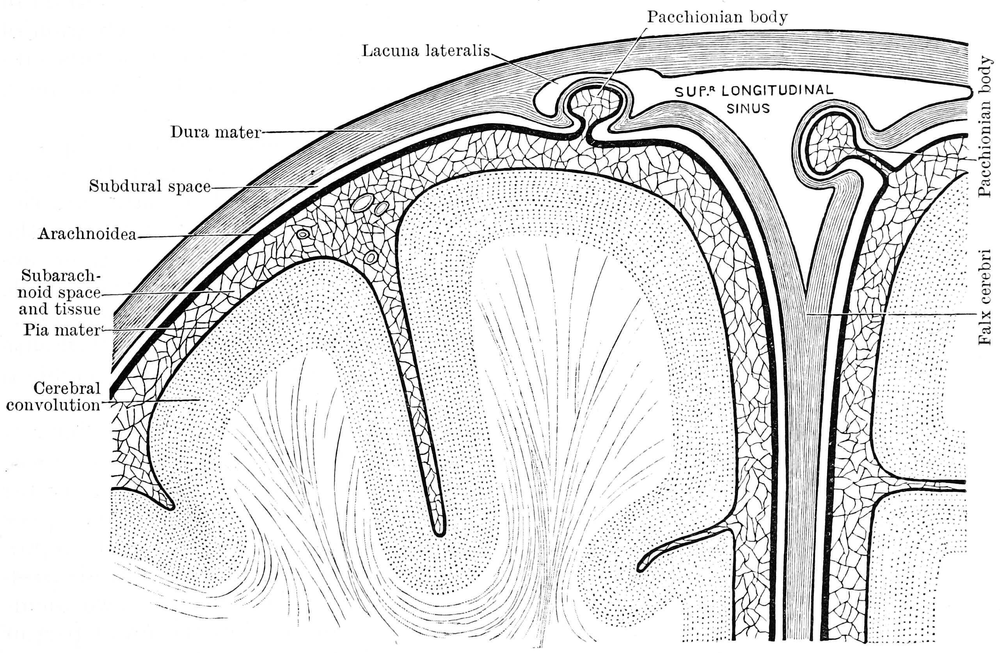
```

## The Ventricular System

The ventricular system is a set of four interconnected cavities (ventricles) in the brain, where the cerebrospinal fluid (CSF) is produced. Within each ventricle is a region of choroid plexus, a network of ependymal cells involved in the production of CSF. The ventricular system is continuous with the central canal of the spinal cord (from the fourth ventricle), allowing for the flow of CSF to circulate. All of the ventricular system and the central canal of the spinal cord are lined with ependyma, a specialised form of epithelium.

(ref:vent) The ventricles in relation to the brain as seen through the left hemisphere. From [Gray Henry, Anatomy of the Human Body. 20^th^ Edition, Lea & Febiger, Philadelphia & New York, 1918](https://archive.org/details/anatomyofhumanbo1918gray/page/n6/mode/2up) 

```{r ventriclesbrain, fig.cap='(ref:vent)', echo=FALSE, message=FALSE, warning=FALSE}
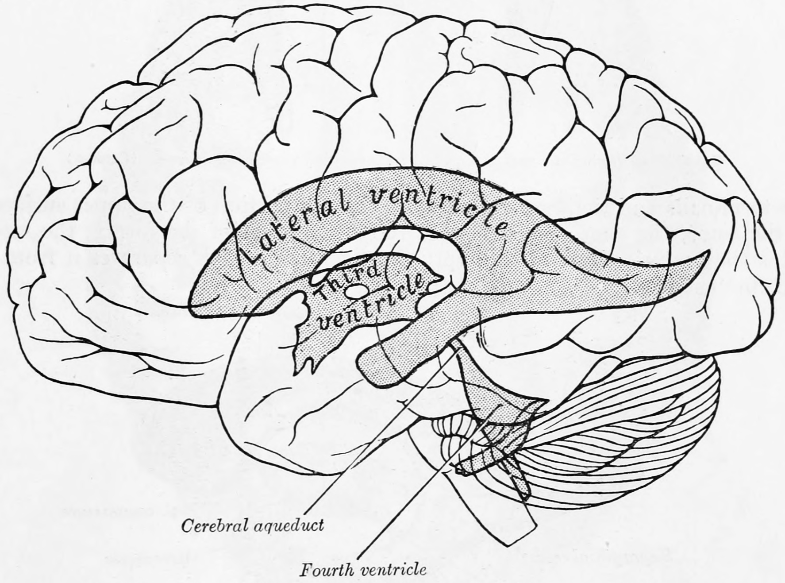
```

The system comprises four ventricles:

* lateral ventricles right and left (one for each hemisphere)
* third ventricle
* fourth ventricle

(ref:ventricle) The ventricular system of the brain as seen from above (top) and the side (bottom). From [Gray Henry, Anatomy of the Human Body. 20^th^ Edition, Lea & Febiger, Philadelphia & New York, 1918](https://archive.org/details/anatomyofhumanbo1918gray/page/n6/mode/2up) 

```{r ventricles, fig.cap='(ref:ventricle)', echo=FALSE, message=FALSE, warning=FALSE}
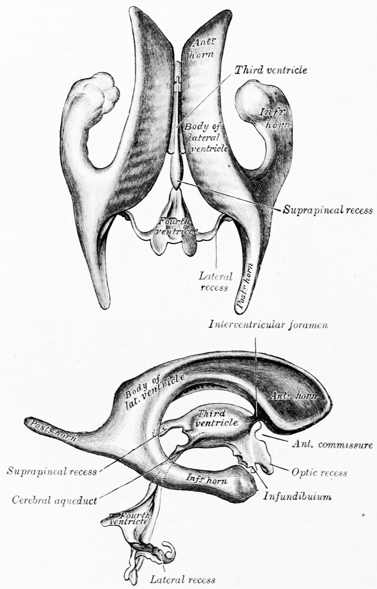
```

There are several foramina, openings acting as channels, that connect the ventricles. The interventricular foramina (also called the foramina of Monro) connect the lateral ventricles to the third ventricle through which the cerebrospinal fluid can flow.

| Name | From | To |
|------|------|----|
| interventricular foramina (Monro) | lateral ventricles | third ventricle |
| cerebral aqueduct (Sylvius) | third ventricle | fourth ventricle |
| median aperture (Magendie) | fourth ventricle | subarachnoid space via the cisterna magna |
| right and left lateral aperture (Luschka) | fourth ventricle | subarachnoid space via the cistern of great cerebral vein |

The ventricles are filled with cerebrospinal fluid (CSF) which bathes and cushions the brain and spinal cord within their bony confines. CSF is produced by modified ependymal cells of the choroid plexus found in all components of the ventricular system except for the cerebral aqueduct and the posterior and anterior horns of the lateral ventricles. CSF flows from the lateral ventricles via the interventricular foramina into the third ventricle, and then the fourth ventricle via the cerebral aqueduct in the brainstem. From the fourth ventricle it can pass into the central canal of the spinal cord or into the subarachnoid cisterns via three small foramina: the central median aperture and the two lateral apertures.

The fluid then flows around the superior sagittal sinus to be reabsorbed via the arachnoid granulations (or arachnoid villi) into the venous sinuses, after which it passes through the jugular vein and major venous system. CSF within the spinal cord can flow all the way down to the lumbar cistern at the end of the cord around the cauda equina where lumbar punctures are performed.

The cerebral aqueduct between the third and fourth ventricles is very small, as are the foramina, which means that they can be easily blocked.

## The Cerebrospinal Fluid

Cerebrospinal fluid (CSF) is a clear, colorless body fluid found in the brain and spinal cord. It is produced by specialised ependymal cells in the choroid plexuses of the ventricles of the brain, and absorbed in the arachnoid granulations. There is about 125mL of CSF at any one time, and about 500 mL is generated every day. CSF acts as a cushion or buffer, providing basic mechanical and immunological protection to the brain inside the skull. CSF also serves a vital function in the cerebral autoregulation of cerebral blood flow.

CSF occupies the subarachnoid space (between the arachnoid mater and the pia mater) and the ventricular system around and inside the brain and spinal cord. It fills the ventricles of the brain, cisterns, and sulci, as well as the central canal of the spinal cord. There is also a connection from the subarachnoid space to the bony labyrinth of the inner ear via the perilymphatic duct where the perilymph is continuous with the cerebrospinal fluid. The ependymal cells of the choroid plexuses have multiple motile cilia on their apical surfaces that beat to move the CSF through the ventricles.

A sample of CSF can be taken via lumbar puncture. This can reveal the intracranial pressure, as well as indicate diseases including infections of the brain or its surrounding meninges. Although noted by Hippocrates, it was only in the 18th century that [Emanuel Swedenborg](https://en.wikipedia.org/wiki/Emanuel_Swedenborg) was credited with its rediscovery, and as late as 1914 [Harvey Cushing](https://en.wikipedia.org/wiki/Harvey_Cushing) demonstrated CSF was secreted by the choroid plexus.

## The Blood-Brain-Barrier

The blood–brain barrier (BBB) is a highly selective semipermeable border that separates the circulating blood from the brain and extracellular fluid in the central nervous system (CNS). The blood-brain barrier is formed by endothelial cells of the capillary wall, astrocyte end-feet (also known as "glia limitans") ensheathing the capillary, and pericytes embedded in the capillary basement membrane. This system allows the passage of some molecules by passive diffusion, as well as the selective transport of molecules such as glucose, water and amino acids that are crucial to neural function.

Specialized structures participating in sensory and secretory integration within neural circuits—the circumventricular organs and choroid plexus—do not have a blood-brain barrier.

The blood-brain barrier restricts the passage of pathogens, the diffusion of solutes in the blood, and large or hydrophilic molecules into the cerebrospinal fluid (CSF), while allowing the diffusion of hydrophobic molecules (O~2~, CO~2~, hormones) and small polar molecules. Cells of the barrier actively transport metabolic products such as glucose across the barrier using specific transport proteins.

Technically, the BBB is a shorthand for the Blood-CNS barrier, which has two parts: the Blood-Brain portion and the Blood-Spinal Cord Barrier portion. The two parts are often breached simultaneously, but may be independently breached.

The blood-brain barrier results from the selectivity of the tight junctions between endothelial cells in CNS vessels, which restricts the passage of solutes. At the interface between blood and the brain, endothelial cells are stitched together by these tight junctions, which are composed of smaller subunits, frequently biochemical dimers, that are transmembrane proteins such as occludin, claudins, junctional adhesion molecule (JAM), or ESAM, for example. Each of these transmembrane proteins is anchored into the endothelial cells by another protein complex that includes ZO-1 and associated proteins.

Several areas of the human brain are not on the brain side of the BBB. Some examples of this include the circumventricular organs, the roof of the third and fourth ventricles, capillaries in the pineal gland on the roof of the diencephalon and the pineal gland. The pineal gland secretes the hormone melatonin "directly into the systemic circulation", thus melatonin is not affected by the blood-brain barrier.

The blood-brain barrier acts effectively to protect the brain from circulating pathogens. Accordingly, blood-borne infections of the brain are rare. Infections of the brain that do occur are often difficult to treat. Antibodies are too large to cross the blood-brain barrier, and only certain antibiotics are able to pass. In some cases, a drug has to be administered directly into the cerebrospinal fluid (CSF) where it can enter the brain by crossing the blood-cerebrospinal fluid barrier.

The blood-brain barrier may become leaky in select neurological diseases, such as amyotrophic lateral sclerosis, epilepsy, brain trauma and edema, and in systemic diseases, such as liver failure. The blood-brain barrier becomes more permeable during inflammation, allowing antibiotics and phagocytes to move across the BBB. However, this also allows bacteria and viruses to infiltrate the blood-brain barrier. Examples of pathogens that can traverse the blood-brain barrier include *Toxoplasma gondii* which causes toxoplasmosis, spirochetes like *Borrelia* (Lyme disease), Group B streptococci which causes meningitis in newborns, and *Treponema pallidum* which causes syphilis. Some of these harmful bacteria gain access by releasing cytotoxins like pneumolysin which have a direct toxic effect on brain microvascular endothelium and tight junctions.

(ref:astrocytes) Astrocytes in the grey matter of the cerebral cortex with their endfeet on brain capillaries. [Histologie du système nerveux de l'homme & des vertébrés, Tome Premier](https://wellcomelibrary.org/item/b2129592x#?c=0&m=0&s=0&cv=14&z=0%2C-3.48%2C1%2C8.6591) (1909) by Santiago Ramón y Cajal translated from Spanish by Dr. L. Azoulay.

```{r astrobbb, fig.cap='(ref:astrocytes)', echo=FALSE, message=FALSE, warning=FALSE}
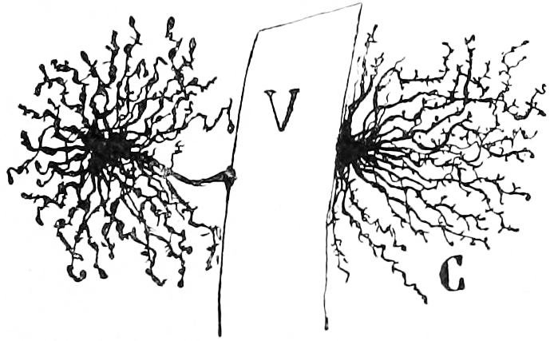 
```

(ref:oligo) Oligodendrocytes in the white matter of the cerebral cortex with their endfeet touching a brain capillary. [Histologie du système nerveux de l'homme & des vertébrés, Tome Premier](https://wellcomelibrary.org/item/b2129592x#?c=0&m=0&s=0&cv=14&z=0%2C-3.48%2C1%2C8.6591) (1909) by Santiago Ramón y Cajal translated from Spanish by Dr. L. Azoulay.

```{r oligobbb, fig.cap='(ref:oligo)', echo=FALSE, message=FALSE, warning=FALSE}
knitr::include_graphics("./figures/cns/ologodendrocytes_vessel.jpg")
```

### Circumventricular Organs

Circumventricular organs (CVOs) are individual structures located adjacent to the fourth ventricle or third ventricle in the brain, and are characterized by dense capillary beds with permeable endothelial cells unlike those of the blood-brain barrier. Included among CVOs having highly permeable capillaries are the area postrema, subfornical organ, vascular organ of the lamina terminalis, median eminence, pineal gland, and three lobes of the pituitary gland.

Permeable capillaries of the sensory CVOs (area postrema, subfornical organ, vascular organ of the lamina terminalis) enable rapid detection of circulating signals in systemic blood, while those of the secretory CVOs (median eminence, pineal gland, pituitary lobes) facilitate transport of brain-derived signals into the circulating blood. Consequently, the CVO permeable capillaries are the point of bidirectional blood-brain communication for neuroendocrine function.

The border zones between brain tissue "behind" the blood-brain barrier and zones "open" to blood signals in certain CVOs contain specialized hybrid capillaries that are leakier than typical brain capillaries, but not as permeable as CVO capillaries. Such zones exist at the border of the area postrema—nucleus tractus solitarii (NTS), and median eminence—hypothalamic arcuate nucleus.

[Paul Ehrlich](https://en.wikipedia.org/wiki/Paul_Ehrlich) was a bacteriologist studying staining, a procedure that is used in many microscopy studies to make fine biological structures visible using chemical dyes. As Ehrlich injected some of these dyes (notably the aniline dyes that were then widely used), the dye stained all of the organs of some kinds of animals except for their brains. At that time, Ehrlich attributed this lack of staining to the brain simply not picking up as much of the dye.

However, in a later experiment in 1913, [Edwin Goldmann](https://en.wikipedia.org/wiki/Edwin_Goldmann) (one of Ehrlich's students) injected the dye directly into the cerebrospinal fluids of animal brains. He found then the brains did become dyed, but the rest of the body did not, demonstrating the existence of a compartmentalization between the two. At that time, it was thought that the blood vessels themselves were responsible for the barrier, since no obvious membrane could be found. The term blood–brain barrier was coined in 1900 by the German neurologist [Max Lewandowsky](https://en.wikipedia.org/wiki/Max_Lewandowsky).

## The Cerebrum

The cerebrum is the largest part of the brain, and is divided into nearly symmetrical left and right hemispheres by a deep groove, the longitudinal fissure (Figure \@ref(fig:topview)). The hemispheres are connected by five commissures that span the longitudinal fissure, the largest of these is the corpus callosum (Figure \@ref(fig:medialview)). Each hemisphere is conventionally divided into four main lobes; the frontal lobe, parietal lobe, temporal lobe, and occipital lobe, named according to the skull bones that overlie them. The surface of the brain is folded into ridges (gyri) and grooves (sulci), many of which are named, usually according to their position, such as the frontal gyrus of the frontal lobe or the central sulcus separating the central regions of the hemispheres. There are many small variations in the secondary and tertiary folds.

(ref:top) View of the human brain (cerebrum) showing the left and right hemispheres from the top. [Sobotta's Textbook and Atlas of Human Anatomy 1909](https://commons.wikimedia.org/wiki/File:Sobo_1909_628.png)

```{r topview, fig.cap='(ref:top)', echo=FALSE, message=FALSE, warning=FALSE}
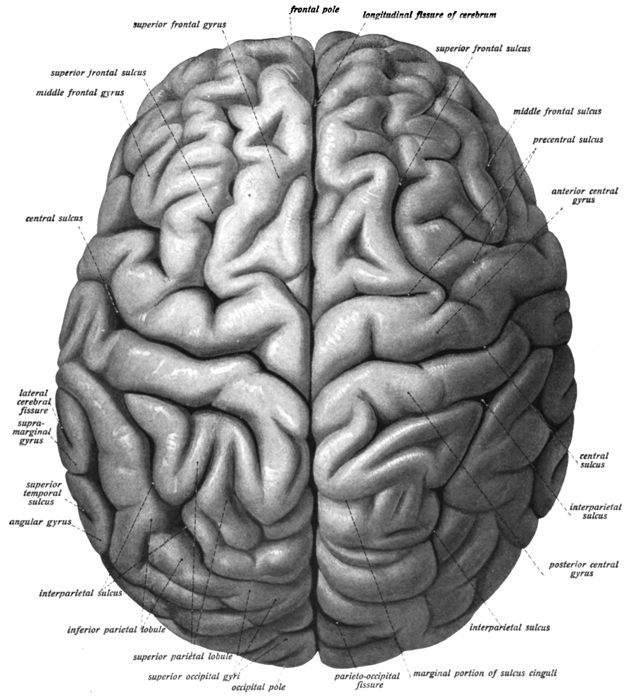
```

(ref:medial) Medial view of the left hemisphere of the human brain. [Sobotta's Textbook and Atlas of Human Anatomy 1909](https://commons.wikimedia.org/wiki/File:Sobo_1909_624.png)

```{r medialview, fig.cap='(ref:medial)', echo=FALSE, message=FALSE, warning=FALSE}
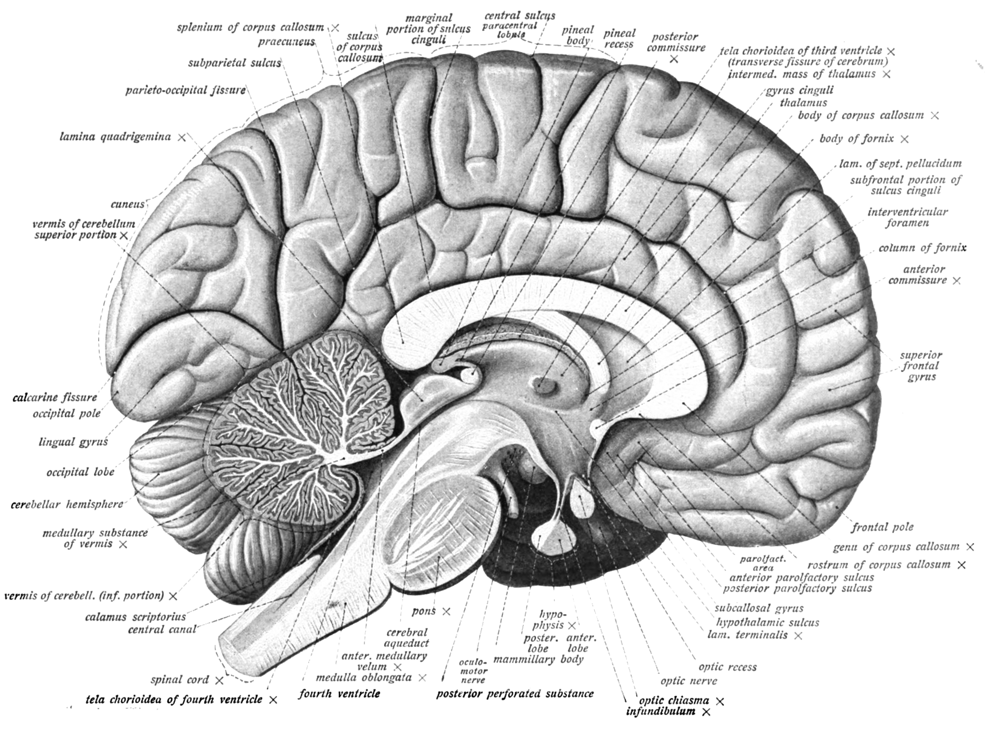
```

(ref:lateral) Lateral view of the left hemisphere of the human brain. [Sobotta's Textbook and Atlas of Human Anatomy 1909](https://commons.wikimedia.org/wiki/File:Sobo_1909_626.png)

```{r lateralview, fig.cap='(ref:lateral)', echo=FALSE, message=FALSE, warning=FALSE}
knitr::include_graphics("./figures/cns/Sobo_1909_626.jpg")
```

(ref:bottom) Bottom view of the human brain. [Sobotta's Textbook and Atlas of Human Anatomy 1909](https://commons.wikimedia.org/wiki/File:Sobo_1909_623.png)

```{r bottomview, fig.cap='(ref:bottom)', echo=FALSE, message=FALSE, warning=FALSE}
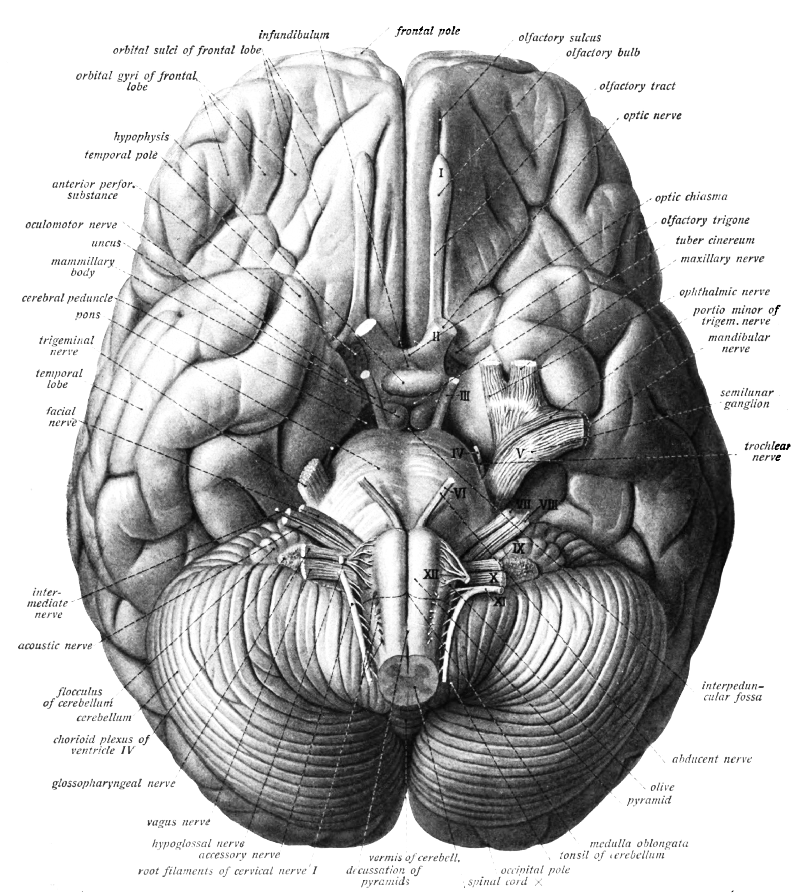
```

### The Cerebral Cortex

The outer part of the cerebrum is the cerebral cortex, made up of grey matter arranged in layers. It is 2 to 4 millimetres thick, and deeply folded to give a convoluted appearance. Beneath the cortex is the cerebral white matter (Figure \@ref(fig:coronalsection)). Based on the differences in laminar organization the cerebral cortex can be classified into two types, the large area of neocortex which has six cell layers, and the much smaller area of allocortex that has three or four layers:

(ref:cortex) Neocortex morphology. Coronal sections of the mouse (left) and human (right) adult neocortex are shown. Red dashed lines highlight the contour of the pial surface of the gray matter (GM). Blue dashed lines highlight neocortical thickness. The inset on the left shows an area of the human neocortex at higher magnification, highlighting a neocortical gyrus that is contiguous to a sulcus. The inset on the right outlines the principal dimensions by which the adult neocortical GM is described: (1) radial (black arrows), i.e. along the white matter (WM)-to-pia axis, corresponding to the apical-basal axis in terms of tissue polarity; and (2) lateral (red arrow), i.e. along the axis perpendicular to the radial axis. Mouse neocortex adapted with permission from the High Resolution Mouse Brain Atlas (Sidman, R. L., Kosaras, B., Misra, B. M. and Senft, S. L., 1999), http://www.hms.harvard.edu/research/brain; human neocortex adapted with permission from http://www.brains.rad.msu.edu and http://brainmuseum.org (supported by the US National Science Foundation). From [Marta Florio, Wieland B. Huttner(2014) Neural progenitors, neurogenesis and the evolution of the neocortex Development 2014 141: 2182-2194; doi: 10.1242/dev.090571](https://dev.biologists.org/content/141/11/2182)

```{r cortexmorphology, fig.cap='(ref:cortex)', echo=FALSE, message=FALSE, warning=FALSE}
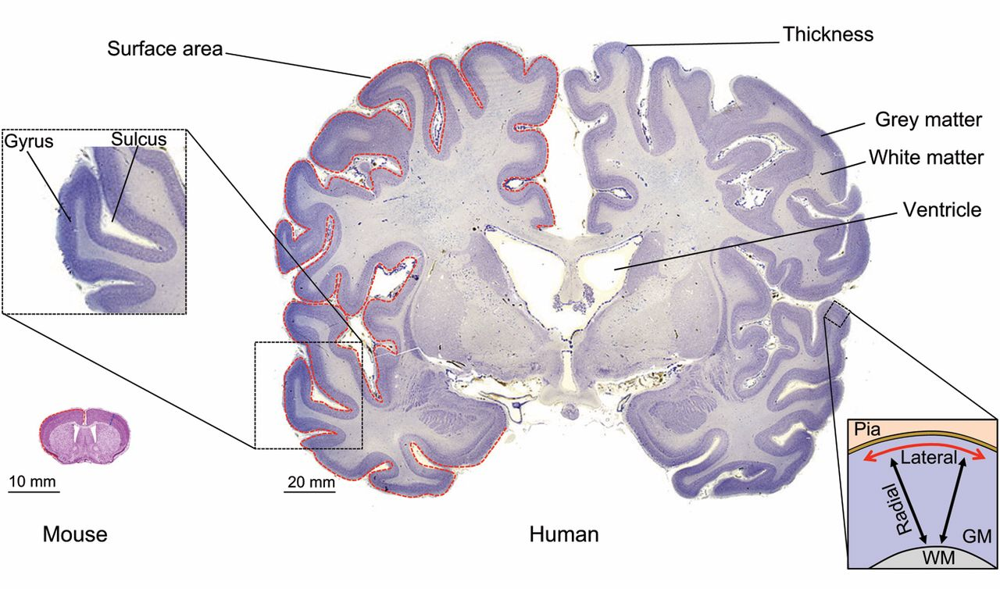
```

* The neocortex is also known as the isocortex or neopallium and is the part of the mature cerebral cortex with six distinct layers. Examples of neocortical areas include the granular primary motor cortex, and the striate primary visual cortex (Figure \@ref(fig:viscortex))". The neocortex has two subtypes, the true isocortex and the proisocortex which is a transitional region between the isocortex and the regions of the periallocortex.
* The allocortex is the part of the cerebral cortex with three or four layers, and has three subtypes, the paleocortex with three cortical laminae, the archicortex which has four or five, and a transitional area adjacent to the allocortex, the periallocortex. Examples of allocortex are the olfactory cortex and the hippocampus.

Staining cross-sections of the cortex to reveal the position of neuronal cell bodies allowed neuroanatomists to produce a detailed description of the laminar structure of the cortex (Figure \@ref(fig:cajallayers) and Figure \@ref(fig:brodmannlayers)). 

(ref:layers1) A section of the visual cortex close to the calcarine fissure from the brain of a 29 year old male. Cajal distinguished 9 different layers based on differences of the morpholical features of groups of neurons. [Studien über die Hirnrinde des Menschen by S. R. y Cajal](https://wellcomelibrary.org/item/b28084585)

```{r cajallayers, fig.cap='(ref:layers1)', echo=FALSE, message=FALSE, warning=FALSE}
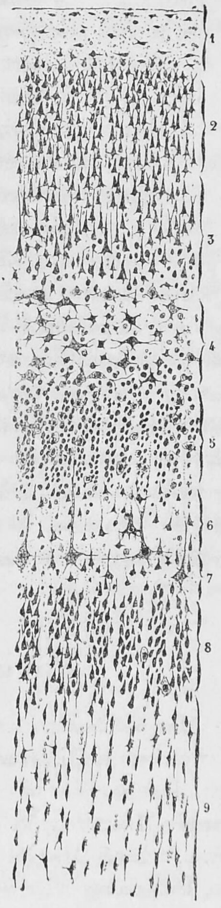
```

Based on the cytoarchitectural organization of neurons observed using the Nissl method of cell staining, the German anatomist [Korbinian Brodmann](https://en.wikipedia.org/wiki/Korbinian_Brodmann) distinguished in the human cortex 7 major cytoarchitectonic regions (*Hauptregionen* in German; Figure \@ref(fig:brodmannregions)) which he subdived into 52 distinct areas (*Felder* in German; Figure \@ref(fig:brodmannareas)).

(ref:layers2) Based on his studies of developing and adult brains of humans and other animals, Korbinian Brodmann proposed that the cerebral cortex consists of six layers. During development and in different brain regions, individual layers can combine or split into sublayers creating location specific cytoarchitectonics. From [Broadmann, Korbinian: Vergleichende Lokalisationslehre der Grosshirnrinde in ihren Prinzipien dargestellt auf Grund des Zellenbaues. Verlag von Johann Ambrosius Barth, Leipzig, 1909.](https://wellcomelibrary.org/item/b28062449)

```{r brodmannlayers, fig.cap='(ref:layers2)', echo=FALSE, message=FALSE, warning=FALSE}
knitr::include_graphics("./figures/cns/cortex_area_5.jpg")
```

(ref:brodreg) [Brodmann's diagram of the cerebral cortex showing the 7 major cytoarchitectonic regions that he identified](https://wellcomelibrary.org/item/b28062449)

```{r brodmannregions, fig.cap='(ref:brodreg)', echo=FALSE, message=FALSE, warning=FALSE}
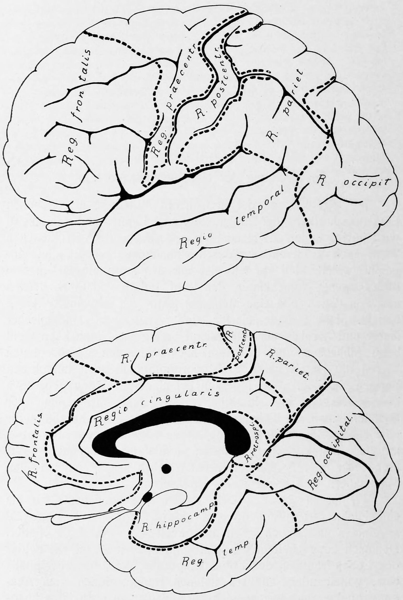
```

(ref:brodar) [Brodmann's diagram of the cerebral cortex showing the 52 distinct cytoarchitectonic areas he identified](https://wellcomelibrary.org/item/b28062449)

```{r brodmannareas, fig.cap='(ref:brodar)', echo=FALSE, message=FALSE, warning=FALSE}
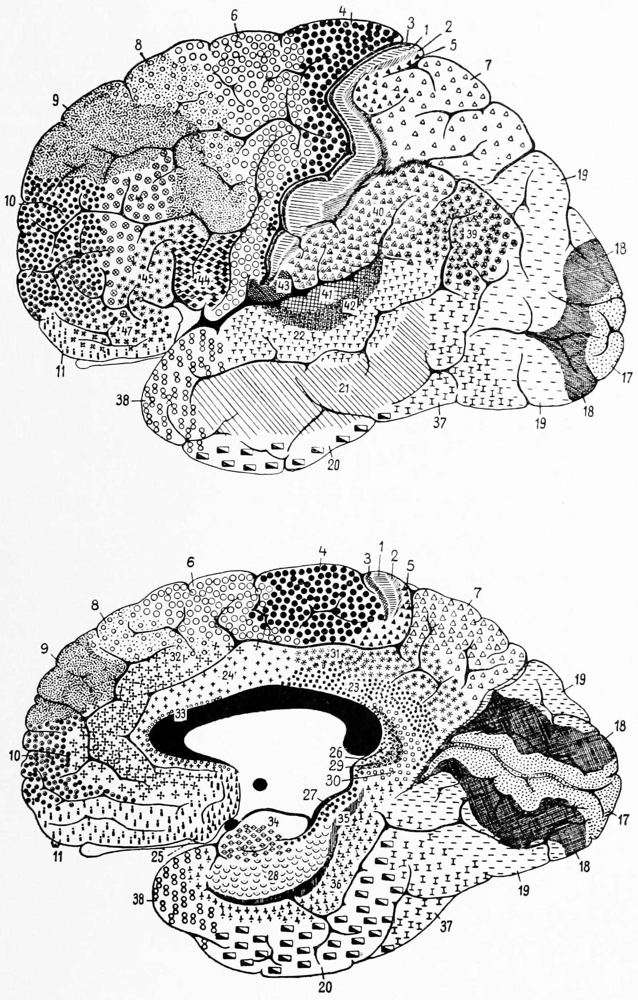
```

These areas are distinctly different when seen under a microscope. Brodmann published his maps of cortical areas in humans, monkeys, and other species in 1909, along with many other findings and observations regarding the general cell types and laminar organization of the mammalian cortex. The same Brodmann area number in different species does not necessarily indicate homologous areas. Brodmann postulated that areas with different structures performed different functions. Indeed, some of these areas were later associated to nervous functions, such as the following:

* Brodmann area 41 and 42 in the temporal lobe, related to hearing
* Brodmann area 45 and 44 overlap with the Broca's area for language in humans
* Brodmann area 1, 2, and 3 in the postcentral gyrus of the parietal lobe (the somatosensory region)
* Brodmann area 4 in the precentral gyrus of the frontal lobe (the primary motor area)
* Brodmann area 17 and 18 in the occipital lobe (the primary visual areas).

His work to characterize brain cytoarchitecture was strongly influenced by [Oskar](https://en.wikipedia.org/wiki/Oskar_Vogt), and [Cécile](https://en.wikipedia.org/wiki/Cécile_Vogt-Mugnier) Vogt who postulated over 200 distinct areas in the brain. Another cortical map was published in the two volume work "Die Cytoarchitektonik der Hirnrinde des erwachsenen Menschen" ("Cytoarchitectonics of the Adult Human Cerebral Cortex") by [Constantin von Economo](https://en.wikipedia.org/wiki/Constantin_von_Economo) and [Georg N. Koskinas](https://en.wikipedia.org/wiki/Georg_N._Koskinas) in 1925.

(ref:vogt) [Korbinian Brodmann, Cécile Vogt-Mugnier, Oskar Vogt, Max Borcherdt, and Max Lewandowsky.](https://commons.wikimedia.org/wiki/File:Lewandowsky_Vogts_Brodmann.JPG)

```{r vogtlab, fig.cap='(ref:vogt)', echo=FALSE, message=FALSE, warning=FALSE}
knitr::include_graphics("./figures/cns/Lewandowsky_Vogts_Brodmann.jpg")
```

Layer I is the molecular layer, and contains few scattered neurons, including GABAergic rosehip neurons. Layer I consists largely of extensions of apical dendritic tufts of pyramidal neurons and horizontally oriented axons, as well as glial cells. During development Cajal-Retzius cells and subpial granular layer cells are present in this layer. Also, some spiny stellate cells can be found here.

Layer II, the external granular layer, contains small pyramidal neurons and numerous stellate neurons.

Layer III, the external pyramidal layer, contains predominantly small and medium-size pyramidal neurons, as well as non-pyramidal neurons with vertically oriented intracortical axons; layers I through III are the main target of interhemispheric corticocortical afferents, and layer III is the principal source of corticocortical efferents.

Layer IV, the internal granular layer, contains different types of stellate and pyramidal cells, and is the main target of thalamocortical afferents from thalamus type C neurons (core-type ) as well as intra-hemispheric corticocortical afferents. The layers above layer IV are also referred to as supragranular layers (layers I-III), whereas the layers below are referred to as infragranular layers (layers V and VI).

Layer V, the internal pyramidal layer, contains large pyramidal neurons. Axons from these leave the cortex and connect with subcortical structures including the basal ganglia. In the primary motor cortex of the frontal lobe, layer V contains giant pyramidal cells called Betz cells, whose axons travel through the internal capsule, the brain stem, and the spinal cord forming the corticospinal tract, which is the main pathway for voluntary motor control.

Layer VI, the polymorphic or multiform layer, contains few large pyramidal neurons and many small spindle-like pyramidal and multiform neurons; layer VI sends efferent fibers to the thalamus, establishing a very precise reciprocal interconnection between the cortex and the thalamus. That is, layer VI neurons from one cortical column connect with thalamus neurons that provide input to the same cortical column. These connections are both excitatory and inhibitory. Neurons send excitatory fibers to neurons in the thalamus and also send collaterals to the thalamic reticular nucleus that inhibit these same thalamus neurons or ones adjacent to them.

(ref:vis1718) The layers in Brodmann areas 17 (towards the right from the arrows) and 18 (towards the left of the arrows) in the human occipital cortex. Like Cajal, Brodmann identified 9 layers (right) in the calcarine area of the visual cortex but in order to fit this observation into this overall scheme of six layers, he chose to subdivide layers 4 and 6. The layers are: I. Lamina zonalis, II. Lamina granularis externa, III Lamina pyramidalis, IV Lamina granularis interna, IVa Sublamina granularis superficialis, IVb Sublamina granularis intermedia, IVc Sublamina granularis interna profunda, V Lamina ganglionaris, VI Lamina multiformis, VIa Sublamina trinagularis, VIb Sublamina fusiformis Sublamina granularis superficialis, IVb Sublamina granularis intermedia, IVc Sublamina granularis interna profunda, V Lamina ganglionaris, VI Lamina multiformis, VIa Sublamina trinagularis, VIb Sublamina fusiformis. [Vergleichende Lokalisationslehre der Grosshirnrinde in ihren Prinzipien dargestellt auf Grund des Zellenbaues by K. Brodmann, 1909](https://wellcomelibrary.org/item/b28062449)

```{r viscortex, fig.cap='(ref:vis1718)', echo=FALSE, message=FALSE, warning=FALSE}
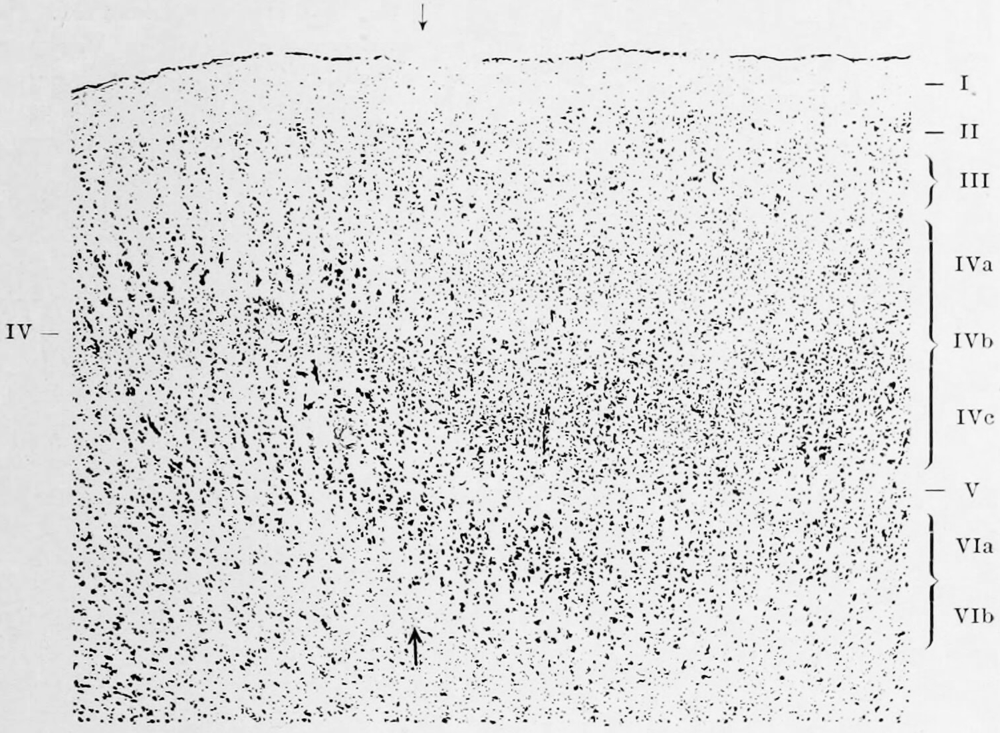
```

Many of those brain areas defined by Brodmann have their own complex internal structures. In a number of cases, brain areas are organized into topographic maps, where adjoining bits of the cortex correspond to adjoining parts of the body, or of some more abstract entity. A simple example of this type of correspondence is the primary motor cortex, a strip of tissue running along the anterior edge of the central sulcus. Motor areas innervating each part of the body arise from a distinct zone, with neighboring body parts represented by neighboring zones. Electrical stimulation of the cortex at any point causes a muscle-contraction in the represented body part. This "somatotopic" representation is not evenly distributed, however. The head, for example, is represented by a region about three times as large as the zone for the entire back and trunk. The size of any zone correlates to the precision of motor control and sensory discrimination possible. The areas for the lips, fingers, and tongue are particularly large, considering the proportional size of their represented body parts.

In visual areas, the maps are retinotopic; this means they reflect the topography of the retina, the layer of light-activated neurons lining the back of the eye. In this case too, the representation is uneven: the fovea—the area at the center of the visual field—is greatly overrepresented compared to the periphery. The visual circuitry in the human cerebral cortex contains several dozen distinct retinotopic maps, each devoted to analyzing the visual input stream in a particular way. The primary visual cortex (Brodmann area 17), which is the main recipient of direct input from the visual part of the thalamus, contains many neurons that are most easily activated by edges with a particular orientation moving across a particular point in the visual field. Visual areas farther downstream extract features such as color, motion, and shape.

In auditory areas, the primary map is tonotopic. Sounds are parsed according to frequency (i.e., high pitch vs. low pitch) by subcortical auditory areas, and this parsing is reflected by the primary auditory zone of the cortex. As with the visual system, there are a number of tonotopic cortical maps, each devoted to analyzing sound in a particular way.

Within a topographic map there can sometimes be finer levels of spatial structure. In the primary visual cortex, for example, where the main organization is retinotopic and the main responses are to moving edges, cells that respond to different edge-orientations are spatially segregated from one another.

The cerebral cortex is connected to various subcortical structures such as the thalamus and the basal ganglia, sending information to them along efferent connections and receiving information from them via afferent connections. Most sensory information is routed to the cerebral cortex via the thalamus. Olfactory information, however, passes through the olfactory bulb to the olfactory cortex (piriform cortex).

In more general terms the cortex is typically described as comprising three parts: sensory, motor, and association areas.

The sensory areas are the cortical areas that receive and process information from the senses. Parts of the cortex that receive sensory inputs from the thalamus are called primary sensory areas. The senses of vision, hearing, and touch are served by the primary visual cortex, primary auditory cortex and primary somatosensory cortex respectively. In general, the two hemispheres receive information from the opposite (contralateral) side of the body. For example, the right primary somatosensory cortex receives information from the left limbs, and the right visual cortex receives information from the left visual field. The organization of sensory maps in the cortex reflects that of the corresponding sensing organ, in what is known as a topographic map. Neighboring points in the primary visual cortex, for example, correspond to neighboring points in the retina. This topographic map is called a retinotopic map. In the same way, there exists a tonotopic map in the primary auditory cortex and a somatotopic map in the primary sensory cortex. This last topographic map of the body onto the posterior central gyrus has been illustrated as a deformed human representation, the somatosensory homunculus, where the size of different body parts reflects the relative density of their innervation. Areas with lots of sensory innervation, such as the fingertips and the lips, require more cortical area to process finer sensation.

The motor areas are located in both hemispheres of the cortex. The motor areas are very closely related to the control of voluntary movements, especially fine fragmented movements performed by the hand. The right half of the motor area controls the left side of the body, and vice versa.

Two areas of the cortex are commonly referred to as motor:

* Primary motor cortex, which executes voluntary movements
* Supplementary motor areas and premotor cortex, which select voluntary movements.

In addition, motor functions have been described for:

* Posterior parietal cortex, which guides voluntary movements in space
* Dorsolateral prefrontal cortex, which decides which voluntary movements to make according to higher-order instructions, rules, and self-generated thoughts.

The association areas are the parts of the cerebral cortex that do not belong to the primary regions. They function to produce a meaningful perceptual experience of the world, enable us to interact effectively, and support abstract thinking and language. The parietal, temporal, and occipital lobes - all located in the posterior part of the cortex - integrate sensory information and information stored in memory. The frontal lobe or prefrontal association complex is involved in planning actions and movement, as well as abstract thought. Globally, the association areas are organized as distributed networks. Each network connects areas distributed across widely spaced regions of the cortex. Distinct networks are positioned adjacent to one another yielding a complex series of interwoven networks. The specific organization of the association networks is debated with evidence for interactions, hierarchical relationships, and competition between networks.

In humans, association networks are particularly important to language function. In the past it was theorized that language abilities are localized in Broca's area in areas of the left inferior frontal gyrus, BA44 and BA45, for language expression and in Wernicke's area BA22, for language reception. However, the processes of language expression and reception have been shown to occur in areas other than just those structures around the lateral sulcus, including the frontal lobe, basal ganglia, cerebellum, and pons.

Below the corpus callosum is the septum pellucidum, a membrane that separates the lateral ventricles. Beneath the lateral ventricles is the thalamus and to the front and below this is the hypothalamus. The hypothalamus leads on to the pituitary gland. At the back of the thalamus is the brainstem.

### The Basal Ganglia

The basal ganglia (or basal nuclei) are a group of subcortical nuclei, of varied origin, in the brains of vertebrates, including humans, which are situated at the base of the forebrain and top of the midbrain, lateral to the thalamus. Basal ganglia are strongly interconnected with the cerebral cortex, thalamus, and brainstem, as well as several other brain areas. The basal ganglia are associated with a variety of functions, including control of voluntary motor movements, procedural learning, habit learning, eye movements, cognition, and emotion.

The main components of the basal ganglia are the caudate nucleus, the putamen, the globus pallidus, the substantia nigra, the nucleus accumbens, and the subthalamic nucleus. The putamen and globus pallidus are also collectively known as the lentiform nucleus, because together they form a lens-shaped body. The putamen and caudate nucleus are also collectively called the corpus striatum after their striped appearance. Part of the dorsal striatum, the putamen, and the globus pallidus, lie separated from the lateral ventricles and thalamus by the internal capsule, whereas the caudate nucleus stretches around and abuts the lateral ventricles on their outer sides. At the deepest part of the lateral sulcus between the insular cortex and the striatum is a thin neuronal sheet called the claustrum.

Below and in front of the striatum are a number of basal forebrain structures. These include the nucleus accumbens, nucleus basalis, diagonal band of Broca, substantia innominata, and the medial septal nucleus. 

The main components of the basal ganglia – as defined functionally – are the striatum; both dorsal striatum (caudate nucleus and putamen) and ventral striatum (nucleus accumbens and olfactory tubercle), globus pallidus, ventral pallidum, substantia nigra, and subthalamic nucleus. Each of these components has a complex internal anatomical and neurochemical organization. The largest component, the striatum (dorsal and ventral), receives input from many brain areas beyond the basal ganglia, but only sends output to other components of the basal ganglia. The pallidum receives input from the striatum, and sends inhibitory output to a number of motor-related areas. The substantia nigra is the source of the striatal input of the neurotransmitter dopamine, which plays an important role in basal ganglia function. The subthalamic nucleus receives input mainly from the striatum and cerebral cortex, and projects to the globus pallidus.

In more specific terms, the basal ganglia's primary function is likely to control and regulate activities of the motor and premotor cortical areas so that voluntary movements can be performed smoothly. Experimental studies show that the basal ganglia exert an inhibitory influence on a number of motor systems, and that a release of this inhibition permits a motor system to become active. The "behavior switching" that takes place within the basal ganglia is influenced by signals from many parts of the brain, including the prefrontal cortex, which plays a key role in executive functions.

The basal ganglia are of major importance for normal brain function and behaviour. Their dysfunction results in a wide range of neurological conditions including disorders of behaviour control and movement. Those of behaviour include Tourette syndrome, obsessive–compulsive disorder, and addiction. Movement disorders include, most notably Parkinson's disease, which involves degeneration of the dopamine-producing cells in the substantia nigra, Huntington's disease, which primarily involves damage to the striatum, dystonia, and more rarely hemiballismus. The basal ganglia have a limbic sector whose components are assigned distinct names: the nucleus accumbens, ventral pallidum, and ventral tegmental area (VTA). There is considerable evidence that this limbic part plays a central role in reward learning as well as cognition and frontal lobe functioning, via the mesolimbic pathway from the VTA to the nucleus accumbens that uses the neurotransmitter dopamine, and the mesocortical pathway. A number of highly addictive drugs, including cocaine, amphetamine, specific medications that are prescribed by a doctor, and nicotine, are thought to work by increasing the efficacy of this dopamine signal. There is also evidence implicating overactivity of the VTA dopaminergic projection in schizophrenia.

### The Limbic Lobe

The limbic lobe is an arc-shaped region of cortex on the medial surface of each cerebral hemisphere of the mammalian brain, consisting of parts of the frontal, parietal and temporal lobes. The term limbic comes from the Latin limbus, for "border" or "edge", or, particularly in medical terminology, a border of an anatomical component. 

[Pierre Paul Broca](https://en.wikipedia.org/wiki/Paul_Broca) first called this part of the brain le grand lobe limbique in 1878. He examined the differentiation between deeply recessed cortical tissue and underlying, subcortical nuclei. 

Broca identified the limbic lobe with the cingulate and parahippocampal gyri, and associated it with the sense of smell. 

The limbic system is a term that was introduced in 1949 by the American physician and neuroscientist, Paul D. MacLean. The In 1937, [James Papez](https://en.wikipedia.org/wiki/James_Papez) proposed that the circuit connecting the hypothalamus to the limbic lobe was the basis for emotional experiences. Papez had been studying cases of rabies which is a disease that causes high levels of aggression. He noticed that this heightened aggression correlated with damage to the hippocampus. Theoretically, this made sense to Papez who asserted that the hippocampus is responsible for the expression of emotion because of its connection to the autonomic nervous system. He also noticed that in other cases, certain stimuli (taste, smell, pain, etc.) would cause strong emotional responses. These stimuli activated not only the hippocampus but also other brain structures. He theorized that these brain structures worked together as the emotional control center in the brain. These interconnected structures were subsequently referred to as the the Papez circuit. Because of these studies, Papez strongly believed that the circuit was the cortical control of emotion. Further evidence that the limbic system was responsible for the cortical representation of emotions was discovered in 1939, by Heinrich Kluver and Paul Bucy. Kluver and Bucy, after much research, demonstrated that the bilateral removal of the temporal lobes in monkeys created an extreme behavioral syndrome. After performing a temporal lobectomy, the monkeys showed a decrease in aggression. The animals revealed a reduced threshold to visual stimuli, and were thus unable to recognize objects that were once familiar. 

(ref:papez) Schematic (modified from Papez's original drawing) summarizing neural systems proposed to process emotion, highlighting structures that are visible on the medial surface of the brain. Papez's (1937) original circuit (top) was expanded upon in the concept of the limbic system (bottom) to include a variety of subcortical and cortical territories (MacLean, 1952; Heimer and Van Hoesen, 2006). (Structures like the anterior insula and nucleus basalis of Meynert, which are not visible on the medial surface of the brain, are not represented here). Orange: cingulate cortex; purple: anterior thalamus; red mammilary bodies; green hippocampus; light yellow: ventromedial frontal cortex; yellow: caudal orbital frontal cortex; hot pink: temporal polar cortex; pink: pyriform and entorhinal cortex; salmon: striatum; blue: septal nuclei; turquoise: amygdala. Modified from Barger N, Hanson KL, Teffer K, Schenker-Ahmed NM and Semendeferi K (2014) Evidence for evolutionary specialization in human limbic structures. [Front. Hum. Neurosci. 8:277. doi: 10.3389/fnhum.2014.00277](http://journal.frontiersin.org/article/10.3389/fnhum.2014.00277/full)

```{r papezcircuit, fig.cap='(ref:papez)', echo=FALSE, message=FALSE, warning=FALSE}
knitr::include_graphics("./figures/cns/papez_ai_scaled.jpg")
```

Around the same time, [Paul D. MacLean](https://en.wikipedia.org/wiki/Paul_D._MacLean) was also interested in the Papez circuit. He had read through Paul Broca's research which indicated that the limbic lobe that surrounds the brainstem is a structure present in all mammals. Papez's paper on the emotional circuit which involved the connection between the hypothalamus and the limbic lobe set MacLean on a journey to learn more. He visited Papez at Cornell University after which he proposed a modified version of the Papez circuit in 1952, emphasizing not only the hippocampus, but also the amygdala and septum.

The hippocampus, amygdala, and septum make up the rhinencephalon (frontotemporal portion of the brain) or, as the Bavarian neuropathologist Christfried Jakob had termed it in 1907/1908, the visceral brain. Together, the limbic lobe and the visceral brain make up the limbic system. MacLean believed that including the visceral brain in the limbic system accounted for the external sensory information associated with subjective emotional experiences. MacLean coined the term limbic system. 

There is controversy over the use of the term limbic system, with some scientists arguing that the term be considered obsolete and abandoned. Originally, the limbic system was believed to be the emotional center of the brain, with cognition being the business of the neocortex. However, cognition depends on acquisition and retention of memories, in which the hippocampus, a primary limbic interacting structure, is involved: hippocampus damage causes severe cognitive (memory) deficits. More important, the "boundaries" of the limbic system have been repeatedly redefined because of advances in neuroscience. Therefore, while it is true that limbic interacting structures are more closely related to emotion, the limbic system itself is best thought of as a component of a larger emotional processing plant, that is essentially responsible for sifting through, organizing, lower order processing, and relaying sensory information to other brain areas for higher order emotional processing.

### The Hippocampus

The hippocampus is located under the cerebral cortex in the allocortex, and in primates it is in the medial temporal lobe. It contains two main interlocking parts: the hippocampus proper (also called Ammon's horn) and the dentate gyrus. It is involved with various processes relating to cognition and is one of the most well understood and heavily involved limbic interacting structure.

The earliest description of the ridge running along the floor of the temporal horn of the lateral ventricle comes from the Venetian anatomist Julius Caesar Aranzi (1587), who likened it first to a silkworm and then to a seahorse (Latin hippocampus, from Greek ἱππόκαμπος, from Greek ἵππος, "horse" + κάμπος, "sea-monster"). The German anatomist Duvernoy (1729), the first to illustrate the structure, also wavered between "seahorse" and "silkworm". "Ram's horn" was proposed by the Danish anatomist Jacob Winsløw in 1732; and a decade later his fellow Parisian, the surgeon de Garengeot, used "cornu Ammonis" – horn of (the ancient Egyptian god) Amun, who was often represented as having a ram's head. This has survived in abbreviated form as CA in naming the subfields of the hippocampus.


(ref:hipposea) [A human hippocampus alongside a sea horse.](https://commons.wikimedia.org/wiki/File:Hippocampus_and_seahorse.JPG)

```{r seahorse, fig.cap='(ref:hipposea)', echo=FALSE, message=FALSE, warning=FALSE}
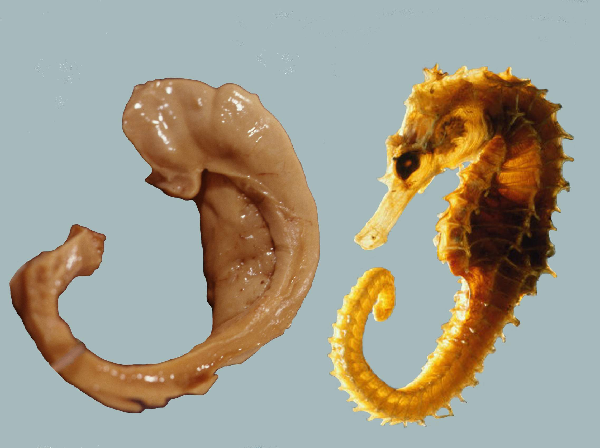
```

Another reference appeared with the term pes hippocampi, which may date back to Diemerbroeck in 1672, introducing a comparison with the shape of the folded back forelimbs and webbed feet of the mythological hippocampus, a sea-monster with a horse's forequarters and a fish's tail. The hippocampus was then described as pes hippocampi major, with an adjacent bulge in the occipital horn, described as the pes hippocampi minor and later renamed as the calcar avis. The renaming of the hippocampus as hippocampus major, and the calcar avis as hippocampus minor, has been attributed to Félix Vicq-d'Azyr systematising nomenclature of parts of the brain in 1786. Mayer mistakenly used the term hippopotamus in 1779, and was followed by some other authors until Karl Friedrich Burdach resolved this error in 1829. In 1861 the hippocampus minor became the centre of a dispute over human evolution between Thomas Henry Huxley and Richard Owen, satirised as the Great Hippocampus Question. The term hippocampus minor fell from use in anatomy textbooks, and was officially removed in the Nomina Anatomica of 1895. Today, the structure is just called the hippocampus, with the term Cornu Ammonis surviving in the names of the hippocampal subfields CA1-CA4.

Since different neuronal cell types are neatly organized into layers in the hippocampus, it has frequently been used as a model system for studying neurophysiology. The form of neural plasticity known as long-term potentiation (LTP) was initially discovered to occur in the hippocampus and has often been studied in this structure. LTP is widely believed to be one of the main neural mechanisms by which memories are stored in the brain.

(ref:hippocor) Coronal section of the brain of a macaque monkey, showing the hippocampus. From [Sobotta's Textbook and Atlas of Human Anatomy 1909](https://commons.wikimedia.org/wiki/File:Sobo_1909_634.png)


```{r hippocross, fig.cap='(ref:hippocor)', echo=FALSE, message=FALSE, warning=FALSE}
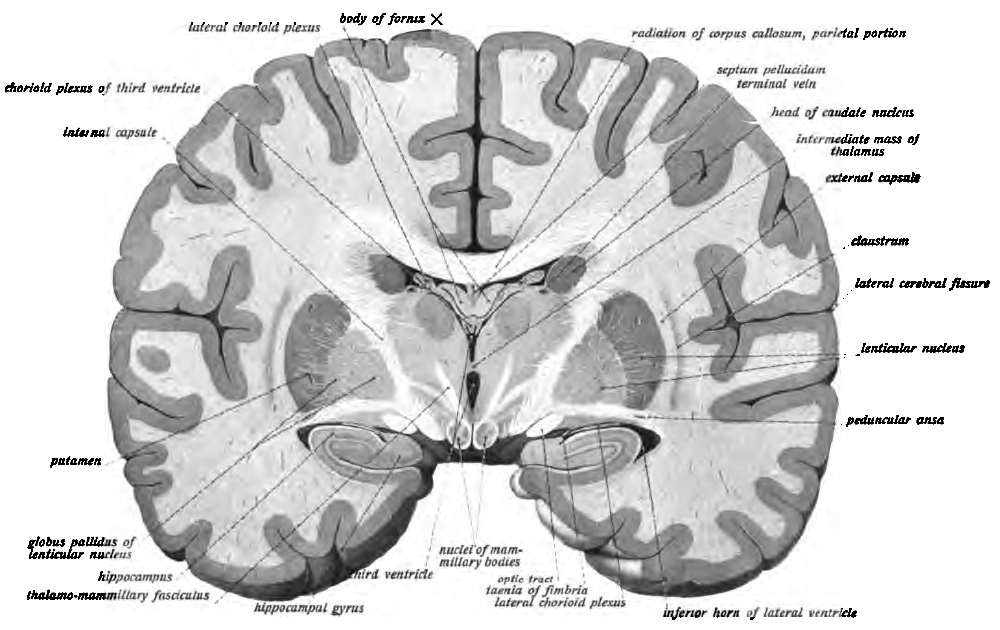
```

In rodents as model organisms, the hippocampus has been studied extensively as part of a brain system responsible for spatial memory and navigation. Many neurons in the rat and mouse hippocampus respond as place cells: that is, they fire bursts of action potentials when the animal passes through a specific part of its environment. Hippocampal place cells interact extensively with head direction cells, whose activity acts as an inertial compass, and conjecturally with grid cells in the neighboring entorhinal cortex.

Spatial memory was found to have many sub-regions in the hippocampus, such as the dentate gyrus (DG) in the dorsal hippocampus, the left hippocampus, and the parahippocampal region. The dorsal hippocampus was found to be an important component for the generation of new neurons, called adult-born granules (GC), in adolescence and adulthood. These new neurons contribute to pattern separation in spatial memory, increasing the firing in cell networks, and overall causing stronger memory formations. This is thought to integrate spatial and episodic memories with the limbic system via a feedback loop that provides emotional context of a particular sensory input.

(ref:hippocirc) Diagram of the structure and connections of the hippocampus. A, Molecular layer of the subiculum. B, Pyramidal cell layer of the Subiculum. C, Hippocampus. D, Fascia dentata. E, Fimbria. F, Cingulum. G, H, Corpus callosum. a, axons entering the cingulum. From [Histologie du système nerveux de l'homme & des vertébrés, Tome Premier](https://wellcomelibrary.org/item/b2129592x#?c=0&m=0&s=0&cv=14&z=0%2C-3.48%2C1%2C8.6591) (1909) by Santiago Ramón y Cajal translated from Spanish by Dr. L. Azoulay.

```{r hippocircuit, fig.cap='(ref:hippocirc)', echo=FALSE, message=FALSE, warning=FALSE}
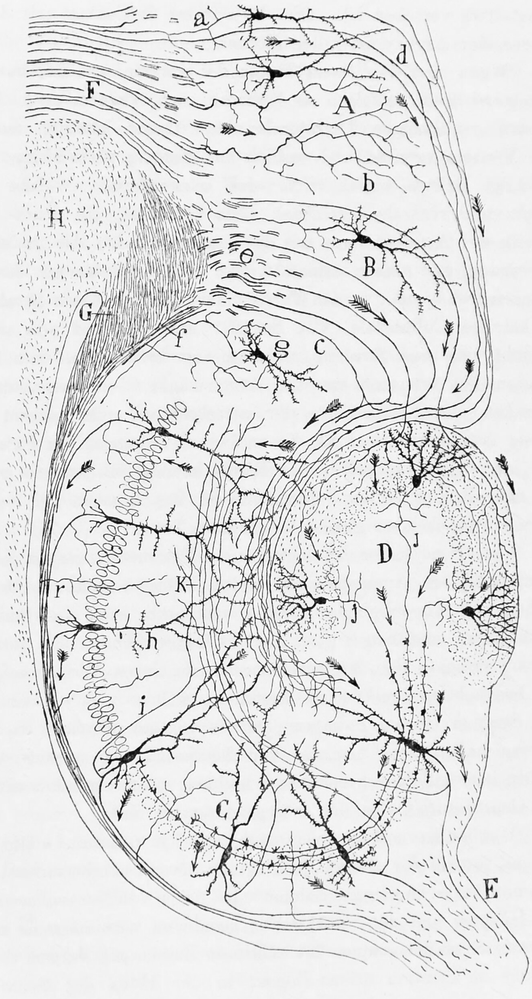
```

Damage related to the hippocampal region of the brain has reported vast effects on overall cognitive functioning, particularly memory such as spatial memory. As previously mentioned, spatial memory is a cognitive function greatly intertwined with the hippocampus. While damage to the hippocampus may be a result of a brain injury or other injuries of that sort, researchers particularly investigated the effects that high emotional arousal and certain types of drugs had on the recall ability in this specific memory type. In particular, in a study performed by Parkard, rats were given the task of correctly making their way through a maze. In the first condition, rats were stressed by shock or restraint which caused a high emotional arousal. When completing the maze task, these rats had an impaired effect on their hippocampal-dependent memory when compared to the control group. Then, in a second condition, a group of rats were injected with anxiogenic drugs. Like the former these results reported similar outcomes, in that hippocampal-memory was also impaired. Studies such as these reinforce the impact that the hippocampus has on memory processing, in particular the recall function of spatial memory. Furthermore, impairment to the hippocampus can occur from prolonged exposure to stress hormones such as glucocorticoids (GCs), which target the hippocampus and cause disruption in explicit memory.

In an attempt to curtail life-threatening epileptic seizures, 27-year-old Henry Gustav Molaison underwent bilateral removal of almost all of his hippocampus in 1953. Over the course of fifty years he participated in thousands of tests and research projects that provided specific information on exactly what he had lost. Semantic and episodic events faded within minutes, having never reached his long term memory, yet emotions, unconnected from the details of causation, were often retained. Dr. Suzanne Corkin, who worked with him for 46 years until his death, described the contribution of this tragic "experiment" in her 2013 book.

### The Amygdala

Another integrative part of the limbic system, the amygdala, which is deepest part of the limbic system, is involved in many cognitive processes and is largely considered the most primordial and vital part of the limbic system. Like the hippocampus, processes in the amygdala seem to impact memory; however, it is not spatial memory as in the hippocampus but the semantic division of episodic-autobiographical memory (EAM) networks. Markowitsch's amygdala research shows it encodes, stores, and retrieves EAM memories. To delve deeper into these types of processes by the amygdala, Markowitsch and his team provided extensive evidence through investigations that the "amygdala's main function is to charge cues so that mnemonic events of a specific emotional significance can be successfully searched within the appropriate neural nets and re-activated." These cues for emotional events created by the amygdala encompass the EAM networks previously mentioned.

Besides memory, the amygdala also seems to be an important brain region involved in attentional and emotional processes. First, to define attention in cognitive terms, attention is the ability to focus on some stimuli while ignoring others. Thus, the amygdala seems to be an important structure in this ability. Foremost, however, this structure was historically thought to be linked to fear, allowing the individual to take action in response to that fear. However, as time has gone by, researchers such as Pessoa, generalized this concept with help from evidence of EEG recordings, and concluded that the amygdala helps an organism to define a stimulus and therefore respond accordingly. However, when the amygdala was initially thought to be linked to fear, this gave way for research in the amygdala for emotional processes. Kheirbek demonstrated research that the amygdala is involved in emotional processes, in particular the ventral hippocampus. He described the ventral hippocampus as having a role in neurogenesis and the creation of adult-born granule cells (GC). These cells not only were a crucial part of neurogenesis and the strengthening of spatial memory and learning in the hippocampus but also appear to be an essential component to the function of the amygdala. A deficit of these cells, as Pessoa (2009) predicted in his studies, would result in low emotional functioning, leading to high retention rate of mental diseases, such as anxiety disorders.

Social processing, specifically the evaluation of faces in social processing, is an area of cognition specific to the amygdala. In a study done by Todorov, fMRI tasks were performed with participants to evaluate whether the amygdala was involved in the general evaluation of faces. After the study, Todorov concluded from his fMRI results that the amygdala did indeed play a key role in the general evaluation of faces. However, in a study performed by researchers Koscik and his team, the trait of trustworthiness was particularly examined in the evaluation of faces. Koscik and his team demonstrated that the amygdala was involved in evaluating the trustworthiness of an individual. They investigated how brain damage to the amygdala played a role in trustworthiness, and found that individuals that suffered damage tended to confuse trust and betrayal, and thus placed trust in those having done them wrong. Furthermore, Rule, along with his colleagues, expanded on the idea of the amygdala in its critique of trustworthiness in others by performing a study in 2009 in which he examined the amygdala's role in evaluating general first impressions and relating them to real-world outcomes. Their study involved first impressions of CEOs. Rule demonstrated that while the amygdala did play a role in the evaluation of trustworthiness, as observed by Koscik in his own research two years later in 2011, the amygdala also played a generalized role in the overall evaluation of first impression of faces. This latter conclusion, along with Todorov's study on the amygdala's role in general evaluations of faces and Koscik's research on trustworthiness and the amygdala, further solidified evidence that the amygdala plays a role in overall social processing.

### The Thalamus

The thalamus (from Greek θάλαμος, "chamber") is a large mass of gray matter located in the dorsal part of the diencephalon. Nerve fibers project out of the thalamus to the cerebral cortex in all directions, allowing hub-like exchanges of information. 

Anatomically, it is a midline symmetrical structure of two halves (left and right), within the vertebrate brain, situated between the cerebral cortex and the midbrain. It forms during embryonic development as the main product of the diencephalon, as first recognized by the Swiss embryologist and anatomist [Wilhelm His Sr.](https://en.wikipedia.org/wiki/Wilhelm_His_Sr.) in 1893.

The thalamus has many connections to the hippocampus via the mammillothalamic tract, this tract comprises the mammillary bodies and fornix.

(ref:thalamus) View of the left hemisphere from medial and below with the brainstem and cerebellum removed by an oblique section through the thalamus. The entire fornix is visible as are the mammilary body. [Sobotta's Textbook and Atlas of Human Anatomy 1909](https://commons.wikimedia.org/wiki/File:Sobo_1909_634.png)


```{r thalamusview, fig.cap='(ref:thalamus)', echo=FALSE, message=FALSE, warning=FALSE}
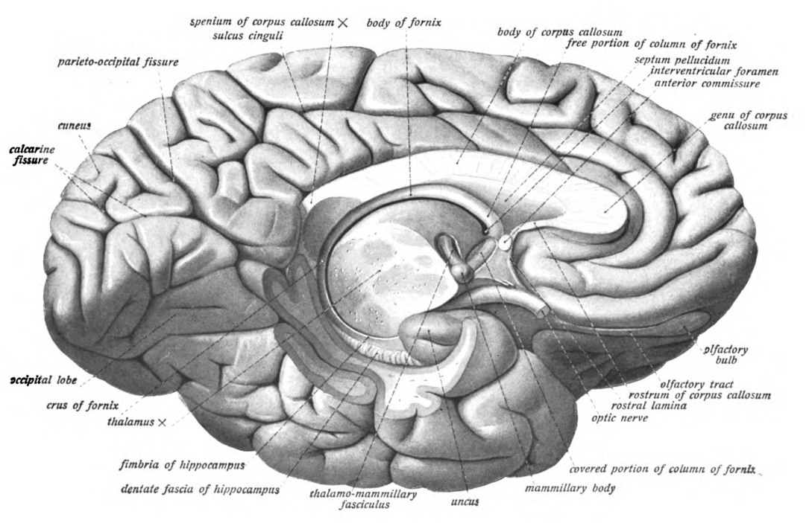
```

The thalamus is connected to the cerebral cortex via the thalamocortical radiations.

The spinothalamic tract is a sensory pathway originating in the spinal cord. It transmits information to the thalamus about pain, temperature, itch and crude touch. There are two main parts: the lateral spinothalamic tract, which transmits pain and temperature, and the anterior (or ventral) spinothalamic tract, which transmits crude touch and pressure.

The thalamus has multiple functions, generally believed to act as a relay station, or hub, relaying information between different subcortical areas and the cerebral cortex. In particular, every sensory system (with the exception of the olfactory system) includes a thalamic nucleus that receives sensory signals and sends them to the associated primary cortical area. For the visual system, for example, inputs from the retina are sent to the lateral geniculate nucleus of the thalamus, which in turn projects to the visual cortex in the occipital lobe. The thalamus is believed to both process sensory information as well as relay it—each of the primary sensory relay areas receives strong feedback connections from the cerebral cortex. Similarly the medial geniculate nucleus acts as a key auditory relay between the inferior colliculus of the midbrain and the primary auditory cortex. The ventral posterior nucleus is a key somatosensory relay, which sends touch and proprioceptive information to the primary somatosensory cortex.

### The Hypothalamus

The hypothalamus is a portion of the brain that contains a number of small nuclei with a variety of functions. One of the most important functions of the hypothalamus is to link the nervous system to the endocrine system via the pituitary gland. The hypothalamus is located below the thalamu. It forms the ventral part of the diencephalon. All vertebrate brains contain a hypothalamus. In humans, it is the size of an almond. The hypothalamus is responsible for the regulation of certain metabolic processes and other activities of the autonomic nervous system. It synthesizes and secretes certain neurohormones, called releasing hormones or hypothalamic hormones, and these in turn stimulate or inhibit the secretion of hormones from the pituitary gland. The hypothalamus controls body temperature, hunger, important aspects of parenting and attachment behaviours, thirst, fatigue, sleep, and circadian rhythms. The hypothalamus derives its name from Greek ὑπό, under and θάλαμος, chamber.

The hypothalamus is a divided into 3 regions (supraoptic, tuberal, mammillary) in a parasagittal plane, indicating location anterior-posterior; and 3 areas (periventricular, medial, lateral) in the coronal plane, indicating location medial-lateral. Hypothalamic nuclei are located within these specific regions and areas. It is found in all vertebrate nervous systems. In mammals, magnocellular neurosecretory cells in the paraventricular nucleus and the supraoptic nucleus of the hypothalamus produce neurohypophysial hormones, oxytocin and vasopressin. These hormones are released into the blood in the posterior pituitary. Much smaller parvocellular neurosecretory cells, neurons of the paraventricular nucleus, release corticotropin-releasing hormone and other hormones into the hypophyseal portal system, where these hormones diffuse to the anterior pituitary.

The hypothalamus is highly interconnected with other parts of the central nervous system, in particular the brainstem and its reticular formation. As part of the limbic system, it has connections to other limbic structures including the amygdala and septum, and is also connected with areas of the autonomous nervous system.

The hypothalamus has a central neuroendocrine function, most notably by its control of the anterior pituitary, which in turn regulates various endocrine glands and organs. Releasing hormones (also called releasing factors) are produced in hypothalamic nuclei then transported along axons to either the median eminence or the posterior pituitary, where they are stored and released as needed.

The hypothalamus has a central neuroendocrine function, most notably by its control of the anterior pituitary, which in turn regulates various endocrine glands and organs. Releasing hormones (also called releasing factors) are produced in hypothalamic nuclei then transported along axons to either the median eminence or the posterior pituitary, where they are stored and released as needed.

In the hypothalamic–adenohypophyseal axis, releasing hormones, also known as hypophysiotropic or hypothalamic hormones, are released from the median eminence, a prolongation of the hypothalamus, into the hypophyseal portal system, which carries them to the anterior pituitary where they exert their regulatory functions on the secretion of adenohypophyseal hormones. These hypophysiotropic hormones are stimulated by parvocellular neurosecretory cells located in the periventricular area of the hypothalamus. After their release into the capillaries of the third ventricle, the hypophysiotropic hormones travel through what is known as the hypothalamo-pituitary portal circulation. Once they reach their destination in the anterior pituitary, these hormones bind to specific receptors located on the surface of pituitary cells. Depending on which cells are activated through this binding, the pituitary will either begin secreting or stop secreting hormones into the rest of the bloodstream.

Other hormones secreted from the median eminence include vasopressin, oxytocin, and neurotensin.

In the hypothalamic-neurohypophyseal axis, neurohypophysial hormones are released from the posterior pituitary, which is actually a prolongation of the hypothalamus, into the circulation. It is also known that hypothalamic-pituitary-adrenal axis (HPA) hormones are related to certain skin diseases and skin homeostasis. There is evidence linking hyperactivity of HPA hormones to stress-related skin diseases and skin tumors.

The extreme lateral part of the ventromedial nucleus of the hypothalamus is responsible for the control of food intake. Stimulation of this area causes increased food intake. Bilateral lesion of this area causes complete cessation of food intake. Medial parts of the nucleus have a controlling effect on the lateral part. Bilateral lesion of the medial part of the ventromedial nucleus causes hyperphagia and obesity of the animal. Further lesion of the lateral part of the ventromedial nucleus in the same animal produces complete cessation of food intake.

There are different hypotheses related to this regulation:

* Lipostatic hypothesis: This hypothesis holds that adipose tissue produces a humoral signal that is proportionate to the amount of fat and acts on the hypothalamus to decrease food intake and increase energy output. It has been evident that a hormone leptin acts on the hypothalamus to decrease food intake and increase energy output.
* Gutpeptide hypothesis: gastrointestinal hormones like Grp, glucagons, CCK and others claimed to inhibit food intake. The food entering the gastrointestinal tract triggers the release of these hormones, which act on the brain to produce satiety. The brain contains both CCK-A and CCK-B receptors.
* Glucostatic hypothesis: The activity of the satiety center in the ventromedial nuclei is probably governed by the glucose utilization in the neurons. It has been postulated that when their glucose utilization is low and consequently when the arteriovenous blood glucose difference across them is low, the activity across the neurons decrease. Under these conditions, the activity of the feeding center is unchecked and the individual feels hungry. Food intake is rapidly increased by intraventricular administration of 2-deoxyglucose therefore decreasing glucose utilization in cells.
* Thermostatic hypothesis: According to this hypothesis, a decrease in body temperature below a given set-point stimulates appetite, whereas an increase above the set-point inhibits appetite.

### The Brainstem

The brainstem lies beneath the cerebrum and consists of the midbrain, pons and medulla. It lies in the back part of the skull, resting on the part of the base known as the clivus, and ends at the foramen magnum, a large opening in the occipital bone. The brainstem continues below this as the spinal cord, protected by the vertebral column.

(ref:quadri) View of the brainstem from behind (left) and from the left (right).  [Sobotta's Textbook and Atlas of Human Anatomy 1909](https://commons.wikimedia.org/wiki/File:Sobo_1909_660.png)

```{r quadrigemina, fig.cap='(ref:quadri)', echo=FALSE, message=FALSE, warning=FALSE}
knitr::include_graphics("./figures/cns/Sobotta_1909_660.jpg")
```

Ten of the twelve pairs of cranial nerves emerge directly from the brainstem. The brainstem also contains many cranial nerve nuclei and nuclei of peripheral nerves, as well as nuclei involved in the regulation of many essential processes including breathing, control of eye movements and balance. The reticular formation, a network of nuclei of ill-defined formation, is present within and along the length of the brainstem. Many nerve tracts, which transmit information to and from the cerebral cortex to the rest of the body, pass through the brainstem.

The internal carotid arteries supply oxygenated blood to the front of the brain and the vertebral arteries supply blood to the back of the brain. These two circulations join together in the circle of Willis, a ring of connected arteries that lies in the interpeduncular cistern between the midbrain and pons.

(ref:bloodsup) The arteries of the base of the brain. The tempora pole of the cerebrum and a portion of the cerebellar hemisphere have been removed on the right side. From [Gray Henry, Anatomy of the Human Body. 20^th^ Edition, Lea & Febiger, Philadelphia & New York, 1918](https://archive.org/details/anatomyofhumanbo1918gray/page/n6/mode/2up) 

```{r bloodsupply, fig.cap='(ref:bloodsup)', echo=FALSE, message=FALSE, warning=FALSE}
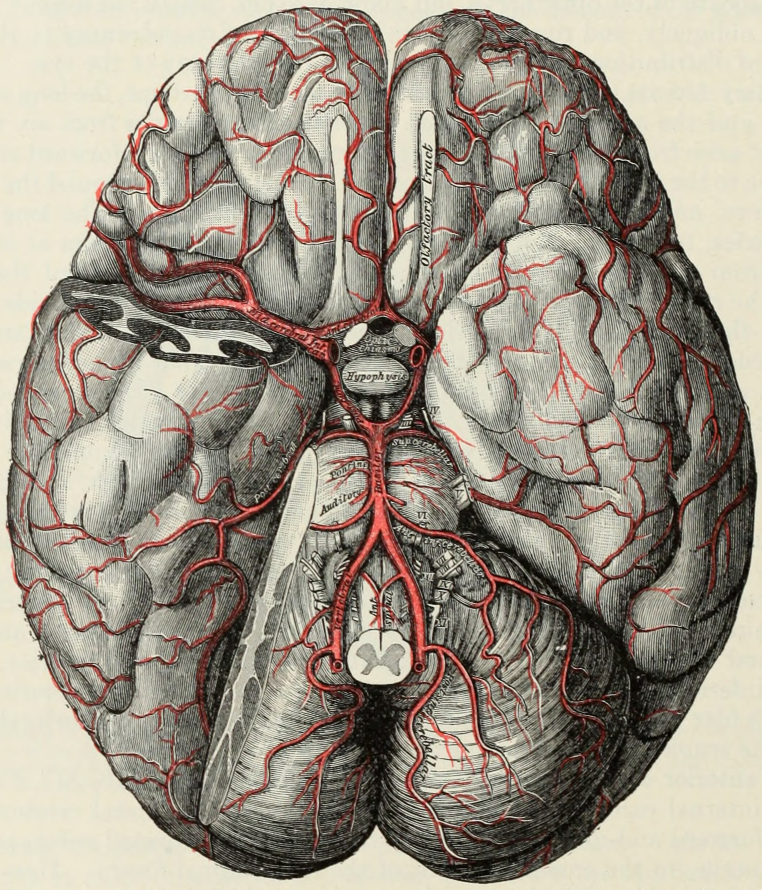
```

The internal carotid arteries are branches of the common carotid arteries. They enter the cranium through the carotid canal, travel through the cavernous sinus and enter the subarachnoid space. They then enter the circle of Willis, with two branches, the anterior cerebral arteries emerging. These branches travel forward and then upward along the longitudinal fissure, and supply the front and midline parts of the brain. One or more small anterior communicating arteries join the two anterior cerebral arteries shortly after they emerge as branches. The internal carotid arteries continue forward as the middle cerebral arteries. They travel sideways along the sphenoid bone of the eye socket, then upwards through the insula cortex, where final branches arise. The middle cerebral arteries send branches along their length.

(ref:bloodsupdia) Diagram of the arterial circulation at the base of the brain. A.L. Antero-lateral. A.M. Antero-medial.P.L. Postero-lateral. P.M. Postero-medial ganglionic branches. From [Gray Henry, Anatomy of the Human Body. 20^th^ Edition, Lea & Febiger, Philadelphia & New York, 1918](https://archive.org/details/anatomyofhumanbo1918gray/page/n6/mode/2up) 

```{r bloodsupplydiagram, fig.cap='(ref:bloodsupdia)', echo=FALSE, message=FALSE, warning=FALSE}
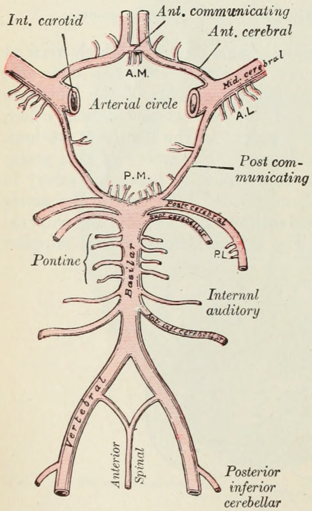
```

The vertebral arteries emerge as branches of the left and right subclavian arteries. They travel upward through transverse foramina which are spaces in the cervical vertebrae. Each side enters the cranial cavity through the foramen magnum along the corresponding side of the medulla. They give off one of the three cerebellar branches. The vertebral arteries join in front of the middle part of the medulla to form the larger basilar artery, which sends multiple branches to supply the medulla and pons, and the two other anterior and superior cerebellar branches. Finally, the basilar artery divides into two posterior cerebral arteries. These travel outwards, around the superior cerebellar peduncles, and along the top of the cerebellar tentorium, where it sends branches to supply the temporal and occipital lobes. Each posterior cerebral artery sends a small posterior communicating artery to join with the internal carotid arteries.

### The Midbrain

The midbrain or mesencephalon is the rostral-most portion of the brainstem and is associated with vision, hearing, motor control, sleep and wakefulness, arousal (alertness), and temperature regulation.

The principal regions of the midbrain are the tectum, the cerebral aqueduct, tegmentum, and the cerebral peduncles. Rostrally the midbrain adjoins the diencephalon (thalamus, hypothalamus, etc.), while caudally it adjoins the hindbrain (pons, medulla and cerebellum). In the rostral direction, the midbrain noticeably splays laterally.

#### The Tectum

The tectum (Latin for roof) is the dorsal side of the midbrain. The position of the tectum is contrasted with the tegmentum, which refers to the region in front of the ventricular system, or floor of the midbrain.

The corpora quadrigemina are four mounds, called colliculi, in two pairs – a superior and an inferior pair, on the surface of the tectum. The superior colliculi process some visual information, aid the decussation of several fibres of the optic nerve (some fibres remain ipsilateral), and are involved with saccadic eye movements. The tectospinal tract connects the superior colliculi to the cervical nerves of the neck, and co-ordinates head and eye movements. Each one of the superior colliculi also sends information to the corresponding lateral geniculate nucleus, with which it is directly connected. The homologous structure to the superior colliculus in non mammalian vertebrates including fish and amphibians, is called the optic tectum; in those animals, the optic tectum integrates sensory information from the eyes and certain auditory reflexes.

The inferior colliculi – located just above the trochlear nerve – process certain auditory information. Each inferior colliculus sends information to the corresponding medial geniculate nucleus, with which it is directly connected.

The cerebral aqueduct is the part of the ventricular system which links the third ventricle (rostrally) with the fourth ventricle (caudally); as such it is responsible for continuing the circulation of cerebrospinal fluid. The cerebral aqueduct is a narrow channel located between the tectum and the tegmentum, and is surrounded by the periaqueductal grey, which has a role in analgesia, quiescence, and bonding. The dorsal raphe nucleus (which releases serotonin in response to certain neural activity) is located at the ventral side of the periaqueductal grey, at the level of the inferior colliculus.

The nuclei of two pairs of cranial nerves are similarly located at the ventral side of the periaqueductal grey – the pair of oculomotor nuclei (which control the eyelid, and most eye movements) is located at the level of the superior colliculus, while the pair of trochlear nuclei (which helps focus vision on more proximal objects) is located caudally to that, at the level of the inferior colliculus, immediatetly lateral to the dorsal raphe nucleus. The oculomotor nerve emerges from the nucleus by traversing the ventral width of the tegmentum, while the trochlear nerve emerges via the tectum, just below the inferior colliculus itself; the trochlear is the only cranial nerve to exit the brainstem dorsally. The Edinger-Westphal nucleus (which controls the shape of the lens and size of the pupil) is located between the oculomotor nucleus and the cerebral aqueduct.

#### The Tegmentum

The midbrain tegmentum is the portion of the midbrain ventral to the cerebral aqueduct, and is much larger in size than the tectum. It communicates with the cerebellum by the superior cerebellar peduncles, which enter at the caudal end, medially, on the ventral side; the cerebellar peduncles are distinctive at the level of the inferior colliculus, where they decussate, but they dissipate more rostrally. Between these peduncles, on the ventral side, is the median raphe nucleus, which is involved in memory consolidation.

The main bulk of the tegmentum contains a complex synaptic network of neurons, primarily involved in homeostasis and reflex actions. It includes portions of the reticular formation. A number of distinct nerve tracts between other parts of the brain pass through it. The medial lemniscus – a narrow ribbon of fibres – passes through in a relatively constant axial position; at the level of the inferior colliculus it is near the lateral edge, on the ventral side, and retains a similar position rostrally. The spinothalamic tract – another ribbon-like region of fibres – are located at the lateral edge of the tegmentum; at the level of the inferior colliculus it is immediately dorsal to the medial lemiscus, but due to the rostral widening of the tegmentum, is lateral of the medial lemiscus at the level of the superior colliculus.

A prominent pair of round, reddish, regions – the red nuclei (which have a role in motor co-ordination) – are located in the rostral portion of the midbrain, somewhat medially, at the level of the superior colliculus. The rubrospinal tract emerges from the red nucleus and descends caudally, primarily heading to the cervical portion of the spine. The area between the red nuclei, on the ventral side – known as the ventral tegmental area – is the largest dopamine-producing area in the brain, and is heavily involved in the neural reward system. The ventral tegmental area is in contact with parts of the forebrain – the mammillary bodies (from the telencephalon) and hypothalamus (of the diencephalon).

The cerebral peduncles each form a lobe ventrally of the tegmentum, on either side of the midline. Beyond the midbrain, between the lobes, is the interpeduncular fossa, which is a cistern filled with cerebrospinal fluid.

The majority of each lobe constitutes the cerebral crus. The cerebral crura are the main tracts descending from the thalamus to caudal parts of the central nervous system; the central and medial ventral portions contain the corticobulbar and corticospinal tracts, while the remainder of each crus primarily contains tracts connecting the cortex to the pons. Older texts refer to the crus cerebri as the cerebral peduncle; however, the latter term actually covers all fibres communicating with the cerebrum (usually via the diencephalon), and therefore would include much of the tegmentum as well. The remainder of the crus pedunculi – small regions around the main cortical tracts – contain tracts from the internal capsule.

The portion of the lobes in connection with the tegmentum, except the most lateral portion, is dominated by a blackened band – the substantia nigra (literally black substance) – which is the only part of the basal ganglia system outside the forebrain. It is ventrally wider at the rostral end. By means of the basal ganglia, the substantia nigra is involved in motor-planning, learning, addiction, and other functions. There are two regions within the substantia nigra – one where neurons are densely packed (the pars compacta) and one where they aren't (the pars reticulata), which serve a different role from one another within the basal ganglia system. The substantia nigra has extremely high production of melanin (hence the colour), dopamine, and noradrenalin; the loss of dopamine-producing neurons in this region leads to Parkinson's disease.

### The Cerebellum

The cerebellum (Latin for "little brain") is a major feature of the hindbrain of all vertebrates. In humans, the cerebellum plays an important role in motor control. It may also be involved in some cognitive functions such as attention and language as well as in regulating fear and pleasure responses, but its movement-related functions are the most solidly established. The human cerebellum does not initiate movement, but contributes to coordination, precision, and accurate timing: it receives input from sensory systems of the spinal cord and from other parts of the brain, and integrates these inputs to fine-tune motor activity. Cerebellar damage produces disorders in fine movement, equilibrium, posture, and motor learning in humans.

The cerebellum is located in the posterior cranial fossa. The fourth ventricle, pons and medulla are in front of the cerebellum. It is separated from the overlying cerebrum by a layer of leathery dura mater, the tentorium cerebelli; all of its connections with other parts of the brain travel through the pons. Anatomists classify the cerebellum as part of the metencephalon, which also includes the pons; the metencephalon is the upper part of the rhombencephalon or "hindbrain". Like the cerebral cortex, the cerebellum is divided into two hemispheres; it also contains a narrow midline zone (the vermis). A set of large folds is, by convention, used to divide the overall structure into 10 smaller "lobules". Because of its large number of tiny granule cells, the cerebellum contains more neurons than the total from the rest of the brain, but takes up only 10% of the total brain volume. The number of neurons in the cerebellum is related to the number of neurons in the neocortex. There are about 3.6 times as many neurons in the cerebellum as in the neocortex, a ratio that is conserved across many different mammalian species.

(ref:cerebellumab) View of the cerebellum viewed from above and behind (top) and from below (bottom). [Sobotta's Textbook and Atlas of Human Anatomy 1909](https://commons.wikimedia.org/wiki/File:Sobo_1909_653.png)

```{r cerebellumabovebelow, fig.cap='(ref:cerebellumab)', echo=FALSE, message=FALSE, warning=FALSE}
knitr::include_graphics("./figures/cns/Sobotta_1909_653.jpg")
```

The unusual surface appearance of the cerebellum conceals the fact that most of its volume is made up of a very tightly folded layer of gray matter: the cerebellar cortex. Each ridge or gyrus in this layer is called a folium. It is estimated that, if the human cerebellar cortex were completely unfolded, it would give rise to a layer of neural tissue about 1 meter long and averaging 5 centimeters wide—a total surface area of about 500 square cm, packed within a volume of dimensions 6 cm × 5 cm × 10 cm. Underneath the gray matter of the cortex lies white matter, made up largely of myelinated nerve fibers running to and from the cortex. Embedded within the white matter—which is sometimes called the arbor vitae (tree of life) because of its branched, tree-like appearance in cross-section—are four deep cerebellar nuclei, composed of gray matter.

Connecting the cerebellum to different parts of the nervous system are three paired cerebellar peduncles. These are the superior cerebellar peduncle, the middle cerebellar peduncle and the inferior cerebellar peduncle, named by their position relative to the vermis. The superior cerebellar peduncle is mainly an output to the cerebral cortex, carrying efferent fibers via thalamic nuclei to upper motor neurons in the cerebral cortex. The fibers arise from the deep cerebellar nuclei. The middle cerebellar peduncle is connected to the pons and receives all of its input from the pons mainly from the pontine nuclei. The input to the pons is from the cerebral cortex and is relayed from the pontine nuclei via transverse pontine fibers to the cerebellum. The middle peduncle is the largest of the three and its afferent fibers are grouped into three separate fascicles taking their inputs to different parts of the cerebellum. The inferior cerebellar peduncle receives input from afferent fibers from the vestibular nuclei, spinal cord and the tegmentum. Output from the inferior peduncle is via efferent fibers to the vestibular nuclei and the reticular formation. The whole of the cerebellum receives modulatory input from the inferior olivary nucleus via the inferior cerebellar peduncle.

(ref:cerebellumai) Anterior (top) and inferior (bottom) view of the cerebellum viewed from above and behind (top). [Sobotta's Textbook and Atlas of Human Anatomy 1909](https://commons.wikimedia.org/wiki/File:Sobo_1909_655.png)

```{r cerebellumanteriorinferior, fig.cap='(ref:cerebellumai)', echo=FALSE, message=FALSE, warning=FALSE}
knitr::include_graphics("./figures/cns/Sobotta_1909_655.jpg")
```

Based on the surface appearance, three lobes can be distinguished within the cerebellum: the anterior lobe (above the primary fissure), the posterior lobe (below the primary fissure), and the flocculonodular lobe (below the posterior fissure). These lobes divide the cerebellum from rostral to caudal (in humans, top to bottom). In terms of function, however, there is a more important distinction along the medial-to-lateral dimension. Leaving out the flocculonodular lobe, which has distinct connections and functions, the cerebellum can be parsed functionally into a medial sector called the spinocerebellum and a larger lateral sector called the cerebrocerebellum. A narrow strip of protruding tissue along the midline is called the cerebellar vermis. (Vermis is Latin for "worm".)

The smallest region, the flocculonodular lobe, is often called the vestibulocerebellum. It is the oldest part in evolutionary terms (archicerebellum) and participates mainly in balance and spatial orientation; its primary connections are with the vestibular nuclei, although it also receives visual and other sensory input. Damage to this region causes disturbances of balance and gait.

(ref:cerebellumiv) Parts of the cerebellum were removed to expose the fourth ventricle (top) and cross section of the cerebellum showing the cerebellar nuclei (bottom). [Sobotta's Textbook and Atlas of Human Anatomy 1909](https://commons.wikimedia.org/wiki/File:Sobo_1909_655.png)

```{r cerebellumcut, fig.cap='(ref:cerebellumiv)', echo=FALSE, message=FALSE, warning=FALSE}
knitr::include_graphics("./figures/cns/Sobotta_1909_657.jpg")
```

The medial zone of the anterior and posterior lobes constitutes the spinocerebellum, also known as paleocerebellum. This sector of the cerebellum functions mainly to fine-tune body and limb movements. It receives proprioceptive input from the dorsal columns of the spinal cord (including the spinocerebellar tract) and from the cranial trigeminal nerve, as well as from visual and auditory systems. It sends fibers to deep cerebellar nuclei that, in turn, project to both the cerebral cortex and the brain stem, thus providing modulation of descending motor systems.

The lateral zone, which in humans is by far the largest part, constitutes the cerebrocerebellum, also known as neocerebellum. It receives input exclusively from the cerebral cortex (especially the parietal lobe) via the pontine nuclei (forming cortico-ponto-cerebellar pathways), and sends output mainly to the ventrolateral thalamus (in turn connected to motor areas of the premotor cortex and primary motor area of the cerebral cortex) and to the red nucleus. 

Two types of neuron play dominant roles in the cerebellar circuit: Purkinje cells and granule cells. Three types of axons also play dominant roles: mossy fibers and climbing fibers (which enter the cerebellum from outside), and parallel fibers (which are the axons of granule cells). There are two main pathways through the cerebellar circuit, originating from mossy fibers and climbing fibers, both eventually terminating in the deep cerebellar nuclei.

(ref:purkinje) A Purkinje cell in the cerebellum of a cat. [A drawing of a Golgi stained cell by S. Ramon y Cajal.](https://commons.wikimedia.org/wiki/File:Purkinje_cell_by_Cajal.png)

```{r purkinjecell, fig.cap='(ref:purkinje)', echo=FALSE, message=FALSE, warning=FALSE}
knitr::include_graphics("./figures/cns/purkinje_cell.jpg")
```

Mossy fibers project directly to the deep nuclei, but also give rise to the following pathway: mossy fibers → granule cells → parallel fibers → Purkinje cells → deep nuclei. Climbing fibers project to Purkinje cells and also send collaterals directly to the deep nuclei. The mossy fiber and climbing fiber inputs each carry fiber-specific information; the cerebellum also receives dopaminergic, serotonergic, noradrenergic, and cholinergic inputs that presumably perform global modulation.

(ref:folium) Semischematic representation of a transverse section of a mammalian cerebellar folium (Golgi stain). A) Molecular layer; B) granule cell layer; C) white matter; a) Purkinje cell (frontal view); b) small stellate cells in the molecular layer; d) descending terminal axonal arborizations forming baskets around the cell bodies of Purkinje cells; e) superficial stellate cells; f)large stellate cells in the granule cell layer; g) granule cells with ascending processes bifurcating in *i*; h) mossy fibres; j) a glial cell; m) glial cell in the granule cell layer; n) climbing fiber. [Histologie du système nerveux de l'homme & des vertébrés, Tome Premier](https://wellcomelibrary.org/item/b2129592x#?c=0&m=0&s=0&cv=14&z=0%2C-3.48%2C1%2C8.6591) (1909) by Santiago Ramón y Cajal translated from Spanish by Dr. L. Azoulay.

```{r cerebellumfolium, fig.cap='(ref:folium)', echo=FALSE, message=FALSE, warning=FALSE}
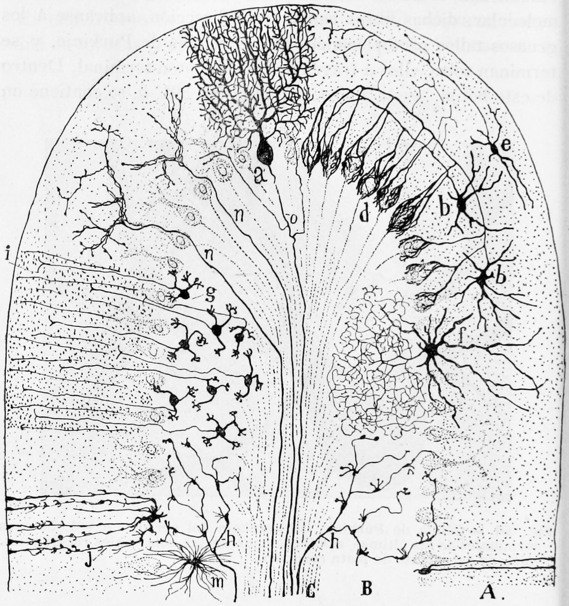
```

The cerebellar cortex is divided into three layers. At the bottom lies the thick granular layer, densely packed with granule cells, along with interneurons, mainly Golgi cells but also including Lugaro cells and unipolar brush cells. In the middle lies the Purkinje layer, a narrow zone that contains the cell bodies of Purkinje cells and Bergmann glial cells. At the top lies the molecular layer, which contains the flattened dendritic trees of Purkinje cells, along with the huge array of parallel fibers penetrating the Purkinje cell dendritic trees at right angles. This outermost layer of the cerebellar cortex also contains two types of inhibitory interneuron: stellate cells and basket cells. Both stellate and basket cells form GABAergic synapses onto Purkinje cell dendrites.

Purkinje cells are among the most distinctive neurons in the brain, and one of the earliest types to be recognized—they were first described by the Czech anatomist [Jan Evangelista Purkyně](https://en.wikipedia.org/wiki/Jan_Evangelista_Purkyně) in 1837. They are distinguished by the shape of their dendritic tree: The dendrites branch very profusely, but are severely flattened in a plane perpendicular to the cerebellar folds. Thus, the dendrites of a Purkinje cell form a dense planar net, through which parallel fibers pass at right angles. The dendrites are covered with dendritic spines, each of which receives synaptic input from a parallel fiber. Purkinje cells receive more synaptic inputs than any other type of cell in the brain—estimates of the number of spines on a single human Purkinje cell run as high as 200,000. The large, spherical cell bodies of Purkinje cells are packed into a narrow layer (one cell thick) of the cerebellar cortex, called the Purkinje layer. After emitting collaterals that affect nearby parts of the cortex, their axons travel into the deep cerebellar nuclei, where they make on the order of 1,000 contacts each with several types of nuclear cells, all within a small domain. Purkinje cells use GABA as their neurotransmitter, and therefore exert inhibitory effects on their targets.

Cerebellar granule cells, in contrast to Purkinje cells, are among the smallest neurons in the brain. They are also easily the most numerous neurons in the brain: In humans, estimates of their total number average around 50 billion, which means that about 3/4 of the brain's neurons are cerebellar granule cells. Their cell bodies are packed into a thick layer at the bottom of the cerebellar cortex. A granule cell emits only four to five dendrites, each of which ends in an enlargement called a dendritic claw. These enlargements are sites of excitatory input from mossy fibers and inhibitory input from Golgi cells.

The thin, unmyelinated axons of granule cells rise vertically to the upper (molecular) layer of the cortex, where they split in two, with each branch traveling horizontally to form a parallel fiber; the splitting of the vertical branch into two horizontal branches gives rise to a distinctive "T" shape. A human parallel fiber runs for an average of 3 mm in each direction from the split, for a total length of about 6 mm (about 1/10 of the total width of the cortical layer). As they run along, the parallel fibers pass through the dendritic trees of Purkinje cells, contacting one of every 3–5 that they pass, making a total of 80–100 synaptic connections with Purkinje cell dendritic spines. Granule cells use glutamate as their neurotransmitter, and therefore exert excitatory effects on their targets.

Granule cells receive all of their input from mossy fibers, but outnumber them by 200 to 1 (in humans). Thus, the information in the granule cell population activity state is the same as the information in the mossy fibers, but recoded in a much more expansive way. Because granule cells are so small and so densely packed, it is difficult to record their spike activity in behaving animals, so there is little data to use as a basis for theorizing. 

Mossy fibers enter the granular layer from their points of origin, many arising from the pontine nuclei, others from the spinal cord, vestibular nuclei etc. In the human cerebellum, the total number of mossy fibers has been estimated at about 200 million. These fibers form excitatory synapses with the granule cells and the cells of the deep cerebellar nuclei. Within the granular layer, a mossy fiber generates a series of enlargements called rosettes. The contacts between mossy fibers and granule cell dendrites take place within structures called glomeruli. Each glomerulus has a mossy fiber rosette at its center, and up to 20 granule cell dendritic claws contacting it. Terminals from Golgi cells infiltrate the structure and make inhibitory synapses onto the granule cell dendrites. The entire assemblage is surrounded by a sheath of glial cells. Each mossy fiber sends collateral branches to several cerebellar folia, generating a total of 20–30 rosettes; thus a single mossy fiber makes contact with an estimated 400–600 granule cells.

Purkinje cells also receive input from the inferior olivary nucleus on the contralateral side of the brainstem via climbing fibers. Although the inferior olive lies in the medulla oblongata and receives input from the spinal cord, brainstem and cerebral cortex, its output goes entirely to the cerebellum. A climbing fiber gives off collaterals to the deep cerebellar nuclei before entering the cerebellar cortex, where it splits into about 10 terminal branches, each of which gives input to a single Purkinje cell. In striking contrast to the 100,000-plus inputs from parallel fibers, each Purkinje cell receives input from exactly one climbing fiber; but this single fiber "climbs" the dendrites of the Purkinje cell, winding around them and making a total of up to 300 synapses as it goes. The climbing fiber synapses cover the cell body and proximal dendrites; this zone is devoid of parallel fiber inputs.

The deep nuclei of the cerebellum are clusters of gray matter lying within the white matter at the core of the cerebellum. They are, with the minor exception of the nearby vestibular nuclei, the sole sources of output from the cerebellum. These nuclei receive collateral projections from mossy fibers and climbing fibers as well as inhibitory input from the Purkinje cells of the cerebellar cortex. The four nuclei (dentate, globose, emboliform, and fastigial) each communicate with different parts of the brain and cerebellar cortex. (The globose and the emboliform nuclei are also referred to as combined in the interposed nucleus). The fastigial and interposed nuclei belong to the spinocerebellum. The dentate nucleus, which in mammals is much larger than the others, is formed as a thin, convoluted layer of gray matter, and communicates exclusively with the lateral parts of the cerebellar cortex. The flocculonodular lobe is the only part of the cerebellar cortex that does not project to the deep nuclei—its output goes to the vestibular nuclei instead.

The majority of neurons in the deep nuclei have large cell bodies and spherical dendritic trees with a radius of about 400 μm, and use glutamate as their neurotransmitter. These cells project to a variety of targets outside the cerebellum. Intermixed with them are a lesser number of small cells, which use GABA as a neurotransmitter and project exclusively to the inferior olivary nucleus, the source of climbing fibers. Thus, the nucleo-olivary projection provides an inhibitory feedback to match the excitatory projection of climbing fibers to the nuclei. There is evidence that each small cluster of nuclear cells projects to the same cluster of olivary cells that send climbing fibers to it; there is strong and matching topography in both directions.

When a Purkinje cell axon enters one of the deep nuclei, it branches to make contact with both large and small nuclear cells, but the total number of cells contacted is only about 35 (in cats). Conversely, a single deep nuclear cell receives input from approximately 860 Purkinje cells (again in cats).

The strongest clues to the function of the cerebellum have come from examining the consequences of damage to it. Animals and humans with cerebellar dysfunction show, above all, problems with motor control, on the same side of the body as the damaged part of the cerebellum. They continue to be able to generate motor activity but lose precision, producing erratic, uncoordinated, or incorrectly timed movements. A standard test of cerebellar function is to reach with the tip of the finger for a target at arm's length: A healthy person will move the fingertip in a rapid straight trajectory, whereas a person with cerebellar damage will reach slowly and erratically, with many mid-course corrections. Deficits in non-motor functions are more difficult to detect. Thus, the general conclusion reached decades ago is that the basic function of the cerebellum is to calibrate the detailed form of a movement, not to initiate movements or to decide which movements to execute.

Prior to the 1990s the function of the cerebellum was almost universally believed to be purely motor-related, but newer findings have brought that view into question. Functional imaging studies have shown cerebellar activation in relation to language, attention, and mental imagery; correlation studies have shown interactions between the cerebellum and non-motor areas of the cerebral cortex; and a variety of non-motor symptoms have been recognized in people with damage that appears to be confined to the cerebellum. Estimates based on functional mapping of the cerebellum using functional MRI suggest that more than half of the cerebellar cortex is interconnected with association zones of the cerebral cortex.

Damage to the cerebellum often causes motor-related symptoms, the details of which depend on the part of the cerebellum involved and how it is damaged. Damage to the flocculonodular lobe may show up as a loss of equilibrium and in particular an altered, irregular walking gait, with a wide stance caused by difficulty in balancing. Damage to the lateral zone typically causes problems in skilled voluntary and planned movements which can cause errors in the force, direction, speed and amplitude of movements. Other manifestations include hypotonia (decreased muscle tone), dysarthria (problems with speech articulation), dysmetria (problems judging distances or ranges of movement), dysdiadochokinesia (inability to perform rapid alternating movements such as walking), impaired check reflex or rebound phenomenon, and intention tremor (involuntary movement caused by alternating contractions of opposing muscle groups). Damage to the midline portion may disrupt whole-body movements, whereas damage localized more laterally is more likely to disrupt fine movements of the hands or limbs. Damage to the upper part of the cerebellum tends to cause gait impairments and other problems with leg coordination; damage to the lower part is more likely to cause uncoordinated or poorly aimed movements of the arms and hands, as well as difficulties in speed. This complex of motor symptoms is called ataxia.

The cerebellum is provided with blood from three paired major arteries: the superior cerebellar artery (SCA), the anterior inferior cerebellar artery (AICA), and the posterior inferior cerebellar artery (PICA). 

## The Spinal cord

The spinal cord is a long, thin, tubular structure made up of nervous tissue, which extends from the medulla oblongata in the brainstem to the lumbar region of the vertebral column. It encloses the central canal of the spinal cord, which contains cerebrospinal fluid. 

(ref:spinalcord) Anterior (Figure 1 and 2) and posterior (Figure 3 and 4) view of the spinal cord and the denticulate ligaments (triangular shaped ligaments named for their tooth-like appearance that arise from the pia mater and anchor the spinal cord along its length, at each side, to the arachnoid and dura mater). Figure 7. Cross section of the spinal cord at the levelo f the first cervical vertebra (Atlas). Figure 8: Cross section of the spinal cord in the dorsal region. Figure 9: Section of the spinal cord at the level of the lumbar region. From [Bourgery, Jean Baptiste Marc; Jacob, Nicolas Henri [Editor], Traité complet de l'anatomie de l'homme: comprenant la médicine opératoire (Volume 3, Atlas) — Paris, 1844](https://digi.ub.uni-heidelberg.de/diglit/bourgey1844bd3_2)

```{r spinalcordanatomy, fig.cap='(ref:spinalcord)', echo=FALSE, message=FALSE, warning=FALSE}
knitr::include_graphics("./figures/cns/bourgey1844bd3_2_0027.jpg")
```

The spinal cord functions primarily in the transmission of nerve signals from the motor cortex to the body, and from the afferent fibers of the sensory neurons to the sensory cortex. It is also a center for coordinating many reflexes and contains reflex arcs that can independently control reflexes. It is also the location of groups of spinal interneurons that make up the neural circuits known as central pattern generators. These circuits are responsible for controlling motor instructions for rhythmic movements such as walking.

The spinal cord is the main pathway for information connecting the brain and peripheral nervous system. Much shorter than its protecting spinal column, the human spinal cord originates in the brainstem, passes through the foramen magnum, and continues through to the conus medullaris near the second lumbar vertebra before terminating in a fibrous extension known as the filum terminale.

It is about 45 cm (18 in) long in men and around 43 cm (17 in) in women, ovoid-shaped, and is enlarged in the cervical and lumbar regions. The cervical enlargement, stretching from the C5 to T1 vertebrae, is where sensory input comes from and motor output goes to the arms and trunk. The lumbar enlargement, located between L1 and S3, handles sensory input and motor output coming from and going to the legs.

(ref:spinalcross) Transverse section of the spinal cord at different levels. From [Gray Henry, Anatomy of the Human Body. 20^th^ Edition, Lea & Febiger, Philadelphia & New York, 1918](https://archive.org/details/anatomyofhumanbo1918gray/page/n6/mode/2up) 


```{r spinalcrossections, fig.cap='(ref:spinalcross)', echo=FALSE, message=FALSE, warning=FALSE}
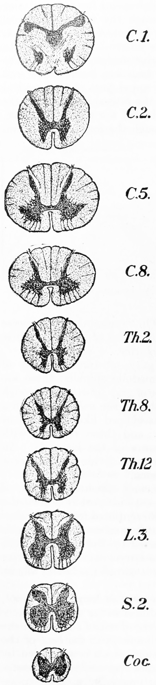
```

The spinal cord is continuous with the caudal portion of the medulla, running from the base of the skull to the body of the first lumbar vertebra. It does not run the full length of the vertebral column in adults. It is made of 31 segments from which branch one pair of sensory nerve roots and one pair of motor nerve roots. The nerve roots then merge into bilaterally symmetrical pairs of spinal nerves. The peripheral nervous system is made up of these spinal roots, nerves, and ganglia.

The dorsal roots are afferent fascicles, receiving sensory information from the skin, muscles, and visceral organs to be relayed to the brain. The roots terminate in dorsal root ganglia, which are composed of the cell bodies of the corresponding neurons. Ventral roots consist of efferent fibers that arise from motor neurons whose cell bodies are found in the ventral (or anterior) gray horns of the spinal cord.

The cord is stabilized within the dura mater by the connecting denticulate ligaments, which extend from the enveloping pia mater laterally between the dorsal and ventral roots. The dural sac ends at the vertebral level of the second sacral vertebra.

In cross-section, the peripheral region of the cord contains neuronal white matter tracts containing sensory and motor axons. Internal to this peripheral region is the grey matter, which contains the nerve cell bodies arranged in the three grey columns that give the region its butterfly-shape. This central region surrounds the central canal, which is an extension of the fourth ventricle and contains cerebrospinal fluid.

The spinal cord is elliptical in cross section, being compressed dorsolaterally. Two prominent grooves, or sulci, run along its length. The posterior median sulcus is the groove in the dorsal side, and the anterior median fissure is the groove in the ventral side.

The human spinal cord is divided into segments where pairs of spinal nerves (mixed; sensory and motor) form. Six to eight motor nerve rootlets branch out of right and left ventro lateral sulci in a very orderly manner. Nerve rootlets combine to form nerve roots. Likewise, sensory nerve rootlets form off right and left dorsal lateral sulci and form sensory nerve roots. The ventral (motor) and dorsal (sensory) roots combine to form spinal nerves (mixed; motor and sensory), one on each side of the spinal cord. Spinal nerves, with the exception of C1 and C2, form inside the intervertebral foramen (IVF). These rootlets form the demarcation between the central and peripheral nervous systems.

The grey column, (as three regions of grey columns) in the center of the cord, is shaped like a butterfly and consists of cell bodies of interneurons, motor neurons, neuroglia cells and unmyelinated axons. The anterior and posterior grey column present as projections of the grey matter and are also known as the horns of the spinal cord. Together, the grey columns and the gray commissure form the "grey H."

(ref:trans) Transverse section of the medulla spinalis in the mid-thoracic region. From [Gray Henry, Anatomy of the Human Body. 20^th^ Edition, Lea & Febiger, Philadelphia & New York, 1918](https://archive.org/details/anatomyofhumanbo1918gray/page/n6/mode/2up) 

```{r transversecord, fig.cap='(ref:trans)', echo=FALSE, message=FALSE, warning=FALSE}
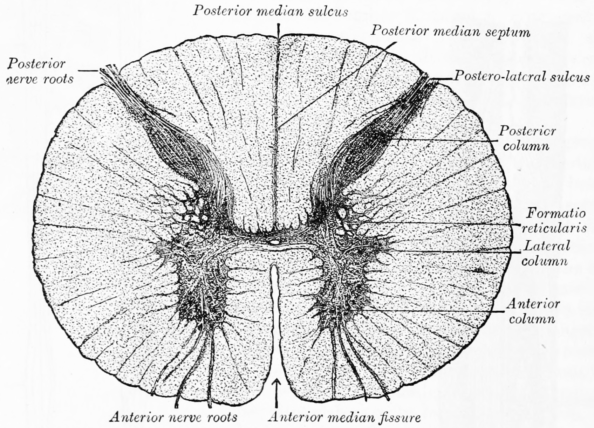
```

The white matter is located outside of the grey matter and consists almost totally of myelinated motor and sensory axons. "Columns" of white matter carry information either up or down the spinal cord.

The spinal cord proper terminates in a region called the conus medullaris, while the pia mater continues as an extension called the filum terminale, which anchors the spinal cord to the coccyx. The cauda equina ("horse's tail") is a collection of nerves inferior to the conus medullaris that continue to travel through the vertebral column to the coccyx. The cauda equina forms because the spinal cord stops growing in length at about age four, even though the vertebral column continues to lengthen until adulthood. This results in sacral spinal nerves originating in the upper lumbar region.

(ref:cauda) Cauda equina and filum terminale seen from behind. The dura mater has been opened and spread out, and the arachnoid has been removed. From [Gray Henry, Anatomy of the Human Body. 20^th^ Edition, Lea & Febiger, Philadelphia & New York, 1918](https://archive.org/details/anatomyofhumanbo1918gray/page/n6/mode/2up) 

```{r caudaequina, fig.cap='(ref:cauda)', echo=FALSE, message=FALSE, warning=FALSE}
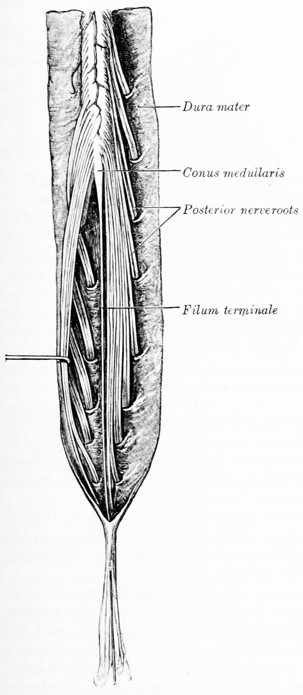
```

There are 31 spinal cord nerve segments in a human spinal cord:

* 8 cervical segments forming 8 pairs of cervical nerves (C1 spinal nerves exit the spinal column between the foramen magnum and the C1 vertebra; C2 nerves exit between the posterior arch of the C1 vertebra and the lamina of C2; C3–C8 spinal nerves pass through the IVF above their corresponding cervical vertebrae, with the exception of the C8 pair which exit between the C7 and T1 vertebrae)
* 12 thoracic segments forming 12 pairs of thoracic nerves
* 5 lumbar segments forming 5 pairs of lumbar nerves
* 5 sacral segments forming 5 pairs of sacral nerves
* 1 coccygeal segment

There are two regions where the spinal cord enlarges:

* Cervical enlargement – corresponds roughly to the brachial plexus nerves, which innervate the upper limb. It includes spinal cord segments from about C4 to T1. The vertebral levels of the enlargement are roughly the same (C4 to T1).
* Lumbar enlargement – corresponds to the lumbosacral plexus nerves, which innervate the lower limb. It comprises the spinal cord segments from L2 to S3 and is found about the vertebral levels of T9 to T12.

The spinal cord is made from part of the neural tube during development. There are four stages of the spinal cord that arises from the neural tube: The neural plate, neural fold, neural tube, and the spinal cord. Neural differentiation occurs within the spinal cord portion of the tube. As the neural tube begins to develop, the notochord begins to secrete a factor known as Sonic hedgehog or SHH. As a result, the floor plate then also begins to secrete SHH, and this will induce the basal plate to develop motor neurons. During the maturation of the neural tube, its lateral walls thicken and form a longtitudinal groove called the sulcus limitans. This extends the length of the spinal cord into dorsal and ventral portions as well. Meanwhile, the overlying ectoderm secretes bone morphogenetic protein (BMP). This induces the roof plate to begin to secrete BMP, which will induce the alar plate to develop sensory neurons. Opposing gradients of such morphogens as BMP and SHH form different domains of dividing cells along the dorsal ventral axis. Dorsal root ganglion neurons differentiate from neural crest progenitors. As the dorsal and ventral column cells proliferate, the lumen of the neural tube narrows to form the small central canal of the spinal cord. The alar plate and the basal plate are separated by the sulcus limitans. Additionally, the floor plate also secretes netrins. The netrins act as chemoattractants to decussation of pain and temperature sensory neurons in the alar plate across the anterior white commissure, where they then ascend towards the thalamus. Following the closure of the caudal neuropore and formation of the brain's ventricles that contain the choroid plexus tissue, the central canal of the caudal spinal cord is filled with cerebrospinal fluid.

The spinal cord is supplied with blood by three arteries that run along its length starting in the brain, and many arteries that approach it through the sides of the spinal column. The three longitudinal arteries are the anterior spinal artery, and the right and left posterior spinal arteries. These travel in the subarachnoid space and send branches into the spinal cord. They form anastamoses (connections) via the anterior and posterior segmental medullary arteries, which enter the spinal cord at various points along its length. 

## Central Neural Pathways

A neural pathway is the connection formed by axons that project from neurons to make synapses onto neurons in another location, to enable a signal to be sent from one region of the nervous system to another. Neurons are connected by a single axon, or by a bundle of axons known as a nerve tract, or fasciculus. Shorter neural pathways are found within grey matter in the brain, whereas longer projections, made up of myelinated axons, constitute white matter.

Descending motor pathways of the pyramidal tracts travel from the cerebral cortex to the brainstem or lower spinal cord. Ascending sensory tracts in the dorsal column–medial lemniscus pathway (DCML) carry information from the periphery to the cortex of the brain.

The first named pathways are evident to the naked eye even in a poorly preserved brain, and were named by the great anatomists of the Renaissance using cadaver material. Examples of these include the great commissures of the brain such as the corpus callosum (Latin, "hard body"), anterior commissure, and posterior commissure. Further examples include the pyramidal tract, crus cerebri (Latin, "leg of the brain"), and cerebellar peduncles (Latin, "little foot of the cerebellum"). Note that these names describe the appearance of a structure but give one no information on its function or location.

(ref:assoc) Dissection of cortex and brainstem showing association fibers after removing of the gray matter. From [Gray Henry, Anatomy of the Human Body. 20^th^ Edition, Lea & Febiger, Philadelphia & New York, 1918](https://archive.org/details/anatomyofhumanbo1918gray/page/n6/mode/2up) 


```{r associfibers, fig.cap='(ref:assoc)', echo=FALSE, message=FALSE, warning=FALSE}
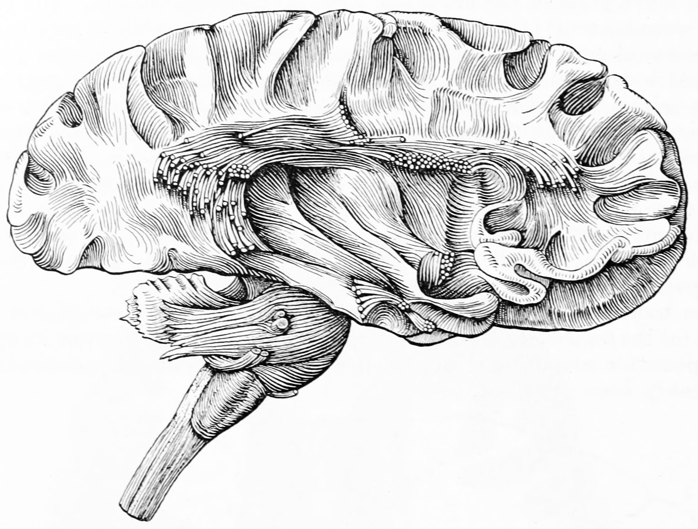
```

Later, as neuroanatomical knowledge became more sophisticated, the trend was toward naming pathways by their origin and termination. For example, the nigrostriatal pathway runs from the substantia nigra (Latin, "black substance") to the corpus striatum (Latin, "striped body"). This naming can extend to include any number of structures in a pathway, such that the cerebellorubrothalamocortical pathway originates in the cerebellum, synapses in the red nucleus ("ruber" in Latin), on to the thalamus, and finally terminating in the cerebral cortex.

Sometimes, these two naming conventions coexist. For example, the name "pyramidal tract" has been mainly supplanted by lateral corticospinal tract in most texts. Note that the "old" name was primarily descriptive, evoking the pyramids of antiquity, from the appearance of this neural pathway in the medulla oblongata. The "new" name is based primarily on its origin (in the primary motor cortex, Brodmann area 4) and termination (onto the alpha motor neurons of the spinal cord).

### The Corpus Callosum

The corpus callosum (Latin for "tough body"), also callosal commissure, is a wide, thick nerve tract, consisting of a flat bundle of commissural fibers, beneath the cerebral cortex in the brain. The corpus callosum is only found in placental mammals. It spans part of the longitudinal fissure, connecting the left and right cerebral hemispheres, enabling communication between them. It is the largest white matter structure in the human brain, about ten centimetres in length and consisting of 200–300 million axonal projections.

The corpus callosum forms the floor of the longitudinal fissure that separates the two cerebral hemispheres. It also forms part of the roof of the lateral ventricles.

(ref:vis) [Visualization of a DTI measurement of a human brain.](https://commons.wikimedia.org/wiki/File:DTI-sagittal-fibers.jpg) Depicted are reconstructed fiber tracts that run through the mid-sagittal plane. Especially prominent are the U-shaped fibers that connect the two hemispheres through the corpus callosum (the fibers come out of the image plane and consequently bend towards the top) and the fiber tracts that descend toward the spine (blue, within the image plane)

```{r visualization, fig.cap='(ref:vis)', echo=FALSE, message=FALSE, warning=FALSE}
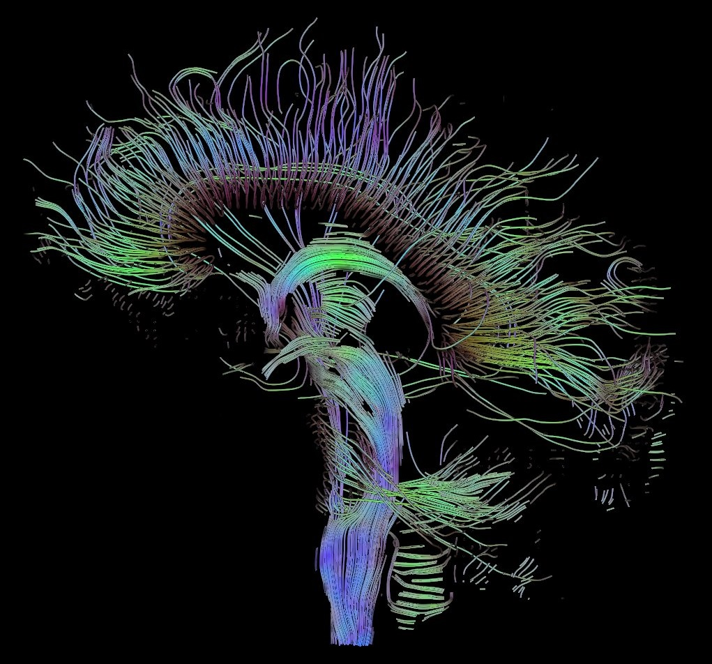
```

The corpus callosum has four main parts; individual nerve tracts that connect different parts of the hemispheres. These are the rostrum, the genu, the trunk or body, and the splenium. A narrowed part between the trunk and the splenium is known as the isthmus.

The front part of the corpus callosum, towards the frontal lobes is called the genu ("knee"). The genu curves downward and backward in front of the septum pellucidum, diminishing greatly in thickness. The lower much thinner part is the rostrum and is connected below with the lamina terminalis, which stretches from the interventricular foramina to the recess at the base of the optic stalk. The rostrum is named for its resemblance to a bird's beak.

The end part of the corpus callosum, towards the cerebellum, is called the splenium. This is the thickest part, and overlaps the tela choroidea of the third ventricle and the midbrain, and ends in a thick, convex, free border. Splenium translates as bandage in Greek.

The trunk of the corpus callosum lies between the splenium and the genu.

The callosal sulcus separates the corpus callosum from the cingulate gyrus.

On either side of the corpus callosum, the fibers radiate in the white matter and pass to the various parts of the cerebral cortex; those curving forward from the genu into the frontal lobes constitute the forceps minor (also forceps anterior) and those curving backward from the splenium into the occipital lobes, the forceps major (also forceps posterior). Between these two parts is the main body of the fibers which constitute the tapetum and extend laterally on either side into the temporal lobe, and cover in the central part of the lateral ventricle. The tapetum and anterior commissure share the function of connecting left and right temporal lobes.

The anterior cerebral arteries are in contact with the under surface of the rostrum, they arch over the front of the genu and are carried along the trunk, supplying the front four-fifths of the corpus callosum.

### The Cerebral Peduncles

The cerebral peduncles are structures at the front of the midbrain which arise from the front of the pons and contain the large ascending (sensory) and descending (motor) nerve tracts that run to and from the cerebrum from the pons. Mainly, the three common areas that give rise to the cerebral peduncles are the cerebral cortex, the spinal cord and the cerebellum. The cerebral peduncle, by most classifications, is everything in the midbrain except the tectum. The region includes the tegmentum, crus cerebri and pretectum. By this definition, the cerebral peduncles are also known as the basis pedunculi, while the large ventral bundle of efferent fibers is referred to as the cerebral crus or the pes pedunculi.

The cerebral peduncles are located on either side of the midbrain and are the frontmost part of the midbrain, and act as the connectors between the rest of the midbrain and the thalamic nuclei and thus the cerebrum. As a whole, the cerebral peduncles assists in refining motor movements, learning of new motor skills, and converting proprioceptive information into balance and posture maintenance. Important fiber tracts that run through the cerebral peduncles are: cortico-spinal, cortico-pontine, and cortico-bulbar tracts.

Damage to the cerebral peduncles results in unrefined motor skills, imbalance, and lack of proprioception.

The descending upper fibers from the internal capsule continue on through the midbrain and are then seen as the fibers in the cerebral peduncles. The cortico-pontine fibers are found in the outer and inner third of the cerebral peduncle, these are the cortical input to the pontine nuclei. The cortico-bulbar and cortico-spinal fibers are found in the middle third of the cerebral peduncle. The cortico-spinal tract exits the internal capsule and is seen in the mid portion of the cerebral peduncles.

Cranial nerve 3 (oculomotor nerve) appears ventrally between the two cerebral peduncles in the interpeduncular fossa. Cranial nerve 4 (trochlear nerve) wraps around the lowest part of the cerebral peduncle.

### The Pyramidal Tracts

The pyramidal tracts include both the corticobulbar tract and the corticospinal tract. These are aggregations of efferent nerve fibers from the upper motor neurons that travel from the cerebral cortex and terminate either in the brainstem (corticobulbar) or spinal cord (corticospinal) and are involved in the control of motor functions of the body.

The corticobulbar tract conducts impulses from the brain to the cranial nerves. These nerves control the muscles of the face and neck and are involved in facial expression, mastication, swallowing, and other functions.

The corticospinal tract conducts impulses from the brain to the spinal cord. It is made up of a lateral and anterior tract. The corticospinal tract is involved in voluntary movement. The majority of fibres of the corticospinal tract cross over in the medulla oblongata, resulting in muscles being controlled by the opposite side of the brain. The corticospinal tract also contains the axons of Betz cells (the largest pyramidal cells) located in the primary motor cortex.

The pyramidal tracts are named because they pass through the pyramids of the medulla oblongata. The corticospinal fibers when descending from the internal capsule to the brain stem, converge to a point from multiple directions giving the impression of an inverted pyramid.

The myelination of the pyramidal fibres is incomplete at birth and gradually progresses in cranio-caudal direction and thereby progressively gaining functionality. Most of the myelination is complete by two years of age and thereafter it progresses very slowly in cranio-caudal direction up to twelve years of age.

The term pyramidal tracts refers to upper motor neurons that originate in the cerebral cortex and terminate in the spinal cord (corticospinal) or brainstem (corticobulbar). Nerves emerge in the cerebral cortex, pass down and may cross sides in the medulla oblongata, and travel as part of the spinal cord until they synapse with interneurons in the grey column of the spinal cord.

#### The Corticospinal Tract

Nerve fibres in the corticospinal tract originate from pyramidal cells in layer V of the cerebral cortex. Fibres arise from the primary motor cortex (about 30%), supplementary motor area and the premotor cortex (together also about 30%), and the somatosensory cortex, parietal lobe, and cingulate gyrus supplies the rest. The cells have their bodies in the cerebral cortex, and the axons form the bulk of the pyramidal tracts. The nerve axons travel from the cortex through the posterior limb of internal capsule, through the cerebral peduncle and into the brainstem and anterior medulla oblongata. Here they form two prominences called the medulla oblongatary pyramids. Below the prominences, the majority of axons cross over to the opposite side from which they originated, known as decussation. The axons that cross over move to the outer part of the medulla oblongata and form the lateral corticospinal tract, whereas the fibres that remain form the anterior corticospinal tract. About 80% of axons cross over and form the lateral corticospinal tract; 10% do not cross over and join the tract, and 10% of fibres travel in the anterior corticospinal tract.

The nerve axons traveling down the tract are the efferent nerve fibers of the upper motor neurons. These axons travel down the tracts in the white matter of the spinal cord until they reach the vertebral level of the muscle that they will innervate. At this point, the axons synapse with lower motor neurons. The majority of axons do not directly synapse with lower motor neurons, but instead synapse with an interneuron that then synapses with a lower motor neuron. This generally occurs in the anterior grey column. Nerve axons of the lateral corticospinal tract that did not cross over in the medulla oblongata do so at the level of the spinal cord they terminate in.

These tracts contain more than 1 million axons and the majority of the axons are myelinated. The corticospinal tracts myelinate largely during the first and second years after birth. The majority of nerve axons are small (<4μm) in diameter. About 3% of nerve axons have a much larger diameter (16μm) and arise from Betz cells, mostly in the leg area of the primary motor cortex. These cells are notable because of their rapid conduction rate, over 70m/sec, the fastest conduction of any signals from the brain to the spinal cord.

#### The Corticobulbar Tract

Fibres from the ventral motor cortex travel with the corticospinal tract through the internal capsule, but terminate in a number of locations in the midbrain (cortico-mesencephalic tract), pons (corticopontine tract), and medulla oblongata (cortico-bulbar tract). The upper motor neurons of the corticobulbar tract synapse with interneurons or directly with the lower motor neurons located in the motor cranial nerve nuclei, namely oculomotor, trochlear, motor nucleus of the trigeminal nerve, abducens, facial nerve and accessory and in the nucleus ambiguus to the hypoglossal, vagus and accessory nerves. These nuclei are supplied by nerves from both sides of the brain, with the exception of the parts of the facial nerve that control muscles of the lower face. These muscles are only innervated by nerves from the contralateral (opposite) side of the cortex.

The nerves within the corticospinal tract are involved in movement of muscles of the body. Because of the crossing-over of fibres, muscles are supplied by the side of the brain opposite to that of the muscle. The nerves within the corticobulbar tract are involved in movement in muscles of the head. They are involved in swallowing, phonation, and movements of the tongue. By virtue of involvement with the facial nerve, the corticobulbar tract is also responsible for transmitting facial expression. With the exception of lower muscles of facial expression, all functions of the corticobulbar tract involve inputs from both sides of the brain.

Damage to the fibres of the corticospinal tracts, anywhere along their course from the cerebral cortex to the lower end of the spinal cord, can cause an upper motor neuron syndrome. A few days after the injury to the upper motor neurons, a pattern of motor signs and symptoms appears, including spasticity, hyperactive reflexes, a loss of the ability to perform fine movements, and an extensor plantar response known as the Babinski sign. Symptoms generally occur alongside other sensory problems. Causes may include masses such as strokes, subdural hemorrhage, abscesses and tumours, neurodegenerative diseases such as multiple system atrophy, inflammation such as meningitis and multiple sclerosis, and trauma to the spinal cord, including from slipped discs.

If the corticobulbar tract is damaged on only one side, then only the lower face will be affected, however if there is involvement of both the left and right tracts, then the result is pseudobulbar palsy. This causes problems with swallowing, speaking, and emotional lability.

### The Corticopontine Fibers

Corticopontine fibers are projections from the cerebral cortex to the pontine nuclei. Depending upon the lobe of origin, they can be classified as frontopontine fibers, parietopontine fibers, temporopontine fibers or occipitopontine fibers.

### The Spinal Tracts

The somatosensory organization of the spinal cord is divided into the dorsal column-medial lemniscus tract (the touch/proprioception/vibration sensory pathway) and the anterolateral system, or ALS (the pain/temperature sensory pathway). Both sensory pathways use three different neurons to get information from sensory receptors at the periphery to the cerebral cortex. These neurons are designated primary, secondary and tertiary sensory neurons. In both pathways, primary sensory neuron cell bodies are found in the dorsal root ganglia, and their central axons project into the spinal cord.

In the dorsal column-medial leminiscus tract, a primary neuron's axon enters the spinal cord and then enters the dorsal column. If the primary axon enters below spinal level T6, the axon travels in the fasciculus gracilis, the medial part of the column. If the axon enters above level T6, then it travels in the fasciculus cuneatus, which is lateral to the fasciculus gracilis. Either way, the primary axon ascends to the lower medulla, where it leaves its fasciculus and synapses with a secondary neuron in one of the dorsal column nuclei: either the nucleus gracilis or the nucleus cuneatus, depending on the pathway it took. At this point, the secondary axon leaves its nucleus and passes anteriorly and medially. The collection of secondary axons that do this are known as internal arcuate fibers. The internal arcuate fibers decussate and continue ascending as the contralateral medial lemniscus. Secondary axons from the medial lemniscus finally terminate in the ventral posterolateral nucleus (VPLN) of the thalamus, where they synapse with tertiary neurons. From there, tertiary neurons ascend via the posterior limb of the internal capsule and end in the primary sensory cortex.

The proprioception of the lower limbs differs from the upper limbs and upper trunk. There is a four-neuron pathway for lower limb proprioception. This pathway initially follows the dorsal spino-cerebellar pathway. It is arranged as follows: proprioceptive receptors of lower limb → peripheral process → dorsal root ganglion → central process → Clarke's column → 2nd order neuron → medulla oblongata (caudate nucleus) → 3rd order neuron → VPLN of thalamus → 4th order neuron → posterior limb of internal capsule → corona radiata → sensory area of cerebrum.

The anterolateral system works somewhat differently. Its primary neurons axons enter the spinal cord and then ascend one to two levels before synapsing in the substantia gelatinosa. The tract that ascends before synapsing is known as Lissauer's tract. After synapsing, secondary axons decussate and ascend in the anterior lateral portion of the spinal cord as the spinothalamic tract. This tract ascends all the way to the VPLN, where it synapses on tertiary neurons. Tertiary neuronal axons then travel to the primary sensory cortex via the posterior limb of the internal capsule.

Some of the "pain fibers" in the ALS deviate from their pathway towards the VPLN. In one such deviation, axons travel towards the reticular formation in the midbrain. The reticular formation then projects to a number of places including the hippocampus (to create memories about the pain), the centromedian nucleus (to cause diffuse, non-specific pain) and various parts of the cortex. Additionally, some ALS axons project to the periaqueductal gray in the pons, and the axons forming the periaqueductal gray then project to the nucleus raphes magnus, which projects back down to where the pain signal is coming from and inhibits it. This helps control the sensation of pain to some degree.

The corticospinal tract serves as the motor pathway for upper motor neuronal signals coming from the cerebral cortex and from brainstem motor nuclei.

Cortical upper motor neurons originate from Brodmann areas 1, 2, 3, 4, and 6 and then descend in the posterior limb of the internal capsule, through the crus cerebri, down through the pons, and to the medullary pyramids, where about 90% of the axons cross to the contralateral side at the decussation of the pyramids. They then descend as the lateral corticospinal tract. These axons synapse with lower motor neurons in the ventral horns of all levels of the spinal cord. The remaining 10% of axons descend on the ipsilateral side as the ventral corticospinal tract. These axons also synapse with lower motor neurons in the ventral horns. Most of them will cross to the contralateral side of the cord (via the anterior white commissure) right before synapsing.

The midbrain nuclei include four motor tracts that send upper motor neuronal axons down the spinal cord to lower motor neurons. These are the rubrospinal tract, the vestibulospinal tract, the tectospinal tract and the reticulospinal tract. The rubrospinal tract descends with the lateral corticospinal tract, and the remaining three descend with the anterior corticospinal tract.

The function of lower motor neurons can be divided into two different groups: the lateral corticospinal tract and the anterior cortical spinal tract. The lateral tract contains upper motor neuronal axons which synapse on dorsal lateral (DL) lower motor neurons. The DL neurons are involved in distal limb control. Therefore, these DL neurons are found specifically only in the cervical and lumbosacral enlargements within the spinal cord. There is no decussation in the lateral corticospinal tract after the decussation at the medullary pyramids.

The anterior corticospinal tract descends ipsilaterally in the anterior column, where the axons emerge and either synapse on lower ventromedial (VM) motor neurons in the ventral horn ipsilaterally or descussate at the anterior white commissure where they synapse on VM lower motor neurons contralaterally . The tectospinal, vestibulospinal and reticulospinal descend ipsilaterally in the anterior column but do not synapse across the anterior white commissure. Rather, they only synapse on VM lower motor neurons ipsilaterally. The VM lower motor neurons control the large, postural muscles of the axial skeleton. These lower motor neurons, unlike those of the DL, are located in the ventral horn all the way throughout the spinal cord.

### The Spinocerebellar Tracts

Proprioceptive information in the body travels up the spinal cord via three tracks. Below L2, the proprioceptive information travels up the spinal cord in the ventral spinocerebellar tract. Also known as the anterior spinocerebellar tract, sensory receptors take in the information and travel into the spinal cord. The cell bodies of these primary neurons are located in the dorsal root ganglia. In the spinal cord, the axons synapse and the secondary neuronal axons decussates and then travel up to the superior cerebellar peduncle where they decussate again. From here, the information is brought to deep nuclei of the cerebellum including the fastigial and interposed nuclei.

From the levels of L2 to T1, proprioceptive information enters the spinal cord and ascends ipsilaterally, where it synapses in Clarke's nucleus. The secondary neuronal axons continue to ascend ipsilaterally and then pass into the cerebellum via the inferior cerebellar peduncle. This tract is known as the dorsal spinocerebellar tract.

From above T1, proprioceptive primary axons enter the spinal cord and ascend ipsilaterally until reaching the accessory cuneate nucleus, where they synapse. The secondary axons pass into the cerebellum via the inferior cerebellar peduncle where again, these axons synapse on cerebellar deep nuclei. This tract is known as the cuneocerebellar tract.

### Default mode network

The default mode network (DMN),(Figure \@ref(fig:defaultnet)) also default network, or default state network, is a large scale brain network of interacting brain regions known to have activity highly correlated with each other and distinct from other networks in the brain.

(ref:defaultnet) The default mode network (DMN) includes regions in the medial pre-frontal cortex, precuneus, and bilateral parietal cortex. Highlighted regions in the images were all correlated with the same component from an independent component analysis of an individual’s resting state fMRI data. The color scale reflects correlation z-scores, with a lower threshold of z = 3. From [Graner John, Oakes Terrence, French Louis, Riedy: Functional MRI in the Investigation of Blast-Related Traumatic Brain Injury. Frontiers in Neurology, vol. 4, 2013](https://www.frontiersin.org/article/10.3389/fneur.2013.00016)     

```{r defaultnetwork, fig.cap='(ref:defaultnet)', echo=FALSE, message=FALSE, warning=FALSE}
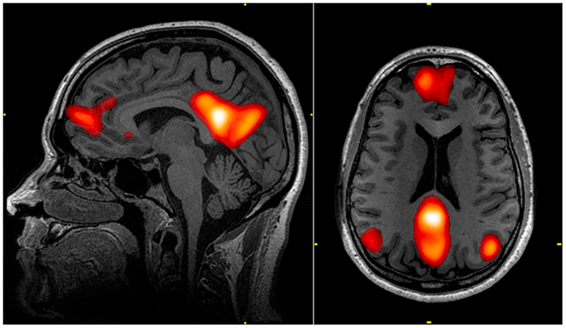
```

It was initially assumed that the default mode network was most commonly active when a person is not focused on the outside world and the brain is at wakeful rest, such as during daydreaming and mind-wandering. However, it is now known that it can contribute to elements of experience that are related to external task performance. It is also active when the individual is thinking about others, thinking about themselves, remembering the past, and planning for the future. Though the DMN was originally noticed to be deactivated in certain goal-oriented tasks and is sometimes referred to as the task-negative network, it can be active in other goal-oriented tasks such as social working memory or autobiographical tasks. The DMN has been shown to be negatively correlated with other networks in the brain such as attention networks.

[Hans Berger](https://en.wikipedia.org/wiki/Hans_Berger), the inventor of the electroencephalogram, was the first to propose the idea that the brain is constantly busy. In a series of papers published in 1929 he showed that the electrical oscillations detected by his device do not cease even when the subject is at rest. However, his ideas were not taken seriously, and a general perception formed among neurologists that only when a focused activity is performed does the brain (or a part of the brain) become active.

But in the 1950s, Louis Sokoloff and his colleagues noticed that metabolism in the brain stayed the same when a person went from a resting state to performing effortful math problems suggesting active metabolism in the brain must also be happening during rest. In the 1970s, David H. Ingvar and colleagues observed blood flow in the front part of the brain became the highest when a person is at rest. 

In the 1990s, with the advent of positron emission tomography (PET) scans, researchers began to notice that when a person is involved in perception, language, and attention tasks, the same brain areas become less active compared to passive rest, and labeled these areas as becoming “deactivated”.

In 1995, a graduate student at the Medical College of Wisconsin in Milwaukee, discovered that the human sensorimotor system displayed "resting-state connectivity," exhibiting synchronicity in functional magnetic resonance imaging (fMRI) scans while not engaged in any task.

Later, experiments by neurologist [Marcus E. Raichle's](https://en.wikipedia.org/wiki/Marcus_Raichle) lab at Washington University School of Medicine and other groups  showed that the brain's energy consumption is increased by less than 5% of its baseline energy consumption while performing a focused mental task. These experiments showed that the brain is constantly active with a high level of activity even when the person is not engaged in focused mental work. Research thereafter focused on finding the regions responsible for this constant background activity level.

Raichle coined the term "default mode" in 2001 to describe resting state brain function; the concept rapidly became a central theme in neuroscience. Around this time the idea was developed that this network of brain areas is involved in internally directed thoughts and is suspended during specific goal-directed behaviors. In 2003, Greicius and colleagues examined resting state fMRI scans and looked at how correlated different sections in the brain are to each other. Their correlation maps highlighted the same areas already identified by the other researchers. This was important because it demonstrated a convergence of methods all leading to the same areas being involved in the DMN. Since then other resting state networks (RSNs) have been found, such as visual, auditory, and attention networks. Some of them are often anti-correlated with the default mode network.

## Sensory Maps

Sensory maps are areas of the brain which respond to sensory stimulation, and are spatially organized according to some feature of the sensory stimulation. In some cases the sensory map is simply a topographic representation of a sensory surface such as the skin, cochlea, or retina. In other cases it represents other stimulus properties resulting from neuronal computation and is generally ordered in a manner that reflects the periphery. 

## The Cortical Homunculus

A cortical homunculus is a distorted representation of the human body, based on a neurological "map" of the areas and proportions of the human brain dedicated to processing motor functions, or sensory functions, for different parts of the body. The word homunculus is Latin for "little man", and was a term used in alchemy and folklore long before scientific literature began using it. A cortical homunculus, or "cortex man", illustrates the concept of a representation of the body lying within the brain. Nerve fibres—conducting somatosensory information from all over the body—terminate in various areas of the parietal lobe in the cerebral cortex, forming a representational map of the body.

A motor homunculus represents a map of brain areas dedicated to motor processing for different anatomical divisions of the body. The primary motor cortex is located in the precentral gyrus, and handles signals coming from the premotor area of the frontal lobes.

A sensory homunculus represents a map of brain areas dedicated to sensory processing for different anatomical divisions of the body. The primary sensory cortex is located in the postcentral gyrus, and handles signals coming from the thalamus.

(ref:hom) The motor homunculus (left) and sensory homunculus (right). The body surface is projected onto the gyrus pre- and postcentralis (coronal section), respectively. From The Cerebral Cortex of Man. By Wilder Penfield and Theodore Rasmussen. The Macmillan Company, New York, N.Y., 1950.

```{r homunculus, fig.cap='(ref:hom)', echo=FALSE, message=FALSE, warning=FALSE}

```

[Wilder Penfield](https://en.wikipedia.org/wiki/Wilder_Penfield) and his co-investigators Edwin Boldrey and Theodore Rasmussen are considered to be the originators of the sensory and motor homunculi. They were not the first scientists to attempt to objectify human brain function by means of a homunculus. However, they were the first to differentiate between sensory and motor function and to map the two across the brain separately, resulting in two different homunculi. In addition, their drawings and later drawings derived from theirs became perhaps the most famous conceptual maps in modern neuroscience because they compellingly illustrated the data at a single glance.

Penfield went on to experiment with electrical stimulation of different brain areas of patients undergoing open brain surgery to control epilepsy, and were thus able to produce the topographical brain maps and their corresponding homunculi.
