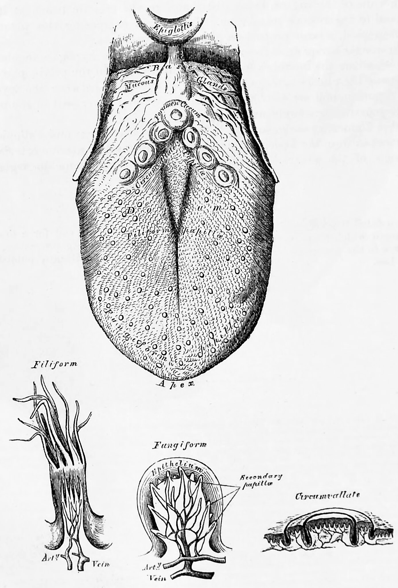

# The Gustatory System

Taste, gustatory perception, or gustation is one of the five traditional senses that belongs to the gustatory system.

Chemicals that stimulate taste receptor cells are known as tastants. The tongue is equipped with many taste buds on its dorsal surface, and each taste bud is equipped with taste receptor cells that can sense particular classes of tastes. Distinct types of taste receptor cells respectively detect substances that are sweet, bitter, salty, sour, spicy, or taste of umami. 

Taste, along with smell (olfaction) and trigeminal nerve stimulation (registering texture, pain, and temperature), determines flavors of food and/or other substances. Humans have taste receptors on taste buds (gustatory calyculi) and other areas including the upper surface of the tongue and the epiglottis. The gustatory cortex is responsible for the perception of taste.

## The Tongue

The tongue is a muscular organ in the mouth of most vertebrates that manipulates food for mastication and is used in the act of swallowing. It has importance in the digestive system and is the primary organ of taste in the gustatory system. The tongue's upper surface (dorsum) is covered by taste buds housed in numerous lingual papillae. It is sensitive and kept moist by saliva and is richly supplied with nerves and blood vessels. The tongue also serves as a natural means of cleaning the teeth. A major function of the tongue is the enabling of speech in humans and vocalization in other animals.

(ref:ton)

```{r tongue, fig.cap='(ref:ton)', echo=FALSE, message=FALSE, warning=FALSE}

```

Innervation of the tongue consists of motor fibers, special sensory fibers for taste, and general sensory fibers for sensation.

* Motor supply for all intrinsic and extrinsic muscles of the tongue is supplied by efferent motor nerve fibers from the hypoglossal nerve (CN XII), with the exception of the palatoglossus, which is innervated by the vagus nerve (CN X).
Innervation of taste and sensation is different for the anterior and posterior part of the tongue because they are derived from different embryological structures (pharyngeal arch 1 and pharyngeal arches 3 and 4, respectively).

* Anterior two thirds of tongue (anterior to the vallate papillae):
    * Taste: chorda tympani branch of the facial nerve (CN VII) via special visceral afferent fibers
    * Sensation: lingual branch of the mandibular (V3) division of the trigeminal nerve (CN V) via general visceral afferent fibers
* Posterior one third of tongue:
    * Taste and sensation: glossopharyngeal nerve (CN IX) via a mixture of special and general visceral afferent fibers
* Base of tongue
    * Taste and sensation: internal branch of the superior laryngeal nerve (itself a branch of the vagus nerve, CN X)

The tongue is covered with thousands of small bumps called papillae, which are visible to the naked eye. Within each papilla are hundreds of taste buds. The exception to this is the filiform papillae that do not contain taste buds. Each taste bud contains 50 to 100 taste receptor cells.

## The Five Basic Tastes

The sensation of taste includes five established basic tastes: sweetness, sourness, saltiness, bitterness, and savoriness (also known as savory or umami). Taste buds are able to distinguish between different tastes through detecting interaction with different molecules or ions. Sweet, savoriness, and bitter tastes are triggered by the binding of molecules to G protein-coupled receptors on the cell membranes of taste buds. Saltiness and sourness are perceived when alkali metal or hydrogen ions enter taste buds, respectively.

The basic tastes contribute only partially to the sensation and flavor of food in the mouth—other factors include smell, detected by the olfactory epithelium of the nose; texture, detected through a variety of mechanoreceptors; temperature, detected by thermoreceptors; and "coolness" (such as of menthol) and "hotness" (pungency), through [chemesthesis](https://en.wikipedia.org/wiki/Chemesthesis).

As taste senses both harmful and beneficial things, all basic tastes are classified as either aversive or appetitive, depending upon the effect the things they sense have on our bodies. Sweetness helps to identify energy-rich foods, while bitterness serves as a warning sign of poisons.

Among humans, taste perception begins to fade around 50 years of age because of loss of tongue papillae and a general decrease in saliva production. Humans can also have distortion of tastes through dysgeusia. Not all mammals share the same taste senses: some rodents can taste starch (which humans cannot), cats cannot taste sweetness, and several other carnivores including hyenas, dolphins, and sea lions, have lost the ability to sense up to four of their ancestral five taste senses.

### Sweetness

Sweetness, usually regarded as a pleasurable sensation, is produced by the presence of sugars and substances that mimic sugar. Sweetness may be connected to aldehydes and ketones, which contain a carbonyl group. Sweetness is detected by a variety of G protein coupled receptors (GPCR) coupled to the G protein gustducin found on the taste buds. At least two different variants of the "sweetness receptors" must be activated for the brain to register sweetness. Compounds the brain senses as sweet are compounds that can bind with varying bond strength to two different sweetness receptors. These receptors are T1R2+3 (heterodimer) and T1R3 (homodimer), which account for all sweet sensing in humans and animals. Taste detection thresholds for sweet substances are rated relative to sucrose, which has an index of 1. The average human detection threshold for sucrose is 10 millimoles per liter. For lactose it is 30 millimoles per liter, with a sweetness index of 0.3, and 5-nitro-2-propoxyaniline 0.002 millimoles per liter. “Natural” sweeteners such as saccharides activate the GPCR, which releases gustducin. The gustducin then activates the molecule adenylate cyclase, which catalyzes the production of the molecule cAMP, or adenosine 3', 5'-cyclic monophosphate. This molecule closes potassium ion channels, leading to depolarization and neurotransmitter release. Synthetic sweeteners such as saccharin activate different GPCRs and induce taste receptor cell depolarization by an alternate pathway.

### Sourness

Sourness is the taste that detects acidity. The sourness of substances is rated relative to dilute hydrochloric acid, which has a sourness index of 1. By comparison, tartaric acid has a sourness index of 0.7, citric acid an index of 0.46, and carbonic acid an index of 0.06.

Sour taste is detected by a small subset of cells that are distributed across all taste buds in the tongue. Sour taste cells can be identified by expression of the protein PKD2L1, although this gene is not required for sour responses. There is evidence that the protons that are abundant in sour substances can directly enter the sour taste cells through apically located ion channels. In 2018, the proton-elective ion channel otopetrin 1 (Otop1) was implicated as the primary mediator of this proton influx. This transfer of positive charge into the cell can itself trigger an electrical response. It has also been proposed that weak acids such as acetic acid, which is not fully dissociated at physiological pH values, can penetrate taste cells and thereby elicit an electrical response. According to this mechanism, intracellular hydrogen ions inhibit potassium channels, which normally function to hyperpolarize the cell. By a combination of direct intake of hydrogen ions (which itself depolarizes the cell) and the inhibition of the hyperpolarizing channel, sourness causes the taste cell to fire action potentials and release neurotransmitter.

### Saltiness

The simplest receptor found in the mouth is the sodium chloride (salt) receptor. Saltiness is a taste produced primarily by the presence of sodium ions. Other ions of the alkali metals group also taste salty, but the further from sodium, the less salty the sensation is. A sodium channel in the taste cell membrane allows sodium cations to enter the cell. This on its own depolarizes the cell, and opens voltage-dependent calcium channels, flooding the cell with positive calcium ions and leading to neurotransmitter release. This sodium channel is known as an epithelial sodium channel (ENaC) and is composed of three subunits. An ENaC can be blocked by the drug amiloride in many mammals, especially rats. The sensitivity of the salt taste to amiloride in humans, however, is much less pronounced, leading to conjecture that there may be additional receptor proteins besides ENaC to be discovered.

The size of lithium and potassium ions most closely resemble those of sodium, and thus the saltiness is most similar. In contrast, rubidium and caesium ions are far larger, so their salty taste differs accordingly. The saltiness of substances is rated relative to sodium chloride (NaCl), which has an index of 1. Potassium, as potassium chloride (KCl), is the principal ingredient in salt substitutes and has a saltiness index of 0.6.

Other monovalent cations, e.g. ammonium (NH4+), and divalent cations of the alkali earth metal group of the periodic table, e.g. calcium (Ca^2+^), ions generally elicit a bitter rather than a salty taste even though they, too, can pass directly through ion channels in the tongue, generating an action potential.

### Bitterness

Bitterness is one of the most sensitive of the tastes, and many perceive it as unpleasant, sharp, or disagreeable, but it is sometimes desirable and intentionally added via various bittering agents. Common bitter foods and beverages include coffee, unsweetened cocoa, South American mate, coca tea, bitter gourd, uncured olives, citrus peel, many plants in the family *Brassicaceae*, dandelion greens, horehound, wild chicory, and escarole. The ethanol in alcoholic beverages tastes bitter, as do the additional bitter ingredients found in some alcoholic beverages including hops in beer and *Gentiana* in bitters. Quinine is also known for its bitter taste and is found in tonic water.

Bitterness is of interest to those who study evolution, as well as various health researchers since a large number of natural bitter compounds are known to be toxic. The ability to detect bitter-tasting, toxic compounds at low thresholds is considered to provide an important protective function. Plant leaves often contain toxic compounds, and among leaf-eating primates there is a tendency to prefer immature leaves, which tend to be higher in protein and lower in fiber and poisons than mature leaves. Amongst humans, various food processing techniques are used worldwide to detoxify otherwise inedible foods and make them palatable. Furthermore, the use of fire, changes in diet, and avoidance of toxins has led to neutral evolution in human bitter sensitivity. This has allowed several loss of function mutations that has led to a reduced sensory capacity towards bitterness in humans when compared to other species.

The threshold for stimulation of bitter taste by quinine averages a concentration of 8 μM (8 micromolar). The taste thresholds of other bitter substances are rated relative to quinine, which is thus given a reference index of 1. For example, brucine has an index of 11, is thus perceived as intensely more bitter than quinine, and is detected at a much lower solution threshold. The most bitter natural substance is amarogentin a compound present in the roots of the plant *Gentiana lutea* and the most bitter substance known is the synthetic chemical denatonium, which has an index of 1,000. It is used as an aversive agent (a bitterant) that is added to toxic substances to prevent accidental ingestion. 

Research has shown that TAS2Rs (taste receptors, type 2, also known as T2Rs) such as TAS2R38 coupled to the G protein gustducin are responsible for the human ability to taste bitter substances. The TAS2R family in humans is thought to comprise about 25 different taste receptors, some of which can recognize a wide variety of bitter-tasting compounds. Over 670 bitter-tasting compounds have been identified, on a bitter database, of which over 200 have been assigned to one or more specific receptors. Researchers use two synthetic substances, phenylthiocarbamide (PTC) and 6-n-propylthiouracil (PROP) to study the genetics of bitter perception. These two substances taste bitter to some people, but are virtually tasteless to others. Among the tasters, some are so-called "supertasters" to whom PTC and PROP are extremely bitter. The variation in sensitivity is determined by two common alleles at the TAS2R38 locus.

### Savoriness (Umami)

Savory, or savoriness is an appetitive taste and is occasionally described by its Japanese name, umami or "meaty". 

## The Taste Receptors

There are four types taste receptors. When food or other substances enter the mouth, molecules interact with saliva and are bound to taste receptors in the oral cavity and other locations. Molecules which give a sensation of taste are considered "sapid".

Taste receptors are divided into two families:[citation needed]

* Type 1, sweet: TAS1R2+TAS1R3; umami: TAS1R1+TAS1R3
* Type 2, bitter: TAS2R

The standard bitter, sweet, or umami taste receptors are G protein-coupled receptors with seven transmembrane domains. Ligand binding at the taste receptors activate second messenger cascades to depolarize the taste cell. Gustducin is the most common taste Gα subunit, having a major role in TAS2R bitter taste reception. Gustducin is a homologue for transducin, a G-protein involved in vision transduction. Additionally, taste receptors share the use of the TRPM5 ion channel, as well as a phospholipase PLCβ2.

The TAS1R1+TAS1R3 heterodimer receptor functions as an umami receptor, responding to L-amino acid binding, especially L-glutamate. The umami taste is most frequently associated with the food additive monosodium glutamate (MSG) and can be enhanced through the binding of inosine monophosphate (IMP) and guanosine monophosphate (GMP) molecules. TAS1R1+3 expressing cells are found mostly in the fungiform papillae at the tip and edges of the tongue and palate taste receptor cells in the roof of the mouth. These cells are shown to synapse upon the chorda tympani nerves to send their signals to the brain, although some activation of the glossopharyngeal nerve has been found.

Alternative candidate umami taste receptors include splice variants of metabotropic glutamate receptors, mGluR4 and mGluR1, and the N-methyl-D-aspartate type glutamate ion channel receptor.

The TAS1R2+TAS1R3 heterodimer receptor functions as the sweet receptor by binding to a wide variety of sugars and sugar substitutes. TAS1R2+3 expressing cells are found in circumvallate papillae and foliate papillae near the back of the tongue and palate taste receptor cells in the roof of the mouth. These cells are shown to synapse upon the chorda tympani and glossopharyngeal nerves to send their signals to the brain. The TAS1R3 homodimer also functions as a sweet receptor in much the same way as TAS1R2+3 but has decreased sensitivity to sweet substances. Natural sugars are more easily detected by the TAS1R3 receptor than sugar substitutes. This may help explain why sugar and artificial sweeteners have different tastes. Genetic polymorphisms in TAS1R3 partly explain the difference in sweet taste perception and sugar consumption between people of African American ancestry and people of European and Asian ancestries.

The TAS2R proteins function as bitter taste receptors. There are 43 human TAS2R genes, each of which (excluding the five pseudogenes) lacks introns and codes for a GPCR protein. These proteins, as opposed to TAS1R proteins, have short extracellular domains and are located in circumvallate papillae, palate, foliate papillae, and epiglottis taste buds, with reduced expression in fungiform papillae. Though it is certain that multiple TAS2Rs are expressed in one taste receptor cell, it is still debated whether mammals can distinguish between the tastes of different bitter ligands. Some overlap must occur, however, as there are far more bitter compounds than there are TAS2R genes. Common bitter ligands include cycloheximide, denatonium, PROP (6-n-propyl-2-thiouracil), PTC (phenylthiocarbamide), and β-glucopyranosides.

Signal transduction of bitter stimuli is accomplished via the α-subunit of gustducin. This G protein subunit activates a taste phosphodiesterase and decreases cyclic nucleotide levels. Further steps in the transduction pathway are still unknown. The βγ-subunit of gustducin also mediates taste by activating IP3 (inositol triphosphate) and DAG (diglyceride). These second messengers may open gated ion channels or may cause release of internal calcium. Though all TAS2Rs are located in gustducin-containing cells, knockout of gustducin does not completely abolish sensitivity to bitter compounds, suggesting a redundant mechanism for bitter tasting (unsurprising given that a bitter taste generally signals the presence of a toxin). One proposed mechanism for gustducin-independent bitter tasting is via ion channel interaction by specific bitter ligands, similar to the ion channel interaction which occurs in the tasting of sour and salty stimuli.

One of the best-researched TAS2R proteins is TAS2R38, which contributes to the tasting of both PROP and PTC. It is the first taste receptor whose polymorphisms are shown to be responsible for differences in taste perception. Current studies are focused on determining other such taste phenotype-determining polymorphisms. More recent studies show that genetic polymorphisms in other bitter taste receptor genes influence bitter taste perception of caffeine, quinine and denatonium benzoate.

Historically it was thought that the sour taste was produced solely when free hydrogen ions (H^+^) directly depolarised taste receptors. However, specific receptors for sour taste with other methods of action are now being proposed. HCN1 and HCN4 (HCN channels) were two such proposals; both of these receptors are cyclic nucleotide-gated channels. The two ion channels suggested to contribute to sour taste are ACCN1 and TASK-1.

Various receptors have also been proposed for salty tastes, along with the possible taste detection of lipids, complex carbohydrates, and water. Evidence for these receptors is, however, shaky at best, and is often unconvincing in mammal studies. For example, the proposed ENaC receptor for sodium detection can only be shown to contribute to sodium taste in Drosophilia.

Visual, olfactive, "sapictive" (the perception of tastes), trigeminal (hot, cool), mechanical, all contribute to the perception of taste. Of these, transient receptor potential cation channel subfamily V member 1 (TRPV1) vanilloid receptors are responsible for the perception of heat from some molecules such as capsaicin, and a CMR1 receptor is responsible for the perception of cold from molecules such as menthol, eucalyptol, and icilin.

The tongue can also feel other sensations not generally included in the basic tastes. These are largely detected by the somatosensory system. In humans, the sense of taste is conveyed via three of the twelve cranial nerves. The facial nerve (VII) carries taste sensations from the anterior two thirds of the tongue, the glossopharyngeal nerve (IX) carries taste sensations from the posterior one third of the tongue while a branch of the vagus nerve (X) carries some taste sensations from the back of the oral cavity.

The trigeminal nerve (cranial nerve V) provides information concerning the general texture of food as well as the taste-related sensations of peppery or hot (from spices).


The glossopharyngeal nerve innervates a third of the tongue including the circumvallate papillae. The facial nerve innervates the other two thirds of the tongue and the cheek via the chorda tympani.

The pterygopalatine ganglia are ganglia (one on each side) of the soft palate. The greater petrosal, lesser palatine and zygomatic nerves all synapse here. The greater petrosal, carries soft palate taste signals to the facial nerve. The lesser palatine sends signals to the nasal cavity; which is why spicy foods cause nasal drip. The zygomatic sends signals to the lacrimal nerve that activate the lacrimal gland; which is the reason that spicy foods can cause tears. Both the lesser palatine and the zygomatic are maxillary nerves (from the trigeminal nerve).

The special visceral afferents of the vagus nerve carry taste from the epiglottal region of the tongue.

The lingual nerve (trigeminal, not shown in diagram) is deeply interconnected with chorda tympani in that it provides all other sensory info from the ⅔ of the tongue. This info is processed separately (nearby) in rostal lateral subdivision of nucleus of the solitary tract (NST).

NST receives input from the amygdala (regulates oculomotor nuclei output), bed nuclei of stria terminalis, hypothalamus, and prefrontal cortex. NST is the topographical map that processes gustatory and sensory (temp, texture, etc.) info.

Reticular formation (includes Raphe nuclei responsible for serotonin production) is signaled to release serotonin during and after a meal to suppress appetite. Similarly, salivary nuclei are signaled to decrease saliva secretion.

Hypoglossal and thalamic connections aid in oral-related movements.

Hypothalamus connections hormonally regulate hunger and the digestive system.

Substantia innominata connects the thalamus, temporal lobe, and insula.

Edinger-Westphal nucleus reacts to taste stimuli by dilating and constricting the pupils.

Spinal ganglion are involved in movement.

The insula cortex aids in swallowing and gastric motility.

## The Gustatory Nucleus

The gustatory nucleus is the rostral part of the solitary nucleus located in the medulla. The gustatory nucleus is associated with the sense of taste and has two sections, the rostral and lateral regions. A close association between the gustatory nucleus and visceral information exists for this function in the gustatory system, assisting in homeostasis - via the identification of food that might be possibly poisonous or harmful for the body. There are many gustatory nuclei in the brain stem. Each of these nuclei corresponds to three cranial nerves, the facial nerve (VII), the glossopharyngeal nerve (IX), and the vagus nerve (X)  and GABA is the primary inhibitory neurotransmitter involved in its functionality. All visceral afferents in the vagus and glossopharyngeal nerves first arrive in the nucleus of the solitary tract and information from the gustatory system can then be relayed to the thalamus and cortex.

The central axons on primary sensory neurons in the taste system in the cranial nerve ganglia connect to lateral and rostral regions of the nucleus of the solitary tract which is located in the medulla and is also known as the gustatory nucleus. The most pronounced gustatory nucleus is the rostral cap of the nucleus solitarius which is located at the ponto-medullary junction. Afferent taste fibers from the facial and from the facial and glossopharyngeal nerves are sent to the nucleus solitarius. The gustatory system then sends information to the thalamus which ultimately sends information to the cerebral cortex.

Each nucleus from the gustatory system can contain networks of interconnected neurons that can help regulate the firing rates of one another. Fishes (specifically channel catfish), have been used to study the structure, mechanism for activation and its integrated with the solitary nucleus. The secondary gustatory nucleus contains three subnucleic structures: a medial, central and dorsal subnucleus (with the central and dorsal positioned in the rostral area of the secondary gustatory nucleus).

Furthermore, the gustatory nucleus is connected via the pons to the thalamocortical system consisting of the hypothalamus and the amygdala. These connections can stimulate appetite, satisfaction, and other homeostatic responses that have to do with eating. Distributed throughout the dorsal epithelium of the tongue, soft palate, pharynx, and upper part of the esophagus are taste buds that contain taste cells, which are peripheral receptors involved in gustatory system and react to chemical stimuli. Different sections of the tongue are innervated with the three cranial nerves. The facial nerve (VII) innervates the anterior two-thirds of the tongue, the glossopharyngeal nerve (IX) innervates the posterior one-third and the vagus nerve (X) innervates the epiglottis.

The study of the nucleus usually involves model organisms like fish, hamsters, and mice. Studies with humans involve MRIs and PET scan. A study done on monkeys found that when a given food is consumed to the point that a monkey is full and satisfied, specific orbitofrontal neurons in the monkey direct their firing towards that stimulus which indicates that these neurons are used in motivating one to eat as well as not to eat. In addition, the gustatory system has been greatly studied in some cyprinoid and cobitoid fish species because of their enormously hypertrophied peripheral gustatory nerves. The major difference between the gustatory neural structure of the fish and the rat is that the secondary gustatory nucleus of the fish projects to the interior lobe's lateral lobule of the diencephalon, while in the rat, the secondary gustatory nucleus projects to a specific thalamic area in the ventrobasal complex and to the ventral forebrain and rostroventral diencephalon.

## The Gustatory Cortex

The primary gustatory cortex is a brain structure responsible for the perception of taste. It consists of two substructures: the anterior insula on the insular lobe and the frontal operculum on the inferior frontal gyrus of the frontal lobe. Because of its composition the primary gustatory cortex is sometimes referred to in literature as the AI/FO(Anterior Insula/Frontal Operculum). By using extracellular unit recording techniques, scientists have elucidated that neurons in the AI/FO respond to sweetness, saltiness, bitterness, and sourness, and they code the intensity of the taste stimulus.

Like the olfactory system, the taste system is defined by its specialized peripheral receptors and central pathways that relay and process taste information. Peripheral taste receptors are found on the upper surface of the tongue, soft palate, pharynx, and the upper part of the esophagus. Taste cells synapse with primary sensory axons that run in the chorda tympani and greater superficial petrosal branches of the facial nerve (cranial nerve VII), the lingual branch of the glossopharyngeal nerve (cranial nerve IX), and the superior laryngeal branch of the vagus nerve (Cranial nerve X) to innervate the taste buds in the tongue, palate, epiglottis, and esophagus respectively. The central axons of these primary sensory neurons in the respective cranial nerve ganglia project to rostral and lateral regions of the nucleus of the solitary tract in the medulla, which is also known as the gustatory nucleus of the solitary tract complex. Axons from the rostral (gustatory) part of the solitary nucleus project to the ventral posterior complex of the thalamus, where they terminate in the medial half of the ventral posterior medial nucleus. This nucleus projects in turn to several regions of the neocortex which includes the gustatory cortex (the frontal operculum and the insula), which becomes activated when the subject is consuming and experiencing taste.

There have been many studies done to observe the functionality of the primary gustatory cortex and associated structures with various chemical and electrical stimulations as well as observations of patients with lesions and GC epileptic focus. It has been reported that electrical stimulation of the lingual nerve, chorda tympani, and a lingual branch of the glossopharyngeal nerve elicit evoked field potential in the frontal operculum. Electrical stimulation of the insula in the human elicit gustatory sensations. Gustatory information is conveyed to the orbitofrontal cortex, the secondary gustatory cortex from the AI/FO. Studies have shown that 8% of neurons in the orbitofrontal cortex respond to taste stimuli, and a part of these neurons are finely tuned to particular taste stimuli. It has also been shown in monkeys that the responses of orbitofrontal neurons to taste decreased when the monkey eats to satiety. Furthermore neurons in the orbitofrontal cortex respond to the visual, and/or olfactory stimuli in addition to the gustatory stimulus. These results suggest that gustatory neurons in the orbitofrontal cortex may play an important role in food identification and selection. A patient study reported that damage in the rostral part of the insula caused gustatory disturbance, as well as taste recognition and intensity deficits in patients with insular cortex lesions. It has also been reported that a patient who had an epileptic focus in the frontal operculum and epileptic activity in the focus produced a disagreeable taste. Activation in the insula also takes place when exposed to gustatory imagery. Studies compared the activated regions in subjects shown food pictures to those shown location pictures and found that food pictures activated the right insula/operculum and the left orbitofrontal cortex.
