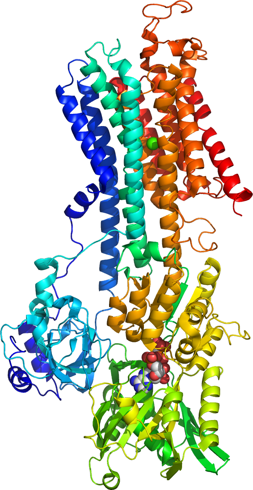
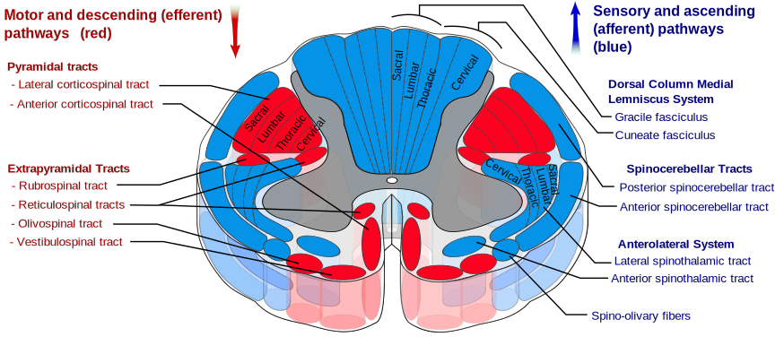
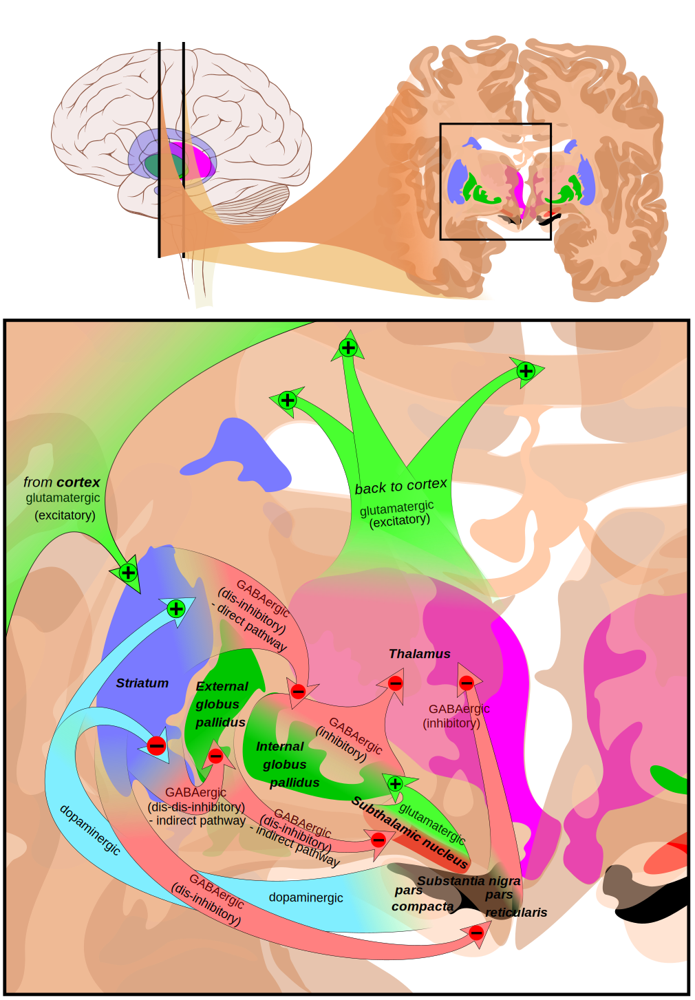

# The Somatic Motor System

The somatic motor system (SMS or voluntary nervous system) is the part of the central and peripheral nervous system associated with the voluntary control of body movements via skeletal muscles.

The somatic nervous system consists of afferent nerves or sensory nerves, and efferent nerves or motor nerves and neurons in the brain and spinal cord. Afferent nerves are responsible for relaying sensation from the body to the central nervous system; efferent nerves are responsible for sending out commands from the CNS to the body, stimulating muscle contraction; they include all the non-sensory neurons connected with skeletal muscles and skin. The a- of afferent and the e- of efferent correspond to the prefixes ad- (to, toward) and ex- (out of).

Peripheral structures of the somatic motor system include skeletal muscles and neural connections with muscle tissues. Central structures include cerebral cortex, brainstem, spinal cord, pyramidal system including the upper motor neurons, extrapyramidal system, cerebellum, and the lower motor neurons in the brainstem and the spinal cord.

## Skeletal Muscle

Skeletal muscle is one of three major muscle types, the others being cardiac muscle and smooth muscle. It is a form of striated muscle tissue, which is under the voluntary control of the somatic nervous system. Most skeletal muscles are attached to bones by bundles of collagen fibers known as tendons.

Many muscles are named by the action the muscle performs. These include:

The flexor and extensor; abductor and adductor; levator and depressor; supinator and pronator; sphincter, tensor, and rotator muscles.

A flexor muscle decreases the anterior angle at a joint; an extensor increases the anterior angle at a joint.

An abductor moves a bone away from the midline; an adductor moves a bone closer to the midline.

A levator raises a structure; a depressor moves a structure down.

A supinator turns the palm of the hand up; a pronator turns the palm down.

A sphincter decreases the size of an opening; a tensor tenses a body part; a rotator turns a bone around its axis.

René Descartes (1596–1650) was one of the first to conceive a model of reciprocal innervation (in 1626) as the principle that provides for the control of agonist and antagonist muscles. Reciprocal innervation describes skeletal muscles as existing in antagonistic pairs, with contraction of one muscle producing forces opposite to those generated by contraction of the other. For example, in the human arm, the triceps acts to extend the lower arm outward while the biceps acts to flex the lower arm inward. To reach optimum efficiency, contraction of opposing muscles must be inhibited while muscles with the desired action are excited. This reciprocal innervation occurs so that the contraction of a muscle results in the simultaneous relaxation of its corresponding antagonist.

A common example of reciprocal innervation, is the effect of the nociceptive (or nocifensive) reflex, or defensive response to pain, otherwise commonly known as the withdrawal reflex; a type of involuntary action of the body to remove the body part from the vicinity of an offending object by contracting the appropriate muscles (usually flexor muscles), while relaxing the extensor muscles.

The concept of reciprocal innervation is also applicable to the eye (Sherrington's law), wherein increased innervation to an extraocular muscle is accompanied by a simultaneous decrease in innervation to its specific antagonist, such as the medial rectus and the lateral rectus in the case of an eye looking to one side of the midline. When looking outward or laterally, the lateral rectus of one eye must contract via increased innervation, while its antagonist, the medial rectus of the same eye - shall relax. The converse would occur in the other eye.

## The Muscle Fiber

A skeletal muscle refers to multiple bundles (fascicles) of cells joined together called muscle fibers. The fibers and muscles are surrounded by connective tissue layers called fasciae. Muscle fibers, or muscle cells, are formed from the fusion of developmental myoblasts in a process known as myogenesis. Muscle fibers are cylindrical and have more than one nucleus.

Muscle fibers are in turn composed of myofibrils. The myofibrils are composed of actin and myosin filaments, repeated in units called sarcomeres, which are the basic functional units of the muscle fiber. The sarcomere is responsible for the striated appearance of skeletal muscle and forms the basic machinery necessary for muscle contraction.

Every single organelle and macromolecule of a muscle fiber is arranged to ensure form meets function. The cell membrane is called the sarcolemma with the cytoplasm known as the sarcoplasm. In the sarcoplasm are the myofibrils. The myofibrils are long protein bundles about 1 micrometer in diameter each containing myofilaments. Pressed against the inside of the sarcolemma are the unusual flattened myonuclei. Between the myofibrils are the mitochondria.

While the muscle fiber does not have smooth endoplasmic cisternae, it contains a sarcoplasmic reticulum. The sarcoplasmic reticulum surrounds the myofibrils and holds a reserve of the calcium ions needed to cause a muscle contraction. Periodically, it has dilated end sacs known as terminal cisternae. These cross the muscle fiber from one side to the other. In between two terminal cisternae is a tubular infolding called a transverse tubule (T tubule). T tubules are the pathways for action potentials to signal the sarcoplasmic reticulum to release calcium, causing a muscle contraction. Together, two terminal cisternae and a transverse tubule form a triad.

In addition to the actin and myosin components that constitute the sarcomere, skeletal muscle fibers also contain two other important regulatory proteins, troponin and tropomyosin, that are necessary for muscle contraction to occur. These proteins are associated with actin and cooperate to prevent its interaction with myosin. 

Once a cell is sufficiently stimulated, the cell's sarcoplasmic reticulum releases ionic calcium (Ca^2+^), which then interacts with the regulatory protein troponin. Calcium-bound troponin undergoes a conformational change that leads to the movement of tropomyosin, subsequently exposing the myosin-binding sites on actin. This allows for myosin and actin ATP-dependent cross-bridge cycling and shortening of the muscle.

(ref:serca) A cartoon representation of the crystal structure of the Ca^2+^ pump of the skeletal muscle sarcoplasmic reticulum. Atomic coordinates of [PDB 1VFP](https://www.rcsb.org/structure/1VFP), rendered with open source molecular visualization tool PyMol.

```{r sercastructure, fig.cap='(ref:serca)', echo=FALSE, message=FALSE, warning=FALSE}

```

## The Motor Unit

Motor units are multiple muscle fibers bundled together. When a person wants to move their body to achieve a certain task, the brain sends an impulse signal that reaches the specific motor unit through the spinal cord. After receiving the signal from the brain, the motor unit contracts muscle fibers within the group to create movement. There is no partial firing in the motor unit, meaning, once the signal is detected, all the muscles fibers within the unit contract. However, there are different intensities. Since each motor unit contracts 100% of its fiber once stimulated, types of motor units that generate different force or speed are significant.

For low intensity tasks, smaller motor units with fewer muscle fibers are used. These smaller motor units are known as low threshold motor units. They consist of type I fibers that contract much slower and thus provide less force for daily basic movement such as typing on the keyboard. For more intense tasks, motor units containing Type II muscle fibers are used. These fast twitch motor units are known as high threshold motor units. 

During an activity of lifting heavy objects such as working out with a dumbbell, not only does low-threshold motor units, but also the high threshold motor units are recruited to compensate forces required in addition to just holding a fork, in which the energy created by the low threshold motor units is sufficient to complete the job. When giving a job, the body first recruits the slow-twitch motor units following by recruit more a more fast-twitch motor units as forces required to complete the movements increase. Thus, when the body has to carry an extremely massive object, it would recruited all the available motor units to contract for the particular muscle that has been used.

### Muscle Contraction

## Somatic Motor Neurons

A motor neuron (or motoneuron) is a neuron whose cell body is located in the motor cortex, brainstem or the spinal cord, and whose axon (fiber) projects to the spinal cord or outside of the spinal cord to directly or indirectly control effector organs, mainly muscles and glands. There are two types of motor neuron – upper motor neurons and lower motor neurons. Axons from upper motor neurons synapse onto interneurons in the spinal cord and occasionally directly onto lower motor neurons. The axons from the lower motor neurons are efferent nerve fibers that carry signals from the spinal cord to the effectors. Types of lower motor neurons are alpha motor neurons, beta motor neurons, and gamma motor neurons.

Upper motor neurons originate in the motor cortex located in the precentral gyrus. The cells that make up the primary motor cortex are Betz cells, which are a type of pyramidal cell. The axons of these cells descend from the cortex to form the corticospinal tract. 

Nerve tracts are bundles of axons as white matter, that carry action potentials to their effectors. In the spinal cord these descending tracts carry impulses from different regions. These tracts also serve as the place of origin for lower motor neurons. There are seven major descending motor tracts to be found in the spinal cord:

* Lateral corticospinal tract
* Rubrospinal tract
* Lateral reticulospinal tract
* Vestibulospinal tract
* Medial reticulospinal tract
* Tectospinal tract
* Anterior corticospinal tract

Lower motor neurons are those that originate in the spinal cord and directly or indirectly innervate effector targets. The target of these neurons varies, but in the somatic nervous system the target will be some sort of muscle fiber.

(ref:spinal) [Efferent and afferent tracts of the spinal cord](https://commons.wikimedia.org/wiki/File:Spinal_cord_tracts_-_English.svg)

```{r spinaltracts, fig.cap='(ref:spinal)', echo=FALSE, message=FALSE, warning=FALSE}

```

* Alpha motor neurons innervate extrafusal muscle fibers, which are the main force-generating component of a muscle. Their cell bodies are in the ventral horn of the spinal cord and they are sometimes called ventral horn cells. A single motor neuron may synapse with 150 muscle fibers on average. The motor neuron and all of the muscle fibers to which it connects is a motor unit. Motor units are split up into 3 categories: 

  * Slow (S) motor units stimulate small muscle fibers, which contract very slowly and provide small amounts of energy but are very resistant to fatigue, so they are used to sustain muscular contraction, such as keeping the body upright. They gain their energy via oxidative means and hence require oxygen. They are also called red fibers.
  * Fast fatiguing (FF) motor units stimulate larger muscle groups, which apply large amounts of force but fatigue very quickly. They are used for tasks that require large brief bursts on energy, such as jumping or running. They gain their energy via glycolytic means and hence don't require oxygen. They are called white fibers.
  * Fast fatigue-resistant motor units stimulate moderate-sized muscles groups that don't react as fast as the FF motor units, but can be sustained much longer (as implied by the name) and provide more force than S motor units. These use both oxidative and glycolytic means to gain energy.

## Neuromuscular Junction

### The Stretch Reflex

[Wilhelm Heinrich Erb](https://en.wikipedia.org/wiki/Wilhelm_Heinrich_Erb) (1840–1921) and [Carl Friedrich Otto Westphal](https://en.wikipedia.org/wiki/Carl_Friedrich_Otto_Westphal) (1833–1890) simultaneously reported the patellar tendon or knee reflex in 1875 . The term knee-jerk was recorded by Sir Michael Foster in his Textbook of physiology in 1877: "Striking the tendon below the patella gives rise to a sudden extension of the leg, known as the knee-jerk."

The patellar reflex or knee-jerk (myotatic) (monosynaptic) is a clinical and classic example of the monosynaptic reflex arc. There is no interneuron in the pathway leading to contraction of the quadriceps muscle. Instead, the sensory neuron synapses directly on a motor neuron in the spinal cord. However, there is an inhibitory interneuron used to relax the antagonistic hamstring muscle (reciprocal innervation).

Striking of the patellar tendon with a reflex hammer just below the patella stretches the muscle spindle in the quadriceps muscle. This produces a signal which travels back to the spinal cord and synapses (without interneurons) at the level of L3 in the spinal cord, completely independent of higher centres. From there, an alpha motor neuron conducts an efferent impulse back to the quadriceps femoris muscle, triggering contraction. This contraction, coordinated with the relaxation of the antagonistic flexor hamstring muscle causes the leg to kick. This is a reflex of proprioception which helps maintain posture and balance, allowing to keep one's balance with little effort or conscious thought.

## The Motor Cortex

The motor cortex is the region of the cerebral cortex involved in the planning, control, and execution of voluntary movements. Classically the motor cortex is an area of the frontal lobe located in the posterior precentral gyrus immediately anterior to the central sulcus. 

The motor cortex can be divided into three areas:

1. The primary motor cortex is the main contributor to generating neural impulses that pass down to the spinal cord and control the execution of movement. However, some of the other motor areas in the brain also play a role in this function. It is located on the anterior paracentral lobule on the medial surface.
1. The premotor cortex is responsible for some aspects of motor control, possibly including the preparation for movement, the sensory guidance of movement, the spatial guidance of reaching, or the direct control of some movements with an emphasis on control of proximal and trunk muscles of the body. Located anterior to the primary motor cortex.
1. The supplementary motor area (or SMA), has many proposed functions including the internally generated planning of movement, the planning of sequences of movement, and the coordination of the two sides of the body such as in bi-manual coordination. Located on the midline surface of the hemisphere anterior to the primary motor cortex.

Other brain regions outside the cerebral cortex are also of great importance to motor function, most notably the cerebellum, the basal ganglia, pedunculopontine nucleus and the red nucleus, as well as other subcortical motor nuclei.

In 1870 Eduard Hitzig and Gustav Fritsch demonstrated that electrical stimulation of certain parts of the dog brain resulted in muscular contraction on the opposite side of the body.

A little later, in 1874, David Ferrier, working in the laboratory of the West Riding Lunatic Asylum at Wakefield (at the invitation of its director, James Crichton-Browne), mapped the motor cortex in the monkey brain using electrical stimulation. He found that the motor cortex contained a rough map of the body with the feet at the top (or dorsal part) of the brain and the face at the bottom (or ventral part) of the brain. He also found that when electrical stimulation was maintained for a longer time, such as for a second, instead of being discharged over a fraction of a second, then some coordinated, seemingly meaningful movements could be caused, instead of only muscle twitches.

After Ferrier's discovery, many neuroscientists used electrical stimulation to study the map of the motor cortex in many animals including monkeys, apes, and humans.

One of the first detailed maps of the human motor cortex was described in 1905 by Campbell. He did autopsies on the brains of amputees. A person who had lost an arm would over time apparently lose some of the neuronal mass in the part of the motor cortex that normally controls the arm. Likewise, a person who had lost a leg would show degeneration in the leg part of motor cortex. In this way the motor map could be established. In the period between 1919 and 1936 others mapped the motor cortex in detail using electrical stimulation, including the husband and wife team Vogt and Vogt, and the neurosurgeon Foerster.

Perhaps the best-known experiments on the human motor map were published by Penfield in 1937. Using a procedure that was common in the 1930s, he examined epileptic patients who were undergoing brain surgery. These patients were given a local anesthetic, their skulls were opened, and their brains exposed. Then, electrical stimulation was applied to the surface of the brain to map out the speech areas. In this way, the surgeon would be able to avoid any damage to speech circuitry. The brain focus of the epilepsy could then be surgically removed. During this procedure, Penfield mapped the effect of electrical stimulation in all parts of the cerebral cortex, including motor cortex.

Penfield is sometimes mistakenly considered to be the discoverer of the map in motor cortex. It was discovered approximately 70 years before his work. However, Penfield drew a picture of a human-like figure stretched over the cortical surface and used the term "homunculus" (diminutive of "homo", Latin for "man") to refer to it. It is perhaps for this reason that his work has become so popular in neuroscience.


### The Supplementary Motor Cortex

## The Basal Ganglia

The basal ganglia (or basal nuclei) are a group of subcortical nuclei, of varied origin, in the brains of vertebrates, including humans, which are situated at the base of the forebrain and top of the midbrain. There are some differences in the basal ganglia of primates. Basal ganglia are strongly interconnected with the cerebral cortex, thalamus, and brainstem, as well as several other brain areas. The basal ganglia are associated with a variety of functions, including control of voluntary motor movements, procedural learning, habit learning, eye movements, cognition, and emotion.

The nomenclature of the basal ganglia system and its components has always been problematic. Early anatomists, seeing the macroscopic anatomical structure but knowing nothing of the cellular architecture or neurochemistry, grouped together components that are now believed to have distinct functions (such as the internal and external segments of the globus pallidus), and gave distinct names to components that are now thought to be functionally parts of a single structure (such as the caudate nucleus and putamen).

The term "basal" comes from the fact that most of its elements are located in the basal part of the forebrain. The term ganglia is a misnomer: In modern usage, neural clusters are called "ganglia" only in the peripheral nervous system; in the central nervous system they are called "nuclei". For this reason, the basal ganglia are also occasionally known as the "basal nuclei". 

The main components of the basal ganglia – as defined functionally – are the striatum; both dorsal striatum (caudate nucleus and putamen) and ventral striatum (nucleus accumbens and olfactory tubercle), globus pallidus, ventral pallidum, substantia nigra, and subthalamic nucleus. Each of these components has a complex internal anatomical and neurochemical organization. The largest component, the striatum (dorsal and ventral), receives input from many brain areas beyond the basal ganglia, but only sends output to other components of the basal ganglia. The pallidum receives input from the striatum, and sends inhibitory output to a number of motor-related areas. The substantia nigra is the source of the striatal input of the neurotransmitter dopamine, which plays an important role in basal ganglia function. The subthalamic nucleus receives input mainly from the striatum and cerebral cortex, and projects to the globus pallidus.

Popular theories implicate the basal ganglia primarily in action selection – in helping to decide which of several possible behaviors to execute at any given time. In more specific terms, the basal ganglia's primary function is likely to control and regulate activities of the motor and premotor cortical areas so that voluntary movements can be performed smoothly. Experimental studies show that the basal ganglia exert an inhibitory influence on a number of motor systems, and that a release of this inhibition permits a motor system to become active. The "behavior switching" that takes place within the basal ganglia is influenced by signals from many parts of the brain, including the prefrontal cortex, which plays a key role in executive functions.

The basal ganglia are of major importance for normal brain function and behaviour. Their dysfunction results in a wide range of neurological conditions including disorders of behaviour control and movement. Those of behaviour include Tourette syndrome, obsessive–compulsive disorder, and addiction. Movement disorders include, most notably Parkinson's disease, which involves degeneration of the dopamine-producing cells in the substantia nigra, Huntington's disease, which primarily involves damage to the striatum, dystonia, and more rarely hemiballismus. The basal ganglia have a limbic sector whose components are assigned distinct names: the nucleus accumbens, ventral pallidum, and ventral tegmental area (VTA). There is considerable evidence that this limbic part plays a central role in reward learning as well as cognition and frontal lobe functioning, via the mesolimbic pathway from the VTA to the nucleus accumbens that uses the neurotransmitter dopamine, and the mesocortical pathway. A number of highly addictive drugs, including cocaine, amphetamine, and nicotine, are thought to work by increasing the efficacy of this dopamine signal. There is also evidence implicating overactivity of the VTA dopaminergic projection in schizophrenia.

The basal ganglia form a fundamental component of the cerebrum. In contrast to the cortical layer that lines the surface of the forebrain, the basal ganglia are a collection of distinct masses of gray matter lying deep in the brain not far from the junction of the thalamus. They lie to the side of and surround the thalamus. Like most parts of the brain, the basal ganglia consist of left and right sides that are virtual mirror images of each other.

## The Cortico-Basal Ganglia-Thalamo-Cortical Loop

The cortico-basal ganglia-thalamo-cortical loop (CBGTC loop) is a system of neural circuits in the brain. The loop involves connections between the cortex, the basal ganglia, the thalamus, and back to the cortex. It is of particular relevance to hyperkinetic and hypokinetic movement disorders, such as Parkinson's disease and Huntington's disease, as well as to mental disorders of control, such as attention deficit hyperactivity disorder (ADHD), obsessive–compulsive disorder (OCD), and Tourette syndrome.

The CBGTC loop primarily consists of modulatory dopaminergic projections from the pars compacta of the substantia nigra, and ventral tegmental area as well as excitatory glutamatergic projections from the cortex to the striatum, where these projections form synapses with excitatory and inhibitory pathways that relay back to the cortex.

The two major input structures of the circuit are the striatum and the subthalamic nucleus (STN). The striatum receives inputs from both the cortex and the pars compacta of the substantia nigra (SNc), while the STN only receives cortical inputs.

Two pathways emerge from the striatum. One pathway is called the indirect (or NoGo) pathway and is inhibitory. This projects to and inhibits the globus pallidus externus (GPe), resulting in the disinhibition of the globus pallidus internus (GPi), leading to inhibition of the thalamus. This pathway also, as a result of inhibiting the GPe, disinhibits the subthalamic nucleus, which results in excitation of the GPi, and therefore inhibition of the thalamus.

The second pathway, is called the direct (or Go) pathway and is excitatory. This pathway inhibits the GPi, resulting in the disinhibition of the thalamus. The direct pathway mostly consists of monosynaptic connections driven by dopamine receptor D1, adenosine A1 receptor, and muscarinic acetylcholine receptor M4, while the indirect pathway relies on connections driven by dopamine receptor D2, adenosine A2A receptor, and muscarinic acetylcholine receptor M1.

(ref:circuits) [Circuits of the basal ganglia.](https://commons.wikimedia.org/wiki/File:Basal_ganglia_circuits.svg) Picture shows 2 coronal slices that have been superimposed to include the involved basal ganglia structures. + and - signs at the point of the arrows indicate respectively whether the pathway is excitatory or inhibitory in effect. Green arrows refer to excitatory glutamatergic pathways, red arrows refer to inhibitory GABAergic pathways and turquoise arrows refer to dopaminergic pathways that are excitatory on the direct pathway and inhibitory on the indirect pathway. Note that dis-inhibitory pathways in effect are excitatory on the feedback to the cortex, while dis-dis-inhibitory pathways in effect are inhibitory. See en:Basal ganglia#Connections

```{r basalcircuits, fig.cap='(ref:circuits)', echo=FALSE, message=FALSE, warning=FALSE}

```

The CBGTC loop has been implicated in many diseases. For example, in Parkinson's disease, degeneration of dopaminergic neurons leading to decreased activity of the excitatory pathway is thought to result in hypokinesia, and in Huntington's disease, degeneration of GABAergic neurons driving the inhibitory pathway is thought to result in the jerky body movements. The co-degeneration of limbic projections along with motor projections may result in many of the psychiatric symptoms of these primarily motor illnesses. 

## The Pyramidal Motor System

The pyramidal motor system, also called the pyramidal tract or the corticospinal tract, start in the motor center of the cerebral cortex. There are upper and lower motor neurons in the corticospinal tract. The motor impulses originate in the giant pyramidal cells or Betz cells of the motor area; i.e., precentral gyrus of cerebral cortex. These are the upper motor neurons (UMN) of the corticospinal tract. The axons of these cells pass in the depth of the cerebral cortex to the corona radiata and then to the internal capsule passing through the posterior branch of internal capsule and continue to descend in the midbrain and the medulla oblongata. In the lower part of Medulla oblongata 80 to 85% of these fibers decussate (pass to the opposite side) and descend in the white matter of the lateral funiculus of the spinal cord on the opposite side. The remaining 15 to 20% pass to the same side. Fibers for the extremities (limbs) pass 100% to the opposite side. The fibers of the corticospinal tract terminate at different levels in the anterior horn of the grey matter of the spinal cord. Here the lower motor neurons (LMN) of the corticospinal cord are located. Peripheral motor nerves carry the motor impulses from the anterior horn to the voluntary muscles.

The pyramidal tracts include both the corticobulbar tract and the corticospinal tract. These are aggregations of efferent nerve fibers from the upper motor neurons that travel from the cerebral cortex and terminate either in the brainstem (corticobulbar) or spinal cord (corticospinal) and are involved in the control of motor functions of the body.

The corticobulbar tract conducts impulses from the brain to the cranial nerves. These nerves control the muscles of the face and neck and are involved in facial expression, mastication, swallowing, and other functions.

The corticospinal tract conducts impulses from the brain to the spinal cord. It is made up of a lateral and anterior tract. The corticospinal tract is involved in voluntary movement. The majority of fibres of the corticospinal tract cross over in the medulla oblongata, resulting in muscles being controlled by the opposite side of the brain. The corticospinal tract also contains the axons of Betz cells (the largest pyramidal cells) located in the primary motor cortex.

The pyramidal tracts are named because they pass through the pyramids of the medulla oblongata. The corticospinal fibers when descending from the internal capsule to the brain stem, converge to a point from multiple directions giving the impression of an inverted pyramid.

The myelination of the pyramidal fibres is incomplete at birth and gradually progresses in cranio-caudal direction and thereby progressively gaining functionality. Most of the myelination is complete by two years of age and thereafter it progresses very slowly in cranio-caudal direction up to twelve years of age.

### The Corticospinal Tract

Nerve fibres in the corticospinal tract originate from pyramidal cells in layer V of the cerebral cortex. Fibres arise from the primary motor cortex (about 30%), supplementary motor area and the premotor cortex (together also about 30%), and the somatosensory cortex, parietal lobe, and cingulate gyrus supplies the rest. The cells have their bodies in the cerebral cortex, and the axons form the bulk of the pyramidal tracts. The nerve axons travel from the cortex through the posterior limb of internal capsule, through the cerebral peduncle and into the brainstem and anterior medulla oblongata. Here they form two prominences called the medulla oblongatary pyramids. Below the prominences, the majority of axons cross over to the opposite side from which they originated, known as decussation. The axons that cross over move to the outer part of the medulla oblongata and form the lateral corticospinal tract, whereas the fibres that remain form the anterior corticospinal tract. About 80% of axons cross over and form the lateral corticospinal tract; 10% do not cross over and join the tract, and 10% of fibres travel in the anterior corticospinal tract.

The nerve axons traveling down the tract are the efferent nerve fibers of the upper motor neurons. These axons travel down the tracts in the white matter of the spinal cord until they reach the vertebral level of the muscle that they will innervate. At this point, the axons synapse with lower motor neurons. The majority of axons do not directly synapse with lower motor neurons, but instead synapse with an interneuron that then synapses with a lower motor neuron. This generally occurs in the anterior grey column. Nerve axons of the lateral corticospinal tract that did not cross over in the medulla oblongata do so at the level of the spinal cord they terminate in.

These tracts contain more than 1 million axons and the majority of the axons are myelinated. The corticospinal tracts myelinate largely during the first and second years after birth. The majority of nerve axons are small (<4μm) in diameter. About 3% of nerve axons have a much larger diameter (16μm) and arise from Betz cells, mostly in the leg area of the primary motor cortex. These cells are notable because of their rapid conduction rate, over 70m/sec, the fastest conduction of any signals from the brain to the spinal cord.

### The Corticobulbar Tract

Fibres from the ventral motor cortex travel with the corticospinal tract through the internal capsule, but terminate in a number of locations in the midbrain (cortico-mesencephalic tract), pons (Corticopontine tract), and medulla oblongata (cortico-bulbar tract). The upper motor neurons of the corticobulbar tract synapse with interneurons or directly with the lower motor neurons located in the motor cranial nerve nuclei, namely oculomotor, trochlear, motor nucleus of the trigeminal nerve, abducens, facial nerve and accessory and in the nucleus ambiguus to the hypoglossal, vagus and accessory nerves. These nuclei are supplied by nerves from both sides of the brain, with the exception of the parts of the facial nerve that control muscles of the lower face. These muscles are only innervated by nerves from the contralateral (opposite) side of the cortex.

The nerves within the corticospinal tract are involved in movement of muscles of the body. Because of the crossing-over of fibres, muscles are supplied by the side of the brain opposite to that of the muscle. The nerves within the corticobulbar tract are involved in movement in muscles of the head. They are involved in swallowing, phonation, and movements of the tongue. By virtue of involvement with the facial nerve, the corticobulbar tract is also responsible for transmitting facial expression. With the exception of lower muscles of facial expression, all functions of the corticobulbar tract involve inputs from both sides of the brain.

## The Extrapyramidal Motor System

The extrapyramidal motor system consists of motor-modulation systems, particularly the basal ganglia and cerebellum. The system is called extrapyramidal to distinguish it from the tracts of the motor cortex that reach their targets by traveling through the pyramids of the medulla.

Extrapyramidal tracts are chiefly found in the reticular formation of the pons and medulla, and target lower motor neurons in the spinal cord that are involved in reflexes, locomotion, complex movements, and postural control. These tracts are in turn modulated by various parts of the central nervous system, including the nigrostriatal pathway, the basal ganglia, the cerebellum, the vestibular nuclei, and different sensory areas of the cerebral cortex. All of these regulatory components can be considered part of the extrapyramidal system, in that they modulate motor activity without directly innervating motor neurons.

The extrapyramidal tracts include parts of the following:

* rubrospinal tract
* pontine reticulospinal tract
* medullary reticulospinal tract
* lateral vestibulospinal tract
* tectospinal tract

In terms of anatomy, the basal ganglia are divided into four distinct structures, depending on how superior or rostral they are (in other words depending on how close to the top of the head they are): Two of them, the striatum and the pallidum, are relatively large; the other two, the substantia nigra and the subthalamic nucleus, are smaller. In the illustration to the right, two coronal sections of the human brain show the location of the basal ganglia components. Of note, and not seen in this section, the subthalamic nucleus and substantia nigra lie farther back (posteriorly) in the brain than the striatum and pallidum.
