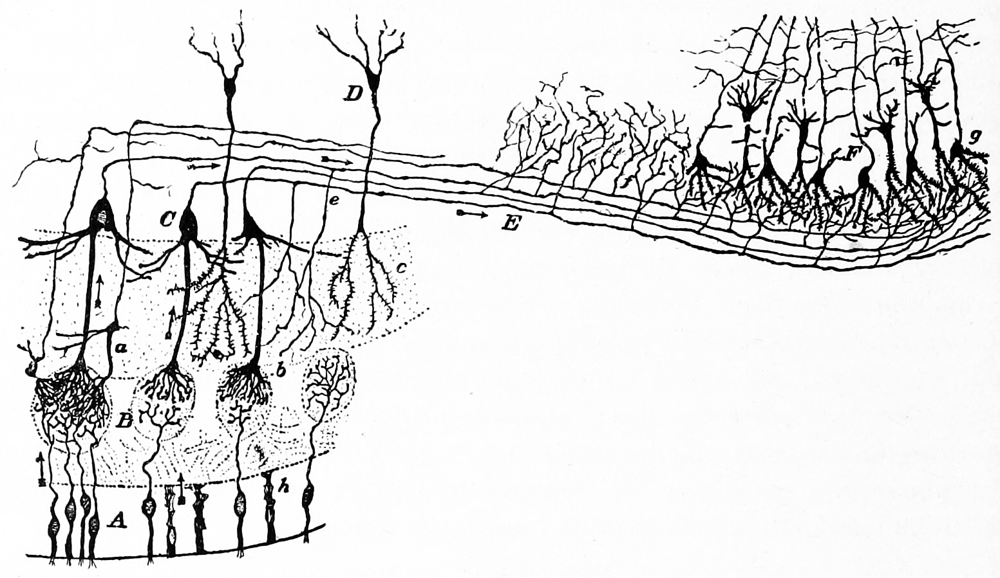

# The Olfactory System

The olfactory system, or sense of smell, is the sensory system used for smelling (olfaction). Olfaction is one of the special senses, that have directly associated specific organs. Most mammals and reptiles have a main olfactory system and an accessory olfactory system. The main olfactory system detects airborne substances, while the accessory system senses fluid-phase stimuli. Often, land organisms will have separate olfaction systems for smell and taste (orthonasal smell and retronasal smell), but water-dwelling organisms usually have only one system. The senses of smell and taste (gustatory system) are often referred to together as the chemosensory system, because they both give the brain information about the chemical composition of objects.

Olfaction is a chemoreception that forms the sense of smell. Olfaction has many purposes, such as the detection of hazards, pheromones, and food. It integrates with other senses to form the sense of flavor. Olfaction occurs when odorants bind to specific sites on olfactory receptors located in the nasal cavity. Glomeruli aggregate signals from these receptors and transmit them to the olfactory bulb, where the sensory input will start to interact with parts of the brain responsible for smell identification, memory, and emotion.

In insects, smells are sensed by olfactory sensory neurons in the chemosensory sensilla, which are present in insect antenna, palps, and tarsa, but also on other parts of the insect body. Odorants penetrate into the cuticle pores of chemosensory sensilla and get in contact with insect odorant-binding proteins (OBPs) or Chemosensory proteins (CSPs), before activating the sensory neurons.

In vertebrates, smells are sensed by olfactory sensory neurons in the olfactory epithelium. The olfactory epithelium is made up of at least six morphologically and biochemically different cell types. The proportion of olfactory epithelium compared to respiratory epithelium (not innervated, or supplied with nerves) gives an indication of the animal's olfactory sensitivity. Humans have about 10 cm^2^ of olfactory epithelium, whereas some dogs have 170 cm^2^. A dog's olfactory epithelium is also considerably more densely innervated, with a hundred times more receptors per square centimeter.

Molecules of odorants passing through the superior nasal concha of the nasal passages dissolve in the mucus that lines the superior portion of the cavity and are detected by olfactory receptors on the dendrites of the olfactory sensory neurons. This may occur by diffusion or by the binding of the odorant to odorant-binding proteins. The mucus overlying the epithelium contains mucopolysaccharides, salts, enzymes, and antibodies (these are highly important, as the olfactory neurons provide a direct passage for infection to pass to the brain). This mucus acts as a solvent for odor molecules, flows constantly, and is replaced approximately every ten minutes.

## The Nose

The human nose is the most protruding part of the face. It bears the nostrils and is the first organ of the respiratory system. It is also the principal organ in the olfactory system. The shape of the nose is determined by the nasal bones and the nasal cartilages, including the nasal septum which separates the nostrils and divides the nasal cavity into two. 

The main function of the nose is respiration, and the nasal mucosa lining the nasal cavity and the paranasal sinuses carries out the necessary conditioning of inhaled air by warming and moistening it. Nasal conchae, shell-like bones in the walls of the cavities, play a major part in this process. Filtering of the air by nasal hair in the nostrils prevents large particles from entering the lungs. Sneezing is a reflex to expel unwanted particles from the nose that irritate the mucosal lining. Sneezing can transmit infections, because aerosols are created in which the droplets can harbour pathogens.

Another major function of the nose is olfaction, the sense of smell. The area of olfactory epithelium, in the upper nasal cavity, contains specialised olfactory cells responsible for this function.

The peripheral olfactory system consists mainly of the nostrils, ethmoid bone, nasal cavity, and the olfactory epithelium (layers of thin tissue covered in mucus that line the nasal cavity). The primary components of the layers of epithelial tissue are the mucous membranes, olfactory glands, olfactory neurons, and nerve fibers of the olfactory nerves.

(ref:septum) View of the right side of the nasal septum showing the olfactory bulb and the filaments of the olfactory nerve.From [Gray, Henry: Anatomy Descriptive And Surgical. 7^th^ Edition, Longmans, Green, And Co., London, 1875 ](https://wellcomelibrary.org/item/b21688692).

```{r rightseptum, fig.cap='(ref:septum)', echo=FALSE, message=FALSE, warning=FALSE}
knitr::include_graphics("./figures/olfactory/GrayP572.jpg")
```

Odor molecules can enter the peripheral pathway and reach the nasal cavity either through the nostrils when inhaling (olfaction) or through the throat when the tongue pushes air to the back of the nasal cavity while chewing or swallowing (retro-nasal olfaction). Inside the nasal cavity, mucus lining the walls of the cavity dissolves odor molecules. Mucus also covers the olfactory epithelium, which contains mucous membranes that produce and store mucus and olfactory glands that secrete metabolic enzymes found in the mucus.

## Olfactory Sensory Neurons  

Humans have between 10 and 20 million olfactory receptor neurons (ORNs). In vertebrates, ORNs are bipolar neurons with dendrites facing the external surface of the cribriform plate with axons that pass through the cribriform foramina with terminal end at olfactory bulbs. The ORNs are located in the olfactory epithelium in the nasal cavity. The cell bodies of the ORNs are distributed among all three of the stratified layers of the olfactory epithelium.

Many tiny hair-like cilia protrude from the olfactory receptor cell's dendrite into the mucus covering the surface of the olfactory epithelium. The surface of these cilia is covered with olfactory receptors, a type of G protein-coupled receptor. Each olfactory receptor cell expresses only one type of olfactory receptor (OR), but many separate olfactory receptor cells express ORs which bind the same set of odors. The axons of olfactory receptor cells which express the same OR converge to form glomeruli in the olfactory bulb.Olfactory sensory neurons in the epithelium detect odor molecules dissolved in the mucus and transmit information about the odor to the brain in a process called sensory transduction. Olfactory neurons have cilia (tiny hairs) containing olfactory receptors that bind to odor molecules, causing an electrical response that spreads through the sensory neuron to the olfactory nerve fibers at the back of the nasal cavity.

Olfactory receptors (ORs), also known as odorant receptors, are expressed in the cell membranes of olfactory receptor neurons and are responsible for the detection of odorants (i.e., compounds that have an odor) which give rise to the sense of smell. Activated olfactory receptors trigger nerve impulses which transmit information about odor to the brain. These receptors are members of the class A rhodopsin-like family of G protein-coupled receptors (GPCRs). The olfactory receptors form a multigene family consisting of around 800 genes in humans and 1400 genes in mice

Rather than binding specific ligands, olfactory receptors display affinity for a range of odor molecules, and conversely a single odorant molecule may bind to a number of olfactory receptors with varying affinities, which depend on physio-chemical properties of molecules like their molecular volumes. Once the odorant has bound to the odor receptor, the receptor undergoes structural changes and it binds and activates the olfactory-type G protein on the inside of the olfactory receptor neuron. The G protein (G~olf~ and/or G~s~) in turn activates  adenylate cyclase - which converts ATP into cyclic AMP (cAMP). The cAMP opens cyclic nucleotide-gated ion channels which allow calcium and sodium ions to enter into the cell, depolarizing the olfactory receptor neuron and triggering the firing of action potentials which convey the information to the brain.

Olfactory nerves and fibers transmit information about odors from the peripheral olfactory system to the central olfactory system of the brain, which is separated from the epithelium by the cribriform plate of the ethmoid bone. Olfactory nerve fibers, which originate in the epithelium, pass through the cribriform plate, connecting the epithelium to the brain's limbic system at the olfactory bulbs.

(ref:olf) Diagram of the structure of the olfactory bulb and olfactory cortex. A) Olfacory mucosa; B) glomeruli in the olfactory bulb; C) mitral cells; D) granule cells; E) olfactory nerve; F) pyramidal cells in the olfactory cortex. Action potentials fired by the olfactory receptor cells and subsequently by the cells in the olfactory bulb, travel to the olfactory cortex (arrows).  [Histologie du système nerveux de l'homme & des vertébrés, Tome Premier](https://wellcomelibrary.org/item/b2129592x#?c=0&m=0&s=0&cv=14&z=0%2C-3.48%2C1%2C8.6591) (1909) by Santiago Ramón y Cajal translated from Spanish by Dr. L. Azoulay.

```{r olfactory, fig.cap='(ref:olf)', echo=FALSE, message=FALSE, warning=FALSE}

```

## The Olfactory Bulb

The main olfactory bulb transmits pulses to both mitral and tufted cells, which help determine odor concentration based off the time certain neuron clusters fire (called 'timing code'). These cells also note differences between highly similar odors and use that data to aid in later recognition. The cells are different with mitral having low firing-rates and being easily inhibited by neighboring cells, while tufted have high rates of firing and are more difficult to inhibit.

## The Olfactory Cortex

The uncus(an anterior extremity of the parahippocampal gyrus, a region that surrounds the hippocampus and is part of the limbic system) houses the olfactory cortex which includes the piriform cortex (posterior orbitofrontal cortex), amygdala, olfactory tubercle, and parahippocampal gyrus.

The olfactory tubercle connects to numerous areas of the amygdala, thalamus, hypothalamus, hippocampus, brain stem, retina, auditory cortex, and olfactory system. 

The anterior olfactory nucleus distributes reciprocal signals between the olfactory bulb and piriform cortex. The anterior olfactory nucleus is the memory hub for smell.

## Olfactory Pathways

Olfactory sensory neurons project axons to the brain within the olfactory nerve, (cranial nerve I). These nerve fibers, lacking myelin sheaths, pass to the olfactory bulb of the brain through perforations in the cribriform plate, which in turn projects olfactory information to the olfactory cortex and other areas. The axons from the olfactory receptors converge in the outer layer of the olfactory bulb within small (≈50 micrometers in diameter) structures called glomeruli. Mitral cells, located in the inner layer of the olfactory bulb, form synapses with the axons of the sensory neurons within glomeruli and send the information about the odor to other parts of the olfactory system, where multiple signals may be processed to form a synthesized olfactory perception. A large degree of convergence occurs, with 25,000 axons synapsing on 25 or so mitral cells, and with each of these mitral cells projecting to multiple glomeruli. Mitral cells also project to periglomerular cells and granular cells that inhibit the mitral cells surrounding it (lateral inhibition). Granular cells also mediate inhibition and excitation of mitral cells through pathways from centrifugal fibers and the anterior olfactory nuclei. Neuromodulators like acetylcholine, serotonin and norepinephrine all send axons to the olfactory bulb and have been implicated in gain modulation, pattern separation, and memory functions, respectively.

The mitral cells leave the olfactory bulb in the lateral olfactory tract, which synapses on five major regions of the cerebrum: the anterior olfactory nucleus, the olfactory tubercle, the amygdala, the piriform cortex, and the entorhinal cortex. The anterior olfactory nucleus projects, via the anterior commissure, to the contralateral olfactory bulb, inhibiting it. The piriform cortex has two major divisions with anatomically distinct organizations and functions. The anterior piriform cortex (APC) appears to be better at determining the chemical structure of the odorant molecules, and the posterior piriform cortex (PPC) has a strong role in categorizing odors and assessing similarities between odors (e.g. minty, woody, and citrus are odors that can, despite being highly variant chemicals, be distinguished via the PPC in a concentration-independent manner). The piriform cortex projects to the medial dorsal nucleus of the thalamus, which then projects to the orbitofrontal cortex. The orbitofrontal cortex mediates conscious perception of the odor (citation needed). The three-layered piriform cortex projects to a number of thalamic and hypothalamic nuclei, the hippocampus and amygdala and the orbitofrontal cortex, but its function is largely unknown. The entorhinal cortex projects to the amygdala and is involved in emotional and autonomic responses to odor. It also projects to the hippocampus and is involved in motivation and memory. Odor information is stored in long-term memory and has strong connections to emotional memory. This is possibly due to the olfactory system's close anatomical ties to the limbic system and hippocampus, areas of the brain that have long been known to be involved in emotion and place memory, respectively.

Since any one receptor is responsive to various odorants, and there is a great deal of convergence at the level of the olfactory bulb, it may seem strange that human beings are able to distinguish so many different odors. It seems that a highly complex form of processing must be occurring; however, as it can be shown that, while many neurons in the olfactory bulb (and even the pyriform cortex and amygdala) are responsive to many different odors, half the neurons in the orbitofrontal cortex are responsive to only one odor, and the rest to only a few. It has been shown through microelectrode studies that each individual odor gives a particular spatial map of excitation in the olfactory bulb. It is possible that the brain is able to distinguish specific odors through spatial encoding, but temporal coding must also be taken into account. Over time, the spatial maps change, even for one particular odor, and the brain must be able to process these details as well.

Inputs from the two nostrils have separate inputs to the brain, with the result that, when each nostril takes up a different odorant, a person may experience perceptual rivalry in the olfactory sense akin to that of binocular rivalry.

In insects, smells are sensed by sensilla located on the antenna and maxillary palp and first processed by the antennal lobe (analogous to the olfactory bulb), and next by the mushroom bodies and lateral horn.

Many animals, including most mammals and reptiles, but not humans, have two distinct and segregated olfactory systems: a main olfactory system, which detects volatile stimuli, and an accessory olfactory system, which detects fluid-phase stimuli. Behavioral evidence suggests that these fluid-phase stimuli often function as pheromones, although pheromones can also be detected by the main olfactory system. In the accessory olfactory system, stimuli are detected by the vomeronasal organ, located in the vomer, between the nose and the mouth. Snakes use it to smell prey, sticking their tongue out and touching it to the organ.

The sensory receptors of the accessory olfactory system are located in the vomeronasal organ. As in the main olfactory system, the axons of these sensory neurons project from the vomeronasal organ to the accessory olfactory bulb, which in the mouse is located on the dorsal-posterior portion of the main olfactory bulb. Unlike in the main olfactory system, the axons that leave the accessory olfactory bulb do not project to the brain's cortex but rather to targets in the amygdala and bed nucleus of the stria terminalis, and from there to the hypothalamus, where they may influence aggression and mating behavior.

The process by which olfactory information is coded in the brain to allow for proper perception is still being researched, and is not completely understood. When an odorant is detected by receptors, they in a sense break the odorant down, and then the brain puts the odorant back together for identification and perception. The odorant binds to receptors that recognize only a specific functional group, or feature, of the odorant, which is why the chemical nature of the odorant is important.

After binding the odorant, the receptor is activated and will send a signal to the glomeruli. Each glomerulus receives signals from multiple receptors that detect similar odorant features. Because several receptor types are activated due to the different chemical features of the odorant, several glomeruli are activated as well. All of the signals from the glomeruli are then sent to the brain, where the combination of glomeruli activation encodes the different chemical features of the odorant. The brain then essentially puts the pieces of the activation pattern back together in order to identify and perceive the odorant. This distributed code allows the brain to detect specific odors in mixtures of many background odors.

Different people smell different odors, and most of these differences are caused by genetic differences. Although odorant receptor genes make up one of the largest gene families in the human genome, only a handful of genes have been linked conclusively to particular smells. For instance, the odorant receptor OR5A1 and its genetic variants (alleles) are responsible for our ability (or failure) to smell β-ionone, a key aroma in foods and beverages. Similarly, the odorant receptor OR2J3 is associated with the ability to detect the "grassy" odor, cis-3-hexen-1-ol. The preference (or dislike) of cilantro (coriander) has been linked to the olfactory receptor OR6A2.
