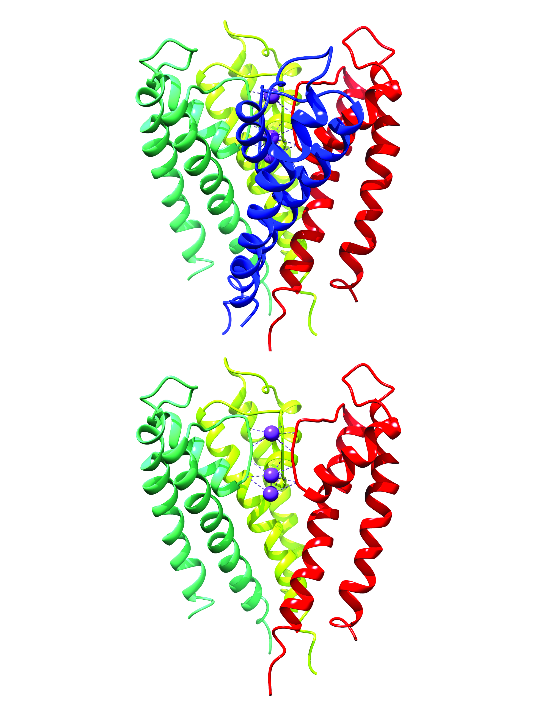
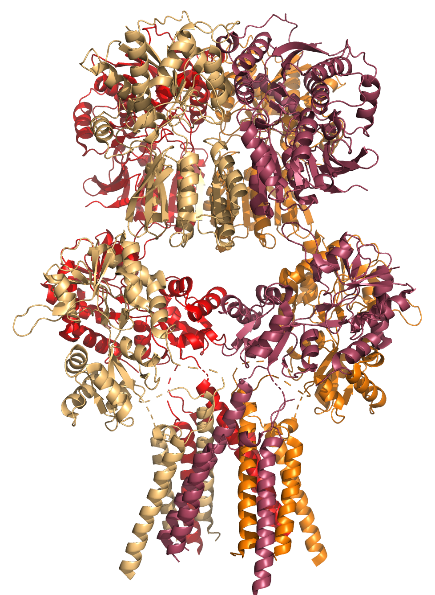
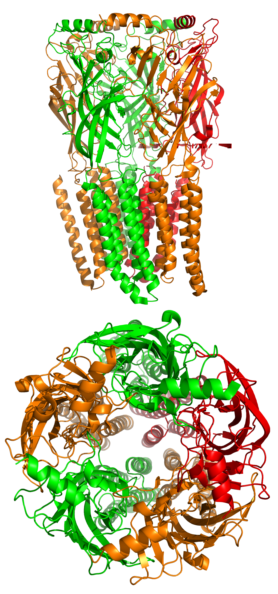
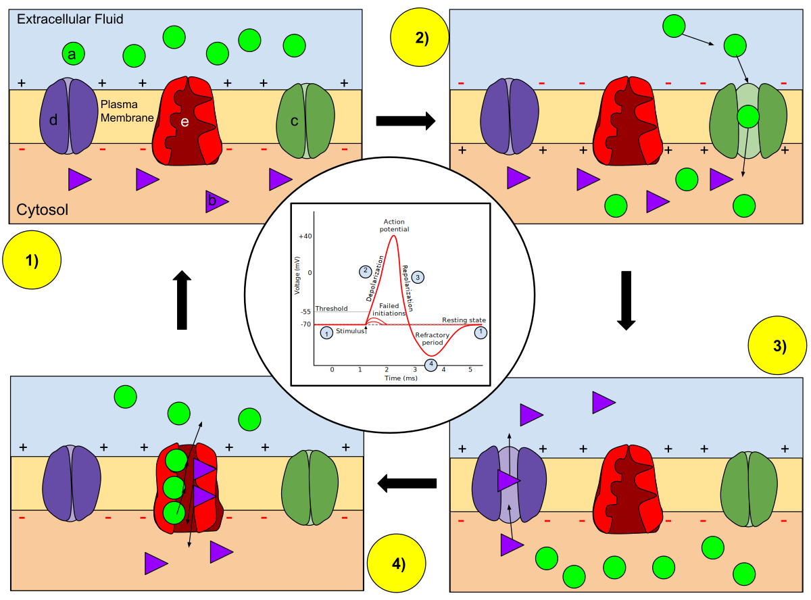

# Electrical Basis Of Neuronal Function

## The Membrane Potential

Membrane potential (also transmembrane potential or membrane voltage) is the difference in electric potential between the interior and the exterior of a biological cell. With respect to the exterior of the cell, typical values of membrane potential, normally given in units of millivolts and denoted as mV, ranges from –40 mV to –80 mV.

All animal cells are surrounded by a membrane composed of a lipid bilayer with proteins embedded in it. The membrane serves as both an insulator and a diffusion barrier to the movement of ions. Transmembrane proteins, also known as ion transporter or ion pump proteins, actively push ions across the membrane and establish concentration gradients across the membrane, and ion channels allow ions to move across the membrane down those concentration gradients. Ion pumps and ion channels are electrically equivalent to a set of batteries and resistors inserted in the membrane, and therefore create a voltage between the two sides of the membrane.

Almost all plasma membranes have an electrical potential across them, with the inside usually negative with respect to the outside. The membrane potential has two basic functions. First, it allows a cell to function as a battery, providing power to operate a variety of "molecular devices" embedded in the membrane. Second, in electrically excitable cells such as neurons and muscle cells, it is used for transmitting signals between different parts of a cell. Signals are generated by opening or closing of ion channels at one point in the membrane, producing a local change in the membrane potential. This change in the electric field can quickly affect adjacent and more distant ion channels in the membrane. Those ion channels can then open or close as a result of the potential change, reproducing the signal.

In non-excitable cells, and in excitable cells in their baseline states, the membrane potential is held at a relatively stable value, called the resting potential. For neurons, typical values of the resting potential range from –70 to –80 millivolts; that is, the interior of a cell has a negative baseline voltage of a bit less than one-tenth of a volt. The opening and closing of ion channels can induce a departure from the resting potential. This is called a depolarization if the interior voltage becomes less negative (say from –70 mV to –60 mV), or a hyperpolarization if the interior voltage becomes more negative (say from –70 mV to –80 mV). In excitable cells, a sufficiently large depolarization can evoke an action potential, in which the membrane potential changes rapidly and significantly for a short time (on the order of 1 to 100 milliseconds), often reversing its polarity. Action potentials are generated by the activation of certain voltage-gated ion channels.

In neurons, the factors that influence the membrane potential are diverse. They include numerous types of ion channels, some of which are chemically gated and some of which are voltage-gated. Because voltage-gated ion channels are controlled by the membrane potential, while the membrane potential itself is influenced by these same ion channels, feedback loops that allow for complex temporal dynamics arise, including oscillations and regenerative events such as action potentials.

The membrane potential in a cell derives ultimately from two factors: electrical force and diffusion. Electrical force arises from the mutual attraction between particles with opposite electrical charges (positive and negative) and the mutual repulsion between particles with the same type of charge (both positive or both negative). Diffusion arises from the statistical tendency of particles to redistribute from regions where they are highly concentrated to regions where the concentration is low.

Voltage, which is synonymous with difference in electrical potential, is the ability to drive an electric current across a resistance. Indeed, the simplest definition of a voltage is given by Ohm's law: V=IR, where V is voltage, I is current and R is resistance. If a voltage source such as a battery is placed in an electrical circuit, the higher the voltage of the source the greater the amount of current that it will drive across the available resistance. The functional significance of voltage lies only in potential differences between two points in a circuit. The idea of a voltage at a single point is meaningless. It is conventional in electronics to assign a voltage of zero to some arbitrarily chosen element of the circuit, and then assign voltages for other elements measured relative to that zero point. There is no significance in which element is chosen as the zero point—the function of a circuit depends only on the differences not on voltages per se. However, in most cases and by convention, the zero level is most often assigned to the portion of a circuit that is in contact with ground.

The same principle applies to voltage in cell biology. In electrically active tissue, the potential difference between any two points can be measured by inserting an electrode at each point, for example one inside and one outside the cell, and connecting both electrodes to the leads of what is in essence a specialized voltmeter. By convention, the zero potential value is assigned to the outside of the cell and the sign of the potential difference between the outside and the inside is determined by the potential of the inside relative to the outside zero.

## Ions And The Forces Driving Their Motion

Electrical signals within biological organisms are, in general, driven by ions. The most important cations for the action potential are sodium (Na^+^) and potassium (K^+^). Both of these are monovalent cations that carry a single positive charge. Action potentials can also involve calcium (Ca^2+^), which is a divalent cation that carries a double positive charge. The chloride anion (Cl^−^) plays a major role in the action potentials of some algae, but plays a negligible role in the action potentials of most animals.

Ions cross the cell membrane under two influences: diffusion and electric fields. A simple example wherein two solutions—A and B—are separated by a porous barrier illustrates that diffusion will ensure that they will eventually mix into equal solutions. This mixing occurs because of the difference in their concentrations. The region with high concentration will diffuse out toward the region with low concentration. To extend the example, let solution A have 30 sodium ions and 30 chloride ions. Also, let solution B have only 20 sodium ions and 20 chloride ions. Assuming the barrier allows both types of ions to travel through it, then a steady state will be reached whereby both solutions have 25 sodium ions and 25 chloride ions. If, however, the porous barrier is selective to which ions are let through, then diffusion alone will not determine the resulting solution. Returning to the previous example, let's now construct a barrier that is permeable only to sodium ions. Now, only sodium is allowed to diffuse cross the barrier from its higher concentration in solution A to the lower concentration in solution B. This will result in a greater accumulation of sodium ions than chloride ions in solution B and a lesser number of sodium ions than chloride ions in solution A.

This means that there is a net positive charge in solution B from the higher concentration of positively charged sodium ions than negatively charged chloride ions. Likewise, there is a net negative charge in solution A from the greater concentration of negative chloride ions than positive sodium ions. Since opposite charges attract and like charges repel, the ions are now also influenced by electrical fields as well as forces of diffusion. Therefore, positive sodium ions will be less likely to travel to the now-more-positive B solution and remain in the now-more-negative A solution. The point at which the forces of the electric fields completely counteract the force due to diffusion is called the equilibrium potential. At this point, the net flow of the specific ion (in this case sodium) is zero.

## The Plasma Membrane

The cell membrane, also called the plasma membrane or plasmalemma, is a semipermeable lipid bilayer common to all living cells. It contains a variety of biological molecules, primarily proteins and lipids, which are involved in a vast array of cellular processes.
Every animal cell is enclosed in a plasma membrane, which has the structure of a lipid bilayer with many types of large molecules embedded in it. Because it is made of lipid molecules, the plasma membrane intrinsically has a high electrical resistivity, in other words a low intrinsic permeability to ions. However, some of the molecules embedded in the membrane are capable either of actively transporting ions from one side of the membrane to the other or of providing channels through which they can move.

In electrical terminology, the plasma membrane functions as a combined resistor and capacitor. Resistance arises from the fact that the membrane impedes the movement of charges across it. Capacitance arises from the fact that the lipid bilayer is so thin that an accumulation of charged particles on one side gives rise to an electrical force that pulls oppositely charged particles toward the other side. The capacitance of the membrane is relatively unaffected by the molecules that are embedded in it, so it has a more or less invariant value estimated at about 2 μF/cm^2^ (the total capacitance of a patch of membrane is proportional to its area). The conductance of a pure lipid bilayer is so low, on the other hand, that in biological situations it is always dominated by the conductance of alternative pathways provided by embedded molecules. Thus, the capacitance of the membrane is more or less fixed, but the resistance is highly variable.

The thickness of a plasma membrane is estimated to be about 7-8 nanometers. Because the membrane is so thin, it does not take a very large transmembrane voltage to create a strong electric field within it. Typical membrane potentials in animal cells are on the order of 100 millivolts (that is, one tenth of a volt), but calculations show that this generates an electric field close to the maximum that the membrane can sustain—it has been calculated that a voltage difference much larger than 200 millivolts could cause dielectric breakdown, that is, arcing across the membrane.

The resistance of a pure lipid bilayer to the passage of ions across it is very high, but structures embedded in the membrane can greatly enhance ion movement, either actively or passively, via mechanisms called facilitated transport and facilitated diffusion. The two types of structure that play the largest roles are ion channels and ion pumps, both usually formed from assemblages of protein molecules. Ion channels provide passageways through which ions can move. In most cases, an ion channel is permeable only to specific types of ions (for example, sodium and potassium but not chloride or calcium), and sometimes the permeability varies depending on the direction of ion movement. Ion pumps, also known as ion transporters or carrier proteins, actively transport specific types of ions from one side of the membrane to the other, using energy derived from metabolic processes to do so.

## Ion Pumps

Ion pumps are integral membrane proteins that carry out active transport, i.e., use cellular energy (ATP) to "pump" the ions against their concentration gradient. Such ion pumps take in ions from one side of the membrane (decreasing its concentration there) and release them on the other side (increasing its concentration there).

The ion pump most relevant to the action potential is the sodium–potassium pump, which transports three sodium ions out of the cell and two potassium ions in. As a consequence, the concentration of potassium ions K^+^ inside the neuron is roughly 20-fold larger than the outside concentration, whereas the sodium concentration outside is roughly ninefold larger than inside. In a similar manner, other ions have different concentrations inside and outside the neuron, such as calcium, chloride and magnesium.

If the numbers of each type of ion were equal, the sodium–potassium pump would be electrically neutral, but, because of the three-for-two exchange, it gives a net movement of one positive charge from intracellular to extracellular for each cycle, thereby contributing to a positive voltage difference. The pump has three effects: (1) it makes the sodium concentration high in the extracellular space and low in the intracellular space; (2) it makes the potassium concentration high in the intracellular space and low in the extracellular space; (3) it gives the intracellular space a negative voltage with respect to the extracellular space.

The sodium-potassium pump is relatively slow in operation. If a cell were initialized with equal concentrations of sodium and potassium everywhere, it would take hours for the pump to establish equilibrium. The pump operates constantly, but becomes progressively less efficient as the concentrations of sodium and potassium available for pumping are reduced.

Ion pumps influence the action potential only by establishing the relative ratio of intracellular and extracellular ion concentrations. The action potential involves mainly the opening and closing of ion channels not ion pumps. If the ion pumps are turned off by removing their energy source, or by adding an inhibitor such as ouabain, the axon can still fire hundreds of thousands of action potentials before their amplitudes begin to decay significantly. In particular, ion pumps play no significant role in the repolarization of the membrane after an action potential.

Another functionally important ion pump is the sodium-calcium exchanger. This pump operates in a conceptually similar way to the sodium-potassium pump, except that in each cycle it exchanges three Na^+^ from the extracellular space for one Ca^2+^ from the intracellular space. Because the net flow of charge is inward, this pump runs "downhill", in effect, and therefore does not require any energy source except the membrane voltage. Its most important effect is to pump calcium outward—it also allows an inward flow of sodium, thereby counteracting the sodium-potassium pump, but, because overall sodium and potassium concentrations are much higher than calcium concentrations, this effect is relatively unimportant. The net result of the sodium-calcium exchanger is that in the resting state, intracellular calcium concentrations become very low.

## Ion Channels

Ion channels are integral membrane proteins with a pore through which ions can travel between extracellular space and cell interior. Most channels are specific (selective) for one ion; for example, most potassium channels are characterized by 1000:1 selectivity ratio for potassium over sodium, though potassium and sodium ions have the same charge and differ only slightly in their radius. The channel pore is typically so small that ions must pass through it in single-file order. Channel pores can be either open or closed for ion passage, although a number of channels demonstrate various sub-conductance levels. When a channel is open, ions permeate through the channel pore down the transmembrane concentration gradient for that particular ion. Rate of ionic flow through the channel, i.e. single-channel current amplitude, is determined by the maximum channel conductance and electrochemical driving force for that ion, which is the difference between the instantaneous value of the membrane potential and the value of the reversal potential.

The fundamental properties of currents mediated by ion channels were analyzed by the British biophysicists [Alan Hodgkin](https://en.wikipedia.org/wiki/Alan_Hodgkin) and [Andrew Huxley](https://en.wikipedia.org/wiki/Andrew_Huxley) as part of their Nobel Prize-winning research on the action potential, published in 1952. They built on the work of other physiologists, such as [Kenneth Stewart Cole's](https://en.wikipedia.org/wiki/Kenneth_Stewart_Cole) research into voltage-gated membrane pores from 1941. The existence of ion channels was confirmed in the 1970s by [Bernard Katz](https://en.wikipedia.org/wiki/Bernard_Katz) and [Ricardo Miledi](https://en.wikipedia.org/wiki/Ricardo_Miledi) using noise analysis. It was then shown more directly with an electrical recording technique known as the "patch clamp", which led to a Nobel Prize to [Erwin Neher](https://en.wikipedia.org/wiki/Erwin_Neher) and [Bert Sakmann](https://en.wikipedia.org/wiki/Bert_Sakmann), the technique's inventors. Hundreds if not thousands of researchers continue to pursue a more detailed understanding of how these proteins work. 

Channels differ with respect to the ion they let pass (for example, Na^+^, K^+^, Cl^−^), the ways in which they may be regulated, the number of subunits of which they are composed and other aspects of structure. Channels belonging to the largest class, which includes the voltage-gated channels that underlie the nerve impulse, consists of four subunits with six transmembrane helices each. On activation, these helices move about and open the pore. Two of these six helices are separated by a loop that lines the pore and is the primary determinant of ion selectivity and conductance in this channel class and some others. The existence and mechanism for ion selectivity was first postulated in the late 1960s by [Bertil Hille](https://en.wikipedia.org/wiki/Bertil_Hille) and [Clay Armstrong](https://en.wikipedia.org/wiki/Clay_Armstrong). The idea of the ionic selectivity for potassium channels was that the carbonyl oxygens of the protein backbones of the "selectivity filter" (named by Bertil Hille) could efficiently replace the water molecules that normally shield potassium ions, but that sodium ions were smaller and cannot be completely dehydrated to allow such shielding, and therefore could not pass through. This mechanism was finally confirmed when the first structure of an ion channel was elucidated. A bacterial potassium channel KcsA, consisting of just the selectivity filter, "P" loop and two transmembrane helices was used as a model to study the permeability and the selectivity of ion channels. The determination of the molecular structure of KcsA by [Roderick MacKinnon](https://en.wikipedia.org/wiki/Roderick_MacKinnon) using X-ray crystallography won a share of the 2003 Nobel Prize in Chemistry.

(ref:KcsA) The structure of the potassium channel KcsA fromn *Streptomyces lividans* determined by X-ray crystallography. KcsA shares sequence similarity with all known K^+^ channels and was the first ion channel to have its structure solved at atomic resolution. It consists of four identical subunits that together form a cone shaped structure (top) with a ion selectivity filter at its outer end. Three K^+^ ions are present in the channel, two of which are helt 7.5 angstroms apart by the selectivity filter, a third K^+^ ion shown in the channel pore below. Molecular graphics were created with [UCSF Chimera](http://www.rbvi.ucsf.edu/chimera/), developed by the Resource for Biocomputing, Visualization, and Informatics at the University of California, San Francisco, with support from NIH P41-GM103311 used atomic coordinates from [PDB 1BL8](https://www.rcsb.org/structure/1BL8).

```{r kchannel, fig.cap='(ref:KcsA)', echo=FALSE, message=FALSE, warning=FALSE}

```

Because of their small size and the difficulty of crystallizing integral membrane proteins for X-ray analysis, it is only very recently that scientists have been able to directly examine what channels "look like." Most of what researchers have deduced about channel operation so far they have established through electrophysiology, biochemistry, gene sequence comparison and mutagenesisi and structural studies (X-ray crystallography and cryoelectronmicroscopy).

Channels can have single (e.g. members of the Chloride Intracellular Ion Channel family) or multiple transmembrane (K^+^ channels, P2X receptors, Na^+^ channels) domains which span the plasma membrane to form pores. 

Ion channels can be classified by how they respond to their environment. For example, the ion channels involved in the action potential are voltage-sensitive channels; they open and close in response to the voltage across the membrane. Ligand-gated channels form another important class; these ion channels open and close in response to the binding of a ligand molecule, such as a neurotransmitter. Other ion channels open and close with mechanical forces. Still other ion channels—such as those of sensory neurons—open and close in response to other stimuli, such as light, temperature or pressure.

Leakage channels are the simplest type of ion channel, in that their permeability is more or less constant. The types of leakage channels that have the greatest significance in neurons are potassium and chloride channels. Even these are not perfectly constant in their properties: First, most of them are voltage-dependent in the sense that they conduct better in one direction than the other (in other words, they are rectifiers); second, some of them are capable of being shut off by chemical ligands even though they do not require ligands in order to operate.

Also known as ionotropic receptors, ligand-gated ion channels are channels whose permeability is greatly increased when some type of chemical ligand binds to the protein structure. Ligand binding causes a conformational change in the structure of the channel protein that ultimately leads to the opening of the channel gate and subsequent ion flux across the plasma membrane. One example of this type is the AMPA receptor (Figure \@ref(fig:ampar)), a receptor for the neurotransmitter glutamate that when activated allows passage of sodium and potassium ions.

(ref:ampa) A cartoon representation of the cryo-cryoelectronmicroscopy structure of GluA2/3 AMPA subtype of the ionotropic glutamate receptor family. Data from [PDB 5IDE](https://www.rcsb.org/structure/5IDE), rendered with open source molecular visualization tool [PyMol](https://pymol.org/2/).

```{r ampar, fig.cap='(ref:ampa)', echo=FALSE, message=FALSE, warning=FALSE}

```
Another example is the GABA~A~ receptor (Figure \@ref(fig:gabaa)), a receptor for the neurotransmitter GABA that when activated allows passage of chloride ions. Animal cells contain hundreds, if not thousands, of types of these. A large subset function as neurotransmitter receptors—they occur at postsynaptic sites, and the chemical ligand that gates them is released by the presynaptic axon terminal. Ion channels activated by second messengers may also be categorized in this group, although ligands and second messengers are otherwise distinguished from each other.


(ref:gaba) A cartoon representation of the atomic structure of the human GABA~A~ receptor α1 (orange), β2 (green), γ2 (red) subtype. Top: side view; bottom: top view. Data from [PDB 6D6U](https://www.rcsb.org/structure/6D6U), rendered with open source molecular visualization tool [PyMol](https://pymol.org/2/).

```{r gabaa, fig.cap='(ref:gaba)', echo=FALSE, message=FALSE, warning=FALSE}

```

Voltage-gated ion channels, also known as voltage dependent ion channels, are channels whose permeability is influenced by the membrane potential. They form another very large group, with each member having a particular ion selectivity and a particular voltage dependence. Many are also time-dependent—in other words, they do not respond immediately to a voltage change but only after a delay.

One of the most important members of this group is a type of voltage-gated sodium channel that underlies action potentials—these are sometimes called Hodgkin-Huxley sodium channels because they were initially characterized by Alan Lloyd Hodgkin and Andrew Huxley in their Nobel Prize-winning studies of the physiology of the action potential. The channel is closed at the resting voltage level, but opens abruptly when the voltage exceeds a certain threshold, allowing a large influx of sodium ions that produces a very rapid change in the membrane potential. Recovery from an action potential is partly dependent on a type of voltage-gated potassium channel that is closed at the resting voltage level but opens as a consequence of the large voltage change produced during the action potential.

Important representative families of voltage-gated ion channels are the:

* Voltage-gated sodium channels: This family contains at least 9 members and is largely responsible for action potential creation and propagation. The pore-forming α subunits are very large (up to 4,000 amino acids) and consist of four homologous repeat domains (I-IV) each comprising six transmembrane segments (S1-S6) for a total of 24 transmembrane segments. The members of this family also coassemble with auxiliary β subunits, each spanning the membrane once. Both α and β subunits are extensively glycosylated.
* Voltage-gated calcium channels: This family consists of channels that are formed as a complex of several different subunits: α1, α2δ, β1-4, and γ. The α1 subunit forms the Ca^2+^ selective ion conducting pore while the associated subunits have several functions including modulation of gating.These channels play an important role in both linking muscle excitation with contraction as well as neuronal excitation with transmitter release. The α subunits have an overall structural resemblance to those of the sodium channels and are equally large.
* Cation channels of sperm: This small family of channels, normally referred to as Catsper channels, is related to the two-pore channels and distantly related to TRP channels.
* Voltage-gated potassium channels (KV): This family contains almost 40 members, which are further divided into 12 subfamilies. These channels are known mainly for their role in repolarizing the cell membrane following action potentials. The α subunits have six transmembrane segments, homologous to a single domain of the sodium channels. Correspondingly, they assemble as tetramers to produce a functioning channel.
* Some transient receptor potential channels: This group of channels, normally referred to simply as TRP channels, is named after their role in *Drosophila* phototransduction. This family, containing at least 28 members, is incredibly diverse in its method of activation. Some TRP channels seem to be constitutively open, while others are gated by voltage, intracellular Ca^2+^, pH, redox state, osmolarity, and mechanical stretch. These channels also vary according to the ion(s) they pass, some being selective for Ca^2+^ while others are less selective, acting as cation channels. This family is subdivided into 6 subfamilies based on homology: classical (TRPC), vanilloid receptors (TRPV), melastatin (TRPM), polycystins (TRPP), mucolipins (TRPML), and ankyrin transmembrane protein 1 (TRPA).
* Hyperpolarization-activated cyclic nucleotide-gated channels: The opening of these channels is due to hyperpolarization rather than the depolarization required for other cyclic nucleotide-gated channels. These channels are also sensitive to the cyclic nucleotides cAMP and cGMP, which alter the voltage sensitivity of the channel's opening. These channels are permeable to the monovalent cations K^+^ and Na^+^. There are 4 members of this family, all of which form tetramers of six-transmembrane α subunits. As these channels open under hyperpolarizing conditions, they function as pacemaking channels in the heart, particularly the SA node.
* Voltage-gated proton channels: Voltage-gated proton channels open with depolarization, but in a strongly pH-sensitive manner. The result is that these channels open only when the electrochemical gradient is outward, such that their opening will only allow protons to leave cells. Their function thus appears to be acid extrusion from cells. Another important function occurs in phagocytes (e.g. eosinophils, neutrophils, macrophages) during the "respiratory burst." When bacteria or other microbes are engulfed by phagocytes, the enzyme NADPH oxidase assembles in the membrane and begins to produce reactive oxygen species (ROS) that help kill bacteria. NADPH oxidase is electrogenic, moving electrons across the membrane, and proton channels open to allow proton flux to balance the electron movement electrically.

## The Reversal Potential

The reversal potential (or equilibrium potential) of an ion is the value of transmembrane voltage at which diffusive and electrical forces counterbalance, so that there is no net ion flow across the membrane. This means that the transmembrane voltage exactly opposes the force of diffusion of the ion, such that the net current of the ion across the membrane is zero and unchanging. The reversal potential is important because it corresponds to the voltage that acts on channels permeable to that ion—in other words, it gives the voltage that the ion concentration gradient generates when it acts as a battery.

The equilibrium potential of a particular ion is usually designated by the notation E~ion~.The equilibrium potential for any ion can be calculated using the Nernst equation. For example, reversal potential for potassium ions will be as follows:

$$  E_{eq,K^+} = \frac{RT}{zF} \ln \frac{[K^+]_{o}}{[K^+]_{i}} $$ 

where

* E~eq,K^+^~ is the equilibrium potential for potassium, measured in volts
* R is the universal gas constant, equal to 8.314 Joule·K^−1^·mol^−1^
* T is the absolute temperature, measured in Kelvin 
* z is the number of elementary charges of the ion in question involved in the reaction
* F is the Faraday constant, equal to 96,485 Coulomb·mol^−1^ or J·V^−1^·mol^−1^
* [K^+^]~o~ is the extracellular concentration of potassium, measured in mol·m^−3^ or mmol·l^−1^
* [K^+^]~i~ is the intracellular concentration of potassium

Even if two different ions have the same charge (i.e., K^+^ and Na^+^), they can still have very different equilibrium potentials, provided their outside and/or inside concentrations differ. Take, for example, the equilibrium potentials of potassium and sodium in neurons. The potassium equilibrium potential E~K~ is −84 mV with 5 mM potassium outside and 140 mM inside. On the other hand, the sodium equilibrium potential, E~Na~, is approximately +66 mV with approximately 12 mM sodium inside and 140 mM outside.

A neuron's resting membrane potential actually changes during the development of an organism. In order for a neuron to eventually adopt its full adult function, its potential must be tightly regulated during development. As an organism progresses through development the resting membrane potential becomes more negative. Glial cells are also differentiating and proliferating as development progresses in the brain. The addition of these glial cells increases the organism's ability to regulate extracellular potassium. The drop in extracellular potassium can lead to a decrease in membrane potential of 35 mV.

Cell excitability is the change in membrane potential that is necessary for cellular responses in various tissues. Cell excitability is a property that is induced during early embriogenesis. Excitability of a cell has also been defined as the ease with which a response may be triggered. The resting potential forms the basis of cell excitability and these processes are fundamental for the generation of graded and action potentials.

The most important regulators of cell excitability are the extracellular calcium concentration and the calcium-sensing receptor. Calcium is also the most important second messenger in excitable cell signaling. Other important proteins that regulate cell excitability are voltage-gated ion channels, ion transporters, membrane receptors and hyperpolarization-activated cyclic-nucleotide-gated channels. For example, potassium channels are important regulators of excitability in neurons, cardiac myocytes and many other excitable cells like astrocytes. Activation of synaptic receptors initiates long-lasting changes in neuronal excitability.

Many cell types are considered to have an excitable membrane. Excitable cells are neurons, cardiac myocytes, skeletal myocytes, smooth muscle cells, many types of endothelial cells (e.g. beta cells), glial cells (e.g. astrocytes), mechanoreceptor cells (e.g. hair cells and Merkel cells), chemoreceptor cells (e.g. glomus cells, taste receptors), some plant cells and possibly immune cells. Astrocytes display a form of non-electrical excitability based on intracellular calcium variations related to the expression of several receptors through which they can detect the synaptic signal. In neurons, there are different membrane properties in some portions of the cell, for example, dendritic excitability endows neurons with the capacity for coincidence detection of spatially separated inputs.

## The Resting Potential

When the membrane potential of a cell goes for a long period of time without changing significantly, it is referred to as a resting potential or resting voltage. This term is used for the membrane potential of non-excitable cells, but also for the membrane potential of excitable cells in the absence of excitation. In excitable cells, the other possible states are graded membrane potentials (of variable amplitude), and action potentials, which are large, all-or-nothing rises in membrane potential that usually follow a fixed time course. Excitable cells include neurons, muscle cells, and some secretory cells in glands. Even in other types of cells, however, the membrane voltage can undergo changes in response to environmental or intracellular stimuli. For example, depolarization of the plasma membrane appears to be an important step in programmed cell death.

The interactions that generate the resting potential are modeled by the Goldman equation. This is similar in form to the Nernst equation shown above, in that it is based on the charges of the ions in question, as well as the difference between their inside and outside concentrations. However, it also takes into consideration the relative permeability of the plasma membrane to each ion in question.

$$ E_{m} = \frac{RT}{F} \ln{ \left( \frac{ P_{\mathrm{K}}[\mathrm{K}^{+}]_\mathrm{out} + P_{\mathrm{Na}}[\mathrm{Na}^{+}]_\mathrm{out} + P_{\mathrm{Cl}}[\mathrm{Cl}^{-}]_\mathrm{in}}{ P_{\mathrm{K}}[\mathrm{K}^{+}]_\mathrm{in} + P_{\mathrm{Na}}[\mathrm{Na}^{+}]_\mathrm{in} + P_{\mathrm{Cl}}[\mathrm{Cl}^{-}]_\mathrm{out}} \right) } $$

The three ions that appear in this equation are potassium (K^+^), sodium (Na^+^), and chloride (Cl^−^). Calcium is omitted, but can be added to deal with situations in which it plays a significant role. Being an anion, the chloride terms are treated differently from the cation terms; the intracellular concentration is in the numerator, and the extracellular concentration in the denominator, which is reversed from the cation terms. *P~i~* stands for the relative permeability of the ion type *i*.

In essence, the Goldman formula expresses the membrane potential as a weighted average of the reversal potentials for the individual ion types, weighted by permeability. (Although the membrane potential changes about 100 mV during an action potential, the concentrations of ions inside and outside the cell do not change significantly. They remain close to their respective concentrations when the membrane is at resting potential.) In most animal cells, the permeability to potassium is much higher in the resting state than the permeability to sodium. As a consequence, the resting potential is usually close to the potassium reversal potential. The permeability to chloride can be high enough to be significant, but, unlike the other ions, chloride is not actively pumped, and therefore equilibrates at a reversal potential very close to the resting potential determined by the other ions.

Values of resting membrane potential in most animal cells usually vary between the potassium reversal potential (usually around -80 mV) and around -40 mV. The resting potential in excitable cells (capable of producing action potentials) is usually near -60 mV—more depolarized voltages would lead to spontaneous generation of action potentials. Immature or undifferentiated cells show highly variable values of resting voltage, usually significantly more positive than in differentiated cells. In such cells, the resting potential value correlates with the degree of differentiation: undifferentiated cells in some cases may not show any transmembrane voltage difference at all.

Maintenance of the resting potential can be metabolically costly for a cell because of its requirement for active pumping of ions to counteract losses due to leakage channels. The cost is highest when the cell function requires an especially depolarized value of membrane voltage. For example, the resting potential in daylight-adapted blowfly (*Calliphora vicina*) photoreceptors can be as high as -30 mV. This elevated membrane potential allows the cells to respond very rapidly to visual inputs; the cost is that maintenance of the resting potential may consume more than 20% of overall cellular ATP.

On the other hand, the high resting potential in undifferentiated cells can be a metabolic advantage. This apparent paradox is resolved by examination of the origin of that resting potential. Little-differentiated cells are characterized by extremely high input resistance, which implies that few leakage channels are present at this stage of cell life. As an apparent result, potassium permeability becomes similar to that for sodium ions, which places resting potential in-between the reversal potentials for sodium and potassium as discussed above. The reduced leakage currents also mean there is little need for active pumping in order to compensate, therefore low metabolic cost.

## The Action Potential

An action potential occurs when the membrane potential of a specific cell location rapidly rises and falls: this depolarisation then causes adjacent locations to similarly depolarise. Action potentials occur in several types of animal cells, called excitable cells, which include neurons, muscle cells, endocrine cells, glomus cells (peripheral chemoreceptor cells mainly located in the carotid and aortic bodies), and in some plant cells.

In neurons, action potentials play a central role in cell-to-cell communication by providing for—or with regard to saltatory conduction, assisting—the propagation of signals along the neuron's axon toward synaptic boutons situated at the ends of an axon; these signals can then connect with other neurons at synapses, or to motor cells or glands. In other types of cells, their main function is to activate intracellular processes. In muscle cells, for example, an action potential is the first step in the chain of events leading to contraction. In beta cells of the pancreas, they provoke release of insulin. Action potentials in neurons are also known as "nerve impulses" or "spikes", and the temporal sequence of action potentials generated by a neuron is called its "spike train". A neuron that emits an action potential, or nerve impulse, is often said to "fire".

Action potentials are generated by special types of voltage-gated ion channels embedded in a cell's plasma membrane. These channels are shut when the membrane potential is near the (negative) resting potential of the cell, but they rapidly begin to open if the membrane potential increases to a precisely defined threshold voltage, depolarising the transmembrane potential. When the channels open, they allow an inward flow of sodium ions, which changes the electrochemical gradient, which in turn produces a further rise in the membrane potential. This then causes more channels to open, producing a greater electric current across the cell membrane and so on. The process proceeds explosively until all of the available ion channels are open, resulting in a large upswing in the membrane potential. The rapid influx of sodium ions causes the polarity of the plasma membrane to reverse, and the ion channels then rapidly inactivate. As the sodium channels close, sodium ions can no longer enter the neuron, and they are then actively transported back out of the plasma membrane. Potassium channels are then activated, and there is an outward current of potassium ions, returning the electrochemical gradient to the resting state. After an action potential has occurred, there is a transient negative shift, called the afterhyperpolarization.

In animal cells, there are two primary types of action potentials. One type is generated by voltage-gated sodium channels, the other by voltage-gated calcium channels. Sodium-based action potentials usually last for under one millisecond, but calcium-based action potentials may last for 100 milliseconds or longer. In some types of neurons, slow calcium spikes provide the driving force for a long burst of rapidly emitted sodium spikes. In cardiac muscle cells, on the other hand, an initial fast sodium spike provides a "primer" to provoke the rapid onset of a calcium spike, which then produces muscle contraction

(ref:action) [Ion movement during an action potential.](https://commons.wikimedia.org/wiki/File:Membrane_Permeability_of_a_Neuron_During_an_Action_Potential.svg) Key: a) Sodium (Na^+^) ion. b) Potassium (K^+^) ion. c) Sodium channel. d) Potassium channel. e) Sodium-potassium pump. In the stages of an action potential, the permeability of the membrane of the neuron changes. At the resting state (1), sodium and potassium ions have limited ability to pass through the membrane, and the neuron has a net negative charge inside. Once the action potential is triggered, the depolarization (2) of the neuron activates sodium channels, allowing sodium ions to pass through the cell membrane into the cell, resulting in a net positive charge in the neuron relative to the extracellular fluid. After the action potential peak is reached, the neuron begins repolarization (3), where the sodium channels close and potassium channels open, allowing potassium ions to cross the membrane into the extracellular fluid, returning the membrane potential to a negative value. Finally, there is a refractory period (4), during which the voltage-dependent ion channels are inactivated while the Na^+^ and K^+^ ions return to their resting state distributions across the membrane (1), and the neuron is ready to repeat the process for the next action potential.

```{r actionpotential, fig.cap='(ref:action)', echo=FALSE, message=FALSE, warning=FALSE}

```

## Graded Potentials

As explained above, the potential at any point in a cell's membrane is determined by the ion concentration differences between the intracellular and extracellular areas, and by the permeability of the membrane to each type of ion. The ion concentrations do not normally change very quickly (with the exception of Ca^2+^, where the baseline intracellular concentration is so low that even a small influx may increase it by orders of magnitude), but the permeabilities of the ions can change in a fraction of a millisecond, as a result of activation of ligand-gated ion channels. The change in membrane potential can be either large or small, depending on how many ion channels are activated and what type they are, and can be either long or short, depending on the lengths of time that the channels remain open. Changes of this type are referred to as graded potentials, in contrast to action potentials, which have a fixed amplitude and time course.

As can be derived from the Goldman equation shown above, the effect of increasing the permeability of a membrane to a particular type of ion shifts the membrane potential toward the reversal potential for that ion. Thus, opening Na^+^ channels shifts the membrane potential toward the Na^+^ reversal potential, which is usually around +100 mV. Likewise, opening K^+^ channels shifts the membrane potential toward about –90 mV, and opening Cl^−^ channels shifts it toward about –70 mV (resting potential of most membranes). Thus, Na^+^ channels shift the membrane potential in a positive direction, K^+^ channels shift it in a negative direction (except when the membrane is hyperpolarized to a value more negative than the K^+^ reversal potential), and Cl^−^ channels tend to shift it towards the resting potential.

Graded membrane potentials are particularly important in neurons, where they are produced by synapses—a temporary change in membrane potential produced by activation of a synapse by a single graded or action potential is called a postsynaptic potential. Neurotransmitters that act to open Na^+^ channels typically cause the membrane potential to become more positive, while neurotransmitters that activate K^+^ channels typically cause it to become more negative; those that inhibit these channels tend to have the opposite effect.

Whether a postsynaptic potential is considered excitatory or inhibitory depends on the reversal potential for the ions of that current, and the threshold for the cell to fire an action potential (around –50mV). A postsynaptic current with a reversal potential above threshold, such as a typical Na^+^ current, is considered excitatory. A current with a reversal potential below threshold, such as a typical K^+^ current, is considered inhibitory. A current with a reversal potential above the resting potential, but below threshold, will not by itself elicit action potentials, but will produce subthreshold membrane potential oscillations. Thus, neurotransmitters that act to open Na^+^ channels produce excitatory postsynaptic potentials, or EPSPs, whereas neurotransmitters that act to open K^+^ or Cl^−^ channels typically produce inhibitory postsynaptic potentials, or IPSPs. When multiple types of channels are open within the same time period, their postsynaptic potentials summate (are added together).

From the viewpoint of biophysics, the resting membrane potential is merely the membrane potential that results from the membrane permeabilities that predominate when the cell is resting. The Goldman equation of weighted averages always applies, but the following approach may be more easily visualized. At any given moment, there are two factors for an ion that determine how much influence that ion will have over the membrane potential of a cell:

1. That ion's driving force
1. That ion's permeability

If the driving force is high, then the ion is being "pushed" across the membrane. If the permeability is high, it will be easier for the ion to diffuse across the membrane.

* Driving force is the net electrical force available to move that ion across the membrane. It is calculated as the difference between the voltage that the ion "wants" to be at (its equilibrium potential) and the actual membrane potential (E~m~). So, in formal terms, the driving force for an ion = E~m~ - E~ion~
* For example, at our earlier calculated resting potential of −73 mV, the driving force on potassium is 7 mV : (−73 mV) − (−80 mV) = 7 mV. The driving force on sodium would be (−73 mV) − (60 mV) = −133 mV.
* Permeability is a measure of how easily an ion can cross the membrane. It is normally measured as the (electrical) conductance and the unit, siemens (S), corresponds to 1 C·s^−1^·V^−1^, that is one coulomb per second per volt of potential.

So, in a resting membrane, while the driving force for potassium is low, its permeability is very high. Sodium has a huge driving force but almost no resting permeability. In this case, potassium carries about 20 times more current than sodium, and thus has 20 times more influence over E~m~ than does sodium.

However, consider another case—the peak of the action potential. Here, permeability to Na is high and K permeability is relatively low. Thus, the membrane moves to near E~Na~ and far from E~K~.
