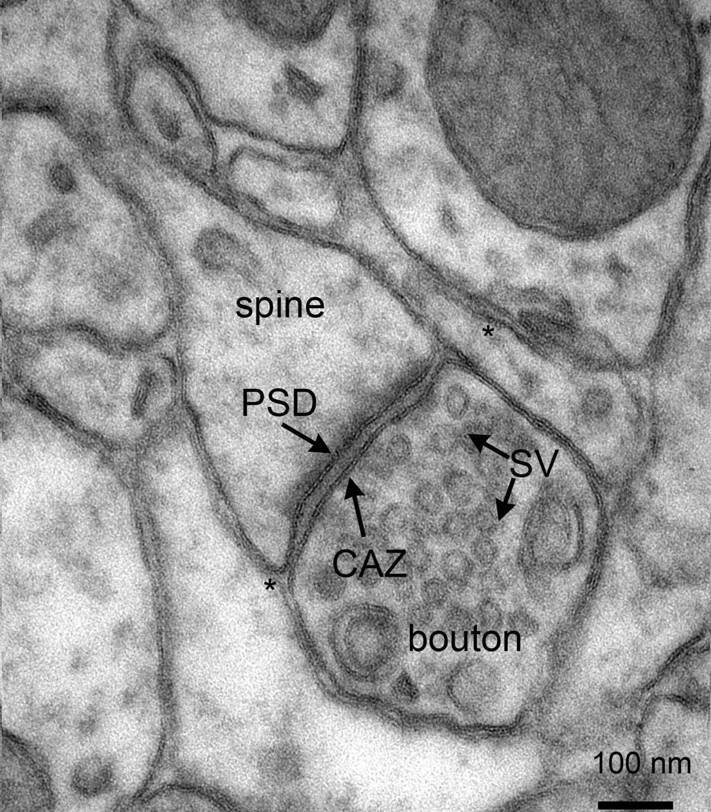
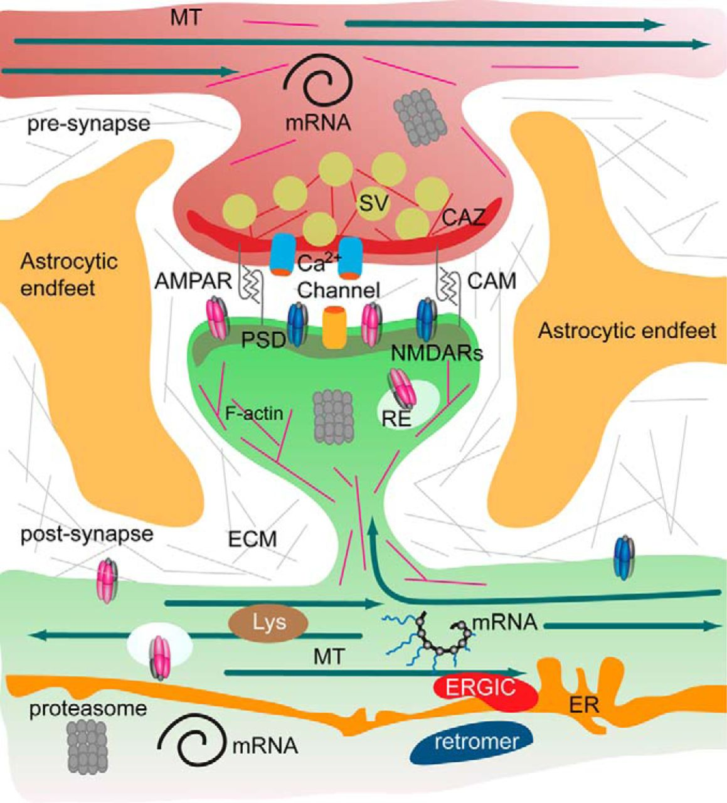

# Neurotransmission

Neurotransmission (Latin: transmissio "passage, crossing" from transmittere "send, let through") is the process by which signaling molecules called neurotransmitters are released by the axon terminal of a neuron (the presynaptic neuron), and bind to and react with the receptors on the dendrites of another neuron (the postsynaptic neuron) a short distance away. 

Neurotransmission is regulated by several different factors: the availability and rate-of-synthesis of the neurotransmitter, the release of that neurotransmitter, the baseline activity of the postsynaptic cell, the number of available postsynaptic receptors for the neurotransmitter to bind to, and the subsequent removal or deactivation of the neurotransmitter by enzymes or presynaptic reuptake.

In response to a threshold action potential or graded electrical potential, a neurotransmitter is released at the presynaptic terminal. The released neurotransmitter may then move across the synaptic cleft to bind to receptors in the postsynaptic neuron. Binding of neurotransmitters may influence the postsynaptic neuron in either an inhibitory or excitatory way. The binding of neurotransmitters to receptors in the postsynaptic neuron can trigger either short term changes, such as changes in the membrane potential called postsynaptic potentials, or longer term changes by the activation of signaling cascades.

Neurons form complex biological neural networks through which nerve impulses (action potentials) travel. Neurons do not touch each other (except in the case of an electrical synapse through a gap junction); instead, neurons interact at close contact points called synapses. When the nerve impulse arrives at the synapse, it may cause the release of neurotransmitters, which influence another (postsynaptic) neuron. The postsynaptic neuron may receive inputs from many additional neurons, both excitatory and inhibitory. The excitatory and inhibitory influences are summed, and if the net effect is inhibitory, the neuron will be less likely to "fire" (i.e., generate an action potential), and if the net effect is excitatory, the neuron will be more likely to fire. How likely a neuron is to fire depends on how far its membrane potential is from the threshold potential, the voltage at which an action potential is triggered because enough voltage-dependent sodium channels are activated so that the net inward sodium current exceeds all outward currents. Excitatory inputs bring a neuron closer to threshold, while inhibitory inputs bring the neuron farther from threshold. An action potential is an "all-or-none" event; neurons whose membranes have not reached threshold will not fire, while those that do must fire. Once the action potential is initiated (traditionally at the axon hillock), it will propagate along the axon, leading to release of neurotransmitters at the synaptic bouton to pass along information to yet another adjacent neuron.

Stages in neurotransmission at the synapse

* Synthesis of the neurotransmitter. This can take place in the cell body, in the axon, or in the axon terminal.
* Storage of the neurotransmitter in storage granules or vesicles in the axon terminal.
* Calcium enters the axon terminal during an action potential, causing release of the neurotransmitter into the synaptic cleft.
* After its release, the transmitter binds to and activates a receptor in the postsynaptic membrane.
* Deactivation of the neurotransmitter. The neurotransmitter is either destroyed enzymatically, or taken back into the terminal from which it came, where it can be reused, or degraded and removed.

## The Synapse 

In the nervous system, a synapse is a structure that permits a neuron (or nerve cell) to pass an electrical or chemical signal to another neuron or to the target effector cell.

Santiago Ramón y Cajal proposed that neurons are not continuous throughout the body, yet still communicate with each other, an idea known as the neuron doctrine. The word "synapse" – from the Greek synapsis (συνάψις), meaning "conjunction", in turn from συνάπτεὶν (συν ("together") and ἅπτειν ("to fasten")) – was introduced in 1897 by the English neurophysiologist [Charles Sherrington](https://en.wikipedia.org/wiki/Charles_Scott_Sherrington) in Michael Foster's Textbook of Physiology. Sherrington struggled to find a good term that emphasized a union between two separate elements, and the actual term "synapse" was suggested by the English classical scholar Arthur Woollgar Verrall, a friend of Foster. Some authors generalize the concept of the synapse to include the communication from a neuron to any other cell type, such as to a motor cell, although such non-neuronal contacts may be referred to as junctions (a historically older term).A landmark electronmicroscopy study by [Sanford Palay](https://en.wikipedia.org/wiki/Sanford_Palay) demonstrated the existence of synapses. Palay examined thin sections of the abducens nucleus, and on the surfaces of dendrites and cell bodies he encountered clublike profiles that were filled with mitochondria and contained vesicles that were concentrated close to the presynaptic membrane. He also noticed that the pre- and postsynaptic membranes were thickened and appeared denser, and most importantly although these membranes appeared to adhere together, they were in fact separated by a thin intercellular space, the synaptic cleft. This observation directly confirmed Cajal’s idea about the synaptic junctions between nerve cells.

Synapses are essential to neuronal function: neurons are cells that are specialized to pass signals to individual target cells, and synapses are the means by which they do so. At a synapse, the plasma membrane of the signal-passing neuron (the presynaptic neuron) comes into close apposition with the membrane of the target (postsynaptic) cell. Both the presynaptic and postsynaptic sites contain extensive arrays of molecular machinery that link the two membranes together and carry out the signaling process. In many synapses, the presynaptic part is located on an axon and the postsynaptic part is located on a dendrite or soma. Astrocytes also exchange information with the synaptic neurons, responding to synaptic activity and, in turn, regulating neurotransmission. Synapses (at least chemical synapses) are stabilized in position by synaptic adhesion molecules (SAMs) projecting from both the pre- and post-synaptic neuron and sticking together where they overlap; SAMs may also assist in the generation and functioning of synapses.

(ref:electron) Electron micrograph of rat cortex showing multiple pre- and postsynaptic structures, as well as astrocytic endfeet (\*) in close contact with synapses. Note the presence of numerous synaptic vesicles in the presynaptic boutons. CAZ, cytomatrix at the active zone; PSD, postsynaptic density; SV, synaptic vesicles. Scalebar: 100 nm. From [Proteomics of the Synapse – A Quantitative Approach to Neuronal Plasticity Daniela C. Dieterich, Michael R. Kreutz Molecular & Cellular Proteomics February 1, 2016, First published on August 25, 2015, 15 (2) 368-381; DOI: 10.1074/mcp.R115.051482]( https://doi.org/10.1074/mcp.R115.051482)

```{r electronsynapse, fig.cap='(ref:electron)', echo=FALSE, message=FALSE, warning=FALSE}

```

There are two fundamentally different types of synapses:

* In a chemical synapse, electrical activity in the presynaptic neuron is converted (via the activation of voltage-gated calcium channels) into the release of a chemical called a neurotransmitter that binds to receptors located in the plasma membrane of the postsynaptic cell. The neurotransmitter may initiate an electrical response or a secondary messenger pathway that may either excite or inhibit the postsynaptic neuron. Chemical synapses can be classified according to the neurotransmitter released: glutamatergic (often excitatory), GABAergic (often inhibitory), cholinergic (e.g. vertebrate neuromuscular junction), and adrenergic (releasing norepinephrine). Because of the complexity of receptor signal transduction, chemical synapses can have complex effects on the postsynaptic cell.
* In an electrical synapse, the presynaptic and postsynaptic cell membranes are connected by special channels called gap junctions that are capable of passing an electric current, causing voltage changes in the presynaptic cell to induce voltage changes in the postsynaptic cell. The main advantage of an electrical synapse is the rapid transfer of signals from one cell to the next.

An autapse is a chemical or electrical synapse that forms when the axon of one neuron synapses onto dendrites of the same neuron.

Synapses can be classified by the type of cellular structures serving as the pre- and post-synaptic components. The vast majority of synapses in the mammalian nervous system are classical axo-dendritic synapses (axon synapsing upon a dendrite), however, a variety of other arrangements exist. These include but are not limited to axo-axonic, dendro-dendritic, axo-secretory, somato-dendritic, dendro-somatic, and somato-somatic synapses.

The axon can synapse onto a dendrite, onto a cell body, or onto another axon or axon terminal, as well as into the bloodstream or diffusely into the adjacent nervous tissue.

The postsynaptic density (PSD) is a protein dense specialization attached to the postsynaptic membrane. PSDs were originally identified by electron microscopy as an electron-dense region at the membrane of a postsynaptic neuron. The PSD is in close apposition to the presynaptic active zone and ensures that receptors are in close proximity to presynaptic neurotransmitter release sites. PSDs vary in size and composition among brain regions and have been studied in great detail at glutamatergic synapses. Hundreds of proteins have been identified in the postsynaptic density including glutamate receptors, scaffold proteins, and many signaling molecules.

PSDs are sized on the order of 250 to 500 nanometres in diameter and 25 to 50 nanometres in thickness, depending on the activity state of the synapse. During synaptic plasticity, the total size of the PSD is increasing along with an increase in synaptic size and strength after inducing long-term potentiation at single synapses.

Many proteins in the PSD are involved in the regulation of synaptic function. Key among these, are postsynaptic density-95 (PSD95), neuroligin (a cellular adhesion molecule), NMDA receptors, AMPA receptors, calcium/calmodulin-dependent protein kinase II and actin. As protein detection technologies have increased in sensitivity, such as with improvements in mass spectrometry techniques, many more proteins have been found to be part of the PSD. Current estimates are that several hundred proteins are found at PSDs in different brain regions and during different states of development and synaptic activity. PSDs also contain cell adhesion molecules and a diverse set of other signaling proteins. Many of the PSD proteins contain PDZ domains.

The PSD has been proposed to concentrate and organize neurotransmitter receptors in the synaptic cleft. The PSD also serves as a signaling apparatus. For instance kinases and phosphatases in the PSD are activated and released from the PSD to change the activity of proteins located in the spine or are transported to the nucleus to affect protein synthesis. Some of the features of the PSD are similar to the neuromuscular junction and other cellular junctions, as the PSD has been modeled as a specialized cellular junction that allows for rapid, asymmetrical signaling.

(ref:synapse) The tetrapartite synapse of principal neurons in the forebrain, consisting of the pre- and postsynaptic compartment, astrocytic endfeet, and the extracellular matrix has a tightly regulated protein composition. A microsceretory system is present in synapses and dendrites that allows for translation of mRNA, local synthesis of, processing and insertion of transmembrane proteins. Hence the turnover of the synaptic protein machinery is controlled by local and somatic de novo protein synthesis, protein degradation by the ubiquitin proteasome system, lysosomes and autophagosomes. In addition, the association of proteins with pre- and postsynaptic compartments is highly dynamic. Molecular machineries and organelles for proteostasis are shared between synapses in dendritic segments. Proteins are transported in and out of the synapse as well as by diffusion of transmembrane proteins. These processes govern the activity-dependent assembly of the pre- and postsynaptic scaffold and the synaptic surface expression of receptors, calcium channels and cell adhesion molecules. Abbreviations: CAM, cell adhesion molecules; CAZ, cytomatrix at the active zone; ECM, extracellular matrix; ER, endoplasmatic reticulum; ERGIC, endoplasmatic reticulum Golgi intermediate compartment; MT, microtubules; PSD, postsynaptic density; RE, recycling endosomes; Lys, lysomes; SV, synaptic vesicle. From [Proteomics of the Synapse – A Quantitative Approach to Neuronal Plasticity Daniela C. Dieterich, Michael R. Kreutz Molecular & Cellular Proteomics February 1, 2016, First published on August 25, 2015, 15 (2) 368-381; DOI: 10.1074/mcp.R115.051482]( https://doi.org/10.1074/mcp.R115.051482)

```{r synapsediagram, fig.cap='(ref:synapse)', echo=FALSE, message=FALSE, warning=FALSE}

```


The adult human brain is estimated to contain from 10^14^ to 5 × 10^14^ (100–500 trillion) synapses. Every cubic millimeter of cerebral cortex contains roughly a billion (10^9^) of them. The number of synapses in the human cerebral cortex has separately been estimated at 0.15 quadrillion (150 trillion)

It is widely accepted that the synapse plays a role in the formation of memory. As neurotransmitters activate receptors across the synaptic cleft, the connection between the two neurons is strengthened when both neurons are active at the same time, as a result of the receptor's signaling mechanisms. The strength of two connected neural pathways is thought to result in the storage of information, resulting in memory. This process of synaptic strengthening is known as long-term potentiation.

Synaptic transmission can be changed by previous activity. These changes are called synaptic plasticity and may result in either a decrease in the efficacy of the synapse, called depression, or an increase in efficacy, called potentiation. These changes can either be long-term or short-term. Forms of short-term plasticity include synaptic fatigue or depression and synaptic augmentation. Forms of long-term plasticity include long-term depression and long-term potentiation. Synaptic plasticity can be either homosynaptic (occurring at a single synapse) or heterosynaptic (occurring at multiple synapses).

By altering the release of neurotransmitters, the plasticity of synapses can be controlled in the presynaptic cell. The postsynaptic cell can be regulated by altering the function and number of its receptors. Changes in postsynaptic signaling are most commonly associated with a N-methyl-D-aspartic acid receptor (NMDAR)-dependent long-term potentiation (LTP) and long-term depression (LTD) due to the influx of calcium into the post-synaptic cell, which are the most analyzed forms of plasticity at excitatory synapses.

A neurotransmitter can influence the function of a neuron through a remarkable number of mechanisms. In its direct actions in influencing a neuron's electrical excitability, however, a neurotransmitter acts in only one of two ways: excitatory or inhibitory. A neurotransmitter influences trans-membrane ion flow either to increase (excitatory) or to decrease (inhibitory) the probability that the cell with which it comes in contact will produce an action potential. Thus, despite the wide variety of synapses, they all convey messages of only these two types, and they are labeled as such. Type I synapses are excitatory in their actions, whereas type II synapses are inhibitory. Each type has a different appearance and is located on different parts of the neurons under its influence.

Type I (excitatory) synapses are typically located on the shafts or the spines of dendrites, whereas type II (inhibitory) synapses are typically located on a cell body. In addition, Type I synapses have round synaptic vesicles, whereas the vesicles of type II synapses are flattened. The material on the presynaptic and post-synaptic membranes is denser in a Type I synapse than it is in a type II, and the type I synaptic cleft is wider. Finally, the active zone on a Type I synapse is larger than that on a Type II synapse.

The different locations of type I and type II synapses divide a neuron into two zones: an excitatory dendritic tree and an inhibitory cell body. From an inhibitory perspective, excitation comes in over the dendrites and spreads to the axon hillock to trigger an action potential. If the message is to be stopped, it is best stopped by applying inhibition on the cell body, close to the axon hillock where the action potential originates. 

Here is a summary of the sequence of events that take place in synaptic transmission from a presynaptic neuron to a postsynaptic cell. Each step is explained in more detail below. Note that with the exception of the final step, the entire process may run only a few hundred microseconds, in the fastest synapses.

* The process begins with an action potential traveling along the membrane of the presynaptic cell, until it reaches the synapse.
* The electrical depolarization of the membrane at the synapse causes channels to open that are permeable to calcium ions.
* Calcium ions flow through the presynaptic membrane, rapidly increasing the calcium concentration in the interior.
* The high calcium concentration activates a set of calcium-sensitive proteins attached to vesicles that contain a neurotransmitter chemical.
* These proteins change shape, causing the membranes of some "docked" vesicles to fuse with the membrane of the presynaptic cell, thereby opening the vesicles and dumping their neurotransmitter contents into the synaptic cleft, the narrow space between the membranes of the pre- and postsynaptic cells.
* The neurotransmitter diffuses within the cleft. Some of it escapes, but some of it binds to chemical receptor molecules located on the membrane of the postsynaptic cell.
* The binding of neurotransmitter causes the receptor molecule to be activated. 
* Due to thermal vibration, the motion of atoms, vibrating about their equilibrium positions in a crystalline solid, neurotransmitter molecules eventually break loose from the receptors and drift away.
* The neurotransmitter is either reabsorbed by the presynaptic cell, and then repackaged for future release, or else it is broken down metabolically.

In general, if an excitatory synapse is strong enough, an action potential in the presynaptic neuron will trigger an action potential in the postsynaptic cell. In many cases the excitatory postsynaptic potential (EPSP) will not reach the threshold for eliciting an action potential. When action potentials from multiple presynaptic neurons fire simultaneously, or if a single presynaptic neuron fires at a high enough frequency, the EPSPs can overlap and summate. If enough EPSPs overlap, the summated EPSP can reach the threshold for initiating an action potential. This process is known as summation.

On the other hand, a presynaptic neuron releasing an inhibitory neurotransmitter, such as GABA, can cause an inhibitory postsynaptic potential (IPSP) in the postsynaptic neuron, moving the membrane potential farther away from the threshold, decreasing its excitability and making it more difficult for the neuron to initiate an action potential. If an IPSP overlaps with an EPSP, the IPSP can in many cases prevent the neuron from firing an action potential. In this way, the output of a neuron may depend on the input of many different neurons, each of which may have a different degree of influence, depending on the strength and type of synapse with that neuron. [John Carew Eccles](https://en.wikipedia.org/wiki/John_Eccles_(neurophysiologist)) performed some of the important early experiments on synaptic integration, for which he received the Nobel Prize for Physiology or Medicine in 1963.

Understanding the effects of drugs on neurotransmitters comprises a significant portion of research initiatives in the field of neuroscience. Most neuroscientists involved in this field of research believe that such efforts may further advance our understanding of the circuits responsible for various neurological diseases and disorders, as well as ways to effectively treat and someday possibly prevent or cure such illnesses.

## Neurotransmitters

Neurotransmitters are endogenous chemicals that enable neurotransmission. It is a type of chemical messenger which transmits signals across a chemical synapse, such as a neuromuscular junction, from one neuron (nerve cell) to another "target" neuron, muscle cell, or gland cell. Neurotransmitters are released from synaptic vesicles in synapses into the synaptic cleft, where they are received by neurotransmitter receptors on the target cells. Many neurotransmitters are synthesized from simple and plentiful precursors such as amino acids, which are readily available from the diet and only require a small number of biosynthetic steps for conversion. Neurotransmitters play a major role in shaping everyday life and functions. Their exact numbers are unknown, but more than 200 unique chemical messengers have been identified.

Neurotransmitters are stored in synaptic vesicles, clustered close to the cell membrane at the axon terminal of the presynaptic neuron. Neurotransmitters are released into and diffuse across the synaptic cleft, where they bind to specific receptors on the membrane of the postsynaptic neuron.

Neurotransmitter action is terminated in three different ways:

* Diffusion – the neurotransmitter detaches from receptor, drifting out of the synaptic cleft, here it becomes absorbed by glial cells.
* Enzyme degradation – special chemicals called enzymes break it down. Usually, astrocytes absorb the excess neurotransmitters and pass them on to enzymes or pump them directly into the presynaptic neuron.
* Reuptake – re-absorption of a neurotransmitter into the neuron. Transporters, or membrane transport proteins, pump neurotransmitters from the synaptic cleft back into axon terminals (the presynaptic neuron) where they are stored.

For example, choline is taken up and recycled by the pre-synaptic neuron to synthesize more ACh. Other neurotransmitters such as dopamine are able to diffuse away from their targeted synaptic junctions and are eliminated from the body via the kidneys, or destroyed in the liver. Each neurotransmitter has very specific degradation pathways at regulatory points, which may be targeted by the body's regulatory system or by recreational drugs.

Until the early 20th century, scientists assumed that the majority of synaptic communication in the brain was electrical. But in 1921 German pharmacologist [Otto Loewi](https://en.wikipedia.org/wiki/Otto_Loewi) (1873–1961) demonstrated that neurons can communicate by releasing chemicals. Some neurons do, however, communicate via electrical synapses through the use of gap junctions, which allow specific ions to pass directly from one cell to another.

There are four classical criteria for identifying neurotransmitters:

1. The chemical must be synthesized in the neuron or otherwise be present in it.
1. When the neuron is active, the chemical must be released and produce a response in some target.
1. The same response must be obtained when the chemical is experimentally placed on the target.
1. A mechanism must exist for removing the chemical from its site of activation after its work is done.

The anatomical localization of neurotransmitters is typically determined using immunocytochemical techniques, which identify the location of either the transmitter substances themselves, or of the enzymes that are involved in their synthesis. Immunocytochemical techniques have also revealed that many transmitters, particularly the neuropeptides, are co-localized, that is, one neuron may release more than one transmitter from its synaptic terminal. Various techniques have been used to identify neurotransmitters throughout the central nervous system.

There are many different ways to classify neurotransmitters. Dividing them into amino acids, peptides, and monoamines is sufficient for some classification purposes.

Major neurotransmitters:

* Amino acids: glutamate, aspartate, D-serine, γ-aminobutyric acid (GABA), glycine
* Gasotransmitters: nitric oxide (NO), carbon monoxide (CO), hydrogen sulfide (H~2~S)
* Monoamines: dopamine (DA), norepinephrine (noradrenaline; NE, NA), epinephrine (adrenaline), histamine, serotonin (SER, 5-HT)
* Trace amines: phenethylamine, N-methylphenethylamine, tyramine, 3-iodothyronamine, octopamine, tryptamine, etc.
* Peptides: oxytocin, somatostatin, substance P, cocaine and amphetamine regulated transcript, opioid peptides
* Purines: adenosine triphosphate (ATP), adenosine
* Catecholamines: dopamine, norepinephrine (noradrenaline), epinephrine (adrenaline)
* Others: acetylcholine (ACh), anandamide, etc.

In addition, over 50 neuroactive peptides have been found, and new ones are discovered regularly. Many of these are "co-released" along with a small-molecule transmitter. Nevertheless, in some cases a peptide is the primary transmitter at a synapse. β-endorphin is a relatively well-known example of a peptide neurotransmitter because it engages in highly specific interactions with opioid receptors in the central nervous system.

Single ions (such as synaptically released zinc) are also considered neurotransmitters by some, as well as some gaseous molecules such as nitric oxide (NO), carbon monoxide (CO), and hydrogen sulfide (H~2~S).

The most prevalent transmitter is glutamate, which is excitatory at well over 90% of the synapses in the human brain. The next most prevalent is Gamma-Aminobutyric Acid, or GABA, which is inhibitory at more than 90% of the synapses that do not use glutamate. Although other transmitters are used in fewer synapses, they may be very important functionally: the great majority of psychoactive drugs exert their effects by altering the actions of some neurotransmitter systems, often acting through transmitters other than glutamate or GABA. Addictive drugs such as cocaine and amphetamines exert their effects primarily on the dopamine system. The addictive opiate drugs exert their effects primarily as functional analogs of opioid peptides, which, in turn, regulate dopamine levels.

### Modulatory Neurotransmitter Systems 

Neurons expressing certain types of neurotransmitters sometimes form distinct systems, where activation of the system acts in a modulatory fashion on a large number of neurons in large volumes of the brain. Such modulatory neurotransmitter systems include the noradrenaline (norepinephrine) system, the dopamine system, the serotonin system, and the cholinergic system, among others. Neuromodulatory neurotransmitters typically bind to metabotropic, G-protein coupled receptors to initiate a second messenger signaling cascade that induces a broad, long-lasting signal. This modulation can last for hundreds of milliseconds to several minutes. Some of the effects of neuromodulators include: altering the intrinsic firing activity, increasing or decreasing voltage-dependent currents, changing synaptic efficacy, increasing bursting activity and reconfiguring of synaptic connectivity.

```{r modulators, out.width='75%', echo=FALSE, message=FALSE, warning=FALSE}
library(tidyverse)
library(printr)        
library(kableExtra)

setwd("~/Dropbox/R/neuroanatomy-text-master")

comparison <-  as_tibble(read.csv("data/modulators.csv"))

knitr::kable(comparison, col.names = c("System", "Origin", "Targets", "Effects"), digits = 2, align = 'llll', longtable = TRUE, booktabs = TRUE, caption = "Major modulatory neurotransmitter systems") %>% kable_styling(latex_options = c("striped", "scale_down", "hold_position")) %>% column_spec(1, width = "5em") %>% column_spec(2, width = "15em") %>% column_spec(3, width = "10em") %>% column_spec(4, width = "15em") %>% collapse_rows(columns = 1:2, latex_hline = "major", valign = "middle") 
```

## Neurotransmitter Receptors

There are two major types of neurotransmitter receptors: ionotropic and metabotropic. Ionotropic means that ions can pass through the receptor, whereas metabotropic means that a second messenger inside the cell relays the message (i.e. metabotropic receptors do not have channels). Metabotropic receptors are G-protein-coupled receptors (GPCRs). Ionotropic receptors are also called ligand-gated ion channels. Conversely, GPCRs are neither excitatory nor inhibitory. Rather, they can have a broad number of functions such as modulating the actions of excitatory and inhibitory ion channels or triggering a signalling cascade that releases calcium from stores inside the cell.

### Ionotropic Receptors: Neurotransmitter-Gated Ion Channels

Ligand-gated ion channels (LGICs) are one type of ionotropic receptor or channel-linked receptor. They are a group of transmembrane ion channels that are opened or closed in response to the binding of a chemical messenger (i.e., a ligand), such as a neurotransmitter.

The binding site of endogenous ligands on LGICs protein complexes are normally located on a different portion of the protein (an allosteric binding site) compared to where the ion conduction pore is located. The direct link between ligand binding and opening or closing of the ion channel, which is characteristic of ligand-gated ion channels, is contrasted with the indirect function of metabotropic receptors, which use second messengers. LGICs are also different from voltage-gated ion channels (which open and close depending on membrane potential), and stretch-activated ion channels (which open and close depending on mechanical deformation of the cell membrane).

### Metabotropic Receptors: G-Protein Coupled Receptors

GPCRs also known as seven-transmembrane domain receptors, 7TM receptors, heptahelical receptors, serpentine receptor comprise a large protein family of transmembrane receptors that sense molecules outside the cell and activate intracellular signal transduction pathways. GPCRs are found only in eukaryotes. The ligands that bind and activate these receptors include light-sensitive compounds, odors, pheromones, hormones, and neurotransmitters, and vary in size from small molecules to peptides to large proteins. G protein-coupled receptors are involved in many diseases, and are also the target of approximately 30% of all modern medicinal drugs.

There are two principal signal transduction pathways involving the G protein-coupled receptors: the cAMP signal pathway and the phosphatidylinositol signal pathway. When a ligand binds to the GPCR it causes a conformational change in the GPCR, which allows it to act as a guanine nucleotide exchange factor (GEF). The GPCR can then activate an associated G-protein by exchanging its bound GDP for a GTP. The G-protein's α subunit, together with the bound GTP, can then dissociate from the β and γ subunits to further affect intracellular signaling proteins or target functional proteins directly depending on the α subunit type (G~αs~, G~αi/o~, G~αq/11~, G~α12/13~).

Neurotransmitter receptors are present on both postsynaptic neurons and presynaptic neurons with the former being used to receive neurotransmitters and the latter for the purpose of preventing further release of a given neurotransmitter. In addition to being found in neuron cells, neurotransmitter receptors are also found in various immune and muscle tissues. Many neurotransmitter receptors are categorized as a serpentine receptor or G protein-coupled receptor because they span the cell membrane not once, but seven times. Neurotransmitter receptors are known to become unresponsive to the type of neurotransmitter they receive when exposed for extended periods of time. This phenomenon is known as ligand-induced desensitization or downregulation.

The following are some major classes of neurotransmitter receptors:

* Adrenergic: α1A, α1b, α1c, α1d, α2a, α2b, α2c, α2d, β1, β2, β3
* Dopaminergic: D1, D2, D3, D4, D5
* GABAergic: GABA~A~, GABA~B1a~, GABA~B1δ~, GABA~B2~, GABA~C~
* Glutamatergic: NMDA, AMPA, kainate, mGluR1, mGluR2, mGluR3, mGluR4, mGluR5, mGluR6, mGluR7
* Histaminergic: H1, H2, H3
* Cholinergic: Muscarinic: M1, M2, M3, M4, M5; Nicotinic: muscle, neuronal (α-bungarotoxin-insensitive), neuronal (α-bungarotoxin-sensitive)
* Opioid: μ, δ1, δ2, κ
* Serotonergic: 5-HT1A, 5-HT1B, 5-HT1D, 5-HT1E, 5-HT1F, 5-HT2A, 5-HT2B, 5-HT2C, 5-HT3, 5-HT4, 5-HT5, 5-HT6, 5-HT7
* Glycinergic: Glycine

Drugs can influence behavior by altering neurotransmitter activity. For instance, drugs can decrease the rate of synthesis of neurotransmitters by affecting the synthetic enzyme(s) for that neurotransmitter. When neurotransmitter synthesis is blocked, the amount of neurotransmitters available for release becomes substantially lower, resulting in a decrease in neurotransmitter activity. Some drugs block or stimulate the release of specific neurotransmitters. Alternatively, drugs can prevent neurotransmitter storage in synaptic vesicles by causing the synaptic vesicle membranes to leak. Drugs that prevent a neurotransmitter from binding to its receptor are called receptor antagonists. For example, drugs used to treat patients with schizophrenia such as haloperidol, chlorpromazine, and clozapine are antagonists at receptors in the brain for dopamine. Other drugs act by binding to a receptor and mimicking the normal neurotransmitter. Such drugs are called receptor agonists. An example of a receptor agonist is morphine, an opiate that mimics effects of the endogenous neurotransmitter β-endorphin to relieve pain. Other drugs interfere with the deactivation of a neurotransmitter after it has been released, thereby prolonging the action of a neurotransmitter. This can be accomplished by blocking re-uptake or inhibiting degradative enzymes. Lastly, drugs can also prevent an action potential from occurring, blocking neuronal activity throughout the central and peripheral nervous system. 

Competitive antagonists bind to receptors at the same binding site (active site) as the endogenous ligand or agonist, but without activating the receptor. Agonists and antagonists "compete" for the same binding site on the receptor. Once bound, an antagonist will block agonist binding. Sufficient concentrations of an antagonist will displace the agonist from the binding sites, resulting in a lower frequency of receptor activation. The level of activity of the receptor will be determined by the relative affinity of each molecule for the site and their relative concentrations. High concentrations of a competitive agonist will increase the proportion of receptors that the agonist occupies, higher concentrations of the antagonist will be required to obtain the same degree of binding site occupancy. In functional assays using competitive antagonists, a parallel rightward shift of agonist dose–response curves with no alteration of the maximal response is observed.

Competitive antagonists are used to prevent the activity of drugs, and to reverse the effects of drugs that have already been consumed. Naloxone (also known as Narcan) is used to reverse opioid overdose caused by drugs such as heroin or morphine.

Competitive antagonists are sub-classified as reversible or irreversible competitive antagonists, depending on how they interact with their receptor protein targets. Reversible antagonists, which bind via noncovalent intermolecular forces, will eventually dissociate from the receptor, freeing the receptor to be bound again. Irreversible antagonists bind via covalent intermolecular forces. Because there is not enough free energy to break covalent bonds in the local environment, the bond is essentially "permanent", meaning the receptor-antagonist complex will never dissociate. The receptor will thereby remain permanently antagonized until it is ubiquitinated and thus destroyed.

A non-competitive antagonist may act in one of two ways: by binding to an allosteric site of the receptor, or by irreversibly binding to the active site of the receptor. The former meaning has been standardised by the IUPHAR, and is equivalent to the antagonist being called an allosteric antagonist. While the mechanism of antagonism is different in both of these phenomena, they are both called "non-competitive" because the end-results of each are functionally very similar. Unlike competitive antagonists, which affect the amount of agonist necessary to achieve a maximal response but do not affect the magnitude of that maximal response, non-competitive antagonists reduce the magnitude of the maximum response that can be attained by any amount of agonist. This property earns them the name "non-competitive" because their effects cannot be negated, no matter how much agonist is present.

Uncompetitive antagonists differ from non-competitive antagonists in that they require receptor activation by an agonist before they can bind to a separate allosteric binding site. This type of antagonism produces a kinetic profile in which "the same amount of antagonist blocks higher concentrations of agonist better than lower concentrations of agonist".
