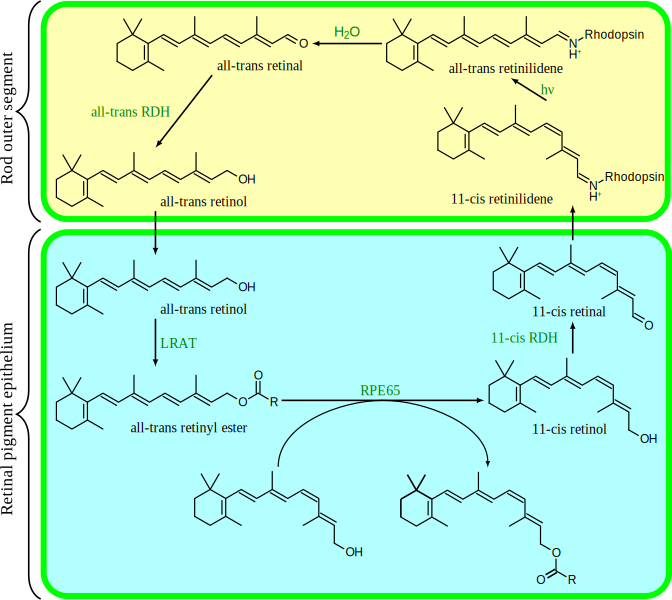
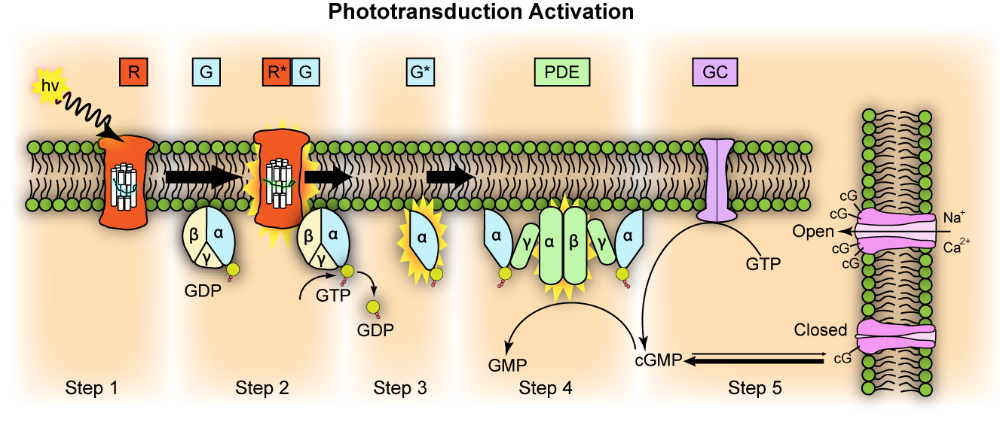

# The Visual System

Visual perception is the ability to interpret the surrounding environment using light in the visible spectrum reflected by the objects in the environment. This is different from visual acuity, which refers to how clearly a person sees (for example "20/20 vision"). A person can have problems with visual perceptual processing even if they have 20/20 vision.

The resulting perception is also known as visual perception, eyesight, sight, or vision (adjectival form: visual, optical, or ocular). The various physiological components involved in vision are referred to collectively as the visual system, and are the focus of much research in linguistics, psychology, cognitive science, neuroscience, and molecular biology, collectively referred to as vision science.

Different species are able to see different parts of the light spectrum; for example, bees can see into the ultraviolet, while pit vipers can accurately target prey with their pit organs, which are sensitive to infrared radiation. The mantis shrimp possesses arguably the most complex visual system in any species. The eye of the mantis shrimp holds 16 color receptive cones, whereas humans only have three. The variety of cones enables them to perceive an enhanced array of colors as a mechanism for mate selection, avoidance of predators, and detection of prey. Swordfish also possess an impressive visual system. The eye of a swordfish can generate heat to better cope with detecting their prey at depths of 2000 feet. Certain one-celled micro-organisms, the warnowiid dinoflagellates have eye-like ocelloids, with analogous structures for the lens and retina of the multi-cellular eye. The armored shell of the chiton Acanthopleura granulata is also covered with hundreds of aragonite crystalline eyes, named ocelli, which can form images.

Many fan worms, such as *Acromegalomma interruptum* which live in tubes on the sea floor of the Great Barrier Reef, have evolved compound eyes on their tentacles, which they use to detect encroaching movement. If movement is detected the fan worms will rapidly withdraw their tentacles. Bok, et al, have discovered opsins and G proteins in the fan worm's eyes, which were previously only seen in simple ciliary photoreceptors in the brains of some invertebrates, as opposed to the rhabdomeric receptors in the eyes of most invertebrates.

Only higher primate Old World (African) monkeys and apes (macaques, apes, orangutans) have the same kind of three-cone photoreceptor color vision humans have, while lower primate New World (South American) monkeys (spider monkeys, squirrel monkeys, cebus monkeys) have a two-cone photoreceptor kind of color vision.

## The Eye

Light entering the eye is refracted as it passes through the cornea. It then passes through the pupil (controlled by the iris) and is further refracted by the lens. The cornea and lens act together as a compound lens to project an inverted image onto the retina.

## The Retina

The retina is the innermost, light-sensitive layer of tissue of the eye of most vertebrates and some molluscs. The optics of the eye create a focused two-dimensional image of the visual world on the retina, which translates that image into electrical neural impulses to the brain to create visual perception, the retina serving a function analogous to that of the film or image sensor in a camera.

The neural retina consists of several layers of neurons interconnected by synapses, and is supported by an outer layer of pigmented epithelial cells. The primary light-sensing cells in the retina are the photoreceptor cells, which are of two types: rods and cones. Rods function mainly in dim light and provide black-and-white vision. Cones function in well-lit conditions and are responsible for the perception of colour, as well as high-acuity vision used for tasks such as reading. A third type of light-sensing cell, the photosensitive ganglion cell, is important for entrainment of circadian rhythms and reflexive responses such as the pupillary light reflex.

Light striking the retina initiates a cascade of chemical and electrical events that ultimately trigger nerve impulses that are sent to various visual centres of the brain through the fibres of the optic nerve. Neural signals from the rods and cones undergo processing by other neurons, whose output takes the form of action potentials in retinal ganglion cells whose axons form the optic nerve. Several important features of visual perception can be traced to the retinal encoding and processing of light.

In vertebrate embryonic development, the retina and the optic nerve originate as outgrowths of the developing brain, specifically the embryonic diencephalon; thus, the retina is considered part of the central nervous system (CNS) and is actually brain tissue. It is the only part of the CNS that can be visualized non-invasively.

The vertebrate retina has ten distinct layers. From closest to farthest from the vitreous body:

* Inner limiting membrane – basement membrane elaborated by Müller cells.
* Nerve fibre layer – axons of the ganglion cell bodies (note that a thin layer of Müller cell footplates exists between this layer and the inner limiting membrane).
* Ganglion cell layer – contains nuclei of ganglion cells, the axons of which become the optic nerve fibres, and some displaced amacrine cells.
* Inner plexiform layer – contains the synapse between the bipolar cell axons and the dendrites of the ganglion and amacrine cells.
* Inner nuclear layer – contains the nuclei and surrounding cell bodies (perikarya) of the amacrine cells, bipolar cells, and horizontal cells.
* Outer plexiform layer – projections of rods and cones ending in the rod spherule and cone pedicle, respectively. These make synapses with dendrites of bipolar cells and horizontal cells. In the macular region, this is known as the Fiber layer of Henle.
* Outer nuclear layer – cell bodies of rods and cones.
* External limiting membrane – layer that separates the inner segment portions of the photoreceptors from their cell nuclei.
* Inner segment / outer segment layer – inner segments and outer segments of rods and cones. The outer segments contain a highly specialized light-sensing apparatus.
* Retinal pigment epithelium – single layer of cuboidal epithelial cells (with extrusions not shown in diagram). This layer is closest to the choroid, and provides nourishment and supportive functions to the neural retina, The black pigment melanin in the pigment layer prevents light reflection throughout the globe of the eyeball; this is extremely important for clear vision.

These layers can be grouped into 4 main processing stages: photoreception; transmission to bipolar cells; transmission to ganglion cells, which also contain photoreceptors, the photosensitive ganglion cells; and transmission along the optic nerve. At each synaptic stage there are also laterally connecting horizontal and amacrine cells.

(ref:retina) Vertical section of the adult human retina. Carmine and Nissl stain. *A*, Photoreceptor layer. *B*, Cell bodies of the photoreceptors. *C*, Outer plexiform layer. *D*, Internal granule layer. *E*, Internal plexiform layer. *F*, Ganglion cell layer. *G*, Ganglion cell axons. *a*, external limiting membrane. *b*, internal limiting membrane. *c*, Spherical endfeet of the rod photoreceptors. *d*, endfeet of the cones. e. *a*, cone. *f*, a rod *g*, horizontal cells. *h*, amacrine cells. Fig. 188 from [Histologie du système nerveux de l'homme & des vertébrés](https://wellcomelibrary.org/item/b2129592x#?c=0&m=0&s=0&cv=0&z=-0.9137%2C-0.0887%2C2.8274%2C1.7747) (1909) by Santiago Ramón y Cajal translated from Spanish by Dr. L. Azoulay.

```{r retcajal, fig.cap='(ref:retina)', echo=FALSE, message=FALSE, warning=FALSE}
knitr::include_graphics("./figures/visual/retina_cajal.png")
```

The optic nerve is a central tract of many axons of ganglion cells connecting primarily to the lateral geniculate body, a visual relay station in the diencephalon (the rear of the forebrain). It also projects to the superior colliculus, the suprachiasmatic nucleus, and the nucleus of the optic tract. It passes through the other layers, creating the optic disc in primates.

Additional structures, not directly associated with vision, are found as outgrowths of the retina in some vertebrate groups. In birds, the pecten is a vascular structure of complex shape that projects from the retina into the vitreous humour; it supplies oxygen and nutrients to the eye, and may also aid in vision. Reptiles have a similar, but much simpler, structure.

In adult humans, the entire retina is approximately 72% of a sphere about 22 mm in diameter. The entire retina contains about 7 million cones and 75 to 150 million rods. The optic disc, a part of the retina sometimes called "the blind spot" because it lacks photoreceptors, is located at the optic papilla, where the optic-nerve fibres leave the eye. It appears as an oval white area of 3 mm². Temporal (in the direction of the temples) to this disc is the macula, at whose centre is the fovea, a pit that is responsible for our sharp central vision but is actually less sensitive to light because of its lack of rods. Human and non-human primates possess one fovea, as opposed to certain bird species, such as hawks, who are bifoviate, and dogs and cats, who possess no fovea but a central band known as the visual streak. Around the fovea extends the central retina for about 6 mm and then the peripheral retina. The farthest edge of the retina is defined by the ora serrata. The distance from one ora to the other (or macula), the most sensitive area along the horizontal meridian is about 32 mm.

In section, the retina is no more than 0.5 mm thick. It has three layers of nerve cells and two of synapses, including the unique ribbon synapse. The optic nerve carries the ganglion cell axons to the brain, and the blood vessels that supply the retina. The ganglion cells lie innermost in the eye while the photoreceptive cells lie beyond. Because of this counter-intuitive arrangement, light must first pass through and around the ganglion cells and through the thickness of the retina, (including its capillary vessels, not shown) before reaching the rods and cones. Light is absorbed by the retinal pigment epithelium or the choroid (both of which are opaque).

The white blood cells in the capillaries in front of the photoreceptors can be perceived as tiny bright moving dots when looking into blue light. This is known as the blue field entoptic phenomenon (or Scheerer's phenomenon).

Between the ganglion cell layer and the rods and cones there are two layers of neuropils where synaptic contacts are made. The neuropil layers are the outer plexiform layer and the inner plexiform layer. In the outer neuropil layer, the rods and cones connect to the vertically running bipolar cells, and the horizontally oriented horizontal cells connect to ganglion cells.

The central retina predominantly contains cones, while the peripheral retina predominantly contains rods. In total, there are about seven million cones and a hundred million rods. At the centre of the macula is the foveal pit where the cones are narrow and long, and, arranged in a hexagonal mosaic, the most dense, in contradistinction to the much fatter cones located more peripherally in the retina. At the foveal pit the other retinal layers are displaced, before building up along the foveal slope until the rim of the fovea, or parafovea, is reached, which is the thickest portion of the retina. The macula has a yellow pigmentation, from screening pigments, and is known as the macula lutea. The area directly surrounding the fovea has the highest density of rods converging on single bipolar cells. Since its cones have a much lesser convergence of signals, the fovea allows for the sharpest vision the eye can attain.

Though the rod and cones are a mosaic of sorts, transmission from receptors, to bipolars, to ganglion cells is not direct. Since there are about 150 million receptors and only 1 million optic nerve fibres, there must be convergence and thus mixing of signals. Moreover, the horizontal action of the horizontal and amacrine cells can allow one area of the retina to control another (e.g. one stimulus inhibiting another). This inhibition is key to lessening the sum of messages sent to the higher regions of the brain. In some lower vertebrates (e.g. the pigeon), there is a "centrifugal" control of messages – that is, one layer can control another, or higher regions of the brain can drive the retinal nerve cells, but in primates this does not occur.

## The Photoreceptors

A photoreceptor cell is a specialized type of neuroepithelial cell found in the retina that is capable of visual phototransduction. The great biological importance of photoreceptors is that they convert light (visible electromagnetic radiation) into signals that can stimulate biological processes. To be more specific, photoreceptor proteins in the cell absorb photons, triggering a change in the cell's membrane potential.

There are currently three known types of photoreceptor cells in mammalian eyes: rods, cones, and intrinsically photosensitive retinal ganglion cells. The two classic photoreceptor cells are rods and cones, each contributing information used by the visual system to form a representation of the visual world, sight. The rods are narrower than the cones and distributed differently across the retina, but the chemical process in each that supports phototransduction is similar. A third class of mammalian photoreceptor cell was discovered during the 1990s: the intrinsically photosensitive retinal ganglion cells. These cells do not contribute to sight directly, but are thought to support circadian rhythms and pupillary reflex.

There are major functional differences between the rods and cones. Rods are extremely sensitive, and can be triggered by a single photon. At very low light levels, visual experience is based solely on the rod signal.

Cones require significantly brighter light (that is, a larger number of photons) to produce a signal. In humans, there are three different types of cone cell, distinguished by their pattern of response to light of different wavelengths. Color experience is calculated from these three distinct signals, perhaps via an opponent process. This explains why colors cannot be seen at low light levels, when only the rod and not the cone photoreceptor cells are active. The three types of cone cell respond (roughly) to light of short, medium, and long wavelengths, so they may respectively be referred to as S-cones, M-cones, and L-cones. In accordance with the principle of univariance, the firing of the cell depends upon only the number of photons absorbed. The different responses of the three types of cone cells are determined by the likelihoods that their respective photoreceptor proteins will absorb photons of different wavelengths. So, for example, an L cone cell contains a photoreceptor protein that more readily absorbs long wavelengths of light (that is, more "red"). Light of a shorter wavelength can also produce the same response, but it must be much brighter to do so.

The human retina contains about 120 million rod cells, and 6 million cone cells. The number and ratio of rods to cones varies among species, dependent on whether an animal is primarily diurnal or nocturnal. Certain owls, such as the nocturnal tawny owl, have a tremendous number of rods in their retinae. In the human visual system, in addition to the photosensitive rods & cones, there are about 2.4 million to 3 million ganglion cells, with 1 to 2% of them being photosensitive. The axons of ganglion cells form the two optic nerves.

## Visual Phototransduction

Visual phototransduction is the sensory transduction of the visual system. It is a process by which light is converted into electrical signals in the rod cells, cone cells and photosensitive ganglion cells of the retina of the eye. This cycle was elucidated by George Wald (1906–1997) for which he received the Nobel Prize in 1967. It is so called "Wald's Visual Cycle" after him.

The visual cycle is the biological conversion of a photon into an electrical signal in the retina. This process occurs via G-protein coupled receptors called opsins which contain the chromophore 11-cis retinal. 11-cis retinal is covalently linked to the opsin receptor via Schiff base forming retinylidene protein. When struck by a photon, 11-cis retinal undergoes photoisomerization to all-trans retinal which changes the conformation of the opsin GPCR leading to signal transduction cascades which causes closure of cyclic GMP-gated cation channel, and hyperpolarization of the photoreceptor cell.

Following isomerization and release from the opsin protein, all-trans retinal is reduced to all-trans retinol and travels back to the retinal pigment epithelium to be "recharged". It is first esterified by lecithin retinol acyltransferase (LRAT) and then converted to 11-cis retinol by the isomerohydrolase RPE65. The isomerase activity of RPE65 has been shown; it is still uncertain whether it also acts as hydrolase. Finally, it is oxidized to 11-cis retinal before traveling back to the rod outer segment where it is again conjugated to an opsin to form new, functional visual pigment (rhodopsin).

The photoreceptor cells involved in vision are the rods and cones. These cells contain a chromophore (11-cis retinal, the aldehyde of Vitamin A1 and light-absorbing portion) bound to cell membrane protein, opsin. Rods deal with low light level and do not mediate color vision. Cones, on the other hand, can code the color of an image through comparison of the outputs of the three different types of cones. Each cone type responds best to certain wavelengths, or colors, of light because each type has a slightly different opsin. The three types of cones are L-cones, M-cones and S-cones that respond optimally to long wavelengths (reddish color), medium wavelengths (greenish color), and short wavelengths (bluish color) respectively. Humans have a trichromatic visual system consisting of three unique systems, rods, mid and long-wavelength sensitive (red and green) cones and short wavelength sensitive (blue) cones.

The absorption of light leads to an isomeric change in the retinal molecule.
To understand the photoreceptor's behaviour to light intensities, it is necessary to understand the roles of different currents.

(ref:retinal) [The chemical reactions involved in the photoreceptor visual cycle.](https://commons.wikimedia.org/wiki/File:Visual_cycle.svg)

```{r absorption, fig.cap='(ref:retinal)', echo=FALSE, message=FALSE, warning=FALSE}

```

There is an ongoing outward potassium current through nongated K^+^-selective channels. This outward current tends to hyperpolarize the photoreceptor at around -70 mV (the equilibrium potential for K^+^).

There is also an inward sodium current carried by cGMP-gated sodium channels. This so-called 'dark current' depolarizes the cell to around -40 mV. Note that this is significantly more depolarized than most other neurons.

A high density of Na^+^-K^+^ pumps enables the photoreceptor to maintain a steady intracellular concentration of Na^+^ and K^+^.

Photoreceptor cells are unusual cells in that they depolarize in response to absence of stimuli or scotopic conditions (darkness). In photopic conditions (light), photoreceptors hyperpolarize to a potential of -60mV.

In the dark, cGMP levels are high and keep cGMP-gated sodium channels open allowing a steady inward current, called the dark current. This dark current keeps the cell depolarized at about -40 mV, leading to glutamate release which inhibits excitation of neurons.

The depolarization of the cell membrane in scotopic conditions opens voltage-gated calcium channels. An increased intracellular concentration of Ca^2+^ causes vesicles containing glutamate, a neurotransmitter, to merge with the cell membrane, therefore releasing glutamate into the synaptic cleft, an area between the end of one cell and the beginning of another neuron. Glutamate, though usually excitatory, functions here as an inhibitory neurotransmitter.

In the cone pathway glutamate

* Hyperpolarizes on-center bipolar cells. Glutamate that is released from the photoreceptors in the dark binds to metabotropic glutamate receptors (mGluR6), which, through a G-protein coupling mechanism, causes non-specific cation channels in the cells to close, thus hyperpolarizing the bipolar cell.
* Depolarizes off-center bipolar cells. Binding of glutamate to ionotropic glutamate receptors results in an inward cation current that depolarizes the bipolar cell.

In the light

In summary: Light closes cGMP-gated sodium channels, reducing the influx of both Na^+^ and Ca^2+^ ions. Stopping the influx of Na^+^ ions effectively switches off the dark current. Reducing this dark current causes the photoreceptor to hyperpolarise, which reduces glutamate release which thus reduces the inhibition of retinal nerves, leading to excitation of these nerves. This reduced Ca^2+^ influx during phototransduction enables deactivation and recovery from phototransduction.

1. A light photon interacts with the retinal in a photoreceptor cell. The retinal undergoes isomerisation, changing from the 11-cis to all-trans configuration.
1. Opsin therefore undergoes a conformational change to metarhodopsin II.
1. Metarhodopsin II activates a G protein known as transducin. This causes transducin to dissociate from its bound GDP, and bind GTP, then the alpha subunit of transducin dissociates from the beta and gamma subunits, with the GTP still bound to the alpha subunit.
1. The alpha subunit-GTP complex activates phosphodiesterase, also known as PDE6. It binds to one of two regulatory subunits of PDE (which itself is a tetramer) and inhibits its activity.
1. PDE hydrolyzes cGMP, forming GMP. This lowers the intracellular concentration of cGMP and therefore the sodium channels close.
1. Closure of the sodium channels causes hyperpolarization of the cell due to the ongoing efflux of potassium ions.
1. Hyperpolarization of the cell causes voltage-gated calcium channels to close.
1. As the calcium level in the photoreceptor cell drops, the amount of the neurotransmitter glutamate that is released by the cell also drops. This is because calcium is required for the glutamate-containing vesicles to fuse with cell membrane and release their contents (see SNARE proteins).
1. A decrease in the amount of glutamate released by the photoreceptors causes depolarization of on-center bipolar cells (rod and cone On bipolar cells) and hyperpolarization of cone off-center bipolar cells.

(ref:steps) [Representation](https://commons.wikimedia.org/wiki/File:Phototransduction.png) of molecular steps in photoactivation (modified from Leskov et al., 2000). Depicted is an outer membrane disk in a rod. Step 1: Incident photon (hν) is absorbed and activates a rhodopsin by conformational change in the disk membrane to R*. Step 2: Next, R* makes repeated contacts with transducin molecules, catalyzing its activation to G* by the release of bound GDP in exchange for cytoplasmic GTP, which expels its β and γ subunits. Step 3: G* binds inhibitory γ subunits of the phosphodiesterase (PDE) activating its α and β subunits. Step 4: Activated PDE hydrolyzes cGMP. Step 5: Guanylyl cyclase (GC) synthesizes cGMP, the second messenger in the phototransduction cascade. Reduced levels of cytosolic cGMP cause cyclic nucleotide gated channels to close preventing further influx of Na^+^ and Ca^2+^.

```{r molsteps, fig.cap='(ref:steps)', echo=FALSE, message=FALSE, warning=FALSE}

```

Deactivation of the phototransduction cascade

In light, low cGMP levels close Na^+^ and Ca^2+^ channels, reducing intracellular Na^+^ and Ca^2+^. During recovery (dark adaptation), the low Ca^2+^ levels induce recovery (termination of the phototransduction cascade), as follows:

1. Low intracellular Ca^2+^ makes intracellular Ca-GCAP (Ca-Guanylate cyclase activating protein) dissociate into Ca^2+^ and GCAP. The liberated GCAP ultimately restores depleted cGMP levels, which re-opens the cGMP-gated cation channels (restoring dark current).
1. Low intracellular Ca^2+^ makes intracellular Ca-GAP (Ca-GTPase Accelerating Protein) dissociate into Ca^2+^ and GAP. The liberated GAP deactivates activated-Transducin, terminating the phototransduction cascade (restoring dark current).
1. Low intracellular Ca^2+^ makes intracellular Ca-recoverin-RK dissociate into Ca^2+^ and recoverin and RK. The liberated RK then phosphorylates the Metarhodopsin II, reducing its binding affinity for transducin. Arrestin then completely deactivates the phosphorylated-metarhodopsin II, terminating the phototransduction cascade (restoring dark current).
1. Low intracellular Ca^2+^ make the Ca^2+^/Calmodulin complex within the cGMP-gated cation channels more sensitive to low cGMP levels (thereby, keeping the cGMP-gated cation channel open even at low cGMP levels, restoring dark current)

In more detail:

GTPase Accelerating Protein (GAP) interacts with the alpha subunit of transducin, and causes it to hydrolyse its bound GTP to GDP, and thus halts the action of phosphodiesterase, stopping the transformation of cGMP to GMP.

In other words: Guanylate Cyclase Activating Protein (GCAP) is a calcium binding protein, and as the calcium levels in the cell have decreased, GCAP dissociates from its bound calcium ions, and interacts with Guanylate Cyclase, activating it. Guanylate Cyclase then proceeds to transform GTP to cGMP, replenishing the cell's cGMP levels and thus reopening the sodium channels that were closed during phototransduction.

Finally, Metarhodopsin II is deactivated. Recoverin, another calcium binding protein, is normally bound to Rhodopsin Kinase when calcium is present. When the calcium levels fall during phototransduction, the calcium dissociates from recoverin, and rhodopsin kinase is released, when it (what?) proceeds to phosphorylate metarhodopsin II, which decreases its affinity for transducin. Finally, arrestin, another protein, binds the phosphorylated metarhodopsin II, completely deactivating it. Thus, finally, phototransduction is deactivated, and the dark current and glutamate release is restored. It is this pathway, where Metarhodopsin II is phosphorylated and bound to arrestin and thus deactivated, which is thought to be responsible for the S2 component of dark adaptation. The S2 component represents a linear section of the dark adaptation function present at the beginning of dark adaptation for all bleaching intensities.

All-trans retinal is transported to the pigment epithelial cells to be reduced to all-trans retinol, the precursor to 11-cis retinal. This is then transported back to the rods. All-trans retinal cannot be synthesised by humans and must be supplied by vitamin A in the diet. Deficiency of all-trans retinal can lead to night blindness. This is part of the bleach and recycle process of retinoids in the photoreceptors and retinal pigment epithelium.

Photoreceptor cells are typically arranged in an irregular but approximately hexagonal grid, known as the retinal mosaic.

The pineal and parapineal glands are photoreceptive in non-mammalian vertebrates, but not in mammals. Birds have photoactive cerebrospinal fluid (CSF)-contacting neurons within the paraventricular organ that respond to light in the absence of input from the eyes or neurotransmitters. Invertebrate photoreceptors in organisms such as insects and molluscs are different in both their morphological organization and their underlying biochemical pathways. This article describes human photoreceptors.

Rod and cone photoreceptors are found on the outermost layer of the retina; they both have the same basic structure. Closest to the visual field (and farthest from the brain) is the axon terminal, which releases a neurotransmitter called glutamate to bipolar cells. Farther back is the cell body, which contains the cell's organelles. Farther back still is the inner segment, a specialized part of the cell full of mitochondria. The chief function of the inner segment is to provide ATP (energy) for the sodium-potassium pump. Finally, closest to the brain (and farthest from the field of view) is the outer segment, the part of the photoreceptor that absorbs light. Outer segments are actually modified cilia that contain disks filled with opsin, the molecule that absorbs photons, as well as voltage-gated sodium channels.

The membranous photoreceptor protein opsin contains a pigment molecule called retinal. In rod cells, these together are called rhodopsin. In cone cells, there are different types of opsins that combine with retinal to form pigments called photopsins. Three different classes of photopsins in the cones react to different ranges of light frequency, a differentiation that allows the visual system to calculate color. The function of the photoreceptor cell is to convert the light energy of the photon into a form of energy communicable to the nervous system and readily usable to the organism: This conversion is called signal transduction.

The opsin found in the intrinsically photosensitive ganglion cells of the retina is called melanopsin. These cells are involved in various reflexive responses of the brain and body to the presence of (day)light, such as the regulation of circadian rhythms, pupillary reflex and other non-visual responses to light. Melanopsin functionally resembles invertebrate opsins.

When light activates the melanopsin signaling system, the melanopsin-containing ganglion cells discharge nerve impulses that are conducted through their axons to specific brain targets. These targets include the olivary pretectal nucleus (a center responsible for controlling the pupil of the eye), the LGN, and, through the retinohypothalamic tract (RHT), the suprachiasmatic nucleus of the hypothalamus (the master pacemaker of circadian rhythms). Melanopsin-containing ganglion cells are thought to influence these targets by releasing from their axon terminals the neurotransmitters glutamate and pituitary adenylate cyclase activating polypeptide (PACAP).

The human retina has approximately 6 million cones and 120 million rods. Signals from the rods and cones converge on ganglion and bipolar cells for preprocessing before they are sent to the lateral geniculate nucleus. At the "center" of the retina (the point directly behind the lens) lies the fovea (or fovea centralis), which contains only cone cells; and is the region capable of producing the highest visual acuity or highest resolution. Across the rest of the retina, rods and cones are intermingled. No photoreceptors are found at the blind spot, the area where ganglion cell fibers are collected into the optic nerve and leave the eye.

The photoreceptor proteins in the three types of cones differ in their sensitivity to photons of different wavelengths (see graph). Since cones respond to both the wavelength and intensity of light, the cone's sensitivity to wavelength is measured in terms of its relative rate of response if the intensity of a stimulus is held fixed, while the wavelength is varied. From this, in turn, is inferred the absorbance. The graph normalizes the degree of absorbance on a hundred-point scale. For example, the S cone's relative response peaks around 420 nm (nanometers, a measure of wavelength). This tells us that an S cone is more likely to absorb a photon at 420 nm than at any other wavelength. If light of a different wavelength to which it is less sensitive, say 480 nm, is increased in brightness appropriately, however, it will produce exactly the same response in the S cone. So, the colors of the curves are misleading. Cones cannot detect color by themselves; rather, color vision requires comparison of the signal across different cone types.


#### Ganglion Cell (Non-Rod Non-Cone) Photoreceptors

A non-rod non-cone photoreceptor in the eyes of mice, which was shown to mediate circadian rhythms, was discovered in 1991 by Foster et al. These neuronal cells, called intrinsically photosensitive retinal ganglion cells (ipRGC), are a small subset (≈1–3%) of the retinal ganglion cells located in the inner retina, that is, in front of the rods and cones located in the outer retina. These light sensitive neurons contain a photopigment, melanopsin, which has an absorption peak of the light at a different wavelength (≈480 nm) than rods and cones. Beside circadian / behavioral functions, ipRGCs have a role in initiating the pupillary light reflex.

Dennis Dacey with colleagues showed in a species of Old World monkey that giant ganglion cells expressing melanopsin projected to the lateral geniculate nucleus (LGN). Previously only projections to the midbrain (pre-tectal nucleus) and hypothalamus (suprachiasmatic nucleus) had been shown. However a visual role for the receptor was still unsuspected and unproven.

In 2007, Farhan H. Zaidi and colleagues published pioneering work using rodless coneless humans. Current Biology subsequently announced in their 2008 editorial, commentary and despatches to scientists and ophthalmologists, that the non-rod non-cone photoreceptor had been conclusively discovered in humans using landmark experiments on rodless coneless humans by Zaidi and colleagues As had been found in other mammals, the identity of the non-rod non-cone photoreceptor in humans was found to be a ganglion cell in the inner retina. The workers had tracked down patients with rare diseases wiping out classic rod and cone photoreceptor function but preserving ganglion cell function. Despite having no rods or cones the patients continued to exhibit circadian photoentrainment, circadian behavioural patterns, melanopsin suppression, and pupil reactions, with peak spectral sensitivities to environmental and experimental light matching that for the melanopsin photopigment. Their brains could also associate vision with light of this frequency.

In humans the retinal ganglion cell photoreceptor contributes to conscious sight as well as to non-image-forming functions like circadian rhythms, behaviour and pupil reactions. Since these cells respond mostly to blue light, it has been suggested that they have a role in mesopic vision. Zaidi and colleagues' work with rodless coneless human subjects hence also opened the door into image-forming (visual) roles for the ganglion cell photoreceptor. It was discovered that there are parallel pathways for vision – one classic rod and cone-based pathway arising from the outer retina, and the other a rudimentary visual brightness detector pathway arising from the inner retina, which seems to be activated by light before the other. Classic photoreceptors also feed into the novel photoreceptor system, and colour constancy may be an important role as suggested by Foster. The receptor could be instrumental in understanding many diseases including major causes of blindness worldwide like glaucoma, a disease that affects ganglion cells, and the study of the receptor offered potential as a new avenue to explore in trying to find treatments for blindness. It is in these discoveries of the novel photoreceptor in humans and in the receptor's role in vision, rather than its non-image-forming functions, where the receptor may have the greatest impact on society as a whole, though the impact of disturbed circadian rhythms is another area of relevance to clinical medicine.

Most work suggests that the peak spectral sensitivity of the receptor is between 460 and 482 nm. Steven Lockley et al. in 2003 showed that 460 nm wavelengths of light suppress melatonin twice as much as longer 555 nm light. However, in more recent work by Farhan Zaidi et al., using rodless coneless humans, it was found that what consciously led to light perception was a very intense 481 nm stimulus; this means that the receptor, in visual terms, enables some rudimentary vision maximally for blue light.

## The Visual Pathways

### The Optic Nerve And Optic Tract

The optic nerve conducts the action potentials generated by the retinal ganglion cells through the optic canal to the subsequent processing centers in the brain. Upon reaching the optic chiasm the nerve fibers from the nasal part of the retina in each eye cross over to the other side (decussate; left becomes right). The fibers then branch and terminate in three places.

The optic nerve, also known as cranial nerve II, or simply as CN II, is a paired cranial nerve that transmits visual information from the retina to the brain. The optic nerve is composed of retinal ganglion cell axons and glial cells. Each human optic nerve contains between 770,000 and 1.7 million nerve fibers, which are axons of the retinal ganglion cells of one retina. In the fovea, which has high acuity, these ganglion cells connect to as few as 5 photoreceptor cells; in other areas of retina, they connect to many thousand photoreceptors.

In humans, the optic nerve is derived from optic stalks during the seventh week of development. It extends from the optic disc to the optic chiasma and continues as the optic tract to the lateral geniculate nucleus, pretectal nuclei, and superior colliculus.

Most of the axons of the optic nerve terminate in the lateral geniculate nucleus from where information is relayed to the visual cortex, while other axons terminate in the pretectal nucleus and are involved in reflexive eye movements. Other axons terminate in the suprachiasmatic nucleus and are involved in regulating the sleep-wake cycle. Its diameter increases from about 1.6 mm within the eye to 3.5 mm in the orbit to 4.5 mm within the cranial space. The optic nerve component lengths are 1 mm in the globe, 24 mm in the orbit, 9 mm in the optic canal, and 16 mm in the cranial space before joining the optic chiasm. There, partial decussation occurs, and about 53% of the fibers cross to form the optic tracts. Most of these fibers terminate in the lateral geniculate body.

## The Superior Colliculus

The superior colliculus (Latin, upper hill) is a structure lying on the roof of the mammalian midbrain. In non-mammalian vertebrates the homologous structure, is known as the optic tectum or optic lobe. The adjective form tectal is commonly used for both structures.

In mammals the superior colliculus forms a major component of the midbrain. It is a paired structure and together with the paired inferior colliculi form the corpora quadrigemina. The superior colliculus is a layered structure, with a number of layers that varies by species. The layers can be grouped into the superficial layers (stratum opticum and above) and the deeper remaining layers. Neurons in the superficial layers receive direct input from the retina and respond almost exclusively to visual stimuli. Many neurons in the deeper layers also respond to other modalities, and some respond to stimuli in multiple modalities. The deeper layers also contain a population of motor-related neurons, capable of activating eye movements as well as other responses.

The general function of the tectal system is to direct behavioral responses toward specific points in egocentric ("body-centered") space. Each layer contains a topographic map of the surrounding world in retinotopic coordinates, and activation of neurons at a particular point in the map evokes a response directed toward the corresponding point in space. In primates, the superior colliculus has been studied mainly with respect to its role in directing eye movements. Visual input from the retina, or "command" input from the cerebral cortex, create a "bump" of activity in the tectal map, which, if strong enough, induces a saccadic eye movement. Even in primates, however, the superior colliculus is also involved in generating spatially directed head turns, arm-reaching movements, and shifts in attention that do not involve any overt movements. In other species, the superior colliculus is involved in a wide range of responses, including whole-body turns in walking rats. In mammals, and especially primates, the massive expansion of the cerebral cortex reduces the superior colliculus to a much smaller fraction of the whole brain. It remains nonetheless important in terms of function as the primary integrating center for eye movements.

In non-mammalian species the optic tectum is involved in many responses including swimming in fish, flying in birds, tongue-strikes toward prey in frogs, and fang-strikes in snakes. In some species, including fish and birds, the optic tectum, also known as the optic lobe, is one of the largest components of the brain.


The superior colliculus is a synaptic layered structure. The two superior colliculi sit below the thalamus and surround the pineal gland in the mammalian midbrain. It comprises the dorsal aspect of the midbrain, posterior to the periaqueductal gray and immediately superior to the inferior colliculus. The inferior and superior colliculi are known collectively as the corpora quadrigemina (Latin, quadruplet bodies). The superior colliculi are larger than the inferior colliculi, though the inferior colliculi are more prominent. The brachium of superior colliculus (or superior brachium) is a branch that extends laterally from the superior colliculus, and, passing between the pulvinar and medial geniculate body, is partly continued into an eminence called the lateral geniculate body, and partly into the optic tract.

The superior colliculus is associated with a nearby structure called the parabigeminal nucleus, often referred to as its satellite. In the optic tectum this nearby structure is known as the nucleus isthmi.

The microstructure of the superior colliculus and of the optic tectum, varies across species. As a general rule, there is always a clear distinction between superficial layers, which receive input primarily from the visual system and show primarily visual responses, and deeper layers, which receive many types of input and project to numerous motor-related brain areas. The distinction between these two zones is so clear and consistent that some anatomists have suggested that they should be considered separate brain structures.

In mammals, neuroanatomists conventionally identify seven layers The top three layers are called superficial:

* Lamina I or SZ, the stratum zonale, is a thin layer consisting of small myelinated axons together with marginal and horizontal cells.
* Lamina II or SGS, the stratum griseum superficiale ("superficial gray layer"), contains many neurons of various shapes and sizes.
* Lamina III or SO, the stratum opticum ("optic layer"), consists mainly of axons coming from the optic tract.

Next come two intermediate layers:

* Lamina IV or SGI, the stratum griseum intermedium ("intermediate gray layer"), is the thickest layer, and is filled with many neurons of many sizes. This layer is often as thick as all the other layers together. It is often subdivided into "upper" and "lower" parts.
* Lamina V or SAI, the stratum album intermedium ("intermediate white layer"), consists mainly of fibers from various sources.

Finally come the two deep layers:

* Lamina VI or SGP, the stratum griseum profundum ("deep gray layer"), consists of loosely packed neurons and myelinated fibers.
* Lamina VII or SAP, the stratum album profundum ("deep white layer"), lying directly above the periaqueductal gray, consists entirely of fibers.

The superficial layers receive input mainly from the retina, vision-related areas of the cerebral cortex, and two tectal-related structures called the pretectum and parabigeminal nucleus. The retinal input encompasses the entire superficial zone, and is bilateral, although the contralateral portion is more extensive. The cortical input comes most heavily from the primary visual cortex (area 17), the secondary visual cortex (areas 18 and 19), and the frontal eye fields. The parabigeminal nucleus plays a very important role in tectal function that is described below.

In contrast to the vision-dominated inputs to the superficial layers, the intermediate and deep layers receive inputs from a very diverse set of sensory and motor structures. Most areas of the cerebral cortex project to these layers, although the input from "association" areas tends to be heavier than the input from primary sensory or motor areas. However, the cortical areas involved, and the strength of their relative projections differs across species. Another important input comes from the substantia nigra, pars reticulata, a component of the basal ganglia. This projection uses the inhibitory neurotransmitter GABA, and is thought to exert a "gating" effect on the superior colliculus. The intermediate and deep layers also receive input from the spinal trigeminal nucleus, which conveys somatosensory information from the face, as well as the hypothalamus, zona incerta, thalamus, and inferior colliculus.

In addition to their distinctive inputs, the superficial and deep zones of the superior colliculus also have distinctive outputs. One of the most important outputs goes to the pulvinar and lateral intermediate areas of the thalamus, which in turn project to areas of the cerebral cortex that are involved in controlling eye movements. There are also projections from the superficial zone to the pretectal nuclei, lateral geniculate nucleus of the thalamus, and the parabigeminal nucleus. The projections from the deeper layers are more extensive. There are two large descending pathways, traveling to the brainstem and spinal cord, and numerous ascending projections to a variety of sensory and motor centers, including several that are involved in generating eye movements.

Both colliculi also have descending projections to the paramedian pontine reticular formation and spinal cord, and thus can be involved in responses to stimuli faster than cortical processing would allow.

On detailed examination the collicular layers are actually not smooth sheets, but divided into a honeycomb arrangement of discrete columns. The clearest indication of columnar structure comes from the cholinergic inputs arising from the parabigeminal nucleus, whose terminals form evenly spaced clusters that extend from top to bottom of the tectum. Several other neurochemical markers including calretinin, parvalbumin, GAP-43, and NMDA receptors, and connections with numerous other brain structures in the brainstem and diencephalon, also show a corresponding inhomogeneity. The total number of columns has been estimated at around 100. The functional significance of this columnar architecture is not clear, but it is interesting that recent evidence has implicated the cholinergic inputs as part of a recurrent circuit producing winner-take-all dynamics within the tectum, as described in more detail below.

All species that have been examined — including mammals and non-mammals — show compartmentalization, but there are some systematic differences in the details of the arrangement. In species with a streak-type retina (mainly species with laterally placed eyes, such as rabbits and deer), the compartments cover the full extent of the SC. In species with a centrally placed fovea, however, the compartmentalization breaks down in the front (rostral) part of the SC. This portion of the SC contains many "fixation" neurons that fire continually while the eyes remain fixed in a constant position.

The history of investigation of the optic tectum has been marked by several large shifts in opinion. Before about 1970, most studies involved non-mammals — fish, frogs, birds - that is, species in which the optic tectum is the dominant structure that receives input from the eyes. The general view then was that the optic tectum, in these species, is the main visual center in the non-mammalian brain, and, as a consequence, is involved in a wide variety of behaviors. From the 1970s to 1990s, however, neural recordings from mammals, mostly monkeys, focused primarily on the role of the superior colliculus in controlling eye movements. This line of investigation came to dominate the literature to such a degree that the majority opinion was that eye-movement control is the only important function in mammals, a view still reflected in many current textbooks.

In the late 1990s, however, experiments using animals whose heads were free to move showed clearly that the SC actually produces gaze shifts, usually composed of combined head and eye movements, rather than eye movements per se. This discovery reawakened interest in the full breadth of functions of the superior colliculus, and led to studies of multisensory integration in a variety of species and situations. Nevertheless, the role of the SC in controlling eye movements is understood in much greater depth than any other function.

Behavioral studies have shown that the SC is not needed for object recognition, but plays a critical role in the ability to direct behaviors toward specific objects, and can support this ability even in the absence of the cerebral cortex. Thus, cats with major damage to the visual cortex cannot recognize objects, but may still be able to follow and orient toward moving stimuli, although more slowly than usual. If one half of the SC is removed, however, the cats will circle constantly toward the side of the lesion, and orient compulsively toward objects located there, but fail to orient at all toward objects located in the opposite hemifield. These deficits diminish over time but never disappear.

In primates, eye movements can be divided into several types: fixation, in which the eyes are directed toward a motionless object, with eye movements only to compensate for movements of the head; smooth pursuit, in which the eyes move steadily to track a moving object; saccades, in which the eyes move very rapidly from one location to another; and vergence, in which the eyes move simultaneously in opposite directions to obtain or maintain single binocular vision. The superior colliculus is involved in all of these, but its role in saccades has been studied most intensively.

Each of the two colliculi — one on each side of the brain — contains a two-dimensional map representing half of the visual field. The fovea — the region of maximum sensitivity — is represented at the front edge of the map, and the periphery at the back edge. Eye movements are evoked by activity in the deep layers of the SC. During fixation, neurons near the front edge — the foveal zone — are tonically active. During smooth pursuit, neurons a small distance from the front edge are activated, leading to small eye movements. For saccades, neurons are activated in a region that represents the point to which the saccade will be directed. Just prior to a saccade, activity rapidly builds up at the target location and decreases in other parts of the SC. The coding is rather broad, so that for any given saccade the activity profile forms a "hill" that encompasses a substantial fraction of the collicular map: The location of the peak of this "hill" represents the saccade target.

The SC encodes the target of a gaze shift, but it does not seem to specify the precise movements needed to get there. The decomposition of a gaze shift into head and eye movements and the precise trajectory of the eye during a saccade depend on integration of collicular and non-collicular signals by downstream motor areas, in ways that are not yet well understood. Regardless of how the movement is evoked or performed, the SC encodes it in "retinotopic" coordinates: that is, the location of the SC 'hill" corresponds to a fixed location on the retina. This seems to contradict the observation that stimulation of a single point on the SC can result in different gaze shift directions, depending on initial eye orientation. However, it has been shown that this is because the retinal location of a stimulus is a non-linear function of target location, eye orientation, and the spherical geometry of the eye.

There has been some controversy about whether the SC merely commands eye movements, and leaves the execution to other structures, or whether it actively participates in the performance of a saccade. In 1991, Munoz et al., on the basis of data they collected, argued that, during a saccade, the "hill" of activity in the SC moves gradually, to reflect the changing offset of the eye from the target location while the saccade is progressing. At present, the predominant view is that, although the "hill" does shift slightly during a saccade, it does not shift in the steady and proportionate way that the "moving hill" hypothesis predicts. However, moving hills may play another role in the superior colliculus; more recent experiments have demonstrated a continuously moving hill of visual memory activity when the eyes move slowly while a separate saccade target is retained.

The output from the motor sector of the SC goes to a set of midbrain and brainstem nuclei, which transform the "place" code used by the SC into the "rate" code used by oculomotor neurons. Eye movements are generated by six muscles, arranged in three orthogonally-aligned pairs. Thus, at the level of the final common path, eye movements are encoded in essentially a Cartesian coordinate system.

Although the SC receives a strong input directly from the retina, in primates it is largely under the control of the cerebral cortex, which contains several areas that are involved in determining eye movements. The frontal eye fields, a portion of the motor cortex, are involved in triggering intentional saccades, and an adjoining area, the supplementary eye fields, are involved in organizing groups of saccades into sequences. The parietal eye fields, farther back in the brain, are involved mainly in reflexive saccades, made in response to changes in the view.

The SC only receives visual inputs in its superficial layers, whereas the deeper layers of the colliculus receive also auditory and somatosensory inputs and are connected to many sensorimotor areas of the brain. The colliculus as a whole is thought to help orient the head and eyes toward something seen and heard.

The superior colliculus also receives auditory information from the inferior colliculus. This auditory information is integrated with the visual information already present to produce the ventriloquist effect.

## The Lateral Geniculate Nucleus (LGN)

The lateral geniculate nucleus (LGN; also called the lateral geniculate body or lateral geniculate complex) is a relay center in the thalamus for the visual pathway. It receives a major sensory input from the retina. The LGN is the main central connection for the optic nerve to the occipital lobe, particularly the primary visual cortex. In humans, each LGN has six layers of neurons (grey matter) alternating with optic fibers (white matter).

The LGN is a small, ovoid, ventral projection at the termination of the optic tract on each side of the brain. The LGN and the medial geniculate nucleus which deals with auditory information are both thalamic nuclei and so are present in both hemispheres.

The LGN receives information directly from the ascending retinal ganglion cells via the optic tract and from the reticular activating system. Neurons of the LGN send their axons through the optic radiation, a direct pathway to the primary visual cortex. In addition, the LGN receives many strong feedback connections from the primary visual cortex. In humans as well as other mammals, the two strongest pathways linking the eye to the brain are those projecting to the dorsal part of the LGN in the thalamus, and to the superior colliculus.

Both the left and right hemisphere of the brain have a lateral geniculate nucleus, named after its resemblance to a bent knee (genu is Latin for "knee"). In humans as well as in many other primates, the LGN has layers of magnocellular cells and parvocellular cells that are interleaved with layers of koniocellular cells. In humans the LGN is normally described as having six distinctive layers. The inner two layers, (1 and 2) are magnocellular layers, while the outer four layers, (3,4,5 and 6), are parvocellular layers. An additional set of neurons, known as the koniocellular layers, are found ventral to each of the magnocellular and parvocellular layers.:227ff This layering is variable between primate species, and extra leafleting is variable within species.

The magnocellular, parvocellular, and koniocellular layers of the LGN correspond with the similarly named types of retinal ganglion cells. Retinal P ganglion cells send axons to a parvocellular layer, M ganglion cells send axons to a magnocellular layer, and K ganglion cells send axons to a koniocellular layer.:269

Koniocellular cells are functionally and neurochemically distinct from M and P cells and provide a third channel to the visual cortex. They project their axons between the layers of the lateral geniculate nucleus where M and P cells project. Their role in visual perception is presently unclear; however, the koniocellular system has been linked with the integration of somatosensory system-proprioceptive information with visual perception, and it may also be involved in color perception.

The parvo- and magnocellular fibers were previously thought to dominate the Ungerleider–Mishkin ventral stream and dorsal stream, respectively. However, new evidence has accumulated showing that the two streams appear to feed on a more even mixture of different types of nerve fibers.

The other major retino–cortical visual pathway is the tectopulvinar pathway, routing primarily through the superior colliculus and thalamic pulvinar nucleus onto posterior parietal cortex and visual area MT.

Ipsilateral and contralateral layers

Layer 1, 2

* Large cells, called magnocellular pathways
* Input from Y-ganglion cells
* Very rapid conduction
* Colour blind system

Layer 3–6

* Parvocellular
* Input from X- ganglion cells
* Colour vision
* Moderate velocity.

Both the LGN in the right hemisphere and the LGN in the left hemisphere receive input from each eye. However, each LGN only receives information from one half of the visual field. This occurs due to axons of the ganglion cells from the inner halves of the retina (the nasal sides) decussating (crossing to the other side of the brain) through the optic chiasma (khiasma means "cross-shaped"). The axons of the ganglion cells from the outer half of the retina (the temporal sides) remain on the same side of the brain. Therefore, the right hemisphere receives visual information from the left visual field, and the left hemisphere receives visual information from the right visual field. Within one LGN, the visual information is divided among the various layers as follows:

* the eye on the same side (the ipsilateral eye) sends information to layers 2, 3 and 5
* the eye on the opposite side (the contralateral eye) sends information to layers 1, 4 and 6.

This description applies to the LGN of many primates, but not all. The sequence of layers receiving information from the ipsilateral and contralateral (opposite side of the head) eyes is different in the tarsier. Some neuroscientists suggested that "this apparent difference distinguishes tarsiers from all other primates, reinforcing the view that they arose in an early, independent line of primate evolution".

In visual perception, the right eye gets information from the right side of the world (the right visual field), as well as the left side of the world (the left visual field). You can confirm this by covering your left eye: the right eye still sees to your left and right, although on the left side your field of view may be partially blocked by your nose.

The LGN receives input from the retina and many other brain structures, especially visual cortex.

The principal neurons in the LGN receive strong inputs from the retina. However, the retina only accounts for a small percentage of LGN input. As much as 95% of input in the LGN comes from the visual cortex, superior colliculus, pretectum, thalamic reticular nuclei, and local LGN interneurons. Regions in the brainstem that are not involved in visual perception also project to the LGN, such as the mesencephalic reticular formation, dorsal raphe nucleus, periaqueuctal grey matter, and the locus coeruleus. The LGN also receives some inputs from the optic tectum (also known as the superior colliculus). These non-retinal inputs can be excitatory, inhibitory, or modulatory.

Information leaving the LGN travels out on the optic radiations, which form part of the retrolenticular portion of the internal capsule.

The axons that leave the LGN go to V1 visual cortex. Both the magnocellular layers 1–2 and the parvocellular layers 3–6 send their axons to layer 4 in V1. Within layer 4 of V1, layer 4cβ receives parvocellular input, and layer 4cα receives magnocellular input. However, the koniocellular layers, intercalated between LGN layers 1–6 send their axons primarily to the cytochrome-oxidase rich blobs of layers 2 and 3 in V1. Axons from layer 6 of visual cortex send information back to the LGN.

Studies involving blindsight have suggested that projections from the LGN travel not only to the primary visual cortex but also to higher cortical areas V2 and V3. Patients with blindsight are phenomenally blind in certain areas of the visual field corresponding to a contralateral lesion in the primary visual cortex; however, these patients are able to perform certain motor tasks accurately in their blind field, such as grasping. This suggests that neurons travel from the LGN to both the primary visual cortex and higher cortex regions.

## The Visual Cortex

The visual cortex of the brain is that part of the cerebral cortex which processes visual information. It is located in the occipital lobe. Visual nerves run straight from the eye to the primary visual cortex to the visual association cortex.

The visual cortex is the largest system in the human brain and is responsible for processing the visual image. The region that receives information directly from the LGN is called the primary visual cortex, (also called V1 and striate cortex). The primary visual cortex is the most studied visual area in the brain. Visual information then flows through a cortical hierarchy. These areas include V2, V3, V4 and area V5/MT (the exact connectivity depends on the species of the animal). These secondary visual areas (collectively termed the extrastriate visual cortex) process a wide variety of visual primitives. Neurons in V1 and V2 respond selectively to bars of specific orientations, or combinations of bars. These are believed to support edge and corner detection. Similarly, basic information about color and motion is processed here.

As visual information passes forward through the visual hierarchy, the complexity of the neural representations increases. Whereas a V1 neuron may respond selectively to a line segment of a particular orientation in a particular retinotopic location, neurons in the lateral occipital complex respond selectively to complete object (e.g., a figure drawing), and neurons in visual association cortex may respond selectively to human faces, or to a particular object.

Along with this increasing complexity of neural representation may come a level of specialization of processing into two distinct pathways: the dorsal stream and the ventral stream (the Two Streams hypothesis, first proposed by Ungerleider and Mishkin in 1982). The dorsal stream, commonly referred to as the "where" stream, is involved in spatial attention (covert and overt), and communicates with regions that control eye movements and hand movements. More recently, this area has been called the "how" stream to emphasize its role in guiding behaviors to spatial locations. The ventral stream, commonly referred as the "what" stream, is involved in the recognition, identification and categorization of visual stimuli.

However, there is still much debate about the degree of specialization within these two pathways, since they are in fact heavily interconnected.

The default mode network is a network of brain regions that are active when an individual is awake and at rest. The visual system's default mode can be monitored during resting state fMRI: Fox, et al. (2005) have found that "The human brain is intrinsically organized into dynamic, anticorrelated functional networks'", in which the visual system switches from resting state to attention.

In the parietal lobe, the lateral and ventral intraparietal cortex are involved in visual attention and saccadic eye movements. These regions are in the Intraparietal sulcus (marked in red in the adjacent image).

Visual information coming from the eye goes through the lateral geniculate nucleus in the thalamus and then reaches the visual cortex. The part of the visual cortex that receives the sensory inputs from the thalamus is the primary visual cortex, also known as visual area 1 (V1, Brodmann area 17), and the striate cortex. The extrastriate areas consist of visual areas 2 (V2, Brodmann area 18), 3, 4, and 5 (V3, V4, V5, all Brodmann area 19).

The primary visual cortex (V1) is located in and around the calcarine fissure in the occipital lobe. Each hemisphere's V1 receives information directly from its ipsilateral lateral geniculate nucleus that receives signals from the contralateral visual hemifield.

Neurons in the visual cortex fire action potentials when visual stimuli appear within their receptive field. By definition, the receptive field is the region within the entire visual field that elicits an action potential. But, for any given neuron, it may respond best to a subset of stimuli within its receptive field. This property is called neuronal tuning. In the earlier visual areas, neurons have simpler tuning. For example, a neuron in V1 may fire to any vertical stimulus in its receptive field. In the higher visual areas, neurons have complex tuning. For example, in the inferior temporal cortex (IT), a neuron may fire only when a certain face appears in its receptive field.

The visual cortex receives its blood supply primarily from the calcarine branch of the posterior cerebral artery.

V1 transmits information to two primary pathways, called the ventral stream and the dorsal stream. The ventral stream begins with V1, goes through visual area V2, then through visual area V4, and to the inferior temporal cortex (IT cortex). The ventral stream, sometimes called the "What Pathway", is associated with form recognition and object representation. It is also associated with storage of long-term memory.
The dorsal stream begins with V1, goes through Visual area V2, then to the dorsomedial area (DM/V6) and medial temporal area (MT/V5) and to the posterior parietal cortex. The dorsal stream, sometimes called the "Where Pathway" or "How Pathway", is associated with motion, representation of object locations, and control of the eyes and arms, especially when visual information is used to guide saccades or reaching.

More recently, Goodale and Milner extended these ideas and suggested that the ventral stream is critical for visual perception whereas the dorsal stream mediates the visual control of skilled actions. It has been shown that visual illusions such as the Ebbinghaus illusion distort judgements of a perceptual nature, but when the subject responds with an action, such as grasping, no distortion occurs.

Work such as the one from Scharnowski and Gegenfurtner suggests that both the action and perception systems are equally fooled by such illusions. Other studies, however, provide strong support for the idea that skilled actions such as grasping are not affected by pictorial illusions and suggest that the action/perception dissociation is a useful way to characterize the functional division of labor between the dorsal and ventral visual pathways in the cerebral cortex.

In mammals, it is located in the posterior pole of the occipital lobe and is the simplest, earliest cortical visual area. It is highly specialized for processing information about static and moving objects and is excellent in pattern recognition.

The functionally defined primary visual cortex is approximately equivalent to the anatomically defined striate cortex. The name "striate cortex" is derived from the line of Gennari, a distinctive stripe visible to the naked eye that represents myelinated axons from the lateral geniculate body terminating in layer 4 of the gray matter.

The primary visual cortex is divided into six functionally distinct layers, labeled 1 to 6. Layer 4, which receives most visual input from the lateral geniculate nucleus (LGN), is further divided into 4 layers, labelled 4A, 4B, 4Cα, and 4Cβ. Sublamina 4Cα receives mostly magnocellular input from the LGN, while layer 4Cβ receives input from parvocellular pathways.

The average number of neurons in the adult human primary visual cortex in each hemisphere has been estimated at around 140 million.

### Area V1

The first stage of visual processing in the cortex is called V1. V1 performs edge-detection to understand spatial organization (initially, 40 milliseconds in, focusing on even small spatial and color changes. Then, 100 milliseconds in, upon receiving the translated LGN, V2, and V3 info, also begins focusing on global organization). V1 also creates a bottom-up saliency map (highlights what is important) to guide attention or gaze shift. V1 has a very well-defined map of the spatial information in vision. For example, in humans, the upper bank of the calcarine sulcus (in the occipital lobe) responds strongly to the lower half of visual field (below the center), and the lower bank of the calcarine to the upper half of visual field. In concept, this retinotopic mapping is a transformation of the visual image from retina to V1. The correspondence between a given location in V1 and in the subjective visual field is very precise: even the blind spots are mapped into V1. In terms of evolution, this correspondence is very basic and found in most animals that possess a V1. In humans and animals with a fovea (cones in the retina), a large portion of V1 is mapped to the small, central portion of visual field, a phenomenon known as cortical magnification. Perhaps for the purpose of accurate spatial encoding, neurons in V1 have the smallest receptive field size of any visual cortex microscopic regions.

The tuning properties of V1 neurons (what the neurons respond to) differ greatly over time. Early in time (40 ms and further) individual V1 neurons have strong tuning to a small set of stimuli. That is, the neuronal responses can discriminate small changes in visual orientations, spatial frequencies and colors. Furthermore, individual V1 neurons in humans and animals with binocular vision have ocular dominance, namely tuning to one of the two eyes. In V1, and primary sensory cortex in general, neurons with similar tuning properties tend to cluster together as cortical columns. David Hubel and Torsten Wiesel proposed the classic ice-cube organization model of cortical columns for two tuning properties: ocular dominance and orientation. However, this model cannot accommodate the color, spatial frequency and many other features to which neurons are tuned. The exact organization of all these cortical columns within V1 remains a hot topic of current research. The mathematical modeling of this function has been compared to Gabor transforms.

Later in time (after 100 ms), neurons in V1 are also sensitive to the more global organisation of the scene (Lamme & Roelfsema, 2000). These response properties probably stem from recurrent feedback processing (the influence of higher-tier cortical areas on lower-tier cortical areas) and lateral connections from pyramidal neurons (Hupe et al. 1998). While feedforward connections are mainly driving, feedback connections are mostly modulatory in their effects (Angelucci et al., 2003; Hupe et al., 2001). Evidence shows that feedback originating in higher-level areas such as V4, IT, or MT, with bigger and more complex receptive fields, can modify and shape V1 responses, accounting for contextual or extra-classical receptive field effects (Guo et al., 2007; Huang et al., 2007; Sillito et al., 2006).

The visual information relayed to V1 is not coded in terms of spatial (or optical) imagery but rather are better described as edge detection. As an example, for an image comprising half side black and half side white, the dividing line between black and white has strongest local contrast (that is, edge detection) and is encoded, while few neurons code the brightness information (black or white per se). As information is further relayed to subsequent visual areas, it is coded as increasingly non-local frequency/phase signals. Note that, at these early stages of cortical visual processing, spatial location of visual information is well preserved amid the local contrast encoding (edge detection).

Axiomatically determined functional models of simple cells in V1 have been determined by Lindeberg in terms of directional derivatives of affine Gaussian kernels over the spatial domain in combination with temporal derivatives of either non-causal or time-causal scale-space kernels over the temporal domain (see axiomatic theory of receptive fields). Specifically, it has been shown that this theory both leads to predictions about receptive fields with good qualitative agreement with the biological receptive field measurements performed by DeAngelis et al. and guarantees good theoretical properties of the mathematical receptive field model, including covariance and invariance properties under natural image transformations.[relevant? – discuss]

### Area V2

Visual area V2, or secondary visual cortex, also called prestriate cortex, is the second major area in the visual cortex, and the first region within the visual association area. It receives strong feedforward connections from V1 (direct and via the pulvinar) and sends strong connections to V3, V4, and V5. It also sends strong feedback connections to V1.

In terms of anatomy, V2 is split into four quadrants, a dorsal and ventral representation in the left and the right hemispheres. Together, these four regions provide a complete map of the visual world. V2 has many properties in common with V1: Cells are tuned to simple properties such as orientation, spatial frequency, and colour. The responses of many V2 neurons are also modulated by more complex properties, such as the orientation of illusory contours, binocular disparity, and whether the stimulus is part of the figure or the ground. Recent research has shown that V2 cells show a small amount of attentional modulation (more than V1, less than V4), are tuned for moderately complex patterns, and may be driven by multiple orientations at different subregions within a single receptive field.

It is argued that the entire ventral visual-to-hippocampal stream is important for visual memory. This theory, unlike the dominant one, predicts that object-recognition memory (ORM) alterations could result from the manipulation in V2, an area that is highly interconnected within the ventral stream of visual cortices. In the monkey brain, this area receives strong feedforward connections from the primary visual cortex (V1) and sends strong projections to other secondary visual cortices (V3, V4, and V5). Most of the neurons of this area in primates are tuned to simple visual characteristics such as orientation, spatial frequency, size, color, and shape. Anatomical studies implicate layer 3 of area V2 in visual-information processing. In contrast to layer 3, layer 6 of the visual cortex is composed of many types of neurons, and their response to visual stimuli is more complex.

In a recent study, the Layer 6 cells of the V2 cortex were found to play a very important role in the storage of Object Recognition Memory as well as the conversion of short-term object memories into long-term memories.

### Area V3

The term third visual complex refers to the region of cortex located immediately in front of V2, which includes the region named visual area V3 in humans. The "complex" nomenclature is justified by the fact that some controversy still exists regarding the exact extent of area V3, with some researchers proposing that the cortex located in front of V2 may include two or three functional subdivisions. For example, David Van Essen and others (1986) have proposed the existence of a "dorsal V3" in the upper part of the cerebral hemisphere, which is distinct from the "ventral V3" (or ventral posterior area, VP) located in the lower part of the brain. Dorsal and ventral V3 have distinct connections with other parts of the brain, appear different in sections stained with a variety of methods, and contain neurons that respond to different combinations of visual stimulus (for example, colour-selective neurons are more common in the ventral V3). Additional subdivisions, including V3A and V3B have also been reported in humans. These subdivisions are located near dorsal V3, but do not adjoin V2.

Dorsal V3 is normally considered to be part of the dorsal stream, receiving inputs from V2 and from the primary visual area and projecting to the posterior parietal cortex. It may be anatomically located in Brodmann area 19. Braddick using fMRI has suggested that area V3/V3A may play a role in the processing of global motion Other studies prefer to consider dorsal V3 as part of a larger area, named the dorsomedial area (DM), which contains a representation of the entire visual field. Neurons in area DM respond to coherent motion of large patterns covering extensive portions of the visual field (Lui and collaborators, 2006).

Ventral V3 (VP), has much weaker connections from the primary visual area, and stronger connections with the inferior temporal cortex. While earlier studies proposed that VP contained a representation of only the upper part of the visual field (above the point of fixation), more recent work indicates that this area is more extensive than previously appreciated, and like other visual areas it may contain a complete visual representation. The revised, more extensive VP is referred to as the ventrolateral posterior area (VLP) by Rosa and Tweedale.

### Area V4

Visual area V4 is one of the visual areas in the extrastriate visual cortex. In macaques, it is located anterior to V2 and posterior to posterior inferotemporal area (PIT). It comprises at least four regions (left and right V4d, left and right V4v), and some groups report that it contains rostral and caudal subdivisions as well. It is unknown whether the human V4 is as expansive as that of the macaque homologue which is a subject of debate.

V4 is the third cortical area in the ventral stream, receiving strong feedforward input from V2 and sending strong connections to the PIT. It also receives direct input from V1, especially for central space. In addition, it has weaker connections to V5 and dorsal prelunate gyrus (DP).

V4 is the first area in the ventral stream to show strong attentional modulation. Most studies indicate that selective attention can change firing rates in V4 by about 20%. A seminal paper by Moran and Desimone characterizing these effects was the first paper to find attention effects anywhere in the visual cortex.

Like V2, V4 is tuned for orientation, spatial frequency, and color. Unlike V2, V4 is tuned for object features of intermediate complexity, like simple geometric shapes, although no one has developed a full parametric description of the tuning space for V4. Visual area V4 is not tuned for complex objects such as faces, as areas in the inferotemporal cortex are.

The firing properties of V4 were first described by Semir Zeki in the late 1970s, who also named the area. Before that, V4 was known by its anatomical description, the prelunate gyrus. Originally, Zeki argued that the purpose of V4 was to process color information. Work in the early 1980s proved that V4 was as directly involved in form recognition as earlier cortical areas. This research supported the two-streams hypothesis, first presented by Ungerleider and Mishkin in 1982.

Recent work has shown that V4 exhibits long-term plasticity, encodes stimulus salience, is gated by signals coming from the frontal eye fields, and shows changes in the spatial profile of its receptive fields with attention.

### Area V5

The middle temporal visual area (MT or V5) is a region of extrastriate visual cortex. In several species of both New World monkeys and Old World monkeys the MT area contains a high concentration of direction-selective neurons. The MT in primates is thought to play a major role in the perception of motion, the integration of local motion signals into global percepts, and the guidance of some eye movements.

MT is connected to a wide array of cortical and subcortical brain areas. Its input comes from visual cortical areas V1, V2 and dorsal V3 (dorsomedial area), the koniocellular regions of the LGN, and the inferior pulvinar. The pattern of projections to MT changes somewhat between the representations of the foveal and peripheral visual fields, with the latter receiving inputs from areas located in the midline cortex and retrosplenial region.

A standard view is that V1 provides the "most important" input to MT. Nonetheless, several studies have demonstrated that neurons in MT are capable of responding to visual information, often in a direction-selective manner, even after V1 has been destroyed or inactivated. Moreover, research by Semir Zeki and collaborators has suggested that certain types of visual information may reach MT before it even reaches V1.

MT sends its major output to areas located in the cortex immediately surrounding it, including areas FST, MST, and V4t (middle temporal crescent). Other projections of MT target the eye movement-related areas of the frontal and parietal lobes (frontal eye field and lateral intraparietal area).

The first studies of the electrophysiological properties of neurons in MT showed that a large portion of the cells are tuned to the speed and direction of moving visual stimuli.

Lesion studies have also supported the role of MT in motion perception and eye movements. Neuropsychological studies of a patient unable to see motion, seeing the world in a series of static 'frames' instead, suggested that V5 in the primate is homologous to MT in the human.

However, since neurons in V1 are also tuned to the direction and speed of motion, these early results left open the question of precisely what MT could do that V1 could not. Much work has been carried out on this region, as it appears to integrate local visual motion signals into the global motion of complex objects. For example, lesion to the V5 leads to deficits in perceiving motion and processing of complex stimuli. It contains many neurons selective for the motion of complex visual features (line ends, corners). Microstimulation of a neuron located in the V5 affects the perception of motion. For example, if one finds a neuron with preference for upward motion in a monkey's V5 and stimulates it with an electrode, then the monkey becomes more likely to report 'upward' motion when presented with stimuli containing 'left' and 'right' as well as 'upward' components.

There is still much controversy over the exact form of the computations carried out in area MT and some research suggests that feature motion is in fact already available at lower levels of the visual system such as V1.  

MT was shown to be organized in direction columns. DeAngelis argued that MT neurons were also organized based on their tuning for binocular disparity.

### Area V6

The dorsomedial area (DM) also known as V6, appears to respond to visual stimuli associated with self-motion and wide-field stimulation. V6, is a subdivision of the visual cortex of primates first described by John Allman and Jon Kaas in 1975. V6 is located in the dorsal part of the extrastriate cortex, near the deep groove through the centre of the brain (medial longitudinal fissure), and typically also includes portions of the medial cortex, such as the parieto-occipital sulcus. DM contains a topographically organized representation of the entire field of vision.

There are similarities between the visual area V5 and V6 of the common marmoset. Both areas receive direct connections from the primary visual cortex. And both have a high myelin content, a characteristic that is usually present in brain structures involved in fast transmission of information.

For many years, it was considered that DM only existed in New World monkeys. However, more recent research has suggested that DM also exists in Old World monkeys and perhaps humans. V6 is also sometimes referred to as the parieto-occipital area (PO), although the correspondence is not exact.

Neurons in area DM/V6 of night monkeys and common marmosets have unique response properties, including an extremely sharp selectivity for the orientation of visual contours, and preference for long, uninterrupted lines covering large parts of the visual field.

However, in comparison with area MT, a much smaller proportion of DM cells shows selectivity for the direction of motion of visual patterns. Another notable difference with area MT is that cells in DM are attuned to low spatial frequency components of an image, and respond poorly to the motion of textured patterns such as a field of random dots. These response properties suggest that DM and MT may work in parallel, with the former analyzing self-motion relative to the environment, and the latter analyzing the motion of individual objects relative to the background.

Recently, an area responsive to wide-angle flow fields has been identified in the human and is thought to be a homologue of macaque area V6.

The connections and response properties of cells in DM/ V6 suggest that this area is a key node in a subset of the 'dorsal stream', referred to by some as the 'dorsomedial pathway'. This pathway is likely to be important for the control of skeletomotor activity, including postural reactions and reaching movements towards objects The main 'feedforward' connection of DM is to the cortex immediately rostral to it, in the interface between the occipital and parietal lobes (V6A). This region has, in turn, relatively direct connections with the regions of the frontal lobe that control arm movements, including the premotor cortex.

The retina translates an optical image into neural impulses starting with the patterned excitation of the colour-sensitive pigments of its rods and cones, the retina's photoreceptor cells. The excitation is processed by the neural system and various parts of the brain working in parallel to form a representation of the external environment in the brain.

The cones respond to bright light and mediate high-resolution colour vision during daylight illumination (also called photopic vision). The rod responses are saturated at daylight levels and don't contribute to pattern vision. However, rods do respond to dim light and mediate lower-resolution, monochromatic vision under very low levels of illumination (called scotopic vision). The illumination in most office settings falls between these two levels and is called mesopic vision. At mesopic light levels, both the rods and cones are actively contributing pattern information. What contribution the rod information makes to pattern vision under these circumstances is unclear.

The response of cones to various wavelengths of light is called their spectral sensitivity. In normal human vision, the spectral sensitivity of a cone falls into one of three subtypes, often called blue, green, and red, but more accurately known as short, medium, and long wavelength-sensitive cone subtypes. It is a lack of one or more of the cone subtypes that causes individuals to have deficiencies in colour vision or various kinds of colour blindness. These individuals are not blind to objects of a particular colour, but are unable to distinguish between colours that can be distinguished by people with normal vision. Humans have this trichromatic vision, while most other mammals lack cones with red sensitive pigment and therefore have poorer dichromatic colour vision. However, some animals have four spectral subtypes, e.g. the trout adds an ultraviolet subgroup to short, medium, and long subtypes that are similar to humans. Some fish are sensitive to the polarization of light as well.

In the photoreceptors, exposure to light hyperpolarizes the membrane in a series of graded shifts. The outer cell segment contains a photopigment. Inside the cell the normal levels of cyclic guanosine monophosphate (cGMP) keep the Na^+^ channel open, and thus in the resting state the cell is depolarised. The photon causes the retinal bound to the receptor protein to isomerise to trans-retinal. This causes the receptor to activate multiple G-proteins. This in turn causes the Ga-subunit of the protein to activate a phosphodiesterase (PDE6), which degrades cGMP, resulting in the closing of Na^+^ cyclic nucleotide-gated ion channels (CNGs). Thus the cell is hyperpolarised. The amount of neurotransmitter released is reduced in bright light and increases as light levels fall. The actual photopigment is bleached away in bright light and only replaced as a chemical process, so in a transition from bright light to darkness the eye can take up to thirty minutes to reach full sensitivity.

When thus excited by light, the photoceptor sends a proportional response synaptically to bipolar cells which in turn signal the retinal ganglion cells. The photoreceptors are also cross-linked by horizontal cells and amacrine cells, which modify the synaptic signal before it reaches the ganglion cells, the neural signals being intermixed and combined. Of the retina's nerve cells, only the retinal ganglion cells and few amacrine cells create action potentials.

In the retinal ganglion cells there are two types of response, depending on the receptive field of the cell. The receptive fields of retinal ganglion cells comprise a central, approximately circular area, where light has one effect on the firing of the cell, and an annular surround, where light has the opposite effect. In ON cells, an increment in light intensity in the centre of the receptive field causes the firing rate to increase. In OFF cells, it makes it decrease. In a linear model, this response profile is well described by a difference of Gaussians and is the basis for edge detection algorithms. Beyond this simple difference, ganglion cells are also differentiated by chromatic sensitivity and the type of spatial summation. Cells showing linear spatial summation are termed X cells (also called parvocellular, P, or midget ganglion cells), and those showing non-linear summation are Y cells (also called magnocellular, M, or parasol retinal ganglion cells), although the correspondence between X and Y cells (in the cat retina) and P and M cells (in the primate retina) is not as simple as it once seemed.

In the transfer of visual signals to the brain, the visual pathway, the retina is vertically divided in two, a temporal (nearer to the temple) half and a nasal (nearer to the nose) half. The axons from the nasal half cross the brain at the optic chiasma to join with axons from the temporal half of the other eye before passing into the lateral geniculate body.

Although there are more than 130 million retinal receptors, there are only approximately 1.2 million fibres (axons) in the optic nerve. So, a large amount of pre-processing is performed within the retina. The fovea produces the most accurate information. Despite occupying about 0.01% of the visual field (less than 2° of visual angle), about 10% of axons in the optic nerve are devoted to the fovea. The resolution limit of the fovea has been determined to be around 10,000 points. The information capacity is estimated at 500,000 bits per second (for more information on bits, see information theory) without colour or around 600,000 bits per second including colour.

When the retina sends neural impulses representing an image to the brain, it spatially encodes (compresses) those impulses to fit the limited capacity of the optic nerve. Compression is necessary because there are 100 times more photoreceptor cells than ganglion cells. This is done by "decorrelation", which is carried out by the "centre–surround structures", which are implemented by the bipolar and ganglion cells.

There are two types of centre–surround structures in the retina – on-centres and off-centres. On-centres have a positively weighted centre and a negatively weighted surround. Off-centres are just the opposite. Positive weighting is more commonly known as excitatory, and negative weighting as inhibitory.

These centre–surround structures are not physical apparent, in the sense that one cannot see them by staining samples of tissue and examining the retina's anatomy. The centre–surround structures are logical (i.e., mathematically abstract) in the sense that they depend on the connection strengths between bipolar and ganglion cells. It is believed that the connection strength between cells is caused by the number and types of ion channels embedded in the synapses between the bipolar and ganglion cells.

The centre–surround structures are mathematically equivalent to the edge detection algorithms used by computer programmers to extract or enhance the edges in a digital photograph. Thus, the retina performs operations on the image-representing impulses to enhance the edges of objects within its visual field. For example, in a picture of a dog, a cat and a car, it is the edges of these objects that contain the most information. In order for higher functions in the brain (or in a computer for that matter) to extract and classify objects such as a dog and a cat, the retina is the first step to separating out the various objects within the scene.

As an example, the following matrix is at the heart of a computer algorithm that implements edge detection. This matrix is the computer equivalent to the centre–surround structure. In this example, each box (element) within this matrix would be connected to one photoreceptor. The photoreceptor in the centre is the current receptor being processed. The centre photoreceptor is multiplied by the +1 weight factor. The surrounding photoreceptors are the "nearest neighbors" to the centre and are multiplied by the −1/8 value. The sum of all nine of these elements is finally calculated. This summation is repeated for every photoreceptor in the image by shifting left to the end of a row and then down to the next line.
The retina consists of a large number of photoreceptor cells which contain particular protein molecules called opsins. In humans, two types of opsins are involved in conscious vision: rod opsins and cone opsins. (A third type, melanopsin in some of the retinal ganglion cells (RGC), part of the body clock mechanism, is probably not involved in conscious vision, as these RGC do not project to the lateral geniculate nucleus but to the pretectal olivary nucleus.) An opsin absorbs a photon (a particle of light) and transmits a signal to the cell through a signal transduction pathway, resulting in hyper-polarization of the photoreceptor.

The vertebrate retina is inverted in the sense that the light sensing cells are in back of the retina, so that light has to pass through layers of neurons and capillaries before it reaches the rods and cones. The ganglion cells, whose axons form the optic nerve, are at the front of the retina; therefore the optic nerve must cross through the retina en route to the brain. In this region there are no photoreceptors, giving rise to the blind spot. In contrast, in the cephalopod retina the photoreceptors are in front, with processing neurons and capillaries behind them. Because of this, cephalopods do not have a blind spot.

Although the overlying neural tissue is partly transparent, and the accompanying glial cells have been shown to act as fibre-optic channels to transport photons directly to the photoreceptors, light scattering does occur. Some vertebrates, including humans, have an area of the central retina adapted for high-acuity vision. This area, termed the fovea centralis, is avascular (does not have blood vessels), and has minimal neural tissue in front of the photoreceptors, thereby minimizing light scattering.

The cephalopods have a non-inverted retina which is comparable in resolving power to the eyes of many vertebrates. Squid eyes do not have an analog of the vertebrate retinal pigment epithelium (RPE). Although their photoreceptors contain a protein, retinochrome, that recycles retinal and replicates one of the functions of the vertebrate RPE, one could argue that cephalopod photoreceptors are not maintained as well as in vertebrates and that, as a result, the useful lifetime of photoreceptors in invertebrates is much shorter than in vertebrates. Having easily replaced stalk-eyes (some lobsters) or retinae (some spiders, such as Deinopis) rarely occurs.

The cephalopod retina does not originate as an outgrowth of the brain, as the vertebrate one does. It is arguable that this difference shows that vertebrate and cephalopod eyes are not homologous but have evolved separately. From an evolutionary perspective, a more complex structure such as the inverted retina can generally come about as a consequence of two alternate processes: (a) an advantageous "good" compromise between competing functional limitations, or (b) as a historical maladaptive relic of the convoluted path of organ evolution and transformation. Vision is an important adaptation in higher vertebrates.

A third view of the "inverted" vertebrate eye is that it combines two benefits: the maintenance of the photoreceptors mentioned above, and the reduction in light intensity necessary to avoid blinding the photoreceptors, which are based on the extremely sensitive eyes of the ancestors of modern hagfishes (a fish that lives in very deep, dark water).


Rods and cones differ in function. Rods are found primarily in the periphery of the retina and are used to see at low levels of light. Cones are found primarily in the center (or fovea) of the retina. There are three types of cones that differ in the wavelengths of light they absorb; they are usually called short or blue, middle or green, and long or red. Cones are used primarily to distinguish color and other features of the visual world at normal levels of light.

In the retina, the photoreceptors synapse directly onto bipolar cells, which in turn synapse onto ganglion cells of the outermost layer, which will then conduct action potentials to the brain. A significant amount of visual processing arises from the patterns of communication between neurons in the retina. About 130 million photo-receptors absorb light, yet roughly 1.2 million axons of ganglion cells transmit information from the retina to the brain. The processing in the retina includes the formation of center-surround receptive fields of bipolar and ganglion cells in the retina, as well as convergence and divergence from photoreceptor to bipolar cell. In addition, other neurons in the retina, particularly horizontal and amacrine cells, transmit information laterally (from a neuron in one layer to an adjacent neuron in the same layer), resulting in more complex receptive fields that can be either indifferent to color and sensitive to motion or sensitive to color and indifferent to motion.

Mechanism of generating visual signals: The retina adapts to change in light through the use of the rods. In the dark, the chromophore retinal has a bent shape called cis-retinal (referring to a cis conformation in one of the double bonds). When light interacts with the retinal, it changes conformation to a straight form called trans-retinal and breaks away from the opsin. This is called bleaching because the purified rhodopsin changes from violet to colorless in the light. At baseline in the dark, the rhodopsin absorbs no light and releases glutamate which inhibits the bipolar cell. This inhibits the release of neurotransmitters from the bipolar cells to the ganglion cell. When there is light present, glutamate secretion ceases thus no longer inhibiting the bipolar cell from releasing neurotransmitters to the ganglion cell and therefore an image can be detected.

The final result of all this processing is five different populations of ganglion cells that send visual (image-forming and non-image-forming) information to the brain:

M cells, with large center-surround receptive fields that are sensitive to depth, indifferent to color, and rapidly adapt to a stimulus;
P cells, with smaller center-surround receptive fields that are sensitive to color and shape;
K cells, with very large center-only receptive fields that are sensitive to color and indifferent to shape or depth;
another population that is intrinsically photosensitive; and
a final population that is used for eye movements.
A 2006 University of Pennsylvania study calculated the approximate bandwidth of human retinas to be about 8960 kilobits per second, whereas guinea pig retinas transfer at about 875 kilobits.

In 2007 Zaidi and co-researchers on both sides of the Atlantic studying patients without rods and cones, discovered that the novel photoreceptive ganglion cell in humans also has a role in conscious and unconscious visual perception. The peak spectral sensitivity was 481 nm. This shows that there are two pathways for sight in the retina – one based on classic photoreceptors (rods and cones) and the other, newly discovered, based on photo-receptive ganglion cells which act as rudimentary visual brightness detectors.

The functioning of a camera is often compared with the workings of the eye, mostly since both focus light from external objects in the field of view onto a light-sensitive medium. In the case of the camera, this medium is film or an electronic sensor; in the case of the eye, it is an array of visual receptors. With this simple geometrical similarity, based on the laws of optics, the eye functions as a transducer, as does a CCD camera.

In the visual system, retinal, technically called retinene1 or "retinaldehyde", is a light-sensitive molecule found in the rods and cones of the retina. Retinal is the fundamental structure involved in the transduction of light into visual signals, i.e. nerve impulses in the ocular system of the central nervous system. In the presence of light, the retinal molecule changes configuration and as a result a nerve impulse is generated.

Information flow from the eyes (top), crossing at the optic chiasma, joining left and right eye information in the optic tract, and layering left and right visual stimuli in the lateral geniculate nucleus. V1 in red at bottom of image. (1543 image from Andreas Vesalius' Fabrica)
The information about the image via the eye is transmitted to the brain along the optic nerve. Different populations of ganglion cells in the retina send information to the brain through the optic nerve. About 90% of the axons in the optic nerve go to the lateral geniculate nucleus in the thalamus. These axons originate from the M, P, and K ganglion cells in the retina, see above. This parallel processing is important for reconstructing the visual world; each type of information will go through a different route to perception. Another population sends information to the superior colliculus in the midbrain, which assists in controlling eye movements (saccades) as well as other motor responses.

A final population of photosensitive ganglion cells, containing melanopsin for photosensitivity, sends information via the retinohypothalamic tract (RHT) to the pretectum (pupillary reflex), to several structures involved in the control of circadian rhythms and sleep such as the suprachiasmatic nucleus (SCN, the biological clock), and to the ventrolateral preoptic nucleus (VLPO, a region involved in sleep regulation). A recently discovered role for photoreceptive ganglion cells is that they mediate conscious and unconscious vision – acting as rudimentary visual brightness detectors as shown in rodless coneless eyes.

The optic nerves from both eyes meet and cross at the optic chiasm, at the base of the hypothalamus of the brain. At this point the information coming from both eyes is combined and then splits according to the visual field. The corresponding halves of the field of view (right and left) are sent to the left and right halves of the brain, respectively, to be processed. That is, the right side of primary visual cortex deals with the left half of the field of view from both eyes, and similarly for the left brain. A small region in the center of the field of view is processed redundantly by both halves of the brain.

Information from the right visual field (now on the left side of the brain) travels in the left optic tract. Information from the left visual field travels in the right optic tract. Each optic tract terminates in the lateral geniculate nucleus (LGN) in the thalamus.

Six layers in the LGN
Lateral geniculate nucleus
Main article: Lateral geniculate nucleus
The lateral geniculate nucleus (LGN) is a sensory relay nucleus in the thalamus of the brain. The LGN consists of six layers in humans and other primates starting from catarhinians, including cercopithecidae and apes. Layers 1, 4, and 6 correspond to information from the contralateral (crossed) fibers of the nasal retina (temporal visual field); layers 2, 3, and 5 correspond to information from the ipsilateral (uncrossed) fibers of the temporal retina (nasal visual field). Layer one (1) contains M cells which correspond to the M (magnocellular) cells of the optic nerve of the opposite eye and are concerned with depth or motion. Layers four and six (4 & 6) of the LGN also connect to the opposite eye, but to the P cells (color and edges) of the optic nerve. By contrast, layers two, three and five (2, 3, & 5) of the LGN connect to the M cells and P (parvocellular) cells of the optic nerve for the same side of the brain as its respective LGN. Spread out, the six layers of the LGN are the area of a credit card and about three times its thickness. The LGN is rolled up into two ellipsoids about the size and shape of two small birds' eggs. In between the six layers are smaller cells that receive information from the K cells (color) in the retina. The neurons of the LGN then relay the visual image to the primary visual cortex (V1) which is located at the back of the brain (posterior end) in the occipital lobe in and close to the calcarine sulcus. The LGN is not just a simple relay station but it is also a center for processing; it receives reciprocal input from the cortical and subcortical layers and reciprocal innervation from the visual cortex.


Optic radiation

The optic radiations, one on each side of the brain, carry information from the thalamic lateral geniculate nucleus to layer 4 of the visual cortex. The P layer neurons of the LGN relay to V1 layer 4C β. The M layer neurons relay to V1 layer 4C α. The K layer neurons in the LGN relay to large neurons called blobs in layers 2 and 3 of V1.

There is a direct correspondence from an angular position in the visual field of the eye, all the way through the optic tract to a nerve position in V1 (up to V4, i.e. the primary visual areas. After that, the visual pathway is roughly separated into a ventral and dorsal pathway).


Proper function of the visual system is required for sensing, processing, and understanding the surrounding environment. Difficulty in sensing, processing and understanding light input has the potential to adversely impact an individual's ability to communicate, learn and effectively complete routine tasks on a daily basis.

In children, early diagnosis and treatment of impaired visual system function is an important factor in ensuring that key social, academic and speech/language developmental milestones are met.

Cataract is clouding of the lens, which in turn affects vision. Although it may be accompanied by yellowing, clouding and yellowing can occur separately. This is typically a result of ageing, disease, or drug use.

Presbyopia is a visual condition that causes farsightedness. The eye's lens becomes too inflexible to accommodate to normal reading distance, focus tending to remain fixed at long distance.

Glaucoma is a type of blindness that begins at the edge of the visual field and progresses inward. It may result in tunnel vision. This typically involves the outer layers of the optic nerve, sometimes as a result of buildup of fluid and excessive pressure in the eye.

Scotoma is a type of blindness that produces a small blind spot in the visual field typically caused by injury in the primary visual cortex.

Homonymous hemianopia is a type of blindness that destroys one entire side of the visual field typically caused by injury in the primary visual cortex.

Quadrantanopia is a type of blindness that destroys only a part of the visual field typically caused by partial injury in the primary visual cortex. This is very similar to homonymous hemianopia, but to a lesser degree.

Prosopagnosia, or face blindness, is a brain disorder that produces an inability to recognize faces. This disorder often arises after damage to the fusiform face area (FFA).

Visual agnosia, or visual-form agnosia, is a brain disorder that produces an inability to recognize objects. This disorder often arises after damage to the ventral stream.

