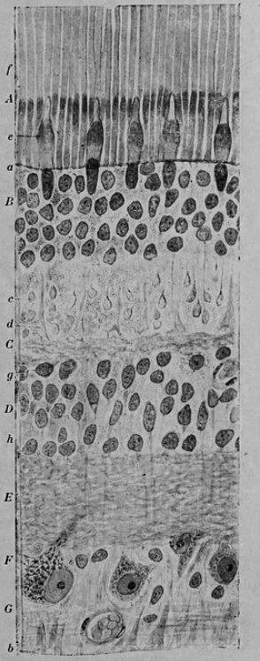
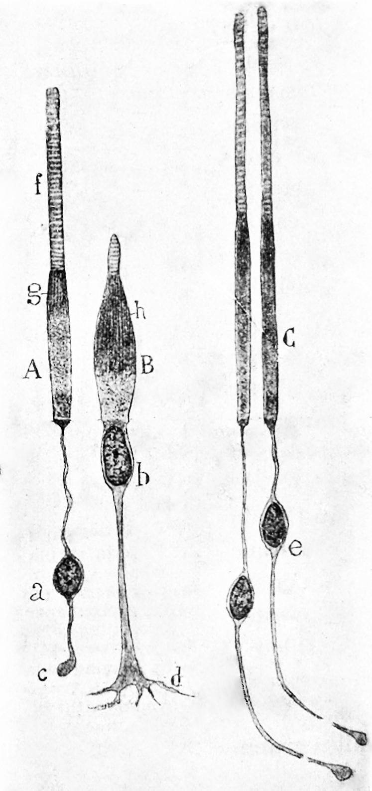

# The Visual System

Visual perception is the ability to interpret the surrounding environment using light in the visible spectrum reflected by the objects in the environment. This is different from visual acuity, which refers to how clearly a person sees (for example "20/20 vision"). A person can have problems with visual perceptual processing even if they have 20/20 vision.

The resulting perception is also known as visual perception, eyesight, sight, or vision. The various physiological components involved in vision are referred to collectively as the visual system.

Different species are able to see different parts of the light spectrum; for example, bees can see into the ultraviolet, while pit vipers can accurately target prey with their pit organs, which are sensitive to infrared radiation. The mantis shrimp possesses arguably the most complex visual system in any species. The eye of the mantis shrimp holds 16 color receptive cones, whereas humans only have three. The variety of cones enables them to perceive an enhanced array of colors as a mechanism for mate selection, avoidance of predators, and detection of prey. Swordfish also possess an impressive visual system. The eye of a swordfish can generate heat to better cope with detecting their prey at depths of 2000 feet. Certain one-celled micro-organisms, the warnowiid dinoflagellates have eye-like ocelloids, with analogous structures for the lens and retina of the multi-cellular eye. The armored shell of the chiton *Acanthopleura granulata* is also covered with hundreds of aragonite crystalline eyes, named ocelli, which can form images.

Many fan worms, such as *Acromegalomma interruptum* which live in tubes on the sea floor of the Great Barrier Reef, have evolved compound eyes on their tentacles, which they use to detect encroaching movement. If movement is detected the fan worms will rapidly withdraw their tentacles. 

Only higher primate Old World (African) monkeys and apes have the same kind of three-cone photoreceptor color vision humans have, while lower primate New World (South American) monkeys have a two-cone photoreceptor kind of color vision.

## The Eye

Light entering the eye is refracted as it passes through the cornea. It then passes through the pupil (controlled by the iris) and is further refracted by the lens. The cornea and lens act together as a compound lens to project an inverted image onto the retina.

(ref:ey) Horizontal section of the eyeball. From [Gray Henry, Anatomy of the Human Body. 20^th^ Edition, Lea & Febiger, Philadelphia & New York, 1918](https://archive.org/details/anatomyofhumanbo1918gray/page/n6/mode/2up) 

```{r eye, fig.cap='(ref:ey)', echo=FALSE, message=FALSE, warning=FALSE}
knitr::include_graphics("./figures/visual/anatomyofhumanbo1918gray_1008.jpg")
```

## The Retina

The retina is the light-sensitive layer of tissue of the eye of most vertebrates and some molluscs. The optics of the eye create a focused two-dimensional image of the visual world on the retina, which translates that image into electrical neural impulses to the brain to create visual perception.

The retina translates an optical image into neural impulses starting with the patterned excitation of the light-sensitive pigments of its rods and cones, the retina's photoreceptor cells. The excitation is processed by the neural system and various parts of the brain working in parallel to form a representation of the external environment in the brain.

Light striking the retina initiates a cascade of chemical and electrical events that ultimately trigger nerve impulses that are sent to various visual centres of the brain through the fibres of the optic nerve. Neural signals from the rods and cones undergo processing by other neurons, whose output takes the form of action potentials in retinal ganglion cells whose axons form the optic nerve. Several important features of visual perception can be traced to the retinal encoding and processing of light.

The cones respond to bright light and mediate high-resolution colour vision during daylight illumination (also called photopic vision). The rod responses are saturated at daylight levels and don't contribute to pattern vision. However, rods do respond to dim light and mediate lower-resolution, monochromatic vision under very low levels of illumination (called scotopic vision). The illumination in most office settings falls between these two levels and is called mesopic vision. At mesopic light levels, both the rods and cones are actively contributing pattern information. What contribution the rod information makes to pattern vision under these circumstances is unclear.

The response of cones to various wavelengths of light is called their spectral sensitivity. In normal human vision, the spectral sensitivity of a cone falls into one of three subtypes, often called blue, green, and red, but more accurately known as short, medium, and long wavelength-sensitive cone subtypes. It is a lack of one or more of the cone subtypes that causes individuals to have deficiencies in colour vision or various kinds of colour blindness. These individuals are not blind to objects of a particular colour, but are unable to distinguish between colours that can be distinguished by people with normal vision. Humans have this trichromatic vision, while most other mammals lack cones with red sensitive pigment and therefore have poorer dichromatic colour vision. However, some animals have four spectral subtypes, e.g. the trout adds an ultraviolet subgroup to short, medium, and long subtypes that are similar to humans. Some fish are sensitive to the polarization of light as well.

When thus excited by light, the photoceptor sends a proportional response synaptically to bipolar cells which in turn signal the retinal ganglion cells. The photoreceptors are also cross-linked by horizontal cells and amacrine cells, which modify the synaptic signal before it reaches the ganglion cells, the neural signals being intermixed and combined. Of the retina's nerve cells, only the retinal ganglion cells and few amacrine cells create action potentials.

In the retinal ganglion cells there are two types of response, depending on the receptive field of the cell. The receptive fields of retinal ganglion cells comprise a central, approximately circular area, where light has one effect on the firing of the cell, and an annular surround, where light has the opposite effect. In ON cells, an increment in light intensity in the centre of the receptive field causes the firing rate to increase. In OFF cells, it makes it decrease. Beyond this simple difference, ganglion cells are also differentiated by chromatic sensitivity and the type of spatial summation. Cells showing linear spatial summation are termed X cells (also called parvocellular, P, or midget ganglion cells), and those showing non-linear summation are Y cells (also called magnocellular, M, or parasol retinal ganglion cells), although the correspondence between X and Y cells (in the cat retina) and P and M cells (in the primate retina) is not as simple as it once seemed.

In the transfer of visual signals to the brain, the visual pathway, the retina is vertically divided in two, a temporal (nearer to the temple) half and a nasal (nearer to the nose) half. The axons from the nasal half cross the brain at the optic chiasma to join with axons from the temporal half of the other eye before passing into the lateral geniculate body.

Although there are more than 130 million retinal receptors, there are only approximately 1.2 million fibres (axons) in the optic nerve. So, a large amount of pre-processing is performed within the retina. The fovea produces the most accurate information. Despite occupying about 0.01% of the visual field (less than 2° of visual angle), about 10% of axons in the optic nerve are devoted to the fovea. 

The final result of all this processing is five different populations of ganglion cells that send visual (image-forming and non-image-forming) information to the brain:

* M cells, with large center-surround receptive fields that are sensitive to depth, indifferent to color, and rapidly adapt to a stimulus
* P cells, with smaller center-surround receptive fields that are sensitive to color and shape
* K cells, with very large center-only receptive fields that are sensitive to color and indifferent to shape or depth
* another population that is intrinsically photosensitive 
* a final population that is involved in the control of eye movements.
The neural retina consists of several layers of neurons interconnected by synapses, and is supported by an outer layer of pigmented epithelial cells. The primary light-sensing cells in the retina are the photoreceptor cells, which are of two types: rods and cones. Rods function mainly in dim light and provide black-and-white vision. Cones function in well-lit conditions and are responsible for the perception of colour, as well as high-acuity vision used for tasks such as reading. A third type of light-sensing cell, the photosensitive ganglion cell, is important for entrainment of circadian rhythms and reflexive responses such as the pupillary light reflex.

In vertebrate embryonic development, the retina and the optic nerve originate as outgrowths of the developing brain, specifically the embryonic diencephalon; thus, the retina is considered part of the central nervous system (CNS) and is actually brain tissue. It is the only part of the CNS that can be visualized non-invasively.

The vertebrate retina has ten distinct layers. From closest to farthest from the vitreous body:

* Inner limiting membrane – basement membrane elaborated by Müller cells.
* Nerve fibre layer – axons of the ganglion cell bodies (note that a thin layer of Müller cell footplates exists between this layer and the inner limiting membrane).
* Ganglion cell layer – contains nuclei of ganglion cells, the axons of which become the optic nerve fibres, and some displaced amacrine cells.
* Inner plexiform layer – contains the synapse between the bipolar cell axons and the dendrites of the ganglion and amacrine cells.
* Inner nuclear layer – contains the nuclei and surrounding cell bodies (perikarya) of the amacrine cells, bipolar cells, and horizontal cells.
* Outer plexiform layer – projections of rods and cones ending in the rod spherule and cone pedicle, respectively. These make synapses with dendrites of bipolar cells and horizontal cells. In the macular region, this is known as the Fiber layer of Henle.
* Outer nuclear layer – cell bodies of rods and cones.
* External limiting membrane – layer that separates the inner segment portions of the photoreceptors from their cell nuclei.
* Inner segment / outer segment layer – inner segments and outer segments of rods and cones. The outer segments contain a highly specialized light-sensing apparatus.
* Retinal pigment epithelium – single layer of cuboidal epithelial cells. This layer is closest to the choroid, and provides nourishment and supportive functions to the neural retina, The black pigment melanin in the pigment layer prevents light reflection throughout the globe of the eyeball.

These layers can be grouped into 4 main processing stages: photoreception; transmission to bipolar cells; transmission to ganglion cells, which also contain photoreceptors, the photosensitive ganglion cells; and transmission along the optic nerve. At each synaptic stage there are also laterally connecting horizontal and amacrine cells.

(ref:retina) Vertical section of the adult human retina. Carmine and Nissl stain. *A*, Photoreceptor layer. *B*, Cell bodies of the photoreceptors. *C*, Outer plexiform layer. *D*, Internal granule layer. *E*, Internal plexiform layer. *F*, Ganglion cell layer. *G*, Ganglion cell axons. *a*, external limiting membrane. *b*, internal limiting membrane. *c*, Spherical endfeet of the rod photoreceptors. *d*, endfeet of the cones. e. *a*, cone. *f*, a rod *g*, horizontal cells. *h*, amacrine cells. Fig. 188 from [Histologie du système nerveux de l'homme & des vertébrés](https://wellcomelibrary.org/item/b2129592x#?c=0&m=0&s=0&cv=0&z=-0.9137%2C-0.0887%2C2.8274%2C1.7747) (1909) by Santiago Ramón y Cajal translated from Spanish by Dr. L. Azoulay.

```{r retcajal, fig.cap='(ref:retina)', echo=FALSE, message=FALSE, warning=FALSE}

```

The optic nerve is a central tract of many axons of ganglion cells connecting primarily to the lateral geniculate body, a visual relay station in the diencephalon (the rear of the forebrain). It also projects to the superior colliculus, the suprachiasmatic nucleus, and the nucleus of the optic tract. It passes through the other layers, creating the optic disc in primates.

Additional structures, not directly associated with vision, are found as outgrowths of the retina in some vertebrate groups. In birds, the pecten is a vascular structure of complex shape that projects from the retina into the vitreous humour; it supplies oxygen and nutrients to the eye, and may also aid in vision. Reptiles have a similar, but much simpler, structure.

In adult humans, the entire retina is approximately 72% of a sphere about 22 mm in diameter. The entire retina contains about 7 million cones and 75 to 150 million rods. The optic disc, a part of the retina sometimes called "the blind spot" because it lacks photoreceptors, is located at the optic papilla, where the optic-nerve fibres leave the eye. It appears as an oval white area of 3 mm². Temporal (in the direction of the temples) to this disc is the macula, at whose centre is the fovea, a pit that is responsible for our sharp central vision but is actually less sensitive to light because of its lack of rods. Human and non-human primates possess one fovea, as opposed to certain bird species, such as hawks, who are bifoviate, and dogs and cats, who possess no fovea but a central band known as the visual streak. Around the fovea extends the central retina for about 6 mm and then the peripheral retina. The farthest edge of the retina is defined by the ora serrata. 

In section, the retina is no more than 0.5 mm thick. It has three layers of nerve cells and two of synapses, including the unique ribbon synapse. The optic nerve carries the ganglion cell axons to the brain, and the blood vessels that supply the retina. The ganglion cells lie innermost in the eye while the photoreceptive cells lie beyond. Because of this counter-intuitive arrangement, light must first pass through and around the ganglion cells and through the thickness of the retina, before reaching the rods and cones. Light is absorbed by the retinal pigment epithelium or the choroid.

The white blood cells in the capillaries in front of the photoreceptors can be perceived as tiny bright moving dots when looking into blue light. This is known as the blue field entoptic phenomenon (or Scheerer's phenomenon).

Between the ganglion cell layer and the rods and cones there are two layers of neuropils where synaptic contacts are made. The neuropil layers are the outer plexiform layer and the inner plexiform layer. In the outer neuropil layer, the rods and cones connect to the vertically running bipolar cells, and the horizontally oriented horizontal cells connect to ganglion cells.

(ref:frogret) A semischematic diagram of the frog retina. a) green rods; b (left) red rods; c) cone; i) horizontal cell; h) bipolar cell; n,m,r,s,t) amacrine cells; o,p) ganglion cells; q) displaced amacrine cell. A) Pigment epithelial cell with extended process; B) Pigment epithelial cell with retracted process. 

```{r frogretina, fig.cap='(ref:frogret)', echo=FALSE, message=FALSE, warning=FALSE}
knitr::include_graphics("./figures/visual/FrogRetinaCajalManual.jpg")
```

The central retina predominantly contains cones, while the peripheral retina predominantly contains rods. At the centre of the macula is the foveal pit where the cones are narrow and long, and, arranged in a hexagonal mosaic, the most dense, in contradistinction to the much fatter cones located more peripherally in the retina. At the foveal pit the other retinal layers are displaced, before building up along the foveal slope until the rim of the fovea, or parafovea, is reached, which is the thickest portion of the retina. The macula has a yellow pigmentation and is known as the macula lutea. The area directly surrounding the fovea has the highest density of rods converging on single bipolar cells. Since its cones have a much lesser convergence of signals, the fovea allows for the sharpest vision the eye can attain.

Though the rod and cones are a mosaic of sorts, transmission from receptors, to bipolars, to ganglion cells is not direct. Since there are about 150 million receptors and only 1 million optic nerve fibres, there must be convergence and thus mixing of signals. Moreover, the horizontal action of the horizontal and amacrine cells can allow one area of the retina to control another (e.g. one stimulus inhibiting another). This inhibition is key to lessening the sum of messages sent to the higher regions of the brain. In some lower vertebrates (e.g. the pigeon), there is a "centrifugal" control of messages – that is, one layer can control another, or higher regions of the brain can drive the retinal nerve cells, but in primates this does not occur.

## The Photoreceptors

A photoreceptor cell is a specialized type of neuroepithelial cell found in the retina that is capable of visual phototransduction. The great biological importance of photoreceptors is that they convert light (visible electromagnetic radiation) into signals that can stimulate biological processes. To be more specific, photoreceptor proteins in the cell absorb photons, triggering a change in the cell's membrane potential.

There are currently three known types of photoreceptor cells in mammalian eyes: rods, cones, and intrinsically photosensitive retinal ganglion cells. The two classic photoreceptor cells are rods and cones, each contributing information used by the visual system to form a representation of the visual world, sight. The rods are narrower than the cones and distributed differently across the retina, but the chemical process in each that supports phototransduction is similar. A third class of mammalian photoreceptor cell was discovered during the 1990s: the intrinsically photosensitive retinal ganglion cells. These cells do not contribute to sight directly, but are thought to support circadian rhythms and pupillary reflex.

(ref:photo) Rods and cones from the human retina. A) a rod from the peripheral retina; B) a cone from the peripheral retina; C) cones from the fovea.

```{r photoreceptors, fig.cap='(ref:photo)', echo=FALSE, message=FALSE, warning=FALSE}

```


There are major functional differences between the rods and cones. Rods are extremely sensitive, and can be triggered by a single photon. At very low light levels, visual experience is based solely on the rod signal.

Cones require significantly brighter light (that is, a larger number of photons) to produce a signal. In humans, there are three different types of cone cell, distinguished by their pattern of response to light of different wavelengths. Color experience is calculated from these three distinct signals. This explains why colors cannot be seen at low light levels, when only the rod and not the cone photoreceptor cells are active. The three types of cone cell respond (roughly) to light of short, medium, and long wavelengths, so they may respectively be referred to as S-cones, M-cones, and L-cones. The different responses of the three types of cone cells are determined by the likelihoods that their respective photoreceptor proteins will absorb photons of different wavelengths. So, for example, an L cone cell contains a photoreceptor protein that more readily absorbs long wavelengths of light (that is, more "red"). Light of a shorter wavelength can also produce the same response, but it must be much brighter to do so.

The number and ratio of rods to cones varies among species, dependent on whether an animal is primarily diurnal or nocturnal.

## Visual Phototransduction

Visual phototransduction is the sensory transduction of the visual system. It is a process by which light is converted into electrical signals in the rod cells, cone cells and photosensitive ganglion cells of the retina of the eye. This cycle was elucidated by [George Wald](https://en.wikipedia.org/wiki/George_Wald) (1906–1997) for which he received the Nobel Prize in 1967.

The visual cycle is the biological conversion of a photon into an electrical signal in the retina. This process occurs via G-protein coupled receptors called opsins which contain the chromophore 11-cis retinal. 11-cis retinal is covalently linked to the opsin receptor via Schiff base forming retinylidene protein. When struck by a photon, 11-cis retinal undergoes photoisomerization to all-trans retinal which changes the conformation of the opsin GPCR leading to signal transduction cascades which causes closure of cyclic GMP-gated cation channel, and hyperpolarization of the photoreceptor cell.

Following isomerization and release from the opsin protein, all-trans retinal is reduced to all-trans retinol and travels back to the retinal pigment epithelium to be "recharged". It is first esterified by lecithin retinol acyltransferase (LRAT) and then converted to 11-cis retinol by the isomerohydrolase RPE65. Finally, it is oxidized to 11-cis retinal before traveling back to the rod outer segment where it is again conjugated to an opsin to form new, functional visual pigment (rhodopsin).

To understand the photoreceptor's behaviour to light intensities, it is necessary to understand the roles of different currents.

(ref:retinal) [The chemical reactions involved in the photoreceptor visual cycle.](https://commons.wikimedia.org/wiki/File:Visual_cycle.svg)

```{r absorption, fig.cap='(ref:retinal)', echo=FALSE, message=FALSE, warning=FALSE}

```

There is an ongoing outward potassium current through nongated K^+^-selective channels. This outward current tends to hyperpolarize the photoreceptor at around -70 mV (the equilibrium potential for K^+^).

There is also an inward sodium current carried by cGMP-gated sodium channels. This so-called 'dark current' depolarizes the cell to around -40 mV. Note that this is significantly more depolarized than most other neurons.

A high density of Na^+^-K^+^ pumps enables the photoreceptor to maintain a steady intracellular concentration of Na^+^ and K^+^.

Photoreceptor cells are unusual cells in that they are depolarized under scotopic conditions (darkness). In photopic conditions (light), photoreceptors are hyperpolarized to a potential of -60mV.

In the dark, cGMP levels are high and keep cGMP-gated sodium channels open allowing a steady inward current, called the dark current. This dark current keeps the cell depolarized at about -40 mV, leading to glutamate release.

The depolarization of the cell membrane in scotopic conditions opens voltage-gated calcium channels. An increased intracellular concentration of Ca^2+^ causes vesicles containing glutamate, the photoreceptor neurotransmitter, to merge with the cell membrane, therefore releasing glutamate.

In the cone pathway glutamate

* Hyperpolarizes on-center bipolar cells. Glutamate that is released from the photoreceptors in the dark binds to metabotropic glutamate receptors (mGluR6), which, through a G-protein coupling mechanism, causes non-specific cation channels in the cells to close, thus hyperpolarizing the bipolar cell.
* Depolarizes off-center bipolar cells. Binding of glutamate to ionotropic glutamate receptors results in an inward cation current that depolarizes the bipolar cell.

Activation of the phototransduction cascade

1. A light photon interacts with the retinal in a photoreceptor cell. The retinal undergoes isomerisation, changing from the 11-cis to all-trans configuration.
1. Opsin therefore undergoes a conformational change to metarhodopsin II.
1. Metarhodopsin II activates a G protein known as transducin. This causes transducin to dissociate from its bound GDP, and bind GTP, then the alpha subunit of transducin dissociates from the beta and gamma subunits, with the GTP still bound to the alpha subunit.
1. The alpha subunit-GTP complex activates phosphodiesterase, also known as PDE6. It binds to one of two regulatory subunits of PDE (which itself is a tetramer) and inhibits its activity.
1. PDE hydrolyzes cGMP, forming GMP. This lowers the intracellular concentration of cGMP and therefore the sodium channels close.
1. Closure of the sodium channels causes hyperpolarization of the cell due to the ongoing efflux of potassium ions.
1. Hyperpolarization of the cell causes voltage-gated calcium channels to close.
1. As the calcium level in the photoreceptor cell drops, the amount of the neurotransmitter glutamate that is released by the cell also drops. This is because calcium is required for the glutamate-containing vesicles to fuse with cell membrane and release their contents (see SNARE proteins).
1. A decrease in the amount of glutamate released by the photoreceptors causes depolarization of on-center bipolar cells (rod and cone On bipolar cells) and hyperpolarization of cone off-center bipolar cells.

(ref:steps) [Representation](https://commons.wikimedia.org/wiki/File:Phototransduction.png) of molecular steps in photoactivation (modified from Leskov et al., 2000). Depicted is an outer membrane disk in a rod. Step 1: Incident photon (hν) is absorbed and activates a rhodopsin by conformational change in the disk membrane to R*. Step 2: Next, R* makes repeated contacts with transducin molecules, catalyzing its activation to G* by the release of bound GDP in exchange for cytoplasmic GTP, which expels its β and γ subunits. Step 3: G* binds inhibitory γ subunits of the phosphodiesterase (PDE) activating its α and β subunits. Step 4: Activated PDE hydrolyzes cGMP. Step 5: Guanylyl cyclase (GC) synthesizes cGMP, the second messenger in the phototransduction cascade. Reduced levels of cytosolic cGMP cause cyclic nucleotide gated channels to close preventing further influx of Na^+^ and Ca^2+^.

```{r molsteps, fig.cap='(ref:steps)', echo=FALSE, message=FALSE, warning=FALSE}
knitr::include_graphics("./figures/visual/Phototransduction.png")
```

Deactivation of the phototransduction cascade

In light, low cGMP levels close Na^+^ and Ca^2+^ channels, reducing intracellular Na^+^ and Ca^2+^. During recovery (dark adaptation), the low Ca^2+^ levels induce recovery (termination of the phototransduction cascade), as follows:

1. Low intracellular Ca^2+^ makes intracellular Ca-GCAP (Ca-Guanylate cyclase activating protein) dissociate into Ca^2+^ and GCAP. The liberated GCAP ultimately restores depleted cGMP levels, which re-opens the cGMP-gated cation channels (restoring dark current).
1. Low intracellular Ca^2+^ makes intracellular Ca-GAP (Ca-GTPase Accelerating Protein) dissociate into Ca^2+^ and GAP. The liberated GAP deactivates activated-transducin, terminating the phototransduction cascade (restoring dark current).
1. Low intracellular Ca^2+^ makes intracellular Ca-recoverin-RK dissociate into Ca^2+^ and recoverin and RK. The liberated RK then phosphorylates metarhodopsin II, reducing its binding affinity for transducin. Arrestin then completely deactivates the phosphorylated-metarhodopsin II, terminating the phototransduction cascade (restoring dark current).
1. Low intracellular Ca^2+^ make the Ca^2+^/calmodulin complex within the cGMP-gated cation channels more sensitive to low cGMP levels (thereby, keeping the cGMP-gated cation channel open even at low cGMP levels, restoring dark current)

In more detail:

GTPase Accelerating Protein (GAP) interacts with the alpha subunit of transducin, and causes it to hydrolyse its bound GTP to GDP, and thus halts the action of phosphodiesterase, stopping the transformation of cGMP to GMP.

Guanylate Cyclase Activating Protein (GCAP) is a calcium binding protein, and as the calcium levels in the cell have decreased, GCAP dissociates from its bound calcium ions, and interacts with Guanylate Cyclase, activating it. Guanylate Cyclase then proceeds to transform GTP to cGMP, replenishing the cell's cGMP levels and thus reopening the sodium channels that were closed during phototransduction.

Finally, metarhodopsin II is deactivated. Recoverin, another calcium binding protein, is normally bound to rhodopsin kinase when calcium is present. When the calcium levels fall during phototransduction, the calcium dissociates from recoverin, and rhodopsin kinase is released, when it (what?) proceeds to phosphorylate metarhodopsin II, which decreases its affinity for transducin. Finally, arrestin, another protein, binds the phosphorylated metarhodopsin II, completely deactivating it. Thus, finally, phototransduction is deactivated, and the dark current and glutamate release is restored. It is this pathway, where Metarhodopsin II is phosphorylated and bound to arrestin and thus deactivated, which is thought to be responsible for the S2 component of dark adaptation. The S2 component represents a linear section of the dark adaptation function present at the beginning of dark adaptation for all bleaching intensities.

All-trans retinal cannot be synthesised by humans and must be supplied by vitamin A in the diet. Deficiency of all-trans retinal can lead to night blindness. This is part of the bleach and recycle process of retinoids in the photoreceptors and retinal pigment epithelium.

Photoreceptor cells are typically arranged in an irregular but approximately hexagonal grid, known as the retinal mosaic.

The opsin found in the intrinsically photosensitive ganglion cells of the retina is called melanopsin. These cells are involved in various reflexive responses of the brain and body to the presence of (day)light, such as the regulation of circadian rhythms, pupillary reflex and other non-visual responses to light. Melanopsin functionally resembles invertebrate opsins.

When light activates the melanopsin signaling system, the melanopsin-containing ganglion cells discharge nerve impulses that are conducted through their axons to specific brain targets. These targets include the olivary pretectal nucleus (a center responsible for controlling the pupil of the eye), the LGN, and, through the retinohypothalamic tract (RHT), the suprachiasmatic nucleus of the hypothalamus (the master pacemaker of circadian rhythms). Melanopsin-containing ganglion cells are thought to influence these targets by releasing from their axon terminals the neurotransmitters glutamate and pituitary adenylate cyclase activating polypeptide (PACAP).

## The Visual Pathways

### The Optic Nerve And Optic Tract

The optic nerve conducts the action potentials generated by the retinal ganglion cells through the optic canal to the subsequent processing centers in the brain. Upon reaching the optic chiasm the nerve fibers from the nasal part of the retina in each eye cross over to the other side (decussate). The fibers then branch and terminate in three places.

(ref:visual) [A simplified schema](https://commons.m.wikimedia.org/wiki/File:Human_visual_pathway.svg) of the human visual pathway.

```{r visualpathways, fig.cap='(ref:visual)', echo=FALSE, message=FALSE, warning=FALSE}
knitr::include_graphics("./figures/visual/Human_visual_pathway.svg")
```

The optic nerve is composed of retinal ganglion cell axons and glial cells. Each human optic nerve contains between 770,000 and 1.7 million nerve fibers, which are axons of the retinal ganglion cells of one retina.

In humans, the optic nerve is derived from optic stalks during the seventh week of development. It extends from the optic disc to the optic chiasma and continues as the optic tract to the lateral geniculate nucleus, pretectal nuclei, and superior colliculus.

Most of the axons of the optic nerve terminate in the lateral geniculate nucleus from where information is relayed to the visual cortex, while other axons terminate in the pretectal nucleus and are involved in reflexive eye movements. Other axons terminate in the suprachiasmatic nucleus and are involved in regulating the sleep-wake cycle. Its diameter increases from about 1.6 mm within the eye to 3.5 mm in the orbit to 4.5 mm within the cranial space.

## The Superior Colliculus

The superior colliculus (Latin, upper hill) is a structure lying on the roof of the mammalian midbrain. In non-mammalian vertebrates the homologous structure, is known as the optic tectum or optic lobe.

In mammals the superior colliculus forms a major component of the midbrain. It is a paired structure and together with the paired inferior colliculi form the corpora quadrigemina (from Latin quadruplet bodies). The superior colliculus is a layered structure, with a number of layers that varies by species. The layers can be grouped into the superficial layers (stratum opticum and above) and the deeper remaining layers. Neurons in the superficial layers receive direct input from the retina and respond almost exclusively to visual stimuli. Many neurons in the deeper layers also respond to other modalities, and some respond to stimuli in multiple modalities. The deeper layers also contain a population of motor-related neurons, capable of activating eye movements as well as other responses.

The general function of the tectal system is to direct behavioral responses toward specific points in egocentric ("body-centered") space. Each layer contains a topographic map of the surrounding world in retinotopic coordinates, and activation of neurons at a particular point in the map evokes a response directed toward the corresponding point in space. In primates, the superior colliculus has been studied mainly with respect to its role in directing eye movements. Visual input from the retina, or "command" input from the cerebral cortex, create a "bump" of activity in the tectal map, which, if strong enough, induces a saccadic eye movement. Even in primates, however, the superior colliculus is also involved in generating spatially directed head turns, arm-reaching movements, and shifts in attention that do not involve any overt movements. In mammals, and especially primates, the massive expansion of the cerebral cortex reduces the superior colliculus to a much smaller fraction of the whole brain. It remains nonetheless important in terms of function as the primary integrating center for eye movements.

In contrast to the vision-dominated inputs to the superficial layers, the intermediate and deep layers receive inputs from a very diverse set of sensory and motor structures. Most areas of the cerebral cortex project to these layers, although the input from "association" areas tends to be heavier than the input from primary sensory or motor areas. However, the cortical areas involved, and the strength of their relative projections differs across species. Another important input comes from the substantia nigra, pars reticulata, a component of the basal ganglia. This projection uses the inhibitory neurotransmitter GABA, and is thought to exert a "gating" effect on the superior colliculus. The intermediate and deep layers also receive input from the spinal trigeminal nucleus, which conveys somatosensory information from the face, as well as the hypothalamus, zona incerta, thalamus, and inferior colliculus.

In addition to their distinctive inputs, the superficial and deep zones of the superior colliculus also have distinctive outputs. One of the most important outputs goes to the pulvinar and lateral intermediate areas of the thalamus, which in turn project to areas of the cerebral cortex that are involved in controlling eye movements. There are also projections from the superficial zone to the pretectal nuclei, lateral geniculate nucleus of the thalamus, and the parabigeminal nucleus. The projections from the deeper layers are more extensive. There are two large descending pathways, traveling to the brainstem and spinal cord, and numerous ascending projections to a variety of sensory and motor centers, including several that are involved in generating eye movements.

Both colliculi also have descending projections to the paramedian pontine reticular formation and spinal cord, and thus can be involved in responses to stimuli faster than cortical processing would allow.

Behavioral studies have shown that the SC is not needed for object recognition, but plays a critical role in the ability to direct behaviors toward specific objects, and can support this ability even in the absence of the cerebral cortex. Thus, cats with major damage to the visual cortex cannot recognize objects, but may still be able to follow and orient toward moving stimuli, although more slowly than usual. If one half of the SC is removed, however, the cats will circle constantly toward the side of the lesion, and orient compulsively toward objects located there, but fail to orient at all toward objects located in the opposite hemifield. These deficits diminish over time but never disappear.

In primates, eye movements can be divided into several types: fixation, in which the eyes are directed toward a motionless object, with eye movements only to compensate for movements of the head; smooth pursuit, in which the eyes move steadily to track a moving object; saccades, in which the eyes move very rapidly from one location to another; and vergence, in which the eyes move simultaneously in opposite directions to obtain or maintain single binocular vision. The superior colliculus is involved in all of these, but its role in saccades has been studied most intensively.

Each of the two colliculi — one on each side of the brain — contains a two-dimensional map representing half of the visual field. The fovea — the region of maximum sensitivity — is represented at the front edge of the map, and the periphery at the back edge. Eye movements are evoked by activity in the deep layers of the SC. During fixation, neurons near the front edge — the foveal zone — are tonically active. During smooth pursuit, neurons a small distance from the front edge are activated, leading to small eye movements. For saccades, neurons are activated in a region that represents the point to which the saccade will be directed. Just prior to a saccade, activity rapidly builds up at the target location and decreases in other parts of the SC. The coding is rather broad, so that for any given saccade the activity profile forms a "hill" that encompasses a substantial fraction of the collicular map: The location of the peak of this "hill" represents the saccade target.

The output from the motor sector of the SC goes to a set of midbrain and brainstem nuclei, which transform the "place" code used by the SC into the "rate" code used by oculomotor neurons. Eye movements are generated by six muscles, arranged in three orthogonally-aligned pairs. Thus, at the level of the final common path, eye movements are encoded in essentially a Cartesian coordinate system.

Although the SC receives a strong input directly from the retina, in primates it is largely under the control of the cerebral cortex, which contains several areas that are involved in determining eye movements. The frontal eye fields, a portion of the motor cortex, are involved in triggering intentional saccades, and an adjoining area, the supplementary eye fields, are involved in organizing groups of saccades into sequences. The parietal eye fields, farther back in the brain, are involved mainly in reflexive saccades, made in response to changes in the view.

The SC only receives visual inputs in its superficial layers, whereas the deeper layers of the colliculus receive also auditory and somatosensory inputs and are connected to many sensorimotor areas of the brain. The colliculus as a whole is thought to help orient the head and eyes toward something seen and heard.

The superior colliculus also receives auditory information from the inferior colliculus. This auditory information is integrated with the visual information already present to produce the ventriloquist effect.

## The Lateral Geniculate Nucleus (LGN)

The lateral geniculate nucleus (LGN; also called the lateral geniculate body or lateral geniculate complex; named after its resemblance to a bent knee) is a relay center in the thalamus for the visual pathway. It receives a major sensory input from the retina. The LGN is the main central connection for the optic nerve to the occipital lobe, particularly the primary visual cortex. In humans, each LGN has six layers of neurons (grey matter) alternating with optic fibers (white matter).

The LGN is a small, ovoid, ventral projection at the termination of the optic tract on each side of the brain. The LGN and the medial geniculate nucleus which deals with auditory information are both thalamic nuclei and so are present in both hemispheres.

The LGN receives information directly from the ascending retinal ganglion cells via the optic tract and from the reticular activating system. Neurons of the LGN send their axons through the optic radiation, a direct pathway to the primary visual cortex. In addition, the LGN receives many strong feedback connections from the primary visual cortex. In humans as well as other mammals, the two strongest pathways linking the eye to the brain are those projecting to the dorsal part of the LGN in the thalamus, and to the superior colliculus.

In humans as well as in many other primates, the LGN has layers of magnocellular cells and parvocellular cells that are interleaved with layers of koniocellular cells. In humans the LGN is normally described as having six distinctive layers. The inner two layers, (1 and 2) are magnocellular layers, while the outer four layers, (3,4,5 and 6), are parvocellular layers. An additional set of neurons, known as the koniocellular layers, are found ventral to each of the magnocellular and parvocellular layers.

The magnocellular, parvocellular, and koniocellular layers of the LGN correspond with the similarly named types of retinal ganglion cells. Retinal P ganglion cells send axons to a parvocellular layer, M ganglion cells send axons to a magnocellular layer, and K ganglion cells send axons to a koniocellular layer.:269

Koniocellular cells are functionally and neurochemically distinct from M and P cells and provide a third channel to the visual cortex. They project their axons between the layers of the lateral geniculate nucleus where M and P cells project. Their role in visual perception is presently unclear; however, the koniocellular system has been linked with the integration of somatosensory system-proprioceptive information with visual perception, and it may also be involved in color perception.

The other major retino–cortical visual pathway is the tectopulvinar pathway, routing primarily through the superior colliculus and thalamic pulvinar nucleus onto posterior parietal cortex and visual area MT.

Ipsilateral and contralateral layers

Layer 1, 2

* Large cells, called magnocellular pathways
* Input from M-ganglion cells
* Very rapid conduction
* Colour blind system

Layer 3–6

* Parvocellular
* Input from P-ganglion cells
* Colour vision
* Moderate velocity.

Both the LGN in the right hemisphere and the LGN in the left hemisphere receive input from each eye. However, each LGN only receives information from one half of the visual field. This occurs due to axons of the ganglion cells from the inner halves of the retina (the nasal sides) decussating (crossing to the other side of the brain) through the optic chiasma (khiasma means "cross-shaped"). The axons of the ganglion cells from the outer half of the retina (the temporal sides) remain on the same side of the brain. Therefore, the right hemisphere receives visual information from the left visual field, and the left hemisphere receives visual information from the right visual field. Within one LGN, the visual information is divided among the various layers as follows:

* the eye on the same side (the ipsilateral eye) sends information to layers 2, 3 and 5
* the eye on the opposite side (the contralateral eye) sends information to layers 1, 4 and 6.

This description applies to the LGN of many primates, but not all. 

The principal neurons in the LGN receive strong inputs from the retina. However, the retina only accounts for a small percentage of LGN input. As much as 95% of input in the LGN comes from the visual cortex, superior colliculus, pretectum, thalamic reticular nuclei, and local LGN interneurons. Regions in the brainstem that are not involved in visual perception also project to the LGN, such as the mesencephalic reticular formation, dorsal raphe nucleus, periaqueductal grey matter, and the locus coeruleus. These non-retinal inputs can be excitatory, inhibitory, or modulatory.

Information leaving the LGN travels out on the optic radiations, which form part of the retrolenticular portion of the internal capsule.

The axons that leave the LGN go to V1 visual cortex. Both the magnocellular layers 1–2 and the parvocellular layers 3–6 send their axons to layer 4 in V1. Within layer 4 of V1, layer 4cβ receives parvocellular input, and layer 4cα receives magnocellular input. However, the koniocellular layers, intercalated between LGN layers 1–6 send their axons primarily to the cytochrome-oxidase rich blobs of layers 2 and 3 in V1. Axons from layer 6 of visual cortex send information back to the LGN.

Studies involving blindsight have suggested that projections from the LGN travel not only to the primary visual cortex but also to higher cortical areas V2 and V3. Patients with blindsight are phenomenally blind in certain areas of the visual field corresponding to a contralateral lesion in the primary visual cortex; however, these patients are able to perform certain motor tasks accurately in their blind field, such as grasping. This suggests that neurons travel from the LGN to both the primary visual cortex and higher cortex regions.

## The Visual Cortex

The visual cortex of the brain is that part of the cerebral cortex which processes visual information. It is located in the occipital lobe.

The visual cortex is the largest system in the human brain and is responsible for processing the visual information. The region that receives information directly from the LGN is called the primary visual cortex, (also called V1 and striate cortex). The primary visual cortex is the most studied visual area in the brain. Visual information then flows through a cortical hierarchy. These areas include V2, V3, V4 and area V5/MT (the exact connectivity depends on the species of the animal). 

As visual information passes forward through the visual hierarchy, the complexity of the neural representations increases. Whereas a V1 neuron may respond selectively to a line segment of a particular orientation in a particular retinotopic location, neurons in the lateral occipital complex respond selectively to complete object (e.g., a figure drawing), and neurons in visual association cortex may respond selectively to human faces, or to a particular object.

(ref:viscort) [A visual field map](https://commons.wikimedia.org/wiki/File:Visual_field_maps.jpg) of the primary visual cortex and the numerous extrastriate areas.

```{r visualcortex, fig.cap='(ref:viscort)', echo=FALSE, message=FALSE, warning=FALSE}
knitr::include_graphics("./figures/visual/Visual_field_maps.jpg")
```

Along with this increasing complexity of neural representation may come a level of specialization of processing into two distinct pathways: the dorsal stream and the ventral stream (the Two Streams hypothesis, first proposed by Ungerleider and Mishkin in 1982). The dorsal stream, commonly referred to as the "where" stream, is involved in spatial attention (covert and overt), and communicates with regions that control eye movements and hand movements. More recently, this area has been called the "how" stream to emphasize its role in guiding behaviors to spatial locations. The ventral stream, commonly referred as the "what" stream, is involved in the recognition, identification and categorization of visual stimuli.

However, there is still much debate about the degree of specialization within these two pathways, since they are in fact heavily interconnected.

Visual information coming from the eye goes through the lateral geniculate nucleus in the thalamus and then reaches the visual cortex. The part of the visual cortex that receives the sensory inputs from the thalamus is the primary visual cortex, also known as visual area 1 (V1, Brodmann area 17), and the striate cortex. The extrastriate areas consist of visual areas 2 (V2, Brodmann area 18), 3, 4, and 5 (V3, V4, V5, all Brodmann area 19).

The primary visual cortex (V1) is located in and around the calcarine fissure in the occipital lobe. Each hemisphere's V1 receives information directly from its ipsilateral lateral geniculate nucleus that receives signals from the contralateral visual hemifield.

Neurons in the visual cortex fire action potentials when visual stimuli appear within their receptive field. By definition, the receptive field is the region within the entire visual field that elicits an action potential. But, for any given neuron, it may respond best to a subset of stimuli within its receptive field. This property is called neuronal tuning. In the earlier visual areas, neurons have simpler tuning. For example, a neuron in V1 may fire to any vertical stimulus in its receptive field. In the higher visual areas, neurons have complex tuning. For example, in the inferior temporal cortex (IT), a neuron may fire only when a certain face appears in its receptive field.

The visual cortex receives its blood supply primarily from the calcarine branch of the posterior cerebral artery.

V1 transmits information to two primary pathways, called the ventral stream and the dorsal stream. The ventral stream begins with V1, goes through visual area V2, then through visual area V4, and to the inferior temporal cortex (IT cortex). The ventral stream, sometimes called the "What Pathway", is associated with form recognition and object representation. It is also associated with storage of long-term memory.
The dorsal stream begins with V1, goes through Visual area V2, then to the dorsomedial area (DM/V6) and medial temporal area (MT/V5) and to the posterior parietal cortex. The dorsal stream, sometimes called the "Where Pathway" or "How Pathway", is associated with motion, representation of object locations, and control of the eyes and arms, especially when visual information is used to guide saccades or reaching.

More recently, Goodale and Milner extended these ideas and suggested that the ventral stream is critical for visual perception whereas the dorsal stream mediates the visual control of skilled actions. It has been shown that visual illusions such as the [Ebbinghaus illusion](https://en.wikipedia.org/wiki/Ebbinghaus_illusion) distort judgements of a perceptual nature, but when the subject responds with an action, such as grasping, no distortion occurs.

Work such as the one from Scharnowski and Gegenfurtner suggests that both the action and perception systems are equally fooled by such illusions. Other studies, however, provide strong support for the idea that skilled actions such as grasping are not affected by pictorial illusions and suggest that the action/perception dissociation is a useful way to characterize the functional division of labor between the dorsal and ventral visual pathways in the cerebral cortex.

The functionally defined primary visual cortex is approximately equivalent to the anatomically defined striate cortex. The name "striate cortex" is derived from the line of Gennari, a distinctive stripe visible to the naked eye that represents myelinated axons from the lateral geniculate body terminating in layer 4 of the gray matter.

The primary visual cortex is divided into six functionally distinct layers, labeled 1 to 6. Layer 4, which receives most visual input from the lateral geniculate nucleus (LGN), is further divided into 4 layers, labelled 4A, 4B, 4Cα, and 4Cβ. Sublamina 4Cα receives mostly magnocellular input from the LGN, while layer 4Cβ receives input from parvocellular pathways.


